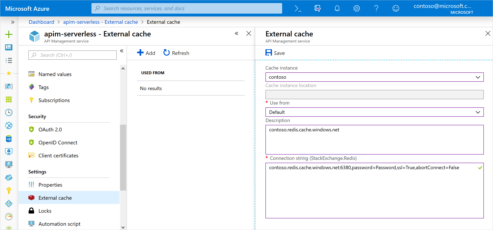
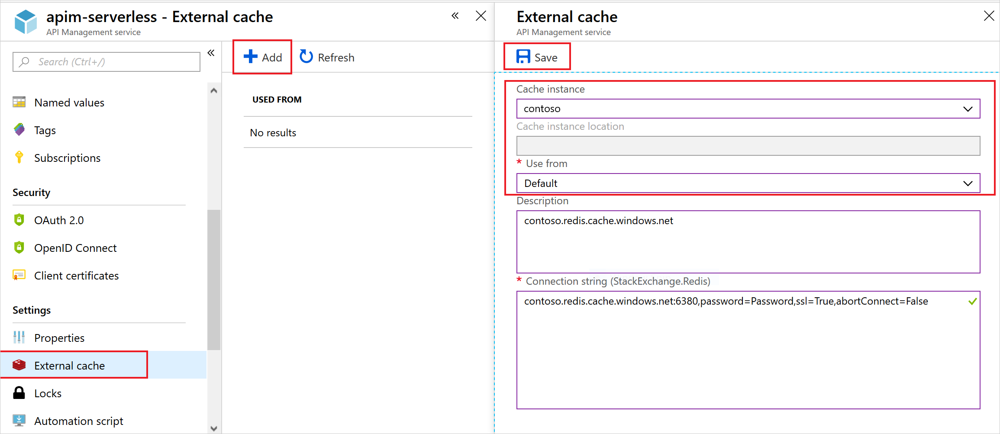

# Use an external Redis-compatible cache in Azure API Management

In addition to utilizing the built-in cache, Azure API Management allows for caching responses in an external Redis-compatible cache, e.g. Azure Cache for Redis.

Using an external cache allows you to overcome a few limitations of the built-in cache:

* Avoid having your cache periodically cleared during API Management updates
* Have more control over your cache configuration
* Cache more data than your API Management tier allows to
* Use caching with the Consumption tier of API Management
* Enable caching in the [API Management self-hosted gateways](self-hosted-gateway-overview.md)

For more detailed information about caching, see [API Management caching policies](api-management-caching-policies.md) and  [Custom caching in Azure API Management](api-management-sample-cache-by-key.md).

What you'll learn:

> [!div class="checklist"]
> * Add an external cache in API Management

## Prerequisites

To complete this tutorial, you need to:

+ [Create an Azure API Management instance](get-started-create-service-instance.md)
+ Understand [caching in Azure API Management](api-management-howto-cache.md)

##  Create Azure Cache for Redis

This section explains how to create an Azure Cache for Redis in Azure. If you already have an Azure Cache for Redis, within or outside of Azure, you can <a href="#add-external-cache">skip</a> to the next section.

[!INCLUDE [redis-cache-create](../../includes/redis-cache-create.md)]

##  Deploy Redis cache to Kubernetes

For caching, self-hosted gateways rely exclusively on external caches. For caching to be effective self-hosted gateways and the cache they rely on must be located close to each other to minimize lookup and store latencies. Deploying a Redis cache into the same Kubernetes cluster or in a separate cluster nearby are the best options. Follow this [link](https://github.com/kubernetes/examples/tree/master/guestbook) to learn how to deploy Redis cache to a Kubernetes cluster.

## Add an external cache

Follow the steps below to add an external Azure Cache for Redis in Azure API Management.

> [!NOTE]
> The **Use from** setting specifies an Azure region or a self-hosted gateway location that will use the configured cache. The caches configured as **Default** will be overridden by caches with a specific matching region or location value.
>
> For example, if API Management is hosted in the East US, Southeast Asia and West Europe regions and there are two caches configured, one for **Default** and one for **Southeast Asia**, API Management in **Southeast Asia** will use its own cache, while the other two regions will use the **Default** cache entry.

### Add an Azure Cache for Redis from the same subscription

1. Browse to your API Management instance in the Azure portal.
2. Select the **External cache** tab from the menu on the left.
3. Click the **+ Add** button.
4. Select your cache in the **Cache instance** dropdown field.
5. Select **Default** or specify the desired region in the **Use from** dropdown field.
6. Click **Save**.

### Add an Azure Cache for Redis hosted outside of the current Azure subscription or Azure in general

1. Browse to your API Management instance in the Azure portal.
2. Select the **External cache** tab from the menu on the left.
3. Click the **+ Add** button.
4. Select **Custom** in the **Cache instance** dropdown field.
5. Select **Default** or specify the desired region in the **Use from** dropdown field.
6. Provide your Azure Cache for Redis connection string in the **Connection string** field.
7. Click **Save**.

### Add a Redis cache to a self-hosted gateway

1. Browse to your API Management instance in the Azure portal.
2. Select the **External cache** tab from the menu on the left.
3. Click the **+ Add** button.
4. Select **Custom** in the **Cache instance** dropdown field.
5. Specify the desired self-hosted gateway location or **Default** in the **Use from** dropdown field.
6. Provide your Redis cache connection string in the **Connection string** field.
7. Click **Save**.

## Use the external cache

Once the external cache is configured in Azure API Management, it can be used through caching policies. See [Add caching to improve performance in Azure API Management](api-management-howto-cache.md) for detailed steps.

## Next steps

* For more information about caching policies, see [Caching policies][Caching policies] in the [API Management policy reference][API Management policy reference].
* For information on caching items by key using policy expressions, see [Custom caching in Azure API Management](api-management-sample-cache-by-key.md).

[API Management policy reference]: ./api-management-policies.md
[Caching policies]: ./api-management-caching-policies.md
