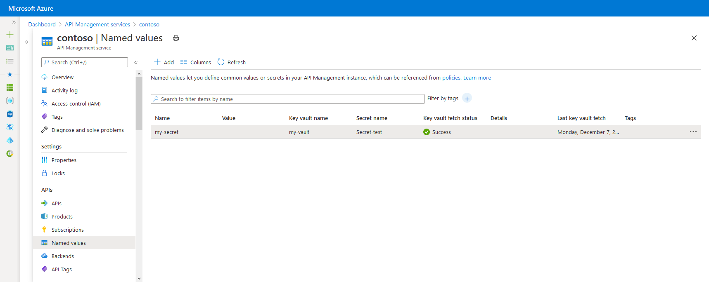

# How to use named values in Azure API Management policies

API Management policies are a powerful capability of the system that allow the Azure portal to change the behavior of the API through configuration. Policies are a collection of statements that are executed sequentially on the request or response of an API. Policy statements can be constructed using literal text values, policy expressions, and named values.

Each API Management service instance has a collection of key/value pairs, which is called named values, that are global to the service instance. There is no imposed limit on the number of items in the collection. Named values can be used to manage constant string values across all API configuration and policies. Each named value may have the following attributes:

| Attribute      | Type            | Description                                                                                                                            |
| -------------- | --------------- | -------------------------------------------------------------------------------------------------------------------------------------- |
| `Display name` | string          | Used for referencing the named value in policies. A string of one to 256 characters. Only letters, numbers, dot, and dash are allowed. |
| `Value`        | string          | Actual value. Must not be empty or consist only of whitespace. Maximum of 4096 characters long.                                        |
| `Secret`       | boolean         | Determines whether the value is a secret and should be encrypted or not.                                                               |
| `Tags`         | array of string | Used to filter the named value list. Up to 32 tags.                                                                                    |



Named values can contain literal strings and [policy expressions](./api-management-policy-expressions.md). For example, the value of `Expression` is a policy expression that returns a string containing the current date and time. The named value `Credential` is marked as a secret, so its value is not displayed by default.

| Name       | Value                      | Secret | Tags          |
| ---------- | -------------------------- | ------ | ------------- |
| Value      | 42                         | False  | vital-numbers |
| Credential | ••••••••••••••••••••••     | True   | security      |
| Expression | @(DateTime.Now.ToString()) | False  |               |

> [!NOTE]
> Instead of named values stored within an API Management service, you can use values stored in the [Azure Key Vault](https://azure.microsoft.com/services/key-vault/) service as demonstrated by this [example](https://github.com/Azure/api-management-policy-snippets/blob/master/examples/Look%20up%20Key%20Vault%20secret%20using%20Managed%20Service%20Identity.policy.xml).

## To add and edit a named value


1. Select **APIs** from under **API MANAGEMENT**.
2. Select **Named values**.
3. Press **+Add**.

    Name and Value are required values. If value is a secret, check the _This is a secret_ checkbox. Enter one or more optional tags to help with organizing your named values, and click Save.

4. Click **Create**.

Once the named value is created, you can edit it by clicking on it. If you change the named value name, any policies that reference that named value are automatically updated to use the new name.

## To delete a named value

To delete a named value, click **Delete** beside the named value to delete.

> [!IMPORTANT]
> If the named value is referenced by any policies, you will be unable to successfully delete it until you remove the named value from all policies that use it.

## To search and filter named values

The **Named values** tab includes searching and filtering capabilities to help you manage your named values. To filter the named values list by name, enter a search term in the **Search property** textbox. To display all named values, clear the **Search property** textbox and press enter.

To filter the list by tag, enter one or more tags into the **Filter by tags** textbox. To display all named values, clear the **Filter by tags** textbox and press enter.

## To use a named value

To use a named value in a policy, place its name inside a double pair of braces like `{{ContosoHeader}}`, as shown in the following example:

```xml
<set-header name="{{ContosoHeader}}" exists-action="override">
  <value>{{ContosoHeaderValue}}</value>
</set-header>
```

In this example, `ContosoHeader` is used as the name of a header in a `set-header` policy, and `ContosoHeaderValue` is used as the value of that header. When this policy is evaluated during a request or response to the API Management gateway, `{{ContosoHeader}}` and `{{ContosoHeaderValue}}` are replaced with their respective values.

Named values can be used as complete attribute or element values as shown in the previous example, but they can also be inserted into or combined with part of a literal text expression as shown in the following example: `<set-header name = "CustomHeader{{ContosoHeader}}" ...>`

Named values can also contain policy expressions. In the following example, the `ExpressionProperty` is used.

```xml
<set-header name="CustomHeader" exists-action="override">
    <value>{{ExpressionProperty}}</value>
</set-header>
```

When this policy is evaluated, `{{ExpressionProperty}}` is replaced with its value: `@(DateTime.Now.ToString())`. Since the value is a policy expression, the expression is evaluated and the policy proceeds with its execution.

You can test this out in the developer portal by calling an operation that has a policy with named values in scope. In the following example, an operation is called with the two previous example `set-header` policies with named values. Note that the response contains two custom headers that were configured using policies with named values.

![Developer portal][api-management-send-results]

If you look at the [API Inspector trace](api-management-howto-api-inspector.md) for a call that includes the two previous sample policies with named values, you can see the two `set-header` policies with the named values inserted as well as the policy expression evaluation for the named value that contained the policy expression.

![API Inspector trace][api-management-api-inspector-trace]

While named values can contain policy expressions, they can't contain other named values. If text containing a named value reference is used for a value, such as `Text: {{MyProperty}}`, that reference won't be resolved and replaced.

## Next steps

-   Learn more about working with policies
    -   [Policies in API Management](api-management-howto-policies.md)
    -   [Policy reference](./api-management-policies.md)
    -   [Policy expressions](./api-management-policy-expressions.md)

[api-management-send-results]: ./media/api-management-howto-properties/api-management-send-results.png
[api-management-properties-filter]: ./media/api-management-howto-properties/api-management-properties-filter.png
[api-management-api-inspector-trace]: ./media/api-management-howto-properties/api-management-api-inspector-trace.png
