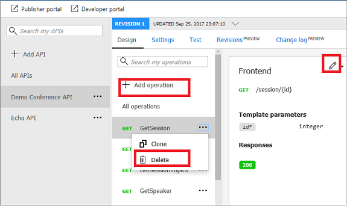
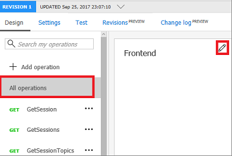
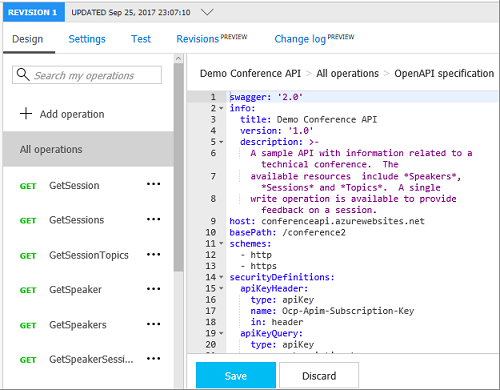

# Edit an API

The steps in this tutorial show you how to use API Management (APIM) to edit an API. 

+ You can do it by adding, deleting, renaming operations in the APIM instance. 
+ You can edit your API's swagger.

## Prerequisites

+ [Create an Azure API Management instance](get-started-create-service-instance.md)
+ [Import and publish your first API](import-and-publish.md)

[!INCLUDE [api-management-navigate-to-instance.md](../../includes/api-management-navigate-to-instance.md)]

## Edit an API in APIM

1. Click the **APIs** tab.
2. Select one of the APIs that you previously imported.
3. Select the **Design** tab.
4. Select an operation, which you want to edit.
5. To rename the operation, select a **pencil** in the **Frontend** window.

## Update the swagger

You can update your backbend API from the Azure portal by following these steps:

1. Select **All operations**
2. Click pencil in the **Frontend** window.

    

    Your API's swagger appears.

    

3. Update the swagger.
4. Press **Save**.

[!INCLUDE [api-management-define-api-topics.md](../../includes/api-management-define-api-topics.md)]

## Next steps

> [!div class="nextstepaction"]
> [APIM policy samples](./policy-reference.md)
> [Transform and protect a published API](transform-api.md)