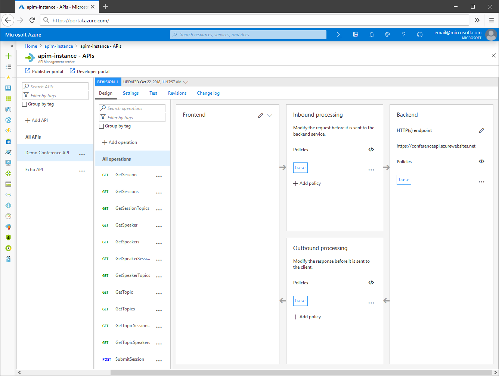
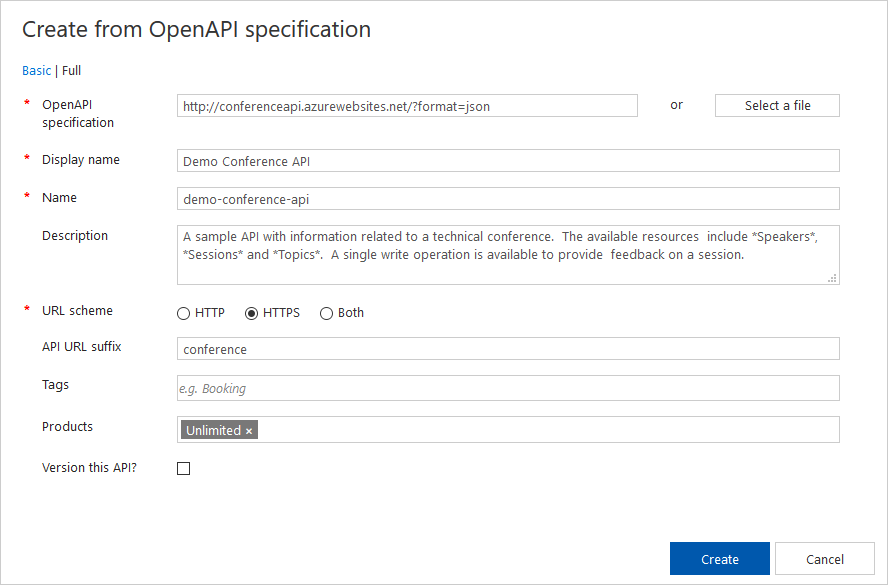
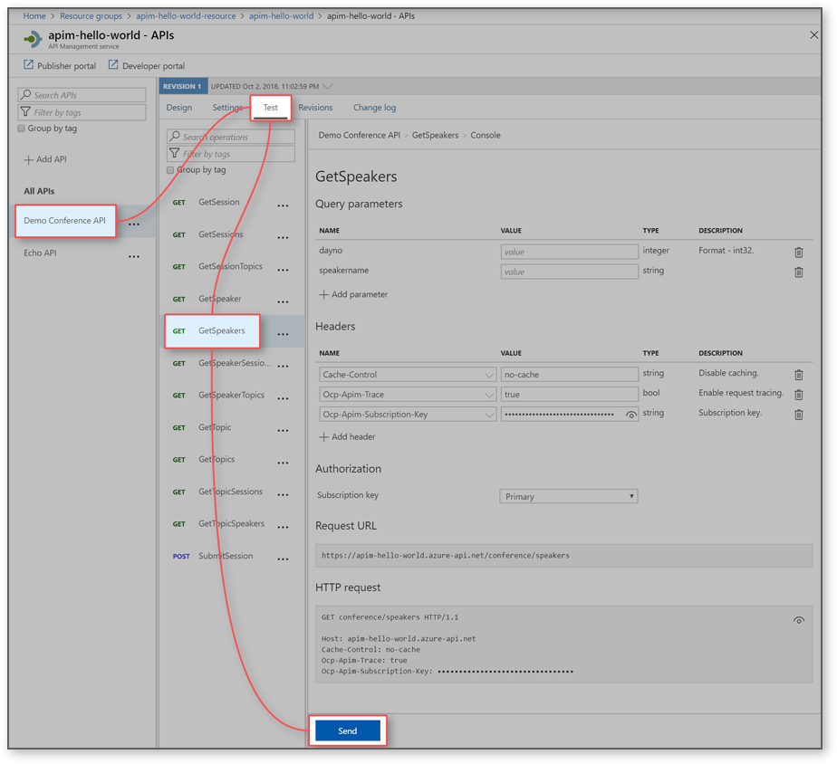

# Import and publish your first API 

This tutorial shows how to import an "OpenAPI specification" backend API residing at https://conferenceapi.azurewebsites.net?format=json. This backend API is provided by Microsoft and hosted on Azure. 

Once the backend API is imported into API Management (APIM), the APIM API becomes a facade for the backend API. At the time you import the backend API, both the source API and the APIM API are identical. APIM enables you to customize the facade according to your needs without touching the backend API. For more information, see [Transform and protect your API](transform-api.md). 

In this tutorial, you learn how to:

> [!div class="checklist"]
> * Import your first API
> * Test the API in the Azure portal
> * Test the API in the Developer portal

## Prerequisites

+ Learn the [Azure API Management terminology](api-management-terminology.md).
+ Complete the following quickstart: [Create an Azure API Management instance](get-started-create-service-instance.md).

[!INCLUDE [api-management-navigate-to-instance.md](../../includes/api-management-navigate-to-instance.md)]

## Import and publish a backend API

This section shows how to import and publish an OpenAPI specification backend API.
 
1. Select **APIs** from under **API MANAGEMENT**.
2. Select **OpenAPI specification** from the list and click **Full** in the pop-up.

    

    You can set the API values during creation or later by going to the **Settings** tab. The red star next to a field indicates that the field is required.

    Use the values from the table below to create your first API.

    | Setting                   | Value                                              | Description                                                                                                                                                                                                                                                                                                                                                                                                                                                                                                                                                                                                                                                                                                                                                                                                                                                 |
    |---------------------------|----------------------------------------------------|-------------------------------------------------------------------------------------------------------------------------------------------------------------------------------------------------------------------------------------------------------------------------------------------------------------------------------------------------------------------------------------------------------------------------------------------------------------------------------------------------------------------------------------------------------------------------------------------------------------------------------------------------------------------------------------------------------------------------------------------------------------------------------------------------------------------------------------------------------------|
    | **OpenAPI Specification** | https://conferenceapi.azurewebsites.net?format=json | References the service implementing the API. API management forwards requests to this address.                                                                                                                                                                                                                                                                                                                                                                                                                                                                                                                                                                                                                                                                                                                                                              |
    | **Display name**          | *Demo Conference API*                              | If you press tab after entering the service URL, APIM will fill out this field based on what is in the json.  This name is displayed in the Developer portal.                                                                                                                                                                                                                                                                                                                                                                                                                                                                                                                                                                                                                                                                                           |
    | **Name**                  | *demo-conference-api*                              | Provides a unique name for the API.  If you press tab after entering the service URL, APIM will fill out this field based on what is in the json.                                                                                                                                                                                                                                                                                                                                                                                                                                                                                                                                                                                                                                                                                                       |
    | **Description**           | Provide an optional description of the API.        | If you press tab after entering the service URL, APIM will fill out this field based on what is in the json.                                                                                                                                                                                                                                                                                                                                                                                                                                                                                                                                                                                                                                                                                                                                                |
    | **URL scheme**            | *HTTPS*                                            | Determines which protocols can be used to access the API.                                                                                                                                                                                                                                                                                                                                                                                                                                                                                                                                                                                                                                                                                                                                                                                                   |
    | **API URL suffix**        | *conference*                                       | The suffix is appended to the base URL for the API management service. API Management distinguishes APIs by their suffix and therefore the suffix must be unique for every API for a given publisher.                                                                                                                                                                                                                                                                                                                                                                                                                                                                                                                                                                                                                                                       |
    | **Products**              | *Unlimited*                                        | Products are associations of one or more APIs. You can include a number of APIs into a Product and offer them to developers through the developer portal.  You publish the API by associating the API with a product (in this example, *Unlimited*). To add this new API to a product, type the product name (you can also do it later from the **Settings** page). This step can be repeated multiple times to add the API to multiple products. To get access to the API, developers must first subscribe to a product. When they subscribe, they get a subscription key that is good for any API in that product.   If you created the APIM instance, you are an administrator already, so you are subscribed to every product.  By default, each API Management instance comes with two sample products: **Starter** and **Unlimited**. |
    | **Tags**                  |                                                    | Tags for organizing APIs. Tags can be used for searching, grouping, or filtering.                                                                                                                                                                                                                                                                                                                                                                                                                                                                                                                                                                                                                                                                                                                                                                           |
    | **Version this API?**     |                                                    | For more information about versioning, see [Publish multiple versions of your API](api-management-get-started-publish-versions.md)                                                                                                                                                                                                                                                                                                                                                                                                                                                                                                                                                                                                                                                                                                                          |

    >[!NOTE]
    > To publish the API, you must associate it with a product. You can do it from the **Settings page**.

3. Select **Create**.

> [!TIP]
> If you are experiencing problems with import of your own API definition, [see the list of known issues and restrictions](api-management-api-import-restrictions.md).

## Test the new API in the Azure portal

Operations can be called directly from the Azure portal, which provides a convenient way to view and test the operations of an API.

1. Select the API you created in the previous step (from the **APIs** tab).
2. Press the **Test** tab.
3. Click on **GetSpeakers**. The page displays fields for query parameters, in this case none, and headers. One of the headers is "Ocp-Apim-Subscription-Key", for the subscription key of the product that is associated with this API. The key is filled in automatically.
4. Press **Send**.

    Backend responds with **200 OK** and some data.

## Next steps

In this tutorial, you learned how to:

> [!div class="checklist"]
> * Import your first API
> * Test the API in the Azure portal

Advance to the next tutorial:

> [!div class="nextstepaction"]
> [Create and publish a product](api-management-howto-add-products.md)
