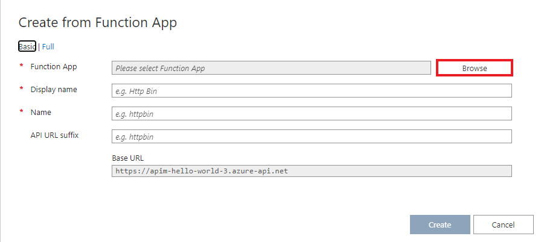
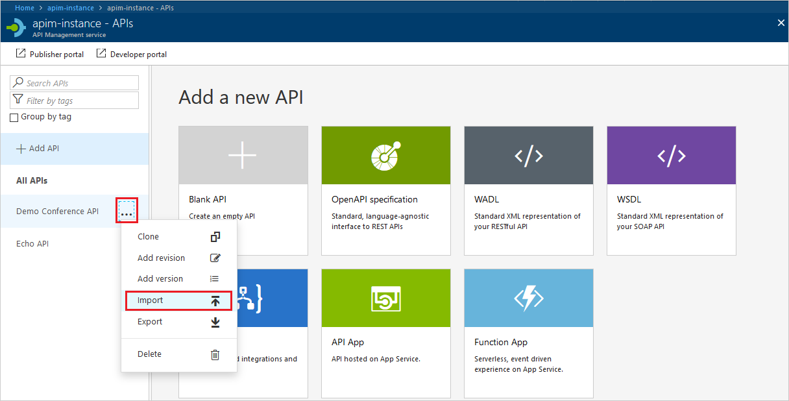
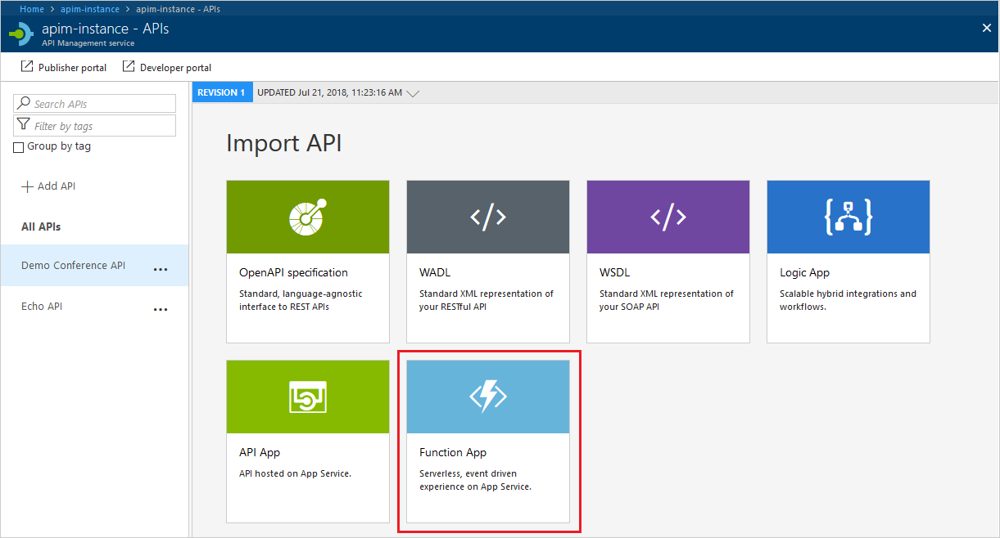
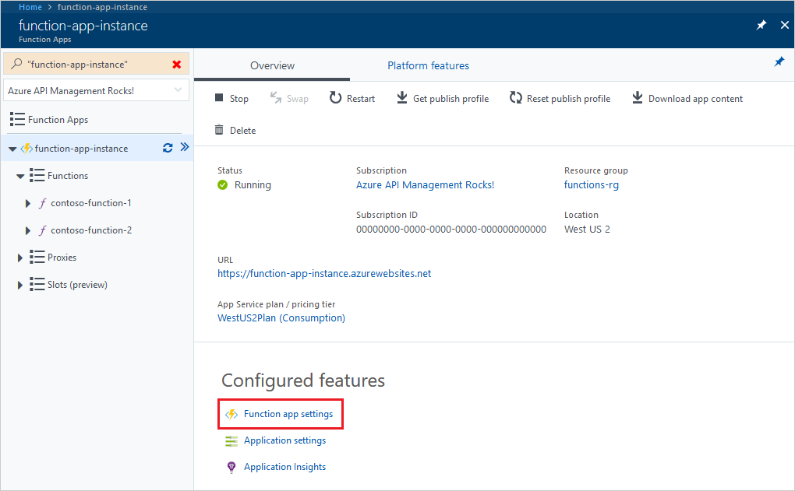
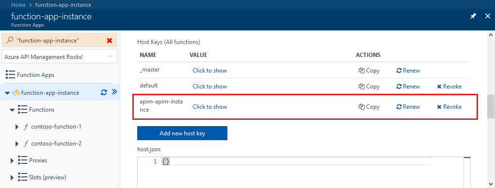
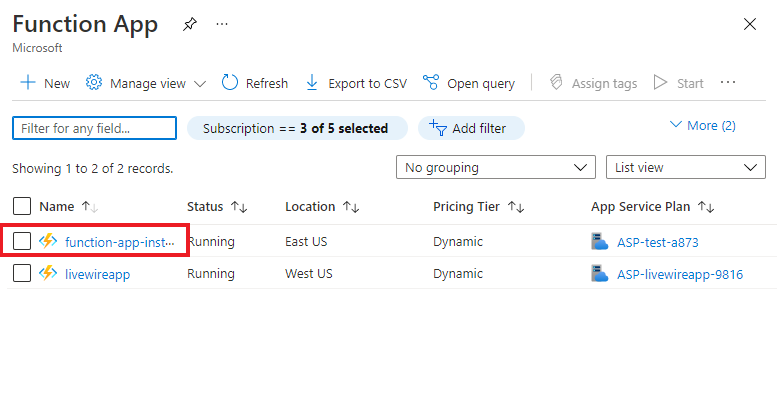

# Import an Azure Function App as an API in Azure API Management

Azure API Management supports importing Azure Function Apps as new APIs or appending them to existing APIs. The process automatically generates a host key in the Azure Function App, which is then assigned to a named value in Azure API Management.

This article walks through importing an Azure Function App as an API in Azure API Management. It also describes the testing process.

You will learn how to:

> [!div class="checklist"]
> * Import an Azure Function App as an API
> * Append an Azure Function App to an API
> * View the new Azure Function App host key and Azure API Management named value
> * Test the API in the Azure portal
> * Test the API in the developer portal

## Prerequisites

* Complete the quickstart [Create an Azure API Management instance](get-started-create-service-instance.md).
* Make sure you have an Azure Functions app in your subscription. For more information, see [Create an Azure Function App](../azure-functions/functions-create-first-azure-function.md#create-a-function-app). It has to contain Functions with HTTP trigger and authorization level setting set to *Anonymous* or *Function*.

[!INCLUDE [api-management-navigate-to-instance.md](../../includes/api-management-navigate-to-instance.md)]

##  Import an Azure Function App as a new API

Follow the steps below to create a new API from an Azure Function App.

1. Navigate to your API Management service in the Azure portal and select **APIs** from the menu.

2. In the **Add a new API** list, select **Function App**.

    

3. Click **Browse** to select Functions for import.

    

4. Click on the **Function App** section to choose from the list of available Function Apps.

    

5. Find the Function App you want to import Functions from, click on it and press **Select**.

    

6. Select the Functions you would like to import and click **Select**.

    

    > [!NOTE]
    > You can import only Functions that are based off HTTP trigger and have the authorization level setting set to *Anonymous* or *Function*.

7. Switch to the **Full** view and assign **Product** to your new API. If needed, specify other fields during creation or configure them later by going to the **Settings** tab. The settings are explained in the [Import and publish your first API](import-and-publish.md#import-and-publish-a-backend-api) tutorial.
8. Click **Create**.

##  Append Azure Function App to an existing API

Follow the steps below to append Azure Function App to an existing API.

1. In your **Azure API Management** service instance, select **APIs** from the menu on the left.

2. Choose an API you want to import an Azure Function App to. Click **...** and select **Import** from the context menu.

    

3. Click on the **Function App** tile.

    

4. In the pop-up window, click **Browse**.

    

5. Click on the **Function App** section to choose from the list of available Function Apps.

    

6. Find the Function App you want to import Functions from, click on it and press **Select**.

    

7. Select the Functions you would like to import and click **Select**.

    

8. Click **Import**.

    

##  Authorization

Import of an Azure Function App automatically generates:

* Host key inside the Function App with the name apim-{*your Azure API Management service instance name*},
* Named value inside the Azure API Management instance with the name {*your Azure Function App instance name*}-key, which contains the created host key.

For APIs created after April 4th 2019, the host key is passed in HTTP requests from API Management to the Function App in a header. Older APIs pass the host key as [a query parameter](../azure-functions/functions-bindings-http-webhook-trigger.md#api-key-authorization). This behavior may be changed through the `PATCH Backend` [REST API call](/rest/api/apimanagement/2019-12-01/backend/update#backendcredentialscontract) on the *Backend* entity associated with the Function App.

> [!WARNING]
> Removing or changing value of either the Azure Function App host key or Azure API Management named value will break the communication between the services. The values do not sync automatically.
>
> If you need to rotate the host key, make sure the named value in Azure API Management is also modified.

### Access Azure Function App host key

1. Navigate to your Azure Function App instance.

2. Select **Function App settings** from the overview.

    

3. The key is located in the **Host Keys** section.

    

### Access the named value in Azure API Management

Navigate to your Azure API Management instance and select **Named values** from the menu on the left. The Azure Function App key is stored there.

##  Test the new API in the Azure portal

You can call operations directly from the Azure portal. Using the Azure portal is a convenient way to view and test the operations of an API.  

1. Select the API that you created in the preceding section.

2. Select the **Test** tab.

3. Select an operation.

    The page displays fields for query parameters and fields for the headers. One of the headers is **Ocp-Apim-Subscription-Key**, for the subscription key of the product that is associated with this API. If you created the API Management instance, you are an administrator already, so the key is filled in automatically. 

4. Select **Send**.

    The back end responds with **200 OK** and some data.

[!INCLUDE [api-management-define-api-topics.md](../../includes/api-management-define-api-topics.md)]

## Next steps

> [!div class="nextstepaction"]
> [Transform and protect a published API](transform-api.md)
