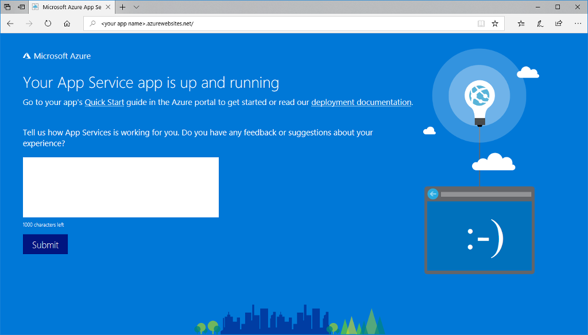

# Create a Node.js web app in Azure

> [!NOTE]
> This article deploys an app to App Service on Windows. To deploy to App Service on _Linux_, see [Create a Node.js web app in Azure App Service on Linux](./containers/quickstart-nodejs.md).
>

[Azure App Service](overview.md) provides a highly scalable, self-patching web hosting service.  This quickstart shows how to deploy a Node.js app to Azure App Service. You create the web app using the [Cloud Shell](https://docs.microsoft.com/azure/cloud-shell/overview), but you can also run these commands locally with [Azure CLI](/cli/azure/install-azure-cli). You deploy the sample Node.js code to the web app using the [az webapp deployment source config-zip](/cli/azure/webapp/deployment/source?view=azure-cli-latest#az-webapp-deployment-source-config-zip) command.  


You can follow the steps here using a Mac, Windows, or Linux machine. It takes about three minutes to complete the steps.

[!INCLUDE [quickstarts-free-trial-note](../../includes/quickstarts-free-trial-note.md)]

[!INCLUDE [cloud-shell-try-it.md](../../includes/cloud-shell-try-it.md)]

## Download the sample

In the Cloud Shell, create a quickstart directory and then change to it.

```azurecli-interactive
mkdir quickstart

cd quickstart
```

Next, run the following command to clone the sample app repository to your quickstart directory.

```azurecli-interactive
git clone https://github.com/Azure-Samples/nodejs-docs-hello-world
```

While running, it displays information similar to the following example:

```bash
Cloning into 'nodejs-docs-hello-world'...
remote: Counting objects: 40, done.
remote: Total 40 (delta 0), reused 0 (delta 0), pack-reused 40
Unpacking objects: 100% (40/40), done.
Checking connectivity... done.
```

> [!NOTE]
> The sample index.js sets the listening port to process.env.PORT. This environment variable is assigned by App Service.
>

[!INCLUDE [Create resource group](../../includes/app-service-web-create-resource-group-scus.md)]

[!INCLUDE [Create app service plan](../../includes/app-service-web-create-app-service-plan-scus.md)]

## Create a web app

In the Cloud Shell, create a web app in the `myAppServicePlan` App Service plan with the [`az webapp create`](/cli/azure/webapp?view=azure-cli-latest#az-webapp-create) command.

In the following example, replace `<app_name>` with a globally unique app name (valid characters are `a-z`, `0-9`, and `-`).

```azurecli-interactive
# Bash and Powershell
az webapp create --resource-group myResourceGroup --plan myAppServicePlan --name <app_name>
```

When the web app has been created, the Azure CLI shows output similar to the following example:

```json
{
  "availabilityState": "Normal",
  "clientAffinityEnabled": true,
  "clientCertEnabled": false,
  "cloningInfo": null,
  "containerSize": 0,
  "dailyMemoryTimeQuota": 0,
  "defaultHostName": "<app_name>.azurewebsites.net",
  "enabled": true,
  < JSON data removed for brevity. >
}
```

### Set Node.js runtime

Set the Node runtime to 10.14.1. To see all supported runtimes, run [`az webapp list-runtimes`](/cli/azure/webapp?view=azure-cli-latest#az-webapp-list-runtimes).

```azurecli-interactive
# Bash and Powershell
az webapp config appsettings set --resource-group myResourceGroup --name <app_name> --settings WEBSITE_NODE_DEFAULT_VERSION=10.14.1
```

Browse to your newly created web app. Replace `<app_name>` with a unique app name.

```
http://<app_name>.azurewebsites.net
```

Here is what your new web app should look like:


## Deploy ZIP file

In the Cloud Shell, navigate to your application's root directory, create a new ZIP file for your sample project.

```azurecli-interactive
cd nodejs-docs-hello-world  

zip -r myUpdatedAppFiles.zip *.*
```

Deploy the ZIP file to your web app by using the [az webapp deployment source config-zip](/cli/azure/webapp/deployment/source?view=azure-cli-latest#az-webapp-deployment-source-config-zip) command.  

```azurecli-interactive
az webapp deployment source config-zip --resource-group myResourceGroup --name <app_name> --src myUpdatedAppFiles.zip
```

This command deploys the files and directories from the ZIP file to your default App Service application folder (`\home\site\wwwroot`) and restarts the app. If any additional custom build process is configured, it is run as well. For more information, see [Kudu documentation](https://github.com/projectkudu/kudu/wiki/Deploying-from-a-zip-file).

## Browse to the app

Browse to the deployed application using your web browser.

```
http://<app_name>.azurewebsites.net
```

The Node.js sample code is running in an Azure App Service web app.


> [!NOTE]
> In Azure App Service, the app is run in IIS using [iisnode](https://github.com/Azure/iisnode). To enable the app to run with iisnode, the root app directory contains a web.config file. The file is readable by IIS, and the iisnode-related settings are documented in [the iisnode GitHub repository](https://github.com/Azure/iisnode/blob/master/src/samples/configuration/web.config).

**Congratulations!** You've deployed your first Node.js app to App Service.

## Update and redeploy the code

In the Cloud Shell, type `code index.js` to open the Cloud Shell editor.


Make a small change to the text in the call to `response.end`:

```javascript
response.end("Hello Azure!");
```

Save your changes and exit the editor. Use the command `^S` to save and `^Q` to exit.

Create a ZIP file and deploy it using the [az webapp deployment source config-zip](/cli/azure/webapp/deployment/source?view=azure-cli-latest#az-webapp-deployment-source-config-zip) command.  

```azurecli-interactive
# Bash
zip -r myUpdatedAppFiles.zip *.*

az webapp deployment source config-zip --resource-group myResourceGroup --name <app_name> --src myUpdatedAppFiles.zip
```

Switch back to the browser window that opened in the **Browse to the app** step, and refresh the page.


## Manage your new Azure app

Go to the <a href="https://portal.azure.com" target="_blank">Azure portal</a> to manage the web app you created.

From the left menu, click **App Services**, and then click the name of your Azure app.


You see your web app's Overview page. Here, you can perform basic management tasks like browse, stop, start, restart, and delete.


The left menu provides different pages for configuring your app.

[!INCLUDE [cli-samples-clean-up](../../includes/cli-samples-clean-up.md)]

## Next steps

> [!div class="nextstepaction"]
> [Node.js with MongoDB](app-service-web-tutorial-nodejs-mongodb-app.md)
