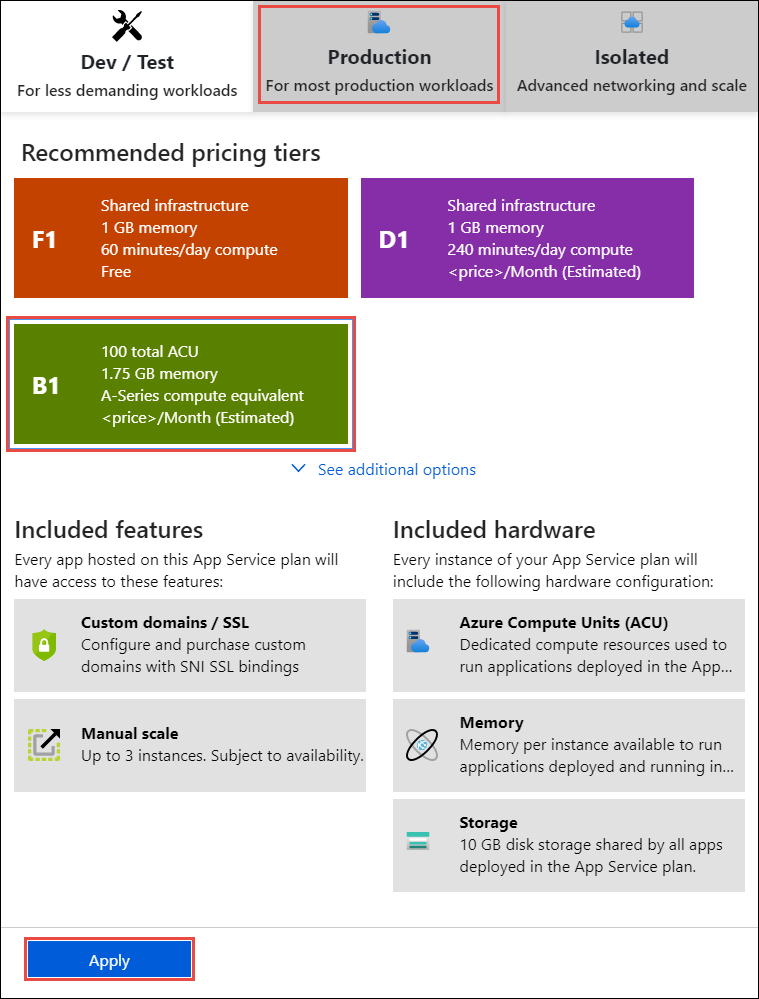
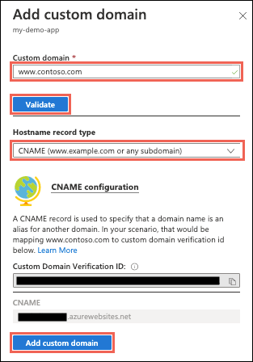
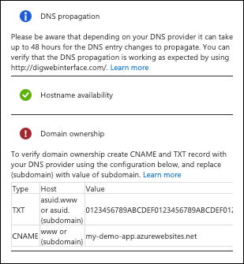
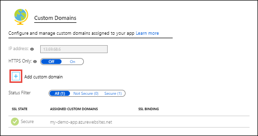
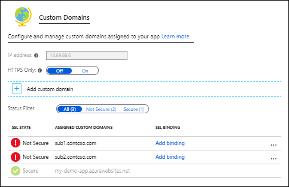

# Tutorial: Map an existing custom DNS name to Azure App Service

[Azure App Service](overview.md) provides a highly scalable, self-patching web hosting service. This tutorial shows you how to map an existing custom DNS name to Azure App Service.


In this tutorial, you learn how to:

> [!div class="checklist"]
> * Map a subdomain (for example, `www.contoso.com`) by using a CNAME record
> * Map a root domain (for example, `contoso.com`) by using an A record
> * Map a wildcard domain (for example, `*.contoso.com`) by using a CNAME record
> * Redirect the default URL to a custom directory
> * Automate domain mapping with scripts

## Prerequisites

To complete this tutorial:

* [Create an App Service app](/azure/app-service/), or use an app that you created for another tutorial.
* Purchase a domain name and make sure you have access to the DNS registry for your domain provider (such as GoDaddy).

  For example, to add DNS entries for `contoso.com` and `www.contoso.com`, you must be able to configure the DNS settings for the `contoso.com` root domain.

  > [!NOTE]
  > If you don't have an existing domain name, consider [purchasing a domain using the Azure portal](manage-custom-dns-buy-domain.md).

## Prepare the app

To map a custom DNS name to a web app, the web app's [App Service plan](https://azure.microsoft.com/pricing/details/app-service/) must be a paid tier (**Shared**, **Basic**, **Standard**, **Premium** or **Consumption** for Azure Functions). In this step, you make sure that the App Service app is in the supported pricing tier.

[!INCLUDE [app-service-dev-test-note](../../includes/app-service-dev-test-note.md)]

### Sign in to Azure

Open the [Azure portal](https://portal.azure.com) and sign in with your Azure account.

### Navigate to the app in the Azure portal

From the left menu, select **App Services**, and then select the name of the app.


You see the management page of the App Service app.  

<a name="checkpricing"></a>

### Check the pricing tier

In the left navigation of the app page, scroll to the **Settings** section and select **Scale up (App Service plan)**.


The app's current tier is highlighted by a blue border. Check to make sure that the app is not in the **F1** tier. Custom DNS is not supported in the **F1** tier. 


If the App Service plan is not in the **F1** tier, close the **Scale up** page and skip to [Map a CNAME record](#cname).

<a name="scaleup"></a>

### Scale up the App Service plan

Select any of the non-free tiers (**D1**, **B1**, **B2**, **B3**, or any tier in the **Production** category). For additional options, click **See additional options**.

Click **Apply**.



When you see the following notification, the scale operation is complete.


<a name="cname"></a>

## Map your domain

You can use either a **CNAME record** or an **A record** to map a custom DNS name to App Service. Follow the respective steps:

- [Map a CNAME record](#map-a-cname-record)
- [Map an A record](#map-an-a-record)
- [Map a wildcard domain (with a CNAME record)](#map-a-wildcard-domain)

> [!NOTE]
> You should use CNAME records for all custom DNS names except root domains (for example, `contoso.com`). For root domains, use A records.

### Map a CNAME record

In the tutorial example, you add a CNAME record for the `www` subdomain (for example, `www.contoso.com`).

#### Access DNS records with domain provider

[!INCLUDE [Access DNS records with domain provider](../../includes/app-service-web-access-dns-records-no-h.md)]

#### Create the CNAME record

Add a CNAME record to map a subdomain to the app's default hostname (`<app_name>.azurewebsites.net`, where `<app_name>` is the name of your app).

For the `www.contoso.com` domain example, add a CNAME record that maps the name `www` to `<app_name>.azurewebsites.net`.

After you add the CNAME, the DNS records page looks like the following example:


#### Enable the CNAME record mapping in Azure

In the left navigation of the app page in the Azure portal, select **Custom domains**. 


In the **Custom domains** page of the app, add the fully qualified custom DNS name (`www.contoso.com`) to the list.

Select the **+** icon next to **Add hostname**.


Type the fully qualified domain name that you added a CNAME record for, such as `www.contoso.com`.

Select **Validate**.

The **Add hostname** page is shown. 

Make sure that **Hostname record type** is set to **CNAME (www\.example.com or any subdomain)**.

Select **Add hostname**.



It might take some time for the new hostname to be reflected in the app's **Custom domains** page. Try refreshing the browser to update the data.


> [!NOTE]
> A **Note Secure** label for your custom domain means that it's not yet bound to an SSL certificate, and any HTTPS request from a browser to your custom domain will receive and error or warning, depending on the browser. To add an SSL binding, see [Bind an existing custom SSL certificate to Azure App Service](app-service-web-tutorial-custom-ssl.md).

If you missed a step or made a typo somewhere earlier, you see a verification error at the bottom of the page.



<a name="a"></a>

### Map an A record

In the tutorial example, you add an A record for the root domain (for example, `contoso.com`).

<a name="info"></a>

#### Copy the app's IP address

To map an A record, you need the app's external IP address. You can find this IP address in the app's **Custom domains** page in the Azure portal.

In the left navigation of the app page in the Azure portal, select **Custom domains**.


In the **Custom domains** page, copy the app's IP address.


#### Access DNS records with domain provider

[!INCLUDE [Access DNS records with domain provider](../../includes/app-service-web-access-dns-records-no-h.md)]

#### Create the A record

To map an A record to an app, App Service requires **two** DNS records:

- An **A** record to map to the app's IP address.
- A **TXT** record to map to the app's default hostname `<app_name>.azurewebsites.net`. App Service uses this record only at configuration time, to verify that you own the custom domain. After your custom domain is validated and configured in App Service, you can delete this TXT record.

For the `contoso.com` domain example, create the A and TXT records according to the following table (`@` typically represents the root domain).

| Record type | Host | Value |
| - | - | - |
| A | `@` | IP address from [Copy the app's IP address](#info) |
| TXT | `@` | `<app_name>.azurewebsites.net` |

> [!NOTE]
> To add a subdomain (like `www.contoso.com`) using an A record instead of a recommended [CNAME record](#map-a-cname-record), your A record and TXT record should look like the following table instead:
>
> | Record type | Host | Value |
> | - | - | - |
> | A | `www` | IP address from [Copy the app's IP address](#info) |
> | TXT | `www` | `<app_name>.azurewebsites.net` |
>

When the records are added, the DNS records page looks like the following example:


<a name="enable-a"></a>

#### Enable the A record mapping in the app

Back in the app's **Custom domains** page in the Azure portal, add the fully qualified custom DNS name (for example, `contoso.com`) to the list.

Select the **+** icon next to **Add hostname**.



Type the fully qualified domain name that you configured the A record for, such as `contoso.com`.

Select **Validate**.

The **Add hostname** page is shown. 

Make sure that **Hostname record type** is set to **A record (example.com)**.

Select **Add hostname**.


It might take some time for the new hostname to be reflected in the app's **Custom domains** page. Try refreshing the browser to update the data.


> [!NOTE]
> A **Note Secure** label for your custom domain means that it's not yet bound to an SSL certificate, and any HTTPS request from a browser to your custom domain will receive and error or warning, depending on the browser. To add an SSL binding, see [Bind an existing custom SSL certificate to Azure App Service](app-service-web-tutorial-custom-ssl.md).

If you missed a step or made a typo somewhere earlier, you see a verification error at the bottom of the page.


<a name="wildcard"></a>

### Map a wildcard domain

In the tutorial example, you map a [wildcard DNS name](https://en.wikipedia.org/wiki/Wildcard_DNS_record) (for example, `*.contoso.com`) to the App Service app by adding a CNAME record.

#### Access DNS records with domain provider

[!INCLUDE [Access DNS records with domain provider](../../includes/app-service-web-access-dns-records-no-h.md)]

#### Create the CNAME record

Add a CNAME record to map a wildcard name to the app's default hostname (`<app_name>.azurewebsites.net`).

For the `*.contoso.com` domain example, the CNAME record will map the name `*` to `<app_name>.azurewebsites.net`.

When the CNAME is added, the DNS records page looks like the following example:


#### Enable the CNAME record mapping in the app

You can now add any subdomain that matches the wildcard name to the app (for example, `sub1.contoso.com` and `sub2.contoso.com` match `*.contoso.com`).

In the left navigation of the app page in the Azure portal, select **Custom domains**.


Select the **+** icon next to **Add hostname**.


Type a fully qualified domain name that matches the wildcard domain (for example, `sub1.contoso.com`), and then select **Validate**.

The **Add hostname** button is activated. 

Make sure that **Hostname record type** is set to **CNAME record (www\.example.com or any subdomain)**.

Select **Add hostname**.


It might take some time for the new hostname to be reflected in the app's **Custom domains** page. Try refreshing the browser to update the data.

Select the **+** icon again to add another hostname that matches the wildcard domain. For example, add `sub2.contoso.com`.



> [!NOTE]
> A **Note Secure** label for your custom domain means that it's not yet bound to an SSL certificate, and any HTTPS request from a browser to your custom domain will receive and error or warning, depending on the browser. To add an SSL binding, see [Bind an existing custom SSL certificate to Azure App Service](app-service-web-tutorial-custom-ssl.md).

## Test in browser

Browse to the DNS name(s) that you configured earlier (for example, `contoso.com`,  `www.contoso.com`, `sub1.contoso.com`, and `sub2.contoso.com`).


## Resolve 404 “Not Found”

If you receive an HTTP 404 (Not Found) error when browsing to the URL of your custom domain, verify that your domain resolves to your app's IP address using <a href="https://www.whatsmydns.net/" target="_blank">WhatsmyDNS.net</a>. If not, it may be due to one of the following reasons:

- The custom domain configured is missing an A record and/or a CNAME record.
- The browser client has cached the old IP address of your domain. Clear the cache and test DNS resolution again. On a Windows machine, you clear the cache with `ipconfig /flushdns`.

<a name="virtualdir"></a>

## Migrate an active domain

To migrate a live site and its DNS domain name to App Service with no downtime, see [Migrate an active DNS name to Azure App Service](manage-custom-dns-migrate-domain.md).

## Redirect to a custom directory

By default, App Service directs web requests to the root directory of your app code. However, certain web frameworks don't start in the root directory. For example, [Laravel](https://laravel.com/) starts in the `public` subdirectory. To continue the `contoso.com` DNS example, such an app would be accessible at `http://contoso.com/public`, but you would really want to direct `http://contoso.com` to the `public` directory instead. This step doesn't involve DNS resolution, but customizing the virtual directory.

To do this, select **Application settings** in the left-hand navigation of your web app page. 

At the bottom of the page, the root virtual directory `/` points to `site\wwwroot` by default, which is the root directory of your app code. Change it to point to the `site\wwwroot\public` instead, for example, and save your changes.


Once the operation completes, your app should return the right page at the root path (for example, http://contoso.com).

## Automate with scripts

You can automate management of custom domains with scripts, using the [Azure CLI](/cli/azure/install-azure-cli) or [Azure PowerShell](/powershell/azure/overview). 

### Azure CLI 

The following command adds a configured custom DNS name to an App Service app. 

```bash 
az webapp config hostname add \
    --webapp-name <app_name> \
    --resource-group <resource_group_name> \
    --hostname <fully_qualified_domain_name>
``` 

For more information, see [Map a custom domain to a web app](scripts/cli-configure-custom-domain.md).

### Azure PowerShell 

[!INCLUDE [updated-for-az](../../includes/updated-for-az.md)]

The following command adds a configured custom DNS name to an App Service app.

```powershell  
Set-AzWebApp `
    -Name <app_name> `
    -ResourceGroupName <resource_group_name> ` 
    -HostNames @("<fully_qualified_domain_name>","<app_name>.azurewebsites.net")
```

For more information, see [Assign a custom domain to a web app](scripts/powershell-configure-custom-domain.md).

## Next steps

In this tutorial, you learned how to:

> [!div class="checklist"]
> * Map a subdomain by using a CNAME record
> * Map a root domain by using an A record
> * Map a wildcard domain by using a CNAME record
> * Redirect the default URL to a custom directory
> * Automate domain mapping with scripts

Advance to the next tutorial to learn how to bind a custom SSL certificate to a web app.

> [!div class="nextstepaction"]
> [Bind an existing custom SSL certificate to Azure App Service](app-service-web-tutorial-custom-ssl.md)
