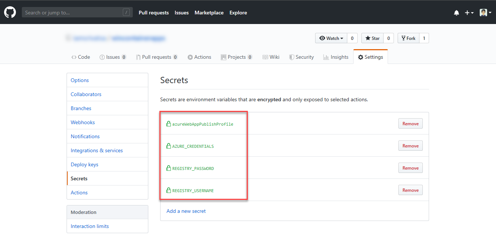

# Deploy a custom container to App Service using GitHub Actions

[GitHub Actions](https://help.github.com/en/articles/about-github-actions) gives you the flexibility to build an automated software development lifecycle workflow. With the [Azure App Service Action for Containers](https://github.com/Azure/webapps-container-deploy), you can automate your workflow to deploy apps as [custom containers to App Service](https://azure.microsoft.com/services/app-service/containers/) using GitHub Actions.

> [!IMPORTANT]
> GitHub Actions is currently in beta. You must first [sign-up to join the preview](https://github.com/features/actions) using your GitHub account.
> 

A workflow is defined by a YAML (.yml) file in the `/.github/workflows/` path in your repository. This definition contains the various steps and parameters that make up the workflow.

For an Azure App Service container workflow, the file has three sections:

|Section  |Tasks  |
|---------|---------|
|**Authentication** | 1. Define a service principal. <br /> 2. Create a GitHub secret. |
|**Build** | 1. Set up the environment. <br /> 2. Build the container image. |
|**Deploy** | 1. Deploy the container image. |

## Create a service principal

You can create a [service principal](https://docs.microsoft.com/azure/active-directory/develop/app-objects-and-service-principals#service-principal-object) by using the [az ad sp create-for-rbac](https://docs.microsoft.com/cli/azure/ad/sp?view=azure-cli-latest#az-ad-sp-create-for-rbac) command in the [Azure CLI](https://docs.microsoft.com/cli/azure/). You can run this command using [Azure Cloud Shell](https://shell.azure.com/) in the Azure portal or by selecting the **Try it** button.

```azurecli-interactive
az ad sp create-for-rbac --name "myApp" --role contributor \
                            --scopes /subscriptions/{subscription-id}/resourceGroups/{resource-group} \
                            --sdk-auth
                            
  # Replace {subscription-id}, {resource-group} with the subscription, resource group details of the WebApp
```

The output is a JSON object with the role assignment credentials that provide access to your App Service app similar to below. Copy this JSON object to authenticate from GitHub.

 ```azurecli 
  {
    "clientId": "<GUID>",
    "clientSecret": "<GUID>",
    "subscriptionId": "<GUID>",
    "tenantId": "<GUID>",
    (...)
  }
```

> [!IMPORTANT]
> It is always a good practice to grant minimum access. You could restrict scope in the above Az CLI command to the specific App Service app and the Azure Container Registry where the container images are pushed to.

## Configure the GitHub secret

The below example uses user-level credentials i.e. Azure Service Principal for deployment. Follow the steps to configure the secret:

1. In [GitHub](https://github.com/), browse your repository, select **Settings > Secrets > Add a new secret**

2. Paste the contents of the below `az cli` command as the value of secret variable. For example, `AZURE_CREDENTIALS`.

    
    ```azurecli
    az ad sp create-for-rbac --name "myApp" --role contributor \
                                --scopes /subscriptions/{subscription-id}/resourceGroups/{resource-group} \
                                --sdk-auth
                                
    # Replace {subscription-id}, {resource-group} with the subscription, resource group details
    ```

3. Now in the workflow file in your branch: `.github/workflows/workflow.yml` replace the secret in Azure login action with your secret.

4. Similarly, define the following additional secrets for the container registry credentials and set them in Docker login action. 

    - REGISTRY_USERNAME
    - REGISTRY_PASSWORD

5. You see the secrets as shown below once defined.

    

## Build the Container image

The following example show part of the workflow that builds the docker image.

```yaml
on: [push]

name: Linux_Container_Node_Workflow

jobs:
  build-and-deploy:
    runs-on: ubuntu-latest
    steps:
    # checkout the repo
    - name: 'Checkout Github Action' 
      uses: actions/checkout@master
    
    - name: 'Login via Azure CLI'
      uses: azure/login@v1
      with:
        creds: ${{ secrets.AZURE_CREDENTIALS }}
    
    - uses: azure/docker-login@v1
      with:
        login-server: contoso.azurecr.io
        username: ${{ secrets.REGISTRY_USERNAME }}
        password: ${{ secrets.REGISTRY_PASSWORD }}
    
    - run: |
        docker build . -t contoso.azurecr.io/nodejssampleapp:${{ github.sha }}
        docker push contoso.azurecr.io/nodejssampleapp:${{ github.sha }}
```

## Deploy to an App Service container

To deploy your image to a custom container in App Service, use the `azure/webapps-container-deploy@v1` action. This action has five parameters:

| **Parameter**  | **Explanation**  |
|---------|---------|
| **app-name** | (Required) Name of the App Service app | 
| **slot-name** | (Optional) Enter an existing Slot other than the Production slot |
| **images** | (Required) Specify the fully qualified container image(s) name. For example, 'myregistry.azurecr.io/nginx:latest' or 'python:3.7.2-alpine/'. For a multi-container app, multiple container image names can be provided (multi-line separated) |
| **configuration-file** | (Optional) Path of the Docker-Compose file. Should be a fully qualified path or relative to the default working directory. Required for multi-container apps. |
| **container-command** | (Optional) Enter the start-up command. For ex. dotnet run or dotnet filename.dll |

Below is the sample workflow to build and deploy a Node.js app to a custom container in App Service.

```yaml
on: [push]

name: Linux_Container_Node_Workflow

jobs:
  build-and-deploy:
    runs-on: ubuntu-latest
    steps:
    # checkout the repo
    - name: 'Checkout Github Action' 
      uses: actions/checkout@master
    
    - name: 'Login via Azure CLI'
      uses: azure/login@v1
      with:
        creds: ${{ secrets.AZURE_CREDENTIALS }}
    
    - uses: azure/docker-login@v1
      with:
        login-server: contoso.azurecr.io
        username: ${{ secrets.REGISTRY_USERNAME }}
        password: ${{ secrets.REGISTRY_PASSWORD }}
    
    - run: |
        docker build . -t contoso.azurecr.io/nodejssampleapp:${{ github.sha }}
        docker push contoso.azurecr.io/nodejssampleapp:${{ github.sha }} 
      
    - uses: azure/webapps-container-deploy@v1
      with:
        app-name: 'node-rnc'
        images: 'contoso.azurecr.io/nodejssampleapp:${{ github.sha }}'
    
    - name: Azure logout
      run: |
        az logout
```

## Next steps

You can find our set of Actions grouped into different repositories on GitHub, each one containing documentation and examples to help you use GitHub for CI/CD and deploy your apps to Azure.

- [Azure login](https://github.com/Azure/login)

- [Azure WebApp](https://github.com/Azure/webapps-deploy)

- [Azure WebApp for containers](https://github.com/Azure/webapps-container-deploy)

- [Docker login/logout](https://github.com/Azure/docker-login)

- [Events that trigger workflows](https://help.github.com/en/articles/events-that-trigger-workflows)

- [K8s deploy](https://github.com/Azure/k8s-deploy)

- [Starter CI Workflows](https://github.com/actions/starter-workflows)

- [Starter workflows to deploy to Azure](https://github.com/Azure/actions-workflow-samples)
