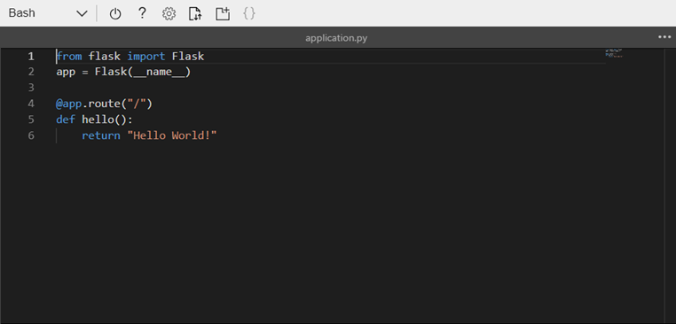
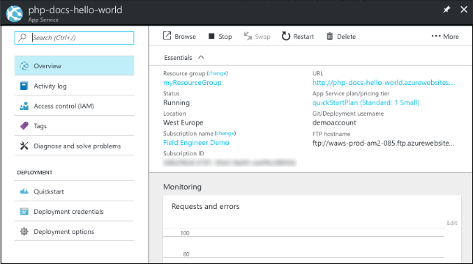

# Create a Python app in Azure App Service on Linux

In this quickstart, you deploy a simple Python app to [App Service on Linux](app-service-linux-intro.md), which provides a highly scalable, self-patching web hosting service. You use the Azure command-line interface (the [Azure CLI](/cli/azure/install-azure-cli)) through the interactive, browser-based Azure Cloud Shell, so you can follow the steps use a Mac, Linux, or Windows computer.


## Prerequisites

To complete this quickstart:

* <a href="https://www.python.org/downloads/" target="_blank">Install Python 3.7</a>
* <a href="https://git-scm.com/" target="_blank">Install Git</a>
* An Azure subscription. If you don't have one already, create a [free account](https://azure.microsoft.com/free/?ref=microsoft.com&utm_source=microsoft.com&utm_medium=docs&utm_campaign=visualstudio) before you begin.

## Download the sample locally

In a terminal window, run the following commands to clone the sample application to your local machine, and go to the directory with the sample code.

```bash
git clone https://github.com/Azure-Samples/python-docs-hello-world
cd python-docs-hello-world
```

The repository contains an *application.py*, which tells App Service that the repository contains a Flask app. For more information, see [Container startup process and customizations](how-to-configure-python.md).

## Run the app locally

Run the application locally so that you see how it should look when you deploy it to Azure. Open a terminal window and use the commands below to install the required dependencies and launch the built-in development server. 

```bash
# In Bash
python3 -m venv venv
source venv/bin/activate
pip install -r requirements.txt
FLASK_APP=application.py flask run

# In PowerShell
py -3 -m venv env
env\scripts\activate
pip install -r requirements.txt
Set-Item Env:FLASK_APP ".\application.py"
flask run
```

Open a web browser, and go to the sample app at `http://localhost:5000/`.

You see the **Hello World!** message from the sample app displayed in the page.


In your terminal window, press **Ctrl+C** to exit the web server.

[!INCLUDE [cloud-shell-try-it.md](../../../includes/cloud-shell-try-it.md)]

## Download the sample

In the Cloud Shell, create a quickstart directory and then change to it.

```bash
mkdir quickstart

cd $HOME/quickstart
```

Next, run the following command to clone the sample app repository to your quickstart directory.

```bash
git clone https://github.com/Azure-Samples/python-docs-hello-world
```

While running, it displays information similar to the following example:

```bash
Cloning into 'python-docs-hello-world'...
remote: Enumerating objects: 43, done.
remote: Total 43 (delta 0), reused 0 (delta 0), pack-reused 43
Unpacking objects: 100% (43/43), done.
Checking connectivity... done.
```

## Create a web app

Change to the directory that contains the sample code and run the `az webapp up` command.

In the following example, replace `<app-name>` with a globally unique app name (*valid characters are `a-z`, `0-9`, and `-`*).

```bash
cd python-docs-hello-world

az webapp up -n <app-name>
```

This command may take a few minutes to run. While running, it displays information similar to the following example:

```json
The behavior of this command has been altered by the following extension: webapp
Creating Resource group 'appsvc_rg_Linux_CentralUS' ...
Resource group creation complete
Creating App service plan 'appsvc_asp_Linux_CentralUS' ...
App service plan creation complete
Creating app '<app-name>' ....
Webapp creation complete
Creating zip with contents of dir /home/username/quickstart/python-docs-hello-world ...
Preparing to deploy contents to app.
All done.
{
  "app_url": "https:/<app-name>.azurewebsites.net",
  "location": "Central US",
  "name": "<app-name>",
  "os": "Linux",
  "resourcegroup": "appsvc_rg_Linux_CentralUS ",
  "serverfarm": "appsvc_asp_Linux_CentralUS",
  "sku": "BASIC",
  "src_path": "/home/username/quickstart/python-docs-hello-world ",
  "version_detected": "-",
  "version_to_create": "python|3.7"
}
```

[!INCLUDE [AZ Webapp Up Note](../../../includes/app-service-web-az-webapp-up-note.md)]

## Browse to the app

Browse to the deployed application using your web browser.

```bash
http://<app-name>.azurewebsites.net
```

The Python sample code is running in App Service on Linux with a built-in image.


**Congratulations!** You've deployed your first Python app to App Service on Linux.

## Update locally and redeploy the code

In the Cloud Shell, enter `code application.py` to open the Cloud Shell editor.



 Make a small change to the text in the call to `return`:

```python
return "Hello Azure!"
```

Save your changes and exit the editor. Use the command `^S` to save and `^Q` to exit.

Redeploy the app using the [`az webapp up`](/cli/azure/webapp#az-webapp-up) command. Substitute the name of your app for `<app-name>`, and specify a location for `<location-name>` (using one of the values shown from the [`az account list-locations`](/cli/azure/appservice?view=azure-cli-latest.md#az-appservice-list-locations) command).

```bash
az webapp up -n <app-name> -l <location-name>
```

Once deployment has completed, switch back to the browser window that opened in the **Browse to the app** step, and refresh the page.


## Manage your new Azure app

Go to the <a href="https://portal.azure.com" target="_blank">Azure portal</a> to manage the app you created.

From the left menu, select **App Services**, and then select the name of your Azure app.


You see your app's Overview page. Here, you can perform basic management tasks like browse, stop, start, restart, and delete.



The left menu provides different pages for configuring your app. 

[!INCLUDE [cli-samples-clean-up](../../../includes/cli-samples-clean-up.md)]

## Next steps

> [!div class="nextstepaction"]
> [Tutorial: Python (Django) web app with PostgreSQL](tutorial-python-postgresql-app.md)

> [!div class="nextstepaction"]
> [Configure Python app](how-to-configure-python.md)

> [!div class="nextstepaction"]
> [Tutorial: Run Python app in custom container](tutorial-custom-docker-image.md)
