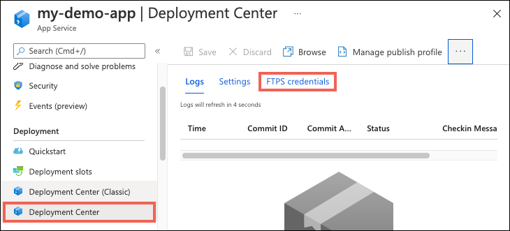

# Configure deployment credentials for Azure App Service
[Azure App Service](https://go.microsoft.com/fwlink/?LinkId=529714) supports two types of credentials for [local Git deployment](deploy-local-git.md) 
and [FTP/S deployment](deploy-ftp.md). These credentials are not the same as your Azure subscription credentials.

* **User-level credentials**: one set of credentials for the entire Azure account. It can be used to deploy to App Service for any app, in any subscription, that the Azure account has permission to access. It's the default set that's surfaced in the portal GUI (such as the **Overview** and **Properties**
of the app's [resource page](../azure-resource-manager/management/manage-resources-portal.md#manage-resources)). When a user is granted app access via Role-Based Access Control (RBAC) or coadmin permissions, that user can use their own user-level credentials until the access is revoked. Do not share these credentials with other Azure users.

* **App-level credentials**: one set of credentials for each app. It can be used to deploy to that app only. The credentials for each app are generated automatically at app creation. They can't be configured manually, but can be reset anytime. For a user to be granted access to app-level credentials via (RBAC), that user must be contributor or higher on the app (including Website Contributor built-in role). Readers are not allowed to publish, and can't access those credentials.

## <a name="userscope"></a>Configure user-level credentials

You can configure your user-level credentials in any app's [resource page](../azure-resource-manager/management/manage-resources-portal.md#manage-resources). Regardless in which app you configure these credentials, it applies to all apps and for all subscriptions in your Azure account. 

### In the Cloud Shell

To configure the deployment user in the [Cloud Shell](https://shell.azure.com), run the [az webapp deployment user set](/cli/azure/webapp/deployment/user?view=azure-cli-latest#az-webapp-deployment-user-set) command. Replace \<username> and \<password> with a deployment user username and password. 

- The username must be unique within Azure, and for local Git pushes, must not contain the ‘@’ symbol. 
- The password must be at least eight characters long, with two of the following three elements: letters, numbers, and symbols. 

```azurecli-interactive
az webapp deployment user set --user-name <username> --password <password>
```

The JSON output shows the password as `null`. If you get a `'Conflict'. Details: 409` error, change the username. If you get a `'Bad Request'. Details: 400` error, use a stronger password. 

### In the portal

In the Azure portal, you must have at least one app before you can access the deployment credentials page. To configure your user-level credentials:

1. In the [Azure portal](https://portal.azure.com), from the left menu, select **App Services** > **\<any_app>** > **Deployment center** > **FTP** > **Dashboard**.

    

    Or, if you've already configured Git deployment, select **App Services** > **&lt;any_app>** > **Deployment center** > **FTP/Credentials**.

    

2. Select **User Credentials**, configure the user name and password, and then select **Save Credentials**.

Once you have set your deployment credentials, you can find the *Git* deployment username in your app's **Overview** page,


If Git deployment is configured, the page shows a **Git/deployment username**; otherwise, an **FTP/deployment username**.

> [!NOTE]
> Azure does not show your user-level deployment password. If you forget the password, you can reset your credentials by following the steps in this section.
>
> 

## Use user-level credentials with FTP/FTPS

Authenticating to an FTP/FTPS endpoint using user-level credentials requirers a username in the following format:
`<app-name>\<user-name>`

Since user-level credentials are linked to the user and not a specific resource, the username must be in this format to direct the sign-in action to the right app endpoint.

## <a name="appscope"></a>Get and reset app-level credentials
To get the app-level credentials:

1. In the [Azure portal](https://portal.azure.com), from the left menu, select **App Services** > **&lt;any_app>** > **Deployment center** > **FTP/Credentials**.

2. Select **App Credentials**, and select the **Copy** link to copy the username or password.

To reset the app-level credentials, select **Reset Credentials** in the same dialog.

## Next steps

Find out how to use these credentials to deploy your app from [local Git](deploy-local-git.md) or using [FTP/S](deploy-ftp.md).
