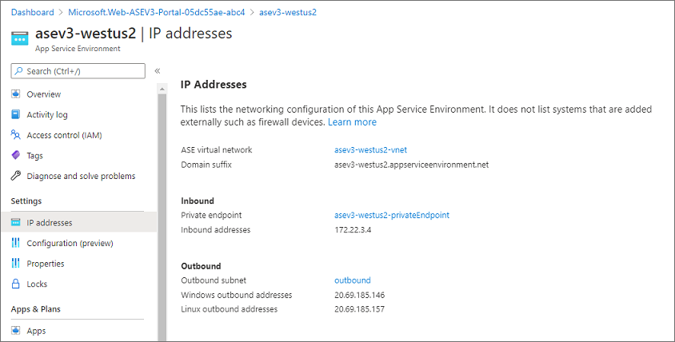

# App Service Environment networking

> [!NOTE]
> This article is about the App Service Environment v3 (preview)
> 

The App Service Environment (ASE) is a single tenant deployment of the Azure App Service that hosts web apps, api apps, and function apps. When you install an ASE, you pick the Azure Virtual Network (VNet) that you want it to be deployed in. All of the inbound and outbound traffic application will be inside the VNet you specify.  

The ASEv3 uses two subnets.  One subnet is used for the private endpoint that handles inbound traffic. This could be a pre-existing subnet or a new one.  The inbound subnet can be used for other purposes than the private endpoint. The outbound subnet can only be used for outbound traffic from the ASE. Nothing else can go in the ASE outbound subnet.

## Addresses 
The ASE has the following addresses at creation:

| Address type | description |
|--------------|-------------|
| Inbound address | The inbound address is the private endpoint address used by your ASE. |
| Outbound subnet | The outbound subnet is also the ASE subnet. During preview this subnet is only used for outbound traffic. |
| Windows outbound address | The Windows apps in this ASE will use this address, by default, when making outbound calls to the internet. |
| Linux outbound address | The Linux apps in this ASE will use this address, by default, when making outbound calls to the internet. |

The ASEv3 has details on the addresses used by the ASE in the **IP Addresses** portion of the ASE portal.

If you delete the private endpoint used by the ASE, you can't reach the apps in your ASE.  

The ASE uses addresses in the outbound subnet to support the infrastructure used by the ASE. As you scale your App Service plans in your ASE, you'll use more addresses. Apps in the ASE don't have dedicated addresses in the outbound subnet. The addresses used by an app in the outbound subnet by an app will change over time.

## Ports

The ASE receives application traffic on ports 80 and 443.  There are no inbound or outbound port requirements for the ASE. 

## Extra configurations

Unlike the ASEv2, with ASEv3 you can set Network Security Groups (NSGs) and Route Tables (UDRs) as you see fit without restriction. If you want to force tunnel all of the outbound traffic from your ASE to an NVA device. You can put WAF devices in front of all inbound traffic to your ASE. 

## DNS

The apps in your ASE will use the DNS that your VNet is configured with. Follow the instructions in [Using an App Service Environment](https://docs.microsoft.com/azure/app-service/environment/using#dns-configuration) to configure your DNS server to point to your ASE. If you want some apps to use a different DNS server than what your VNet is configured with, you can manually set it on a per app basis with the app settings WEBSITE_DNS_SERVER and WEBSITE_DNS_ALT_SERVER. The app setting WEBSITE_DNS_ALT_SERVER configures the secondary DNS server. The secondary DNS server is only used when there is no response from the primary DNS server. 

## Preview limitation

There are a few networking features that aren't available with ASEv3.  The things that aren't available in ASEv3 include:

• FTP
• Remote debug
• External load balancer deployment
• Ability to access a private container registry for container deployments
• Ability to make calls to globally peered Vnets 
• Ability to backup/restore with a service endpoint or private endpoint secured storage account
• Ability to have app settings keyvault references on service endpoint or private endpoint secured keyvault accounts
• Ability to use BYOS to a service endpoint or private endpoint secured storage account
• Use of Network Watcher or NSG Flow on outbound traffic
	
	

