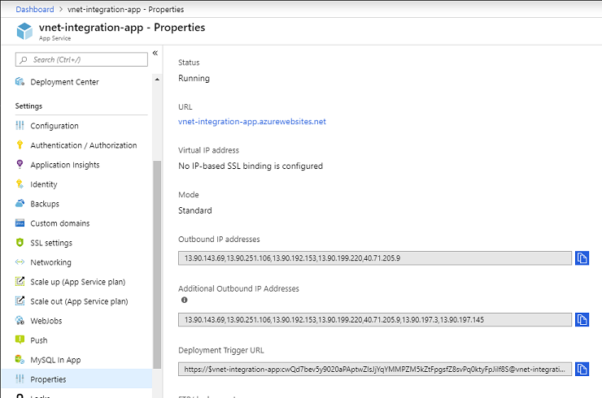
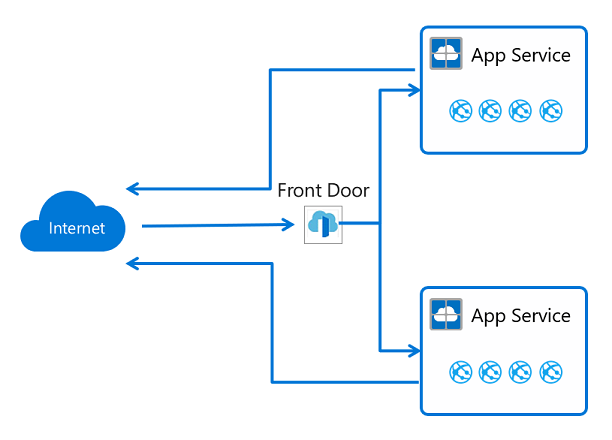
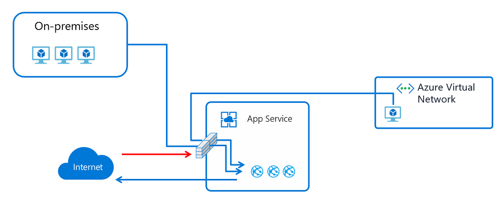
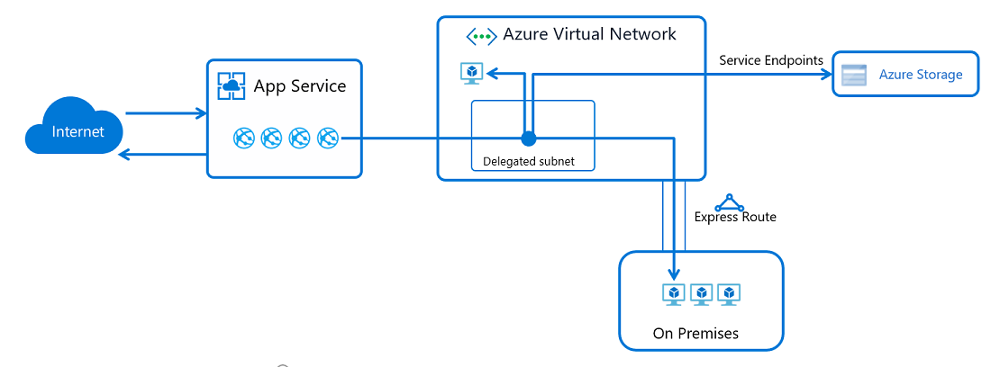

# App Service networking features

Applications in the Azure App Service can be deployed in multiple ways. By default, App Service hosted apps are directly internet accessible and can only reach internet hosted endpoints. Many customer applications however need to control the inbound and outbound network traffic. There are several features available in the App Service to satisfy those needs. The challenge is knowing what feature should be used to solve a given problem. This document is intended to help customers determine what feature should be used based on some example use cases.

There are two primary deployment types for the Azure App Service. There is the multi-tenant public service, which hosts App Service plans in the Free, Shared, Basic, Standard, Premium, and Premiumv2 pricing SKUs. Then there is the single tenant App Service Environment(ASE), which hosts Isolated SKU App Service plans directly in your Azure Virtual Network (VNet). The features you use will vary on if you are in the multi-tenant service or in an ASE. 

## Multi-tenant App Service networking features 

The Azure App Service is a distributed system. The roles that handle incoming HTTP/HTTPS requests are called front-ends. The roles that host the customer workload are called workers. All of the roles in an App Service deployment exist in a multi-tenant network. Because there are many different customers in the same App Service scale unit, you cannot connect the App Service network directly to your network. Instead of connecting the networks, we need features to handle the different aspects of application communication. The features that handle requests TO your app can't be used to solve problems when making calls FROM your app. Likewise, the features that solve problems for calls FROM your app can't be used to solve problems TO your app.  

| Inbound features | Outbound features |
|---------------------|-------------------|
| App assigned address | Hybrid Connections |
| Access Restrictions | Gateway required VNet Integration |
| Service Endpoints | VNet Integration (preview) |

Unless otherwise stated, all of the features can be used together. You can mix the features to solve your various problems.

## Use case and features

For any given use case, there can be a few ways to solve the problem.  The right feature to use is sometimes due to reasons beyond just the use case itself. The following inbound use cases suggest how to use App Service networking features to solve  problems around controlling traffic going to your app. 
 
| Inbound use cases | Feature |
|---------------------|-------------------|
| Support IP-based SSL needs for your app | app assigned address |
| Not shared, dedicated inbound address for your app | app assigned address |
| Restrict access to your app from a set of well-defined addresses | Access Restrictions |
| Expose my app on private IPs in my VNet | ILB ASE   Application Gateway with service endpoints |
| Restrict access to my app from resources in a VNet | Service Endpoints   ILB ASE |
| Expose my app on a private IP in my VNet | ILB ASE   private IP for inbound on an Application Gateway with service endpoints |
| Protect my app with a WAF | Application Gateway + ILB ASE   Application Gateway with service endpoints   Azure Front Door with Access Restrictions |
| Load balance traffic to my apps in different regions | Azure Front Door with Access Restrictions | 
| Load balance traffic in the same region | Application Gateway with service endpoints | 

The following outbound use cases suggest how to use App Service networking features to solve outbound access needs for your app. 

| Outbound use cases | Feature |
|---------------------|-------------------|
| Access resources in an Azure Virtual Network in the same region | VNet Integration   ASE |
| Access resources in an Azure Virtual Network in a different region | Gateway required VNet Integration   ASE and VNet peering |
| Access resources secured with service endpoints | VNet Integration   ASE |
| Access resources in a private network not connected to Azure | Hybrid Connections |
| Access resources across ExpressRoute circuits | VNet Integration (restricted to RFC 1918 addresses for now)   ASE | 

### Default networking behavior

The Azure App Service scale units support many customers in each deployment. The Free and Shared SKU plans host customer workloads on multi-tenant workers. The Basic, and above plans host customer workloads that are dedicated to only one App Service plan (ASP). If you had a Standard App Service plan, then all of the apps in that plan will run on the same worker. If you scale out the worker, then all of the apps in that ASP will be replicated on a new worker for each instance in your ASP. The workers that are used for Premiumv2 are different from the workers used for the other plans. Each App Service deployment has one IP address that is used for all of the inbound traffic to the apps in that App Service deployment. There are however anywhere from 4 to 11 addresses used for making outbound calls. These addresses are shared by all of the apps in that App Service deployment. The outbound addresses are different based on the different worker types. That means that the addresses used by the Free, Shared, Basic, Standard and Premium ASPs are different than the addresses used for outbound calls from the Premiumv2 ASPs. If you look in the properties for your app, you can see the inbound and outbound addresses that are used by your app. If you need to lock down a dependency with an IP ACL, use the possibleOutboundAddresses. 

App Service has a number of endpoints that are used to manage the service.  Those addresses are published in a separate document and are also in the AppServiceManagement IP service tag. The AppServiceManagement tag is only used with an App Service Environment (ASE) where you need to allow such traffic. The App Service inbound addresses are tracked in the AppService IP service tag. There is no IP service tag that contains the outbound addresses used by App Service. 

### App assigned address 

The app assigned address feature is an offshoot of the IP-based SSL capability and is accessed by setting up SSL with your app. This feature can be used for IP-based SSL calls but it can also be used to give your app an address that only it has. 

When you use an app assigned address, your traffic still goes through the same front-end roles that handle all of the incoming traffic into the App Service scale unit. The address that is assigned to your app however, is only used by your app. The use cases for this feature are to:

* Support IP-based SSL needs for your app
* Set a dedicated address for your app that is not shared with anything else

You can learn how to set an address on your app with the tutorial on [Configuring IP based SSL][appassignedaddress]. 

### Access Restrictions 

The Access Restrictions capability lets you filter **inbound** requests based on the origination IP address. The filtering action takes place on the front-end roles that are upstream from the worker roles where your apps are running. Since the front-end roles are upstream from the workers, the Access Restrictions capability can be regarded as network level protection for your apps. The feature allows you to build a list of allow and deny address blocks that are evaluated in priority order. It is similar to the Network Security Group (NSG) feature that exists in Azure Networking.  You can use this feature in an ASE or in the multi-tenant service. When used with an ILB ASE, you can restrict access from private address blocks.

The Access Restrictions feature helps in scenarios where you want to restrict the IP addresses that can be used to reach your app. Among the use cases for this feature are:

* Restrict access to your app from a set of well-defined addresses 
* Restrict access to coming through a load-balancing service, such as Azure Front Door. If you wanted to lock down your inbound traffic to Azure Front Door, create rules to allow traffic from 147.243.0.0/16 and 2a01:111:2050::/44. 

If you wish to lock down access to your app so that it can only be reached from resources in your Azure Virtual Network (VNet), you need a static public address on whatever your source is in your VNet. If the resources do not have a public address, you should use the Service Endpoints feature instead. Learn how to enable this feature with the tutorial on [Configuring Access Restrictions][iprestrictions].

### Service endpoints

Service endpoints allows you to lock down **inbound** access to your app such that the source address must come from a set of subnets that you select. This feature works in conjunction with the IP Access Restrictions. Service endpoints are set in the same user experience as the IP Access Restrictions. You can build an allow/deny list of access rules that includes public addresses as well as subnets in your VNets. This feature supports scenarios such as:

* Setting up an Application Gateway with your app to lock down inbound traffic to your app
* Restricting access to your app to resources in your VNet. This can include VMs, ASEs, or even other apps that use VNet Integration 

You can learn more about configuring service endpoints with your app in the tutorial on [Configuring Service Endpoint Access Restrictions][serviceendpoints]
 
### Hybrid Connections

App Service Hybrid Connections enables your apps to make **outbound** calls to specified TCP endpoints. The endpoint can be on-premises, in a VNet or anywhere that allows outbound traffic to Azure on port 443. The feature requires the installation of a relay agent called the Hybrid Connection Manager (HCM) on a Windows Server 2012 or newer host. The HCM needs to be able to reach Azure Relay at port 443. The HCM can be downloaded from the App Service Hybrid Connections UI in the portal. 

The App Service Hybrid Connections feature is built on the Azure Relay Hybrid Connections capability. App Service uses a specialized form of the feature that only supports making outbound calls from your app to a TCP host and port. This host and port only need to resolve on the host where the HCM is installed. When the app, in App Service, does a DNS lookup on the host and port defined in your Hybrid Connection, the traffic is automatically redirected to go through the Hybrid Connection and out the Hybrid Connection Manager. To learn more about Hybrid Connections, read the documentation on [App Service Hybrid Connections][hybridconn]

This feature is commonly used to:

* Access resources in private networks that are not connected to Azure with a VPN or ExpressRoute
* Support lift and shift of on-premises apps to App Service without needing to also move supporting databases  
* Securely provide access to a single host and port per Hybrid Connection. Most networking features open access to a network and with Hybrid Connections you only have the single host and port you can reach.
* Cover scenarios not covered by other outbound connectivity methods
* Perform development in App Service where the apps can easily leverage on-premises resources 

Because the feature enables access to on-premises resources without an inbound firewall hole, it is popular with developers. The other outbound App Service networking features are very Azure Virtual Networking related. Hybrid Connections does not have a dependency on going through a VNet and can be used for a wider variety of networking needs. It is important to note that the App Service Hybrid Connections feature does not care or know what you are doing on top of it. That is to say that you can use it to access a database, a web service or an arbitrary TCP socket on a mainframe. The feature essentially tunnels TCP packets. 

While Hybrid Connections is popular for development, it is also used in numerous production applications as well. It is great for accessing a web service or database, but is not appropriate for situations involving creating many connections. 

### Gateway required VNet Integration 

The gateway required App Service VNet Integration feature enables your app to make **outbound** requests into an Azure Virtual Network. The feature works by connecting the host your app is running on to a Virtual Network gateway on your VNet with a point-to-site VPN. When you configure the feature, your app gets one of the point-to-site addresses assigned to each instance. This feature enables you to access resources in either Classic or Resource Manager VNets in any region. 

This feature solves the problem of accessing resources in other VNets and can even be used to connect through a VNet to either other VNets or even on-premises. It does not work with ExpressRoute connected VNets but does with Site-to-site VPN connected networks. It is normally inappropriate to use this feature from an app in an App Service Environment (ASE), because the ASE is already in your VNet. The use cases that this feature solves are:

* Accessing resources on private IPs in your Azure virtual networks 
* Accessing resources on-premises if there is a site-to-site VPN 
* Accessing resources in peered VNets 

When this feature is enabled, your app will use the DNS server that the destination VNet is configured with. You can read more on this feature in the documentation on [App Service VNet Integration][vnetintegrationp2s]. 

### VNet Integration

The gateway required VNet Integration feature is very useful but still does not solve accessing resources across ExpressRoute. On top of needing to reach across ExpressRoute connections, there is a need for apps to be able to make calls to service endpoint secured services. To solve both of those additional needs, another VNet Integration capability was added. The new VNet Integration feature enables you to place the backend of your app in a subnet in a Resource Manager VNet in the same region. This feature is not available from an App Service Environment, which is already in a VNet. This feature enables:

* Accessing resources in Resource Manager VNets in the same region
* Accessing resources that are secured with service endpoints 
* Accessing resources that are accessible across ExpressRoute or VPN connections

This feature is in preview and should not be used for production workloads. To learn more about this feature, read the docs on [App Service VNet Integration][vnetintegration].

## App Service Environment 

An App Service Environment (ASE) is a single tenant deployment of the Azure App Service that runs in your VNet. The ASE enables use cases such as:

* Access resources in your VNet
* Access resources across ExpressRoute
* Expose your apps with a private address in your VNet 
* Access resources across service endpoints 

With an ASE, you do not need to use features like VNet Integration or service endpoints because the ASE is already in your VNet. If you want to access resources like SQL or Storage over service endpoints, enable service endpoints on the ASE subnet. If you want to access resources in the VNet, there is no additional configuration required.  If you want to access resources across ExpressRoute, you are already in the VNet and do not need to configure anything on the ASE or the apps inside it. 

Because the apps in an ILB ASE can be exposed on a private IP address, you can easily add WAF devices to expose just the apps that you want to the internet and keep the rest secure. It lends itself to easy development of multi-tier applications. 

There are some things that are not yet possible from the multi-tenant service that are from an ASE. Those include things like:

* Expose your apps on a private IP address
* Secure all outbound traffic with network controls that are not a part of your app 
* Host your apps in a single tenant service 
* Scale up to many more instances than are possible in the multi-tenant service 
* Load private CA client certificates for use by your apps with private CA secured endpoints 
* Force TLS 1.1 across all of the apps hosted in the system without any ability to disable at the app level 
* Provide a dedicated outbound address for all of the apps in your ASE that is not shared with any customers 

The ASE provides the best story around isolated and dedicated app hosting but does come with some management challenges. Some things to consider before using an operational ASE are:
 
 * An ASE runs inside your VNet but does have dependencies outside of the VNet. Those dependencies must be allowed. Read more in [Networking considerations for an App Service Environment][networkinfo]
 * An ASE does not scale immediately like the multi-tenant service. You need to anticipate scaling needs rather than reactively scaling. 
 * An ASE does have a higher up front cost associated with it. In order to get the most out of your ASE, you should plan on putting many workloads into one ASE rather than have it used for small efforts
 * The apps in an ASE cannot restrict access to some apps in an ASE and not others.
 * The ASE is in a subnet and any networking rules apply to all the traffic to and from that ASE. If you want to assign inbound traffic rules for just one app, use Access Restrictions. 

## Combining features 

The features noted for the multi-tenant service can be used together to solve more elaborate use cases. Two of the more common use cases are described here but they are just examples. By understanding what the various features do, you can solve nearly all of your system architecture needs.

### Inject app into a VNet

A common request is on how to put your app in a VNet. Putting your app into a VNet means that the inbound and outbound endpoints for an app are within a VNet. The ASE provides the best solution to solve this problem but, you can get most of what is needed with in the multi-tenant service by combining features. For example, you can host intranet only applications with private inbound and outbound addresses by:

* Creating an Application Gateway with private inbound and outbound address
* Securing inbound traffic to your app with service endpoints 
* Use the new VNet Integration so the backend of your app is in your VNet 

This deployment style would not give you a dedicated address for outbound traffic to the internet or give you the ability to lock down all outbound traffic from your app.  This deployment style would give you a much of what you would only otherwise get with an ASE. 

### Create multi-tier applications

A multi-tier application is an application where the API backend apps can only be accessed from the front-end tier. To create a multi-tier application, you can:

* Use VNet Integration to connect the backend of your front-end web app with a subnet in a VNet
* Use service endpoints to secure inbound traffic to your API app to only coming from the subnet used by your front-end web app

You can have multiple front-end apps use the same API app by using VNet Integration from the other front-end apps and service endpoints from the API app with their subnets.  

<!--Links-->
[appassignedaddress]: https://docs.microsoft.com/azure/app-service/configure-ssl-certificate
[iprestrictions]: https://docs.microsoft.com/azure/app-service/app-service-ip-restrictions
[serviceendpoints]: https://docs.microsoft.com/azure/app-service/app-service-ip-restrictions
[hybridconn]: https://docs.microsoft.com/azure/app-service/app-service-hybrid-connections
[vnetintegrationp2s]: https://docs.microsoft.com/azure/app-service/web-sites-integrate-with-vnet
[vnetintegration]: https://docs.microsoft.com/azure/app-service/web-sites-integrate-with-vnet
[networkinfo]: https://docs.microsoft.com/azure/app-service/environment/network-info
