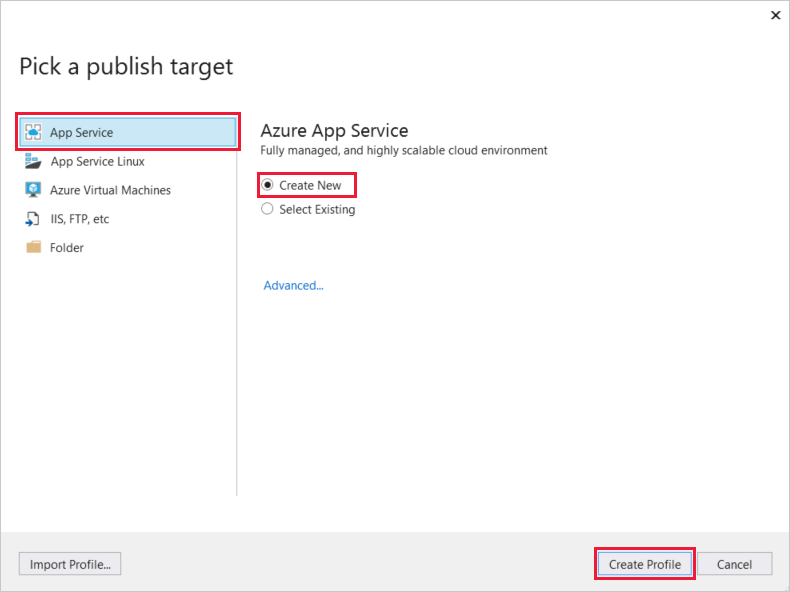
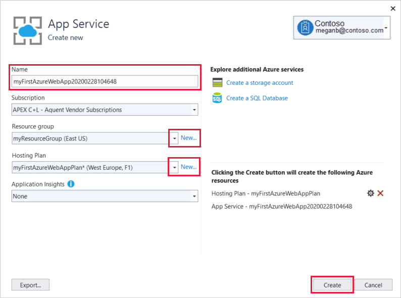
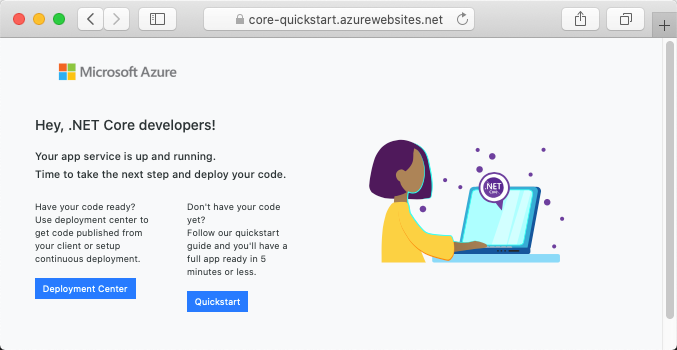
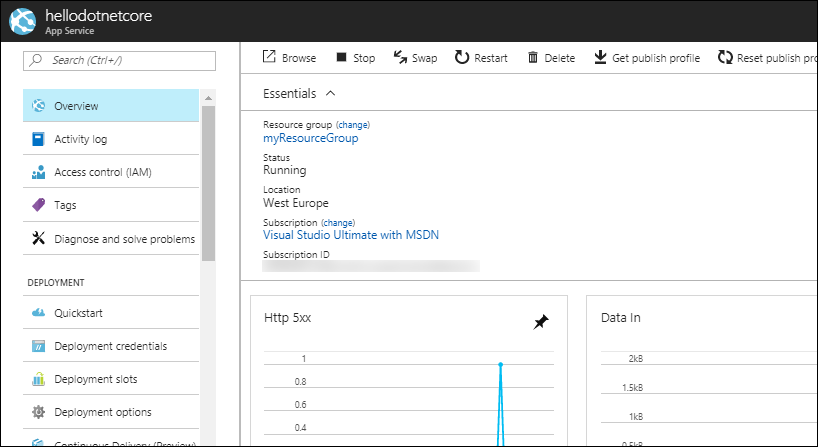

# Quickstart: Create an ASP.NET Core web app in Azure

::: zone pivot="platform-windows"  

In this quickstart, you'll learn how to create and deploy your first ASP.NET Core web app to [Azure App Service](overview.md). 

When you're finished, you'll have an Azure resource group consisting of an App Service hosting plan and an App Service with a deployed web application.

## Prerequisites

- An Azure account with an active subscription. [Create an account for free](https://azure.microsoft.com/free/dotnet/).
- This quickstart deploys an app to App Service on Windows. To deploy to App Service on _Linux_, see [Create a .NET Core web app in App Service](./quickstart-dotnetcore.md).
- Install <a href="https://www.visualstudio.com/downloads/" target="_blank">Visual Studio 2019</a> with the **ASP.NET and web development** workload.

  If you've installed Visual Studio 2019 already:

  - Install the latest updates in Visual Studio by selecting **Help** > **Check for Updates**.
  - Add the workload by selecting **Tools** > **Get Tools and Features**.


## Create an ASP.NET Core web app

Create an ASP.NET Core web app in Visual Studio by following these steps:

1. Open Visual Studio and select **Create a new project**.

1. In **Create a new project**, select **ASP.NET Core Web Application** and confirm that **C#** is listed in the languages for that choice, then select **Next**.

1. In **Configure your new project**, name your web application project *myFirstAzureWebApp*, and select **Create**.

   

1. You can deploy any type of ASP.NET Core web app to Azure, but for this quickstart, choose the **Web Application** template. Make sure **Authentication** is set to **No Authentication**, and that no other option is selected. Then, select **Create**.

    
   
1. From the Visual Studio menu, select **Debug** > **Start Without Debugging** to run your web app locally.

   

## Publish your web app

To publish your web app, you must first create and configure a new App Service that you can publish your app to. 

As part of setting up the App Service, you'll create:

- A new [resource group](../azure-resource-manager/management/overview.md#terminology) to contain all of the Azure resources for the service.
- A new [Hosting Plan](./overview-hosting-plans.md) that specifies the location, size, and features of the web server farm that hosts your app.

Follow these steps to create your App Service and publish your web app:

1. In **Solution Explorer**, right-click the **myFirstAzureWebApp** project and select **Publish**. If you haven't already signed-in to your Azure account from Visual Studio, select either **Add an account** or **Sign in**. You can also create a free Azure account.

1. In the **Pick a publish target** dialog box, choose **App Service**, select **Create New**, and then select **Create Profile**.

   

1. In the **App Service: Create new** dialog, provide a globally unique **Name** for your app by either accepting the default name, or entering a new name. Valid characters are: `a-z`, `A-Z`, `0-9`, and `-`. This **Name** is used as the URL prefix for your web app in the format `http://<app_name>.azurewebsites.net`.

1. For **Subscription**, accept the subscription that is listed or select a new one from the drop-down list.

1. In **Resource group**, select **New**. In **New resource group name**, enter *myResourceGroup* and select **OK**. 

1. For **Hosting Plan**, select **New**. 

1. In the **Hosting Plan: Create new** dialog, enter the values specified in the following table:

   | Setting  | Suggested Value | Description |
   | -------- | --------------- | ----------- |
   | **Hosting Plan**  | *myFirstAzureWebAppPlan* | Name of the App Service plan. |
   | **Location**      | *West Europe* | The datacenter where the web app is hosted. |
   | **Size**          | *Free* | [Pricing tier](https://azure.microsoft.com/pricing/details/app-service/?ref=microsoft.com&utm_source=microsoft.com&utm_medium=docs&utm_campaign=visualstudio) determines hosting features. |
   
   

1. Leave **Application Insights** set to *None*.

1. In the **App Service: Create new** dialog box, select **Create** to start creating the Azure resources.

   

1. Once the wizard completes, select **Publish**.

   

   Visual Studio publishes your ASP.NET Core web app to Azure, and launches the app in your default browser. 

   

**Congratulations!** Your ASP.NET Core web app is running live in Azure App Service.

## Update the app and redeploy

Follow these steps to update and redeploy your web app:

1. In **Solution Explorer**, under your project, open **Pages** > **Index.cshtml**.

1. Replace the entire `<div>` tag with the following code:

   ```html
   <div class="jumbotron">
       <h1>ASP.NET in Azure!</h1>
       <p class="lead">This is a simple app that we've built that demonstrates how to deploy a .NET app to Azure App Service.</p>
   </div>
   ```

1. To redeploy to Azure, right-click the **myFirstAzureWebApp** project in **Solution Explorer** and select **Publish**.

1. In the **Publish** summary page, select **Publish**.

   

When publishing completes, Visual Studio launches a browser to the URL of the web app.


## Manage the Azure app

To manage your web app, go to the [Azure portal](https://portal.azure.com), and search for and select **App Services**.


On the **App Services** page, select the name of your web app.

:::image type="content" source="./media/quickstart-dotnetcore/select-app-service.png" alt-text="Screenshot of the App Services page with an example web app selected.":::

The **Overview** page for your web app, contains options for basic management like browse, stop, start, restart, and delete. The left menu provides further pages for configuring your app.


[!INCLUDE [Clean-up section](../../includes/clean-up-section-portal.md)]

## Next steps

In this quickstart, you used Visual Studio to create and deploy an ASP.NET Core web app to Azure App Service.

Advance to the next article to learn how to create a .NET Core app and connect it to a SQL Database:

> [!div class="nextstepaction"]
> [ASP.NET Core with SQL Database](tutorial-dotnetcore-sqldb-app.md)

> [!div class="nextstepaction"]
> [Configure ASP.NET Core app](configure-language-dotnetcore.md)

::: zone-end  

::: zone pivot="platform-linux"
[App Service on Linux](overview.md#app-service-on-linux) provides a highly scalable, self-patching web hosting service using the Linux operating system. This quickstart shows how to create a [.NET Core](/aspnet/core/) app on App Service on Linux. You create the app using the [Azure CLI](/cli/azure/get-started-with-azure-cli), and you use Git to deploy the .NET Core code to the app.


You can follow the steps in this article using a Mac, Windows, or Linux machine.

[!INCLUDE [quickstarts-free-trial-note](../../includes/quickstarts-free-trial-note.md)]

## Prerequisites

To complete this quickstart:

* <a href="https://git-scm.com/" target="_blank">Install Git</a>
* <a href="https://dotnet.microsoft.com/download/dotnet-core/3.1" target="_blank">Install the latest .NET Core 3.1 SDK</a>

## Create the app locally

In a terminal window on your machine, create a directory named `hellodotnetcore` and change the current directory to it.

```bash
mkdir hellodotnetcore
cd hellodotnetcore
```

Create a new .NET Core app.

```bash
dotnet new web
```

## Run the app locally

Run the application locally so that you see how it should look when you deploy it to Azure. 

Restore the NuGet packages and run the app.

```bash
dotnet run
```

Open a web browser, and navigate to the app at `http://localhost:5000`.

You see the **Hello World** message from the sample app displayed in the page.


In your terminal window, press **Ctrl+C** to exit the web server. Initialize a Git repository for the .NET Core project.

```bash
git init
git add .
git commit -m "first commit"
```

[!INCLUDE [cloud-shell-try-it.md](../../includes/cloud-shell-try-it.md)]

[!INCLUDE [Configure deployment user](../../includes/configure-deployment-user.md)]

[!INCLUDE [Create resource group](../../includes/app-service-web-create-resource-group-linux.md)]

[!INCLUDE [Create app service plan](../../includes/app-service-web-create-app-service-plan-linux.md)]

## Create a web app

[!INCLUDE [Create web app](../../includes/app-service-web-create-web-app-dotnetcore-linux-no-h.md)]

Browse to your newly created app. Replace _&lt;app-name>_ with your app name.

```bash
https://<app-name>.azurewebsites.net
```

Here is what your new app should look like:



[!INCLUDE [Push to Azure](../../includes/app-service-web-git-push-to-azure.md)] 

<pre>
Enumerating objects: 5, done.
Counting objects: 100% (5/5), done.
Compressing objects: 100% (3/3), done.
Writing objects: 100% (3/3), 285 bytes | 95.00 KiB/s, done.
Total 3 (delta 2), reused 0 (delta 0), pack-reused 0
remote: Deploy Async
remote: Updating branch 'master'.
remote: Updating submodules.
remote: Preparing deployment for commit id 'd6b54472f7'.
remote: Repository path is /home/site/repository
remote: Running oryx build...
remote: Build orchestrated by Microsoft Oryx, https://github.com/Microsoft/Oryx
remote: You can report issues at https://github.com/Microsoft/Oryx/issues
remote:
remote: Oryx Version      : 0.2.20200114.13, Commit: 204922f30f8e8d41f5241b8c218425ef89106d1d, ReleaseTagName: 20200114.13
remote: Build Operation ID: |imoMY2y77/s=.40ca2a87_
remote: Repository Commit : d6b54472f7e8e9fd885ffafaa64522e74cf370e1
.
.
.
remote: Deployment successful.
remote: Deployment Logs : 'https://&lt;app-name&gt;.scm.azurewebsites.net/newui/jsonviewer?view_url=/api/deployments/d6b54472f7e8e9fd885ffafaa64522e74cf370e1/log'
To https://&lt;app-name&gt;.scm.azurewebsites.net:443/&lt;app-name&gt;.git
   d87e6ca..d6b5447  master -> master
</pre>

## Browse to the app

Browse to the deployed application using your web browser.

```bash
http://<app_name>.azurewebsites.net
```

The .NET Core sample code is running in App Service on Linux with a built-in image.


**Congratulations!** You've deployed your first .NET Core app to App Service on Linux.

## Update and redeploy the code

In the local directory, open the _Startup.cs_ file. Make a small change to the text in the method call `context.Response.WriteAsync`:

```csharp
await context.Response.WriteAsync("Hello Azure!");
```

Commit your changes in Git, and then push the code changes to Azure.

```bash
git commit -am "updated output"
git push azure master
```

Once deployment has completed, switch back to the browser window that opened in the **Browse to the app** step, and hit refresh.


## Manage your new Azure app

Go to the <a href="https://portal.azure.com" target="_blank">Azure portal</a> to manage the app you created.

From the left menu, click **App Services**, and then click the name of your Azure app.

:::image type="content" source="./media/quickstart-dotnetcore/portal-app-service-list.png" alt-text="Screenshot of the App Services page showing an example Azure app selected.":::

You see your app's Overview page. Here, you can perform basic management tasks like browse, stop, start, restart, and delete. 



The left menu provides different pages for configuring your app. 

[!INCLUDE [cli-samples-clean-up](../../includes/cli-samples-clean-up.md)]

## Next steps

> [!div class="nextstepaction"]
> [Tutorial: ASP.NET Core app with SQL Database](tutorial-dotnetcore-sqldb-app.md)

> [!div class="nextstepaction"]
> [Configure ASP.NET Core app](configure-language-dotnetcore.md)

::: zone-end