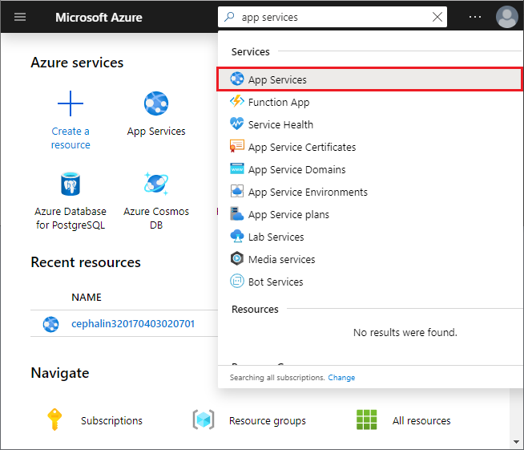
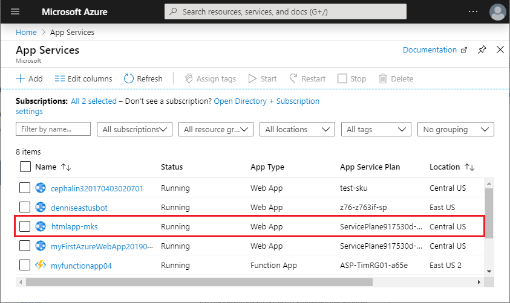

# Create a static HTML web app in Azure

[Azure App Service](overview.md) provides a highly scalable, self-patching web hosting service. This quickstart shows how to deploy a basic HTML+CSS site to Azure App Service. You'll complete this quickstart in [Cloud Shell](../cloud-shell/overview.md), but you can also run these commands locally with [Azure CLI](/cli/azure/install-azure-cli).


[!INCLUDE [quickstarts-free-trial-note](../../includes/quickstarts-free-trial-note.md)]

[!INCLUDE [cloud-shell-try-it.md](../../includes/cloud-shell-try-it.md)]

## Download the sample

In the Cloud Shell, create a quickstart directory and then change to it.

```bash
mkdir quickstart

cd $HOME/quickstart
```

Next, run the following command to clone the sample app repository to your quickstart directory.

```bash
git clone https://github.com/Azure-Samples/html-docs-hello-world.git
```

## Create a web app

Change to the directory that contains the sample code and run the `az webapp up` command. In the following example, replace <app_name> with a unique app name. Static content is indicated by the `--html` flag.

```bash
cd html-docs-hello-world

az webapp up --location westeurope --name <app_name> --html
```

The `az webapp up` command does the following actions:

- Create a default resource group.

- Create a default app service plan.

- Create an app with the specified name.

- [Zip deploy](./deploy-zip.md) files from the current working directory to the web app.

This command may take a few minutes to run. While running, it displays information similar to the following example:

```output
{
  "app_url": "https://&lt;app_name&gt;.azurewebsites.net",
  "location": "westeurope",
  "name": "&lt;app_name&gt;",
  "os": "Windows",
  "resourcegroup": "appsvc_rg_Windows_westeurope",
  "serverfarm": "appsvc_asp_Windows_westeurope",
  "sku": "FREE",
  "src_path": "/home/&lt;username&gt;/quickstart/html-docs-hello-world ",
  &lt; JSON data removed for brevity. &gt;
}
```

Make a note of the `resourceGroup` value. You need it for the [clean up resources](#clean-up-resources) section.

## Browse to the app

In a browser, go to the app URL: `http://<app_name>.azurewebsites.net`.

The page is running as an Azure App Service web app.


**Congratulations!** You've deployed your first HTML app to App Service.

## Update and redeploy the app

In the Cloud Shell, type `nano index.html` to open the nano text editor. In the `<h1>` heading tag, change "Azure App Service - Sample Static HTML Site" to "Azure App Service", as shown below.


Save your changes and exit nano. Use the command `^O` to save and `^X` to exit.

You'll now redeploy the app with the same `az webapp up` command.

```bash
az webapp up --location westeurope --name <app_name> --html
```

Once deployment has completed, switch back to the browser window that opened in the **Browse to the app** step, and refresh the page.


## Manage your new Azure app

To manage the web app you created, in the [Azure portal](https://portal.azure.com), search for and select **App Services**. 



On the **App Services** page, select the name of your Azure app.



You see your web app's Overview page. Here, you can perform basic management tasks like browse, stop, start, restart, and delete.


The left menu provides different pages for configuring your app.

## Clean up resources

In the preceding steps, you created Azure resources in a resource group. If you don't expect to need these resources in the future, delete the resource group by running the following command in the Cloud Shell. Remember that the resource group name was automatically generated for you in the [create a web app](#create-a-web-app) step.

```bash
az group delete --name appsvc_rg_Windows_westeurope
```

This command may take a minute to run.

## Next steps

> [!div class="nextstepaction"]
> [Map custom domain](app-service-web-tutorial-custom-domain.md)
