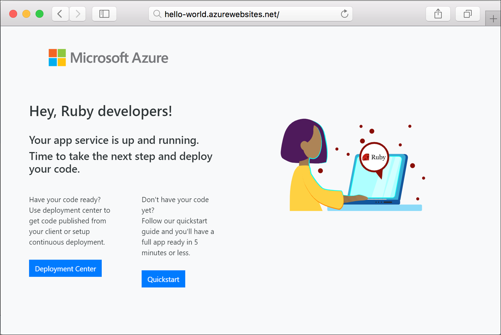

# Create a Ruby on Rails App in App Service

[Azure App Service on Linux](overview.md#app-service-on-linux) provides a highly scalable, self-patching web hosting service using the Linux operating system. This quickstart tutorial shows how to deploy a Ruby on Rails app to App Service on Linux using the [Cloud Shell](../cloud-shell/overview.md).

> [!NOTE]
> The Ruby development stack only supports Ruby on Rails at this time. If you want to use a different platform, such as Sinatra, or if you want to use an unsupported Ruby version, you need to [run it in a custom container](./quickstart-custom-container.md?pivots=platform-linux%3fpivots%3dplatform-linux).


[!INCLUDE [quickstarts-free-trial-note](../../includes/quickstarts-free-trial-note.md)]

## Prerequisites

* <a href="https://www.ruby-lang.org/en/documentation/installation/#rubyinstaller" target="_blank">Install Ruby 2.6 or higher</a>
* <a href="https://git-scm.com/" target="_blank">Install Git</a>

## Download the sample

In a terminal window, run the following command to clone the sample app repository to your local machine:

```bash
git clone https://github.com/Azure-Samples/ruby-docs-hello-world
```

## Run the application locally

Run the application locally so that you see how it should look when you deploy it to Azure. Open a terminal window, change to the `hello-world` directory, and use the `rails server` command to start the server.

The first step is to install the required gems. There's a `Gemfile` included in the sample, so just run the following command:

```bash
bundle install
```

Once the gems are installed, we'll use bundler to start the app:

```bash
bundle exec rails server
```

Using your web browser, navigate to `http://localhost:3000` to test the app locally.


[!INCLUDE [Try Cloud Shell](../../includes/cloud-shell-try-it.md)]

[!INCLUDE [Configure deployment user](../../includes/configure-deployment-user.md)]

[!INCLUDE [Create resource group](../../includes/app-service-web-create-resource-group-linux.md)]

[!INCLUDE [Create app service plan](../../includes/app-service-web-create-app-service-plan-linux.md)]

## Create a web app

[!INCLUDE [Create web app](../../includes/app-service-web-create-web-app-ruby-linux-no-h.md)] 

Browse to the app to see your newly created web app with built-in image. Replace _&lt;app name>_ with your web app name.

```bash
http://<app_name>.azurewebsites.net
```

Here is what your new web app should look like:



## Deploy your application

Run the following commands to deploy the local application to your Azure web app:

```bash
git remote add azure <Git deployment URL from above>
git push azure main
```

Confirm that the remote deployment operations report success. The commands produce output similar to the following text:

```bash
remote: Using turbolinks 5.2.0
remote: Using uglifier 4.1.20
remote: Using web-console 3.7.0
remote: Bundle complete! 18 Gemfile dependencies, 78 gems now installed.
remote: Bundled gems are installed into `/tmp/bundle`
remote: Zipping up bundle contents
remote: .......
remote: ~/site/repository
remote: Finished successfully.
remote: Running post deployment command(s)...
remote: Deployment successful.
remote: App container will begin restart within 10 seconds.
To https://<app-name>.scm.azurewebsites.net/<app-name>.git
   a6e73a2..ae34be9  main -> main
```

Once the deployment has completed, wait about 10 seconds for the web app to restart, and then navigate to the web app and verify the results.

```bash
http://<app-name>.azurewebsites.net
```


> [!NOTE]
> While the app is restarting, you may observe the HTTP status code `Error 503 Server unavailable` in the browser, or the `Hey, Ruby developers!` default page. It may take a few minutes for the app to fully restart.
>

[!INCLUDE [Clean-up section](../../includes/cli-script-clean-up.md)]

## Next steps

> [!div class="nextstepaction"]
> [Tutorial: Ruby on Rails with Postgres](tutorial-ruby-postgres-app.md)

> [!div class="nextstepaction"]
> [Configure Ruby app](configure-language-ruby.md)
