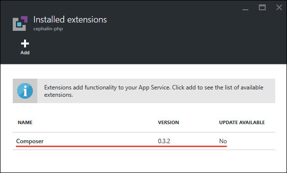
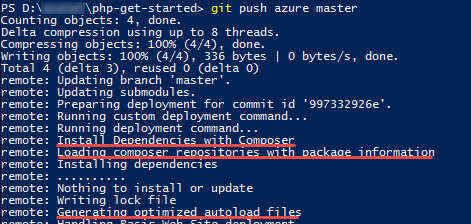

---
title: Configure PHP runtime
description: Learn how to configure the default PHP installation or add a custom PHP installation for Azure App Service.
author: msangapu-msft

ms.assetid: 95c4072b-8570-496b-9c48-ee21a223fb60
ms.devlang: php
ms.topic: article
ms.date: 04/11/2018
ms.author: msangapu
ms.custom: seodec18

---
# Configure PHP in Azure App Service

## Introduction

This guide shows you how to configure the built-in PHP runtime for web apps, mobile back ends, and API apps in [Azure App Service](https://go.microsoft.com/fwlink/?LinkId=529714), provide a custom PHP runtime, and enable extensions. To use App Service, sign up for the [free trial]. To get the most from this guide, you should first create a PHP app in App Service.

## How to: Change the built-in PHP version

By default, PHP 5.6 is installed and immediately available for use when you create an App Service app. The best way to see the available release revision, its default configuration, and the enabled extensions is to deploy a script that calls the [phpinfo()] function.

PHP 7.0 and PHP 7.2 versions are also available, but not enabled by default. To update the PHP version, follow one of these methods:

### Azure portal

1. Browse to your app in the [Azure portal](https://portal.azure.com) and scroll to the **Configuration** page.

2. From **Configuration**, select **General Settings** and choose the new PHP version.

3. Click the **Save** button at the top of the **General settings** blade.

### Azure PowerShell (Windows)

[!INCLUDE [updated-for-az](../../includes/updated-for-az.md)]

1. Open Azure PowerShell, and login to your account:

        PS C:\> Connect-AzAccount
2. Set the PHP version for the app.

        PS C:\> Set-AzureWebsite -PhpVersion {5.6 | 7.0 | 7.2} -Name {app-name}
3. The PHP version is now set. You can confirm these settings:

        PS C:\> Get-AzureWebsite -Name {app-name} | findstr PhpVersion

### Azure CLI 

To use the Azure Command-Line Interface, you must [Install the Azure CLI](https://docs.microsoft.com/cli/azure/install-azure-cli?view=azure-cli-latest) on your computer.

1. Open Terminal, and login to your account.

        az login

1. Check to see the list of supported runtimes.

        az webapp list-runtimes | grep php

2. Set the PHP version for the app.

        az webapp config set --php-version {5.6 | 7.0 | 7.1 | 7.2} --name {app-name} --resource-group {resource-group-name}

3. The PHP version is now set. You can confirm these settings:

        az webapp show --name {app-name} --resource-group {resource-group-name}

## How to: Change the built-in PHP configurations

For any built-in PHP runtime, you can change any of the configuration options by following these steps. (For information about php.ini directives, see [List of php.ini directives].)

### Changing PHP\_INI\_USER, PHP\_INI\_PERDIR, PHP\_INI\_ALL configuration settings

1. Add a [.user.ini] file to your root directory.
1. Add configuration settings to the `.user.ini` file using the same syntax you would use in a `php.ini` file. For example, if you wanted to turn on the `display_errors` setting and set `upload_max_filesize` setting to 10M, your `.user.ini` file would contain this text:

        ; Example Settings
        display_errors=On
        upload_max_filesize=10M

        ; OPTIONAL: Turn this on to write errors to d:\home\LogFiles\php_errors.log
        ; log_errors=On
2. Deploy your app.
3. Restart the app. (Restarting is necessary because the frequency with which PHP reads `.user.ini` files is governed by the `user_ini.cache_ttl` setting, which is a system level setting and is 300 seconds (5 minutes) by default. Restarting the app forces PHP to read the new settings in the `.user.ini` file.)

As an alternative to using a `.user.ini` file, you can use the [ini_set()] function in scripts to set configuration options that are not system-level directives.

### Changing PHP\_INI\_SYSTEM configuration settings

1. Add an App Setting to your app with the key `PHP_INI_SCAN_DIR` and value `d:\home\site\ini`
1. Create an `settings.ini` file using Kudu Console (http://&lt;site-name&gt;.scm.azurewebsite.net) in the `d:\home\site\ini` directory.
1. Add configuration settings to the `settings.ini` file using the same syntax you would use in a `php.ini` file. For example, if you wanted to point the `curl.cainfo` setting to a `*.crt` file and set 'wincache.maxfilesize' setting to 512K, your `settings.ini` file would contain this text:

        ; Example Settings
        curl.cainfo="%ProgramFiles(x86)%\Git\bin\curl-ca-bundle.crt"
        wincache.maxfilesize=512
1. To reload the changes, restart your app.

## How to: Enable extensions in the default PHP runtime

As noted in the previous section, the best way to see the default PHP version, its default configuration, and the enabled extensions is to deploy a script that calls [phpinfo()]. To enable additional extensions, by following these steps:

### Configure via ini settings

1. Add a `ext` directory to the `d:\home\site` directory.
1. Put `.dll` extension files in the `ext` directory (for example, `php_xdebug.dll`). Make sure that the extensions are compatible with default version of PHP and are VC9 and non-thread-safe (nts) compatible.
1. Add an App Setting to your app with the key `PHP_INI_SCAN_DIR` and value `d:\home\site\ini`
1. Create an `ini` file in `d:\home\site\ini` called `extensions.ini`.
1. Add configuration settings to the `extensions.ini` file using the same syntax you would use in a `php.ini` file. For example, if you wanted to enable the MongoDB and XDebug extensions, your `extensions.ini` file would contain this text:

        ; Enable Extensions
        extension=d:\home\site\ext\php_mongo.dll
        zend_extension=d:\home\site\ext\php_xdebug.dll
1. Restart your app to load the changes.

### Configure via App Setting

1. Add a `bin` directory to the root directory.
2. Put `.dll` extension files in the `bin` directory (for example, `php_xdebug.dll`). Make sure that the extensions are compatible with default version of PHP and are VC9 and non-thread-safe (nts) compatible.
3. Deploy your app.
4. Browse to your app in the Azure portal and click on the **Configuration** located below **Settings** section.
5. From the **Configuration** blade, select **Application Settings**.
6. In the **Application settings** section, click on **+ New application setting** and create a **PHP_EXTENSIONS** key. The value for this key would be a path relative to website root: **bin\your-ext-file**.
7. Click the **Update** button at the bottom then click **Save** above the **Application settings** tab.

Zend extensions are also supported by using a **PHP_ZENDEXTENSIONS** key. To enable multiple extensions, include a comma-separated list of `.dll` files for the app setting value.

## How to: Use a custom PHP runtime

Instead of the default PHP runtime, App Service can use a PHP runtime that you provide to execute PHP scripts. The runtime that you provide can be configured by a `php.ini` file that you also provide. To use a custom PHP runtime with App Service, following these steps.

1. Obtain a non-thread-safe, VC9 or VC11 compatible version of PHP for Windows. Recent releases of PHP for Windows can be found here: [https://windows.php.net/download/]. Older releases can be found in the archive here: [https://windows.php.net/downloads/releases/archives/].
2. Modify the `php.ini` file for your runtime. Any configuration settings that are system-level-only directives are ignored by App Service. (For information about system-level-only directives, see [List of php.ini directives]).
3. Optionally, add extensions to your PHP runtime and enable them in the `php.ini` file.
4. Add a `bin` directory to your root directory, and put the directory that contains your PHP runtime in it (for example, `bin\php`).
5. Deploy your app.
6. Browse to your app in the Azure portal and click on the **Configuration** blade.
8. From the **Configuration** blade, select **Path mappings**. 
9. Click **+ New Handler** and add `*.php` to the Extension field and add the path to the `php-cgi.exe` executable in **Script processor**. If you put your PHP runtime in the `bin` directory in the root of your application, the path is `D:\home\site\wwwroot\bin\php\php-cgi.exe`.
10. At the bottom, click **Update** to finish adding the handler mapping.
11. Click **Save** to save changes.

<a name="composer" />

## How to: Enable Composer automation in Azure

By default, App Service doesn't do anything with composer.json, if you have one in your PHP
project. If you use [Git deployment](deploy-local-git.md), you can enable composer.json 
processing during `git push` by enabling the Composer extension.

> [!NOTE]
> You can [vote for first-class Composer support in App Service here](https://feedback.azure.com/forums/169385-web-apps-formerly-websites/suggestions/6477437-first-class-support-for-composer-and-pip)!
>

1. In your PHP app's blade in the [Azure portal](https://portal.azure.com), click **Tools** > **Extensions**.

    
2. Click **Add**, then click **Composer**.

    
3. Click **OK** to accept legal terms. Click **OK** again to add the extension.

    The **Installed extensions** blade shows the Composer extension.
    
4. Now, in a terminal window on your local machine, perform `git add`, `git commit`, and `git push` to your app. Notice that Composer
   is installing dependencies defined in composer.json.

    

## Next steps

For more information, see the [PHP Developer Center](https://azure.microsoft.com/develop/php/).

[free trial]: https://www.windowsazure.com/pricing/free-trial/
[phpinfo()]: https://php.net/manual/en/function.phpinfo.php
[select-php-version]: ./media/web-sites-php-configure/select-php-version.png
[List of php.ini directives]: https://www.php.net/manual/en/ini.list.php
[.user.ini]: https://www.php.net/manual/en/configuration.file.per-user.php
[ini_set()]: https://www.php.net/manual/en/function.ini-set.php
[application-settings]: ./media/web-sites-php-configure/application-settings.png
[settings-button]: ./media/web-sites-php-configure/settings-button.png
[save-button]: ./media/web-sites-php-configure/save-button.png
[php-extensions]: ./media/web-sites-php-configure/php-extensions.png
[handler-mappings]: ./media/web-sites-php-configure/handler-mappings.png
[https://windows.php.net/download/]: https://windows.php.net/download/
[https://windows.php.net/downloads/releases/archives/]: https://windows.php.net/downloads/releases/archives/
[SETPHPVERCLI]: ./media/web-sites-php-configure/ChangePHPVersion-XPlatCLI.png
[GETPHPVERCLI]: ./media/web-sites-php-configure/ShowPHPVersion-XplatCLI.png
[SETPHPVERPS]: ./media/web-sites-php-configure/ChangePHPVersion-PS.png
[GETPHPVERPS]: ./media/web-sites-php-configure/ShowPHPVersion-PS.png
