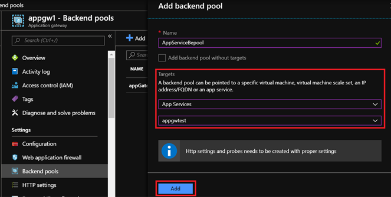
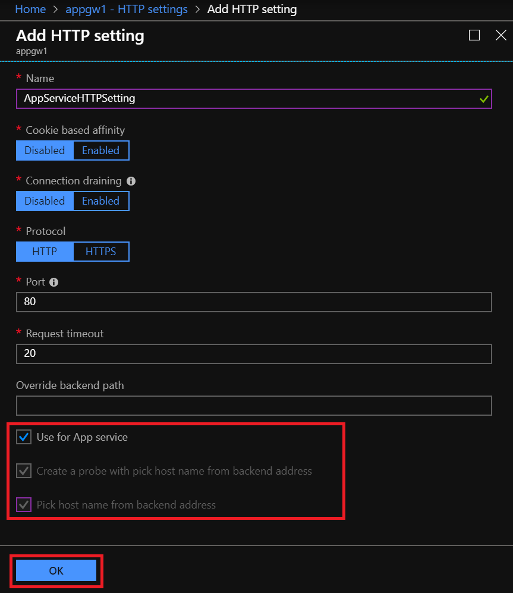
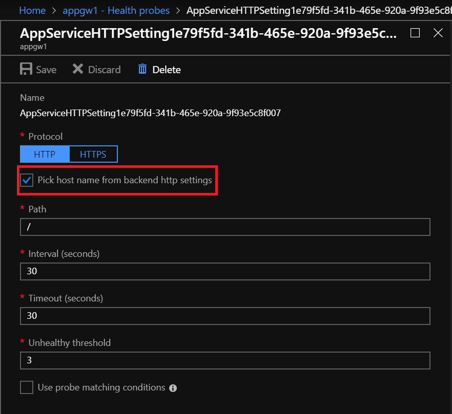
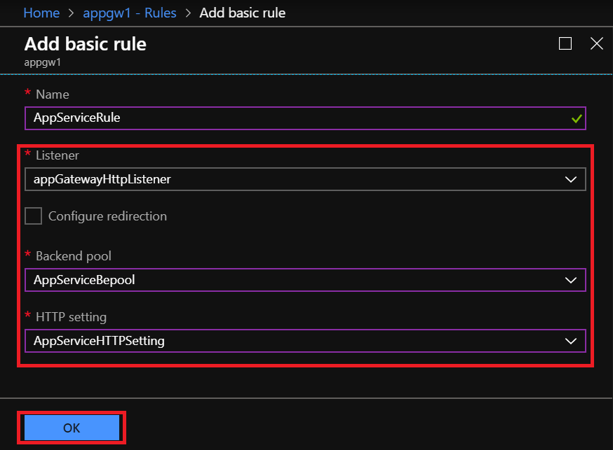

# Configure App Service with Application Gateway

Since app service is a multi-tenant service instead of a dedicate deployment, it uses host header in the incoming request to resolve the request to the correct app service endpoint. Usually, the DNS name of the application, which in turn is the DNS name associated with the application gateway fronting the app service, is different from the domain name of the backend app service. Therefore, the host header in the original request received by the application gateway is not the same as the host name of the backend service. Because of this, unless the host header in the request from the application gateway to the backend is changed to the host name of the backend service, the multi-tenant backends are not able to resolve the request to the correct endpoint.

Application Gateway provides a switch called `Pick host name from backend address` which overrides the  host header in the request with the host name of the back-end when the request is routed from the Application Gateway to the backend. This capability enables support for multi-tenant back ends such as Azure app service and API management. 

In this article, you learn how to:

- Create a backend pool and add an App Service to it
- Create HTTP Settings and Custom Probe with “Pick Hostname” switches enabled

## Prerequisites

- Application gateway: If you don't have an existing application gateway, see how to [create an application gateway](https://docs.microsoft.com/azure/application-gateway/quick-create-portal)
- App service: If you don't have an existing App service, see [App service documentation](https://docs.microsoft.com/azure/app-service/).

## Add App service as backend pool

1. In the Azure portal, open the configuration view of you application gateway.

2. Under **Backend pools**, click on **Add** to create a new backend pool.

3. Provide a suitable name to the backend pool. 

4. Under **Targets**, click on the dropdown and choose **App Services** as the option.

5. A dropdown immediately below the **Targets**  dropdown will appear which will contain a list of your App Services. From this dropdown, choose the App Service you want to add as a backend pool member and click Add.

   
   
   > [!NOTE]
   > The dropdown will only populate those app services which are in the same subscription as your Application Gateway. If you want to use an app service which is in a different subscription than the one in which the Application Gateway is, then instead of choosing **App Services** in the **Targets** dropdown, choose **IP address or hostname** option and enter the hostname (example. azurewebsites.net) of the app service.

## Create HTTP settings for App service

1. Under **HTTP Settings**, click **Add** to create a new HTTP Setting.

2. Input a name for the HTTP Setting and you can enable or disable Cookie Based Affinity as per your requirement.

3. Choose the protocol as HTTP or HTTPS as per your use case. 

   > [!NOTE]
   > If you select HTTPS, you do not need to upload any authentication certificate or trusted root certificate to allow the app service backend since app service is a trusted Azure service.

4. Check the box for **Use for App Service** . Note that the switches  `Create a probe with pick host name from backend address` and `Pick host name from backend address` will automatically get enabled.`Pick host name from backend address` will override the  host header in the request with the host name of the back-end when the request is routed from the Application Gateway to the backend.  

   `Create a probe with pick host name from backend address` will automatically create a health probe and associate it to this HTTP Setting. You do not need to create any other health probe for this HTTP setting. You can check that a new probe with the name <HTTP Setting name><Unique GUID> has been added in the list of Health probes and it already has the switch `Pick host name from backend http settings enabled`.

   If you already have one or more HTTP Settings which are being used for App service and if those HTTP settings use the same protocol as the one you are using in the one you are creating, then instead of the `Create a probe with pick host name from backend address` switch, you will get a dropdown to select one of the custom probes . This is because since there already exists an HTTP Setting with app service, therefore, there would also exist a health probe which has the switch `Pick host name from backend http settings enabled` . Choose that custom probe from the dropdown.

5. Click **OK** to create the HTTP setting.

   

   

## Create Rule to tie the Listener, Backend Pool and HTTP Setting

1. Under **Rules**, click **Basic** to create a new Basic rule.

2. Provide a suitable name and select the listener which will be accepting the incoming requests for the App service.

3. In the **Backend pool** dropdown, choose the backend pool you created above.

4. In the **HTTP setting** dropdown, choose the HTTP setting you created above.

5. Click **OK** to save this rule.

   

## Additional configuration in case of redirection to app service's relative path

When the app service sends a redirection response to the client to redirect to its relative path (For example, a redirect from contoso.azurewebsites.net/path1 to contoso.azurewebsites.net/path2), it uses the same hostname in the location header of its response as the one in the request it received from the application gateway. So the client will make the request directly to contoso.azurewebsites.net/path2 instead of going through the application gateway (contoso.com/path2). Bypassing the application gateway isn't desirable.

If in your use case, there are scenarios where the App service will need to send a redirection response to the client, perform the [additional steps to rewrite the location header](https://docs.microsoft.com/azure/application-gateway/troubleshoot-app-service-redirection-app-service-url#sample-configuration).

## Restrict access

The web apps deployed in these examples use public IP addresses that can be  accessed directly from the Internet. This helps with troubleshooting when you are learning about a new feature and trying new things. But if you intend to deploy a feature into production, you'll want to add more restrictions.

One way you can restrict access to your web apps is to use [Azure App Service static IP restrictions](../app-service/app-service-ip-restrictions.md). For example, you can restrict the web app so that it only receives traffic from the application gateway. Use the app service IP restriction feature to list the application gateway VIP as the only address with access.

## Next steps

To learn more about the App service and other multi-tenant support with application gateway, see [multi-tenant service support with application gateway](https://docs.microsoft.com/azure/application-gateway/application-gateway-web-app-overview).
