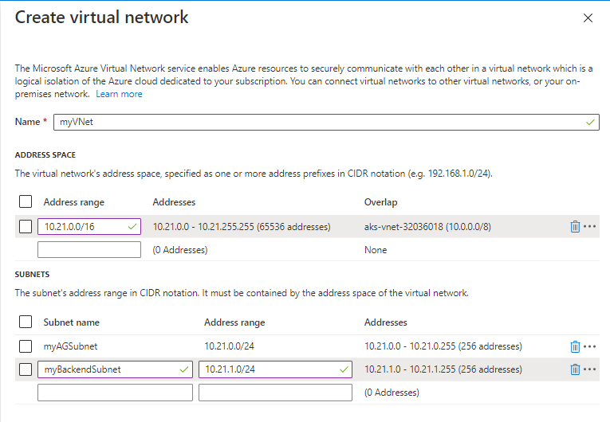
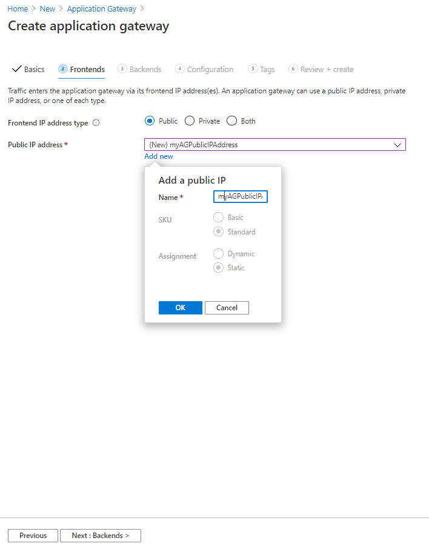
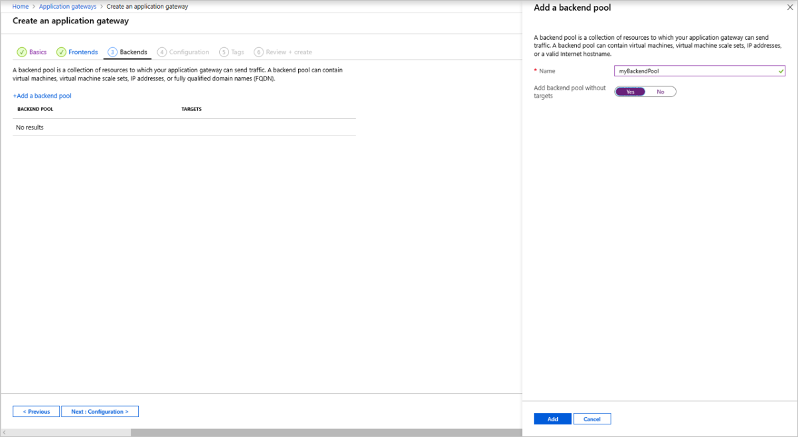
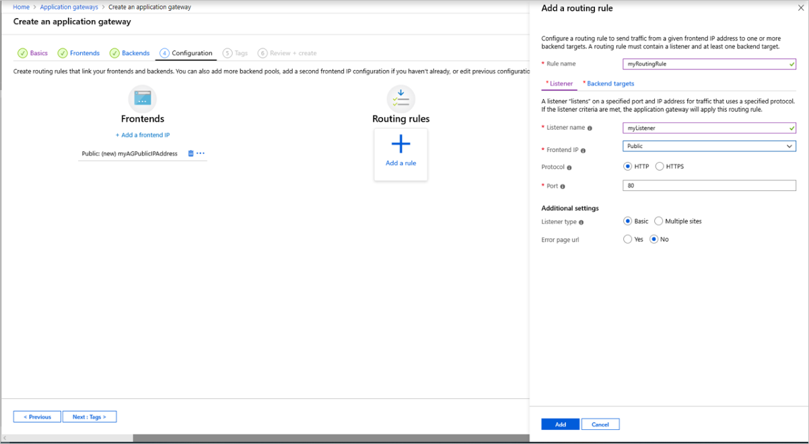
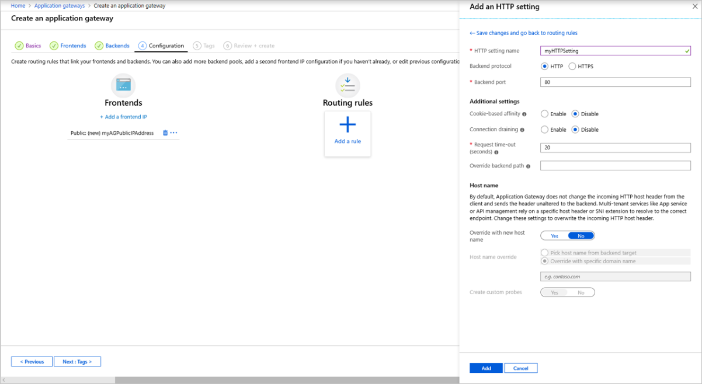
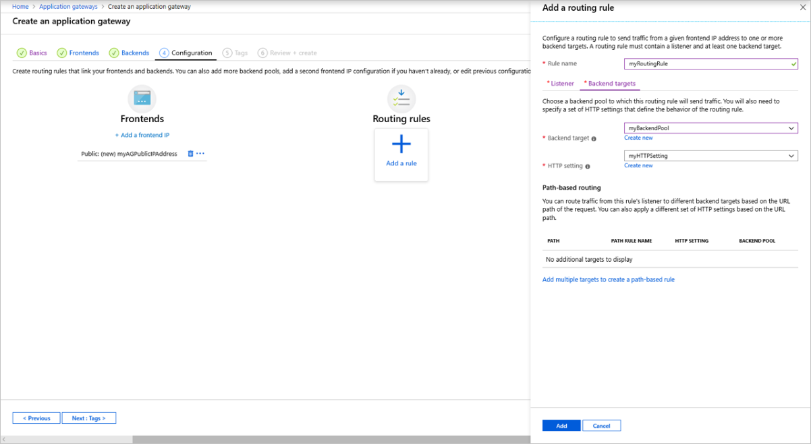

# Quickstart: Direct web traffic with Azure Application Gateway - Azure portal

In this quickstart, you use the Azure portal to create an application gateway. Then you test it to make sure it works correctly. 

The application gateway directs application web traffic to specific resources in a backend pool. You assign listeners to ports, create rules, and add resources to a backend pool. For the sake of simplicity, this article uses a simple setup with a public front-end IP, a basic listener to host a single site on the application gateway, a basic request routing rule, and two virtual machines in the backend pool.

You can also complete this quickstart using [Azure PowerShell](quick-create-powershell.md) or [Azure CLI](quick-create-cli.md).

[!INCLUDE [updated-for-az](../../includes/updated-for-az.md)]

## Prerequisites

- An Azure account with an active subscription. [Create an account for free](https://azure.microsoft.com/free/?WT.mc_id=A261C142F).

## Sign in to the Azure portal

Sign in to the [Azure portal](https://portal.azure.com) with your Azure account.

## Create an application gateway

You'll create the application gateway using the tabs on the **Create an application gateway** page.

1. On the Azure portal menu or from the **Home** page, select **Create a resource**. The **New** window appears.

2. Select **Networking** and then select **Application Gateway** in the **Featured** list.

### Basics tab

1. On the **Basics** tab, enter these values for the following application gateway settings:

   - **Resource group**: Select **myResourceGroupAG** for the resource group. If it doesn't exist, select **Create new** to create it.
   - **Application gateway name**: Enter *myAppGateway* for the name of the application gateway.

     

2. For Azure to communicate between the resources that you create, it needs a virtual network. You can either create a new virtual network or use an existing one. In this example, you'll create a new virtual network at the same time that you create the application gateway. Application Gateway instances are created in separate subnets. You create two subnets in this example: one for the application gateway, and another for the backend servers.

    > [!NOTE]
    > [Virtual network service endpoint policies](../virtual-network/virtual-network-service-endpoint-policies-overview.md) are currently not supported in an Application Gateway subnet.

    Under **Configure virtual network**, create a new virtual network by selecting **Create new**. In the **Create virtual network** window that opens, enter the following values to create the virtual network and two subnets:

    - **Name**: Enter *myVNet* for the name of the virtual network.

    - **Subnet name** (Application Gateway subnet): The **Subnets** grid will show a subnet named *Default*. Change the name of this subnet to *myAGSubnet*.<br>The application gateway subnet can contain only application gateways. No other resources are allowed.

    - **Subnet name** (backend server subnet): In the second row of the **Subnets** grid, enter *myBackendSubnet* in the **Subnet name** column.

    - **Address range** (backend server subnet): In the second row of the **Subnets** Grid, enter an address range that doesn't overlap with the address range of *myAGSubnet*. For example, if the address range of *myAGSubnet* is 10.0.0.0/24, enter *10.0.1.0/24* for the address range of *myBackendSubnet*.

    Select **OK** to close the **Create virtual network** window and save the virtual network settings.

     
    
3. On the **Basics** tab, accept the default values for the other settings and then select **Next: Frontends**.

### Frontends tab

1. On the **Frontends** tab, verify **Frontend IP address type** is set to **Public**. <br>You can configure the Frontend IP to be Public or Private as per your use case. In this example, you'll choose a Public Frontend IP.
   > [!NOTE]
   > For the Application Gateway v2 SKU, there must be a **Public** frontend IP configuration. You can still have both a Public and a Private frontend IP configuration, but Private only frontend IP configuration (Only ILB mode) is currently not enabled for the v2 SKU. 

2. Select **Add new** for the **Public IP address** and enter *myAGPublicIPAddress* for the public IP address name, and then select **OK**. 

     

3. Select **Next: Backends**.

### Backends tab

The backend pool is used to route requests to the backend servers that serve the request. Backend pools can be composed of NICs, virtual machine scale sets, public IP addresses, internal IP addresses, fully qualified domain names (FQDN), and multi-tenant back-ends like Azure App Service. In this example, you'll create an empty backend pool with your application gateway and then add backend targets to the backend pool.

1. On the **Backends** tab, select **Add a backend pool**.

2. In the **Add a backend pool** window that opens, enter the following values to create an empty backend pool:

    - **Name**: Enter *myBackendPool* for the name of the backend pool.
    - **Add backend pool without targets**: Select **Yes** to create a backend pool with no targets. You'll add backend targets after creating the application gateway.

3. In the **Add a backend pool** window, select **Add** to save the backend pool configuration and return to the **Backends** tab.

     

4. On the **Backends** tab, select **Next: Configuration**.

### Configuration tab

On the **Configuration** tab, you'll connect the frontend and backend pool you created using a routing rule.

1. Select **Add a routing rule** in the **Routing rules** column.

2. In the **Add a routing rule** window that opens, enter *myRoutingRule* for the **Rule name**.

3. A routing rule requires a listener. On the **Listener** tab within the **Add a routing rule** window, enter the following values for the listener:

    - **Listener name**: Enter *myListener* for the name of the listener.
    - **Frontend IP**: Select **Public** to choose the public IP you created for the frontend.
  
      Accept the default values for the other settings on the **Listener** tab, then select the **Backend targets** tab to configure the rest of the routing rule.

   

4. On the **Backend targets** tab, select **myBackendPool** for the **Backend target**.

5. For the **HTTP setting**, select **Add new** to add a new HTTP setting. The HTTP setting will determine the behavior of the routing rule. In the **Add an HTTP setting** window that opens, enter *myHTTPSetting* for the **HTTP setting name** and *80* for the **Backend port**. Accept the default values for the other settings in the **Add an HTTP setting** window, then select **Add** to return to the **Add a routing rule** window. 

     

6. On the **Add a routing rule** window, select **Add** to save the routing rule and return to the **Configuration** tab.

     

7. Select **Next: Tags** and then **Next: Review + create**.

### Review + create tab

Review the settings on the **Review + create** tab, and then select **Create** to create the virtual network, the public IP address, and the application gateway. It may take several minutes for Azure to create the application gateway. Wait until the deployment finishes successfully before moving on to the next section.

## Add backend targets

In this example, you'll use virtual machines as the target backend. You can either use existing virtual machines or create new ones. You'll create two virtual machines as backend servers for the application gateway.

To do this, you'll:

1. Create two new VMs, *myVM* and *myVM2*, to be used as backend servers.
2. Install IIS on the virtual machines to verify that the application gateway was created successfully.
3. Add the backend servers to the backend pool.

### Create a virtual machine

1. On the Azure portal menu or from the **Home** page, select **Create a resource**. The **New** window appears.
2. Select **Windows Server 2016 Datacenter** in the **Popular** list. The **Create a virtual machine** page appears.<br>Application Gateway can route traffic to any type of virtual machine used in its backend pool. In this example, you use a Windows Server 2016 Datacenter virtual machine.
3. Enter these values in the **Basics** tab for the following virtual machine settings:

    - **Resource group**: Select **myResourceGroupAG** for the resource group name.
    - **Virtual machine name**: Enter *myVM* for the name of the virtual machine.
    - **Region**: Select the same region where you created the application gateway.
    - **Username**: Type a name for the administrator user name.
    - **Password**: Type a password.
    - **Public inbound ports**: None.
4. Accept the other defaults and then select **Next: Disks**.  
5. Accept the **Disks** tab defaults and then select **Next: Networking**.
6. On the **Networking** tab, verify that **myVNet** is selected for the **Virtual network** and the **Subnet** is set to **myBackendSubnet**. Accept the other defaults and then select **Next: Management**.<br>Application Gateway can communicate with instances outside of the virtual network that it is in, but you need to ensure there's IP connectivity.
7. On the **Management** tab, set **Boot diagnostics** to **Disable**. Accept the other defaults and then select **Review + create**.
8. On the **Review + create** tab, review the settings, correct any validation errors, and then select **Create**.
9. Wait for the virtual machine creation to complete before continuing.

### Install IIS for testing

In this example, you install IIS on the virtual machines to verify Azure created the application gateway successfully.

1. Open Azure PowerShell.

   Select **Cloud Shell** from the top navigation bar of the Azure portal and then select **PowerShell** from the drop-down list. 

    

2. Run the following command to install IIS on the virtual machine. Change the *Location* parameter if necessary: 

    ```azurepowershell
    Set-AzVMExtension `
      -ResourceGroupName myResourceGroupAG `
      -ExtensionName IIS `
      -VMName myVM `
      -Publisher Microsoft.Compute `
      -ExtensionType CustomScriptExtension `
      -TypeHandlerVersion 1.4 `
      -SettingString '{"commandToExecute":"powershell Add-WindowsFeature Web-Server; powershell Add-Content -Path \"C:\\inetpub\\wwwroot\\Default.htm\" -Value $($env:computername)"}' `
      -Location EastUS
    ```

3. Create a second virtual machine and install IIS by using the steps that you previously completed. Use *myVM2* for the virtual machine name and for the **VMName** setting of the **Set-AzVMExtension** cmdlet.

### Add backend servers to backend pool

1. On the Azure portal menu, select **All resources** or search for and select *All resources*. Then select **myAppGateway**.

2. Select **Backend pools** from the left menu.

3. Select **myBackendPool**.

4. Under **Backend targets**, **Target type**, select **Virtual machine** from the drop-down list.

5. Under **Target**, select the **myVM** and **myVM2** virtual machines and their associated network interfaces from the drop-down lists.

   > [!div class="mx-imgBorder"]
   > 

6. Select **Save**.

7. Wait for the deployment to complete before proceeding to the next step.

## Test the application gateway

Although IIS isn't required to create the application gateway, you installed it in this quickstart to verify if Azure successfully created the application gateway. 

Use IIS to test the application gateway:

1. Find the public IP address for the application gateway on its **Overview** page. Or, you can select **All resources**, enter *myAGPublicIPAddress* in the search box, and then select it in the search results. Azure displays the public IP address on the **Overview** page.
2. Copy the public IP address, and then paste it into the address bar of your browser to browse that IP address.
3. Check the response. A valid response verifies that the application gateway was successfully created and can successfully connect with the backend.

   

   Refresh the browser multiple times and you should see connections to both myVM and myVM2.

## Clean up resources

When you no longer need the resources that you created with the application gateway, delete the resource group. When you delete the resource group, you also remove the application gateway and all the related resources.

To delete the resource group:

1. On the Azure portal menu, select **Resource groups** or search for and select *Resource groups*.
2. On the **Resource groups** page, search for **myResourceGroupAG** in the list, then select it.
3. On the **Resource group page**, select **Delete resource group**.
4. Enter *myResourceGroupAG* under **TYPE THE RESOURCE GROUP NAME** and then select **Delete**

## Next steps

> [!div class="nextstepaction"]
> [Tutorial: Configure an application gateway with TLS termination using the Azure portal](create-ssl-portal.md)
