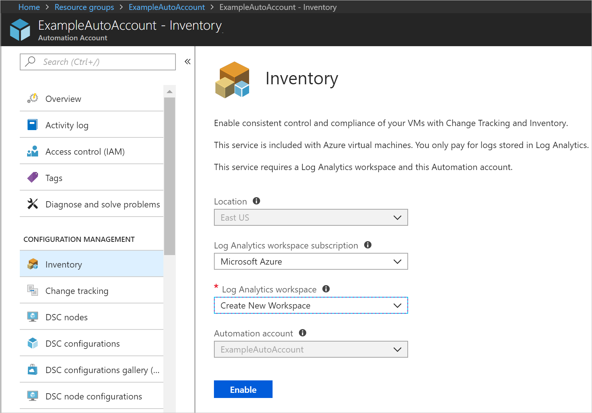
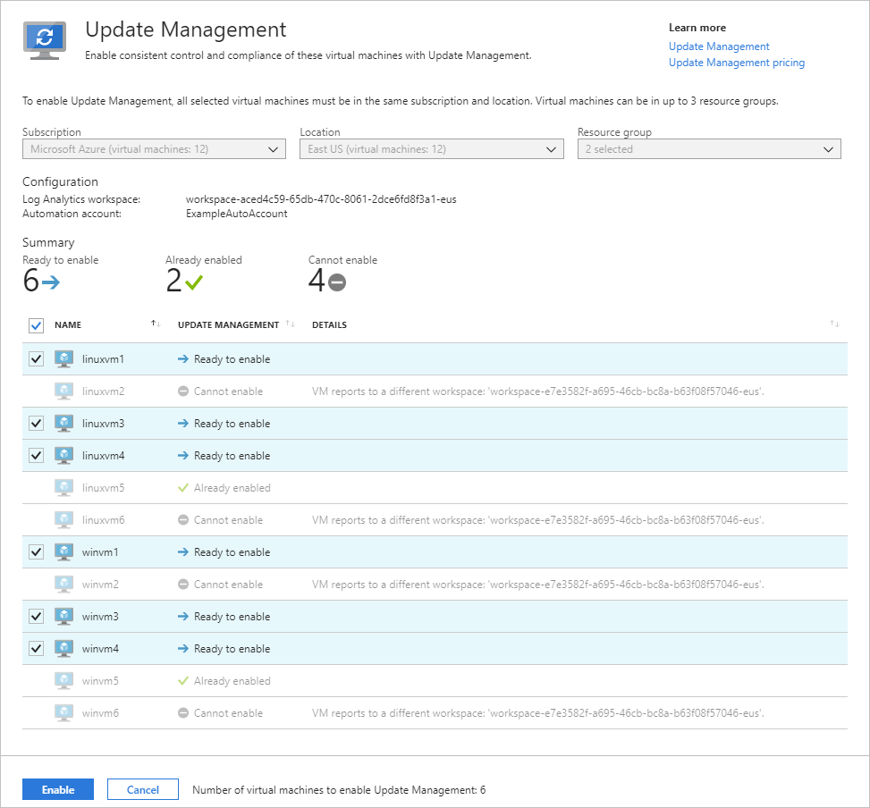
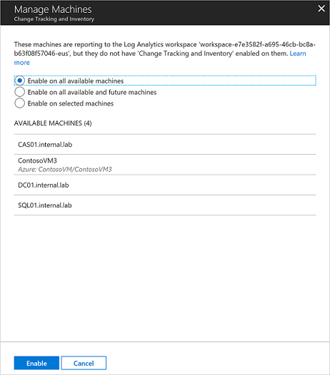

# Onboard Update Management, Change Tracking, and Inventory solutions

Azure Automation provides solutions to manage operating system security updates, track changes, and inventory what is installed on your computers. There are many ways to onboard machines, you can onboard the solution [from a virtual machine](automation-onboard-solutions-from-vm.md), [from browsing multiple machines](automation-onboard-solutions-from-browse.md), from your Automation account, or by [runbook](automation-onboard-solutions.md). This article covers onboarding these solutions from your Automation account.

## Sign in to Azure

Sign in to Azure at https://portal.azure.com

## Enable solutions

Navigate to your Automation account and select either **Inventory** or **Change tracking** under **CONFIGURATION MANAGEMENT**.

Choose the Log Analytics workspace and Automation account and click **Enable** to enable the solution. The solution takes up to 15 minutes to enable.

> [!NOTE]
> When enabling solutions, only certain regions are supported for linking a Log Analytics workspace and an Automation Account.
>
> For a list of the supported mapping pairs, see [Region mapping for Automation Account and Log Analytics workspace](how-to/region-mappings.md).

The Change Tracking and Inventory solution provides the ability to [track changes](automation-vm-change-tracking.md) and [inventory](automation-vm-inventory.md) on your virtual machines. In this step, you enable the solution on a virtual machine.

When the change tracking and inventory solution onboarding notification completes, click on **Update Management** under **CONFIGURATION MANAGEMENT**.

The Update Management solution allows you to manage updates and patches for your Azure Windows VMs. You can assess the status of available updates, schedule installation of required updates, and review deployment results to verify updates were applied successfully to the VM. This action enabled the solution for your VM.

Select **Update management** under **UPDATE MANAGEMENT**. The Log Analytics workspace selected is the same workspace used in the preceding step. Click **Enable** to onboard the Update management solution. The solution takes up to 15 minutes to enable.

## Scope Configuration

Each solution uses a Scope Configuration within the workspace to target the computers that get the solution. The Scope Configuration is a group of one or more saved searches that is used to limit the scope of the solution to specific computers. To access the Scope Configurations, in your Automation account under **RELATED RESOURCES**, select **Workspace**. Then in the workspace under **WORKSPACE DATA SOURCES**, select **Scope Configurations**.

If the selected workspace doesn't have the Update Management or Change Tracking solutions yet, the following scope configurations are created:

* **MicrosoftDefaultScopeConfig-ChangeTracking**

* **MicrosoftDefaultScopeConfig-Updates**

If the selected workspace already has the solution, the solution isn't re-deployed, and the scope configuration isn't added to it.

## Saved searches

When a computer is added to the Update Management or the Change Tracking and Inventory solutions, they're added to one of two saved searches in your workspace. These saved searches are queries that contain the computers that are targeted for these solutions.

Navigate to your Automation account and select **Saved searches** under **General**. The two saved searches used by these solutions can be seen in the following table:

|Name     |Category  |Alias  |
|---------|---------|---------|
|MicrosoftDefaultComputerGroup     |  ChangeTracking       | ChangeTracking__MicrosoftDefaultComputerGroup        |
|MicrosoftDefaultComputerGroup     | Updates        | Updates__MicrosoftDefaultComputerGroup         |

Select either saved search to view the query used to populate the group. The following image shows the query and its results:

## Onboard Azure VMs

From your Automation account select **Inventory** or **Change tracking** under **CONFIGURATION MANAGEMENT**, or **Update management** under **UPDATE MANAGEMENT**.

Click **+ Add Azure VMs**, select one or more VMs from the list. Virtual machines that can't be enabled are greyed out and unable to be selected. Azure VMs can exist in any region no matter the location of your Automation Account. On the **Enable Update Management** page, click **Enable**. This action adds the selected VMs to the computer group saved search for the solution.

## Onboard a non-Azure machine

Machines not in Azure need to be added manually. From your Automation account select **Inventory** or **Change tracking** under **CONFIGURATION MANAGEMENT**, or **Update management** under **UPDATE MANAGEMENT**.

Click **Add non-Azure machine**. This action opens up a new browser window with the [instructions on how to install and configure the Microsoft Monitoring Agent on the machine](../azure-monitor/platform/log-analytics-agent.md) so the machine can begin reporting to the solution. If you're onboarding a machine that currently managed by System Center Operations Manager, a new agent isn't required, the workspace information is entered into the existing agent.

## Onboard machines in the workspace

Manually installed machines or machines already reporting to your workspace must to be added to Azure Automation for the solution to be enabled. From your Automation account select **Inventory** or **Change tracking** under **CONFIGURATION MANAGEMENT**, or **Update management** under **UPDATE MANAGEMENT**.

Select **Manage machines**. This action opens up the **Manage Machines** page. This page allows you to enable the solution on a select set of machines, all available machines, or enable the solution for all current machines and enable it on all future machines. The **Manage machines** button may be greyed out if you previously chose the option **Enable on all available and future machines**.

### All available machines

To enable the solution for all available machines, select **Enable on all available machines**. This action disables the control to add machines individually. This task adds all the names of the machines reporting to the workspace to the computer group saved search query. When selected, this action disables the **Manage Machines** button.

### All available and future machines

To enable the solution for all available machines and future machines, select **Enable on all available and future machines**. This option deletes the saved searches and Scope Configurations from the workspace. This action opens the solution to all Azure and non-Azure machines that are reporting to the workspace. When selected, this action disables the **Manage Machines** button permanently as there's no Scope Configuration left.

### Selected machines

To enable the solution for one or more machines, select **Enable on selected machines** and click **add** next to each machine you want to add to the solution. This task adds the selected machine names to the computer group saved search query for the solution.

## Unlink workspace

The following solutions are dependent on a Log Analytics workspace:

* [Update Management](automation-update-management.md)
* [Change Tracking](automation-change-tracking.md)
* [Start/Stop VMs during off-hours](automation-solution-vm-management.md)

If you decide you no longer wish to integrate your Automation account with a Log Analytics workspace, you can unlink your account directly from the Azure portal.  Before you continue, you first need to remove the solutions mentioned earlier, otherwise this process will be prevented from proceeding. Review the article for the particular solution you've imported to understand the steps required to remove it.

After you remove these solutions, you can complete the following steps to unlink your Automation account.

> [!NOTE]
> Some solutions including earlier versions of the Azure SQL monitoring solution may have created automation assets and may also need to be removed prior to unlinking the workspace.

1. From the Azure portal, open your Automation account, and on the Automation account page select **Linked workspace** under the section labeled **Related Resources** on the left.

2. On the Unlink workspace page, click **Unlink workspace**.

   .

   You will receive a prompt verifying you wish to continue.

3. While Azure Automation tries to unlink the account your Log Analytics workspace, you can track the progress under **Notifications** from the menu.

If you used the Update Management solution, optionally you may want to remove the following items that are no longer needed after you remove the solution.

* Update schedules - Each will have names that match the update deployments you created)

* Hybrid worker groups created for the solution -  Each will be named similarly to  machine1.contoso.com_9ceb8108-26c9-4051-b6b3-227600d715c8).

If you used the Start and Stop VMs during off-hours solution, optionally you may want to remove the following items that are no longer needed after you remove the solution.

* Start and stop VM runbook schedules
* Start and stop VM runbooks
* Variables

Alternatively you can also unlink your workspace from your Automation Account from your Log Analytics workspace. On your workspace, select **Automation Account** under **Related Resources**. On the Automation Account page, select **Unlink account**.

## Next steps

Continue to the tutorials on the solutions to learn how to use them.

* [Tutorial - Manage Updates for your VM](automation-tutorial-update-management.md)

* [Tutorial - Identify software on a VM](automation-tutorial-installed-software.md)

* [Tutorial - Troubleshoot changes on a VM](automation-tutorial-troubleshoot-changes.md)
