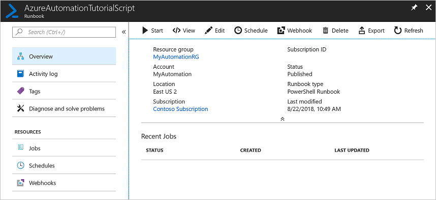
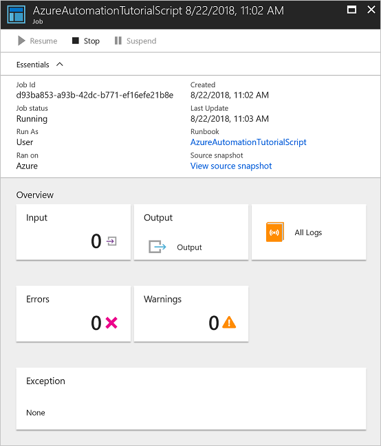

# Create an Azure Automation account

You can create an Azure Automation account through Azure, using the Azure portal, a browser-based user interface allowing access to a number of resources. One Automation account can manage resources across all regions and subscriptions for a given tenant. 

This quickstart guides you in creating an Automation account and running a runbook in the account. If you don't have an Azure subscription, create a [free Azure account](https://azure.microsoft.com/free/?WT.mc_id=A261C142F) before you begin.

## Sign in to Azure

[Sign in to Azure](https://portal.azure.com).

## Create Automation account

1. Choose a name for your Azure account. Automation account names are unique per region and resource group. Names for Automation accounts that have been deleted might not be immediately available.

    > [!NOTE]
    > You can't change the account name once it has been entered in the user interface. 

2. Click the **Create a resource** button found in the upper left corner of Azure portal.

3. Select **IT & Management Tools**, and then select **Automation**.

4. Enter the account information, including the selected account name. For **Create Azure Run As account**, choose **Yes** so that the artifacts to simplify authentication to Azure are enabled automatically. When the information is complete, click **Create** to start the Automation account deployment.

      

    > [!NOTE]
    > For an updated list of locations that you can deploy an Automation account to, see [Products available by region](https://azure.microsoft.com/global-infrastructure/services/?products=automation&regions=all).

5. When the deployment has completed, click **All Services**.

6. Select **Automation Accounts** and then choose the Automation account you've created.

    

## Run a runbook

Run one of the tutorial runbooks.

1. Click **Runbooks** under **Process Automation**. The list of runbooks is displayed. By default, several tutorial runbooks are enabled in the account.

    

1. Select the **AzureAutomationTutorialScript** runbook. This action opens the runbook overview page.

    

1. Click **Start**, and on the Start Runbook page, click **OK** to start the runbook.

    

1. After the job status becomes `Running`, click **Output** or **All Logs** to view the runbook job output. For this tutorial runbook, the output is a list of your Azure resources.

## Next steps

In this quickstart, you’ve deployed an Automation account, started a runbook job, and viewed the job results. To learn more about Azure Automation, continue to the quickstart for creating your first runbook.

> [!div class="nextstepaction"]
> [Automation Quickstart - Create an Azure Automation runbook](./automation-quickstart-create-runbook.md)

