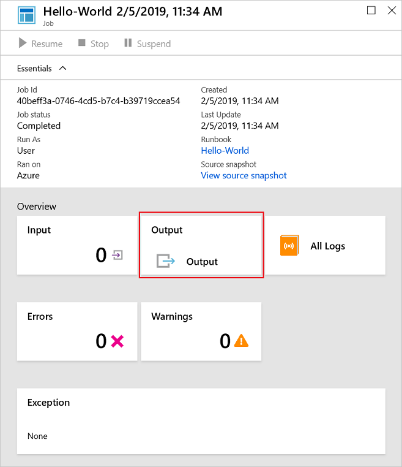
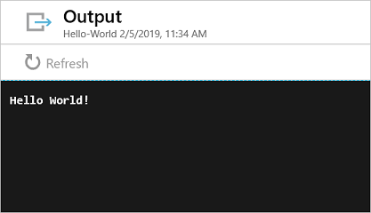

# Create an Azure Automation runbook

Azure Automation runbooks can be created through Azure. This method provides a browser-based user interface for creating Automation runbooks. In this quickstart you walk through creating, editing, testing, and publishing an Automation PowerShell runbook.

If you don't have an Azure subscription, create a [free Azure account](https://azure.microsoft.com/free/?WT.mc_id=A261C142F) before you begin.

## Sign in to Azure

Sign in to Azure at https://portal.azure.com

## Create runbook

First, create a runbook. The sample runbook created in this quickstart outputs `Hello World` by default.

1. Open your Automation account.

1. Click **Runbooks** under **PROCESS AUTOMATION**. The list of runbooks is displayed.

1. Click the **Add a runbook** button found at the top of the list. On the **Add Runbook** page, select **Quick Create**.

1. Enter "Hello-World" for the runbook **Name**, and select **PowerShell** for **Runbook type**. Click **Create**.

   

1. The runbook is created and the **Edit PowerShell Runbook** page opens.

    

1. Type or copy and paste the following code into the edit pane. It creates an optional input parameter called "Name" with a default value of "World", and outputs a string that uses this input value:
   
   ```powershell-interactive
   param
   (
       [Parameter(Mandatory=$false)]
       [String] $Name = "World"
   )

   "Hello $Name!"
   ```

1. Click **Save**, to save a draft copy of the runbook.

    

## Test the runbook

Once the runbook is created, you test the runbook to validate that it works.

1. Click **Test pane** to open the **Test** page.

1. Enter a value for **Name**, and click **Start**. The test job starts and the job status and output display.

    

1. Close the **Test** page by clicking the **X** in the upper right corner. Select **OK** in the popup that appears.

1. In the **Edit PowerShell Runbook** page, click **Publish** to publish the runbook as the official version of the runbook in the account.

   

## Run the runbook

Once the runbook is published, the overview page is shown.

1. In the runbook overview page, click **Start** to open the **Start Runbook** configuration page for this runbook.

   

1. Leave **Name** blank, so that the default value is used, and click **OK**. The runbook job is submitted, and the job page appears.

   

1. When the **Job status** is **Running** or **Completed**, click **Output** to open the **Output** pane and view the runbook output.

   

## Clean up resources

When no longer needed, delete the runbook. To do so, select the runbook in the runbook list, and click **Delete**.

## Next steps

In this quickstart, you’ve created, edited, tested, and published a runbook and started a runbook job. To learn more about Automation runbooks, continue to the article on the different runbook types that you can create and use in Automation.

> [!div class="nextstepaction"]
> [Automation How To - Runbook Types](./automation-runbook-types.md)

