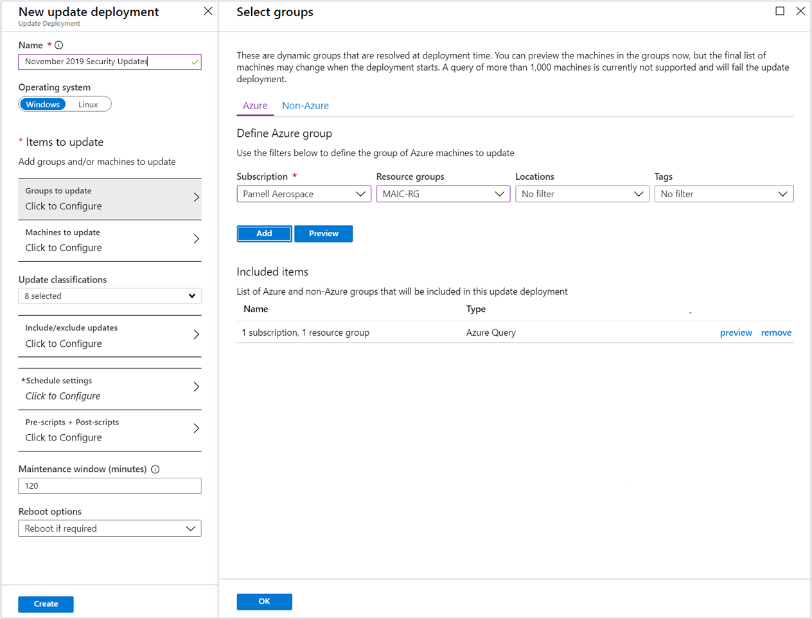
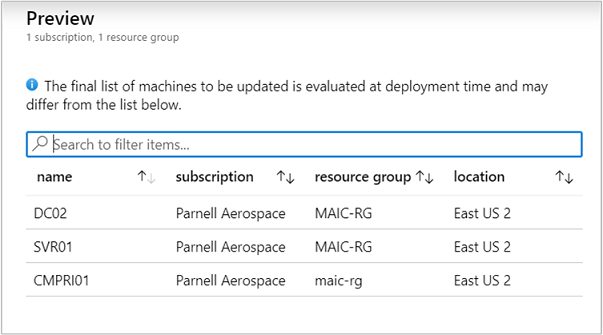
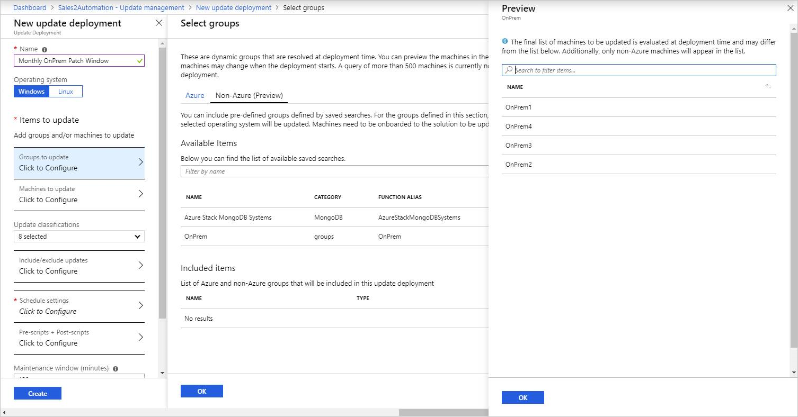

# Use dynamic groups with Update Management

Update Management allows you to target a dynamic group of Azure or non-Azure VMs for update deployments. These groups, defined by queries, are evaluated at deployment time so that you don't have to edit your deployment to add machines.

## Azure machines

Dynamic groups do not work with classic VMs. When defining your query, the following items can be used together to populate a dynamic group:

* Subscription
* Resource groups
* Locations
* Tags

To preview the results of a dynamic group, click **Preview**. The preview shows the group membership at the current time. In the example, we're searching for machines having the tag `Role` for the group **BackendServer**. If more machines have this tag added, they are added to any future deployments against that group.

## Non-Azure machines

For non-Azure machines, saved searches, also referred to as computer groups, are used to create the dynamic group. To learn how to create a saved search, see [Creating a computer group](../azure-monitor/platform/computer-groups.md#creating-a-computer-group). Once your group is created, you can select it from the list of saved searches. Click **Preview** to preview the computers in the saved search at that time.

## Next steps

After creating a dynamic group, you can [Create an Update Deployment](automation-tutorial-update-management.md).
