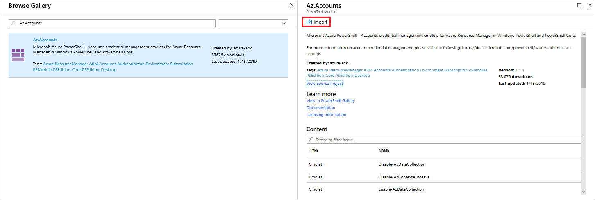

# Az module support in Azure Automation

Azure Automation supports the use of the [Azure PowerShell Az module](/powershell/azure/new-azureps-module-az?view=azps-1.1.0) in your runbooks. The rollup Az module is not imported automatically in any new or existing Automation accounts. 

## Considerations

There are several things to take into consideration when using the Az modules in Azure Automation:

* Higher-level solutions in your Automation account can use runbooks and modules. Therefore, editing runbooks or upgrading modules can potentially cause issues with your solutions. You should test all runbooks and solutions carefully in a separate Automation account before importing new Az modules. 

* Any modifications to modules can negatively affect the [Start/Stop](automation-solution-vm-management.md) solution. 

* Importing an Az module in your Automation account doesn't automatically import the module in the PowerShell session that runbooks use. Modules are imported into the PowerShell session in the following situations:

    * When a runbook invokes a cmdlet from a module
    * When a runbook imports the module explicitly with the `Import-Module` cmdlet
    * When a runbook imports another module depending on the module

> [!NOTE]
> We don't recommend altering modules and runbooks in Automation accounts that contain any solutions. This provision isn't specific to the Az modules. It should be taken into consideration when introducing any changes to your Automation account.

> [!IMPORTANT]
> Make sure that runbooks in an Automation account import either Az modules or [AzureRM](https://www.powershellgallery.com/packages/AzureRM/6.13.1) modules, but not both, into a PowerShell session. If a runbook imports Az modules before AzureRM modules, the runbook completes. However, an error referencing the [Get_SerializationSettings](troubleshoot/runbooks.md#get-serializationsettings) cmdlet shows up in the job streams and cmdlets might not execute properly. If the runbook imports AzureRM modules before Az modules, the runbook also completes. In this case, though, you receive an error in the job streams stating that both Az and AzureRM can't be imported in the same session or used in the same runbook.

## Migrating to Az modules

We recommend that you test a migration to Az modules in a test Automation account. Once you create the account, you can use the instructions in this section to work with the modules.

### Stop and unschedule all runbooks that use AzureRM modules

To ensure that you do not run any existing runbooks that use AzureRM modules, stop and unschedule all affected runbooks. You can see what schedules exist and which schedules to remove by running code similar to this example:

  ```powershell-interactive
  Get-AzureRmAutomationSchedule -AutomationAccountName "<AutomationAccountName>" -ResourceGroupName "<ResourceGroupName>" | Remove-AzureRmAutomationSchedule -WhatIf
  ```

It's important to review each schedule separately to ensure that you can reschedule it in the future for your runbooks, if necessary.

### Import the Az modules

>[!NOTE]
>Have your runbooks import only required Az modules. Don't import the rollup Az module, as it includes all Az modules. This guidance is the same for all modules.

The [Az.Accounts](https://www.powershellgallery.com/packages/Az.Accounts/1.1.0) module is a dependency for the other Az modules. For this reason, your runbooks must import this module into your Automation account before importing any other modules.

To import the modules in the Azure portal:

1. From your Automation account, select **Modules** under **Shared Resources**. 
2. Click **Browse Gallery** to open the Browse Gallery page.  
3. In the search bar, enter the module name, for example, `Az.Accounts`. 
4. On the PowerShell Module page, click **Import** to import the module into your Automation account.



This import process can also be done through the [PowerShell Gallery](https://www.powershellgallery.com) by searching for the module for import. Once you find the module, select it, choose the **Azure Automation** tab, and click **Deploy to Azure Automation**.


## Testing your runbooks

Once you've imported the Az modules into the Automation account, you can start editing your runbooks to use the modules. The majority of the cmdlets have the same names as for the AzureRM module, except that the AzureRM (or AzureRm) prefix has been changed to Az. For a list of modules that don't follow this naming convention, see [list of exceptions](/powershell/azure/migrate-from-azurerm-to-az#update-cmdlets-modules-and-parameters).

One way to test the modification of a runbook to use the new cmdlets is by using `Enable-AzureRmAlias -Scope Process` at the beginning of the runbook. By adding this command to your runbook, the script can run without changes.

## After-migration details

After the migration is complete, don't try to start runbooks using AzureRM modules on the Automation account. It's also recommended to not import or update AzureRM modules on the account. Consider the account migrated to Az, and operate with Az modules only. 

When you create a new Automation account, the existing AzureRM modules are still installed. You can still update the tutorial runbooks with AzureRM cmdlets. However, you should not run these runbooks.

## Next steps

To learn more about using Az modules, see [Getting started with Az module](/powershell/azure/get-started-azureps?view=azps-1.1.0).
