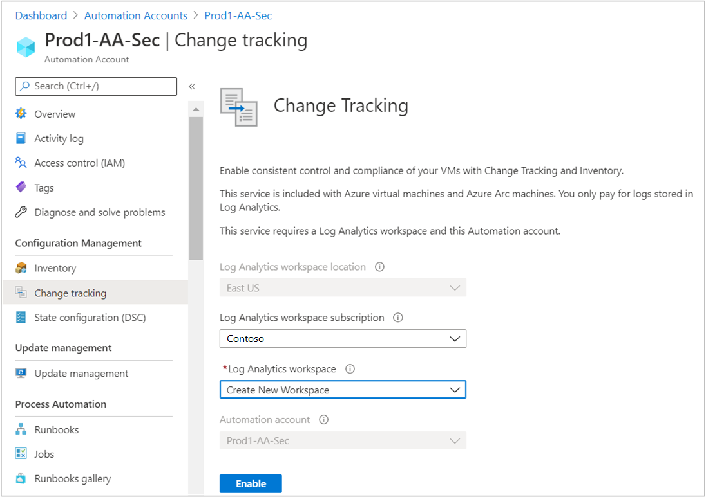
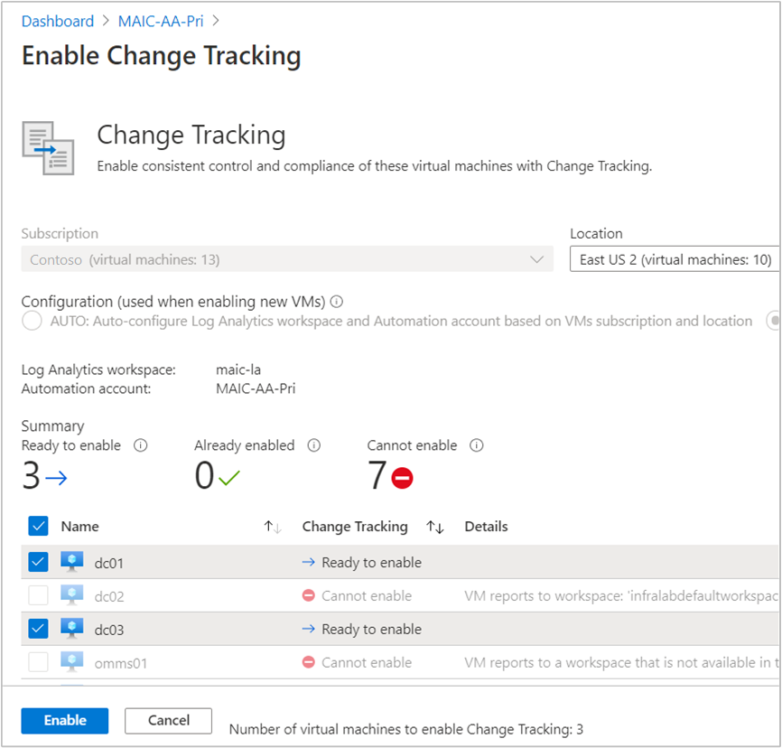
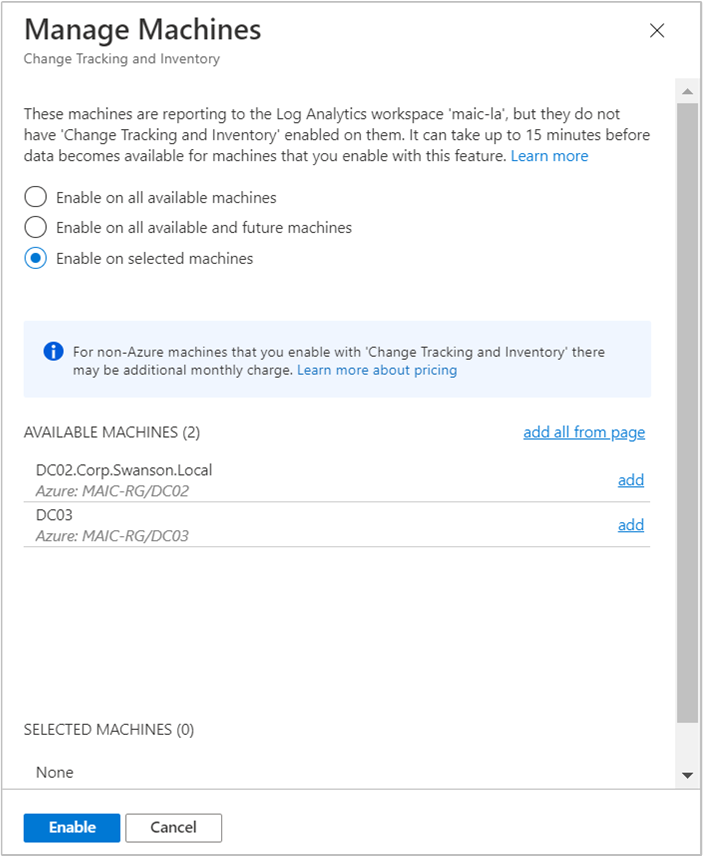

# Enable Change Tracking and Inventory from an Automation account

This article describes how you can use your Automation account to enable [Change Tracking and Inventory](overview.md) for VMs in your environment. To enable Azure VMs at scale, you must enable an existing VM using Change Tracking and Inventory.

> [!NOTE]
> When enabling Change Tracking and Inventory, only certain regions are supported for linking a Log Analytics workspace and an Automation account. For a list of the supported mapping pairs, see [Region mapping for Automation account and Log Analytics workspace](../how-to/region-mappings.md).

## Prerequisites

* Azure subscription. If you don't have one yet, you can [activate your MSDN subscriber benefits](https://azure.microsoft.com/pricing/member-offers/msdn-benefits-details/) or sign up for a [free account](https://azure.microsoft.com/free/?WT.mc_id=A261C142F).
* [Automation account](../index.yml) to manage machines.
* A [virtual machine](../../virtual-machines/windows/quick-create-portal.md).

## Sign in to Azure

Sign in to Azure at https://portal.azure.com.

## Enable Change Tracking and Inventory

1. Navigate to your Automation account and select either **Inventory** or **Change tracking** under **Configuration Management**.

2. Choose the Log Analytics workspace and Automation account and click **Enable** to enable Change Tracking and Inventory. The setup takes up to 15 minutes to complete.

    

## Enable Azure VMs

1. From your Automation account, select **Inventory** or **Change tracking** under **Configuration Management**.

2. Click **+ Add Azure VMs** and select one or more VMs from the list. Virtual machines that can't be enabled are grayed out and unable to be selected. Azure VMs can exist in any region no matter the location of your Automation account. 

3. Click **Enable** to add the selected VMs to the computer group saved search for the feature. For more information, see [Limit Change Tracking and Inventory deployment scope](manage-scope-configurations.md).

      

## Enable non-Azure VMs

Machines not in Azure need to be added manually.

1. From your Automation account select **Inventory** or **Change tracking** under **Configuration Management**.

2. Click **Add non-Azure machine**. This action opens up a new browser window with [instructions to install and configure the Log Analytics agent for Windows](../../azure-monitor/platform/log-analytics-agent.md) so that the machine can begin reporting Change Tracking and Inventory operations. If you're enabling a machine that's currently managed by Operations Manager, a new agent isn't required and the workspace information is entered into the existing agent.

## Enable machines in the workspace

Manually installed machines or machines already reporting to your workspace must to be added to Azure Automation for Change Tracking and Inventory to be enabled.

1. From your Automation account, select **Inventory** or **Change tracking** under **Configuration Management**.

2. Select **Manage machines**. The **Manage machines** option might be grayed out if you previously chose the option **Enable on all available and future machines**

    

3. To enable Change Tracking and Inventory for all available machines, select **Enable on all available machines** on the **Manage Machines** page. This action disables the control to add machines individually and adds all of the machines reporting to the workspace to the computer group saved search query. When selected, this action disables the **Manage Machines** option.

4. To enable the feature for all available machines and future machines, select **Enable on all available and future machines**. This option deletes the saved search and scope configuration from the workspace and opens the feature for all Azure and non-Azure machines that are reporting to the workspace. When selected, this action disables the **Manage Machines** option permanently, as there's no scope configuration left.

    > [!NOTE]
    > Because this option deletes the saved search and scope configuration within Log Analytics, it's important to remove any deletion locks on the Log Analytics Workspace before you select this option. If you don't, the option will fail to remove the configurations and you must remove them manually.

5. If necessary, you can add the scope configuration back by re-adding the initial saved search. For more information, see [Limit Change Tracking and Inventory deployment scope](manage-scope-configurations.md).

6. To enable the feature for one or more machines, select **Enable on selected machines** and click **Add** next to each machine to enable for the feature. This task adds the selected machine names to the computer group saved search query for the feature.

## Next steps

* For details of working with the feature, see [Manage Change Tracking](manage-change-tracking.md) and [Manage Inventory](manage-inventory-vms.md).

* To troubleshoot general problems with the feature, see [Troubleshoot Change Tracking and Inventory issues](../troubleshoot/change-tracking.md).
