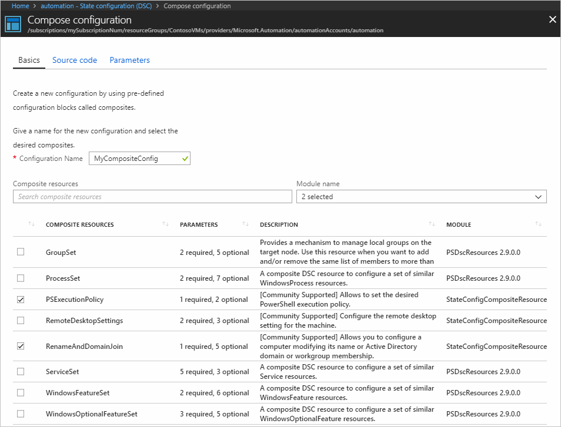
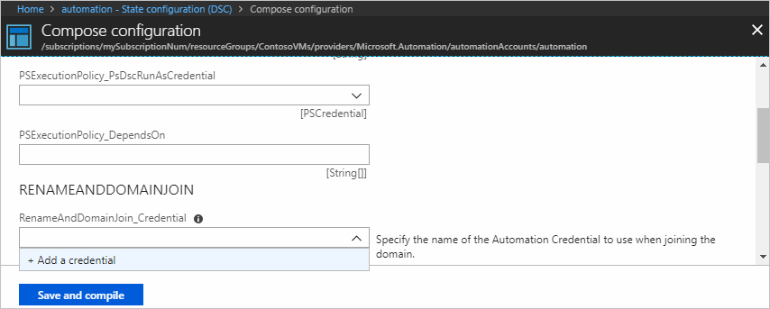

# Compose DSC configurations

When you need to manage resource with more than a single desired state configuration (DSC), the best path is to use [composite resources](/powershell/scripting/dsc/resources/authoringresourcecomposite). A composite resource is a nested and parameterized configuration being used as a DSC resource within another configuration. Use of composite resources allows you to create complex configurations while allowing the underlying composite resources to be individually managed and built.

Azure Automation enables the [import and compilation of composite resources](automation-dsc-compile.md). Once you've imported composite resources into your Automation account, you can use Azure Automation State Configuration through the **State Configuration (DSC)** feature in the Azure portal.

## Compose a configuration

Before you can assign a configuration made from composite resources in the Azure portal, you must compose the configuration. Composition uses **Compose configuration** on the State Configuration (DSC) page while on either the **Configurations** or the **Compiled configurations** tab.

1. Sign in to the [Azure portal](https://portal.azure.com).
1. On the left, click **All resources** and then the name of your Automation account.
1. On the Automation account page, select **State configuration (DSC)** under **Configuration Management**.
1. On the State configuration (DSC) page, click either the **Configurations** or the **Compiled configurations** tab, then click **Compose configuration** in the menu at the top of the page.
1. On the **Basics** step, provide the new configuration name (required) and click anywhere on the row of each composite resource that you want to include in your new configuration, then click **Next** or click the **Source code** step. For the following steps, we selected `PSExecutionPolicy` and `RenameAndDomainJoin` composite resources.
   
1. The **Source code** step shows what the composed configuration of the selected composite resources looks like. You can see the merging of all parameters and how they are passed to the composite resource. When you are done reviewing the new source code, click **Next** or click the **Parameters** step.
   
1. On the **Parameters** step, the parameter for each composite resource is exposed so that values can be provided. If a parameter has a description, it is displayed next to the parameter field. If a parameter is of `PSCredential` type, the dropdown provides a list of **Credential** objects in the current Automation account. A **+ Add a credential** option is also available. Once all required parameters have been provided, click **Save and compile**.
   

## Submit the configuration for compilation

Once the new configuration is saved, it is submitted for compilation. You can view the status of the compilation job like you do with any imported configuration. For more information, see [View a compilation job](automation-dsc-getting-started.md#view-a-compilation-job).

When compilation has completed successfully, the new configuration appears in the **Compiled configurations** tab. Then you can assign the configuration to a managed node, using the steps in [Reassigning a node to a different node configuration](automation-dsc-getting-started.md#reassign-a-node-to-a-different-node-configuration).

## Next steps

- To learn how to enable nodes, see [Enable Azure Automation State Configuration](automation-dsc-onboarding.md).
- To learn about compiling DSC configurations so that you can assign them to target nodes, see [Compile DSC configurations in Azure Automation State Configuration](automation-dsc-compile.md).
- To see an example of using Azure Automation State Configuration in a continuous deployment pipeline, see [Set up continuous deployment with Chocolatey](automation-dsc-cd-chocolatey.md).
- For pricing information, see [Azure Automation State Configuration pricing](https://azure.microsoft.com/pricing/details/automation/).
- For a PowerShell cmdlet reference, see [Az.Automation](/powershell/module/az.automation).
