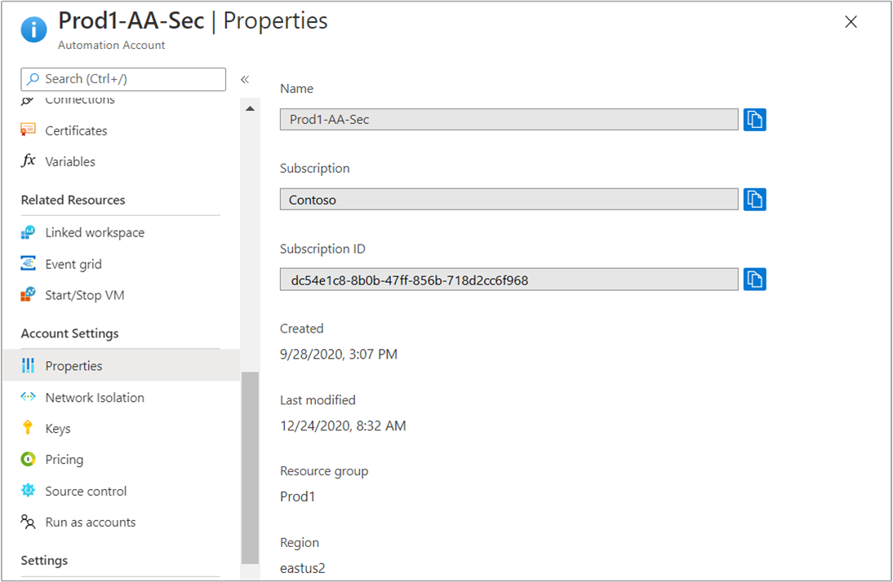

# How to create an Azure Automation Run As account

Run As accounts in Azure Automation provide authentication for managing resources on the Azure Resource Manager or Azure Classic deployment model using Automation runbooks and other Automation features. This article describes how to create a Run As or Classic Run As account from the Azure portal or Azure PowerShell.

## Create account in Azure portal

Perform the following steps to update your Azure Automation account in the Azure portal. The Run As and Classic Run As accounts are created separately. If you don't need to manage classic resources, you can just create the Azure Run As account.

1. Sign in to the Azure portal with an account that is a member of the Subscription Admins role and co-administrator of the subscription.

2. Search for and select **Automation Accounts**.

3. On the **Automation Accounts** page, select your Automation account from the list.

4. In the left pane, select **Run As Accounts** in the **Account Settings** section.

    :::image type="content" source="media/create-run-as-account/automation-account-properties-pane.png" alt-text="Select the Run As Account option.":::

5. Depending on the account you require, use the **+ Azure Run As Account** or **+ Azure Classic Run As Account** pane. After reviewing the overview information, click **Create**.

    :::image type="content" source="media/create-run-as-account/automation-account-create-run-as.png" alt-text="Select the option to create a Run As Account":::

6. While Azure creates the Run As account, you can track the progress under **Notifications** from the menu. A banner is also displayed stating that the account is being created. The process can take a few minutes to complete.

## Create account using PowerShell

The following list provides the requirements to create a Run As account in PowerShell using a provided script. These requirements apply to both types of Run As accounts.

* Windows 10 or Windows Server 2016 with Azure Resource Manager modules 3.4.1 and later. The PowerShell script doesn't support earlier versions of Windows.
* Azure PowerShell PowerShell 6.2.4 or later. For information, see [How to install and configure Azure PowerShell](/powershell/azure/install-az-ps).
* An Automation account, which is referenced as the value for the `AutomationAccountName` and `ApplicationDisplayName` parameters.
* Permissions equivalent to the ones listed in [Required permissions to configure Run As accounts](automation-security-overview.md#permissions).

To get the values for `AutomationAccountName`, `SubscriptionId`, and `ResourceGroupName`, which are required parameters for the PowerShell script, complete the following steps.

1. Sign in to the Azure portal.

1. Search for and select **Automation Accounts**.

1. On the Automation Accounts page, select your Automation account from the list.

1. In the left pane, select **Properties**.

1. Note the values for **Name**, **Subscription ID**, and **Resource Group** on the **Properties** page.

   

### PowerShell script to create a Run As account

The PowerShell script includes support for several configurations.

* Create a Run As account by using a self-signed certificate.
* Create a Run As account and/or a Classic Run As account by using a self-signed certificate.
* Create a Run As account and/or a Classic Run As account by using a certificate issued by your enterprise certification authority (CA).
* Create a Run As account and/or a Classic Run As account by using a self-signed certificate in the Azure Government cloud.

1. Download and save the script to a local folder using the following command.

    ```powershell
    wget https://raw.githubusercontent.com/azureautomation/runbooks/master/Utility/AzRunAs/Create-RunAsAccount.ps1 -outfile Create-RunAsAccount.ps1
    ```

2. Start PowerShell with elevated user rights and navigate to the folder that contains the script.

3. Run one of the following commands to create a Run As and/or Classic Run As account based on your requirements.

    * Create a Run As account using a self-signed certificate.

        ```powershell
        .\Create-RunAsAccount.ps1 -ResourceGroup <ResourceGroupName> -AutomationAccountName <NameofAutomationAccount> -SubscriptionId <SubscriptionId> -ApplicationDisplayName <DisplayNameofAADApplication> -SelfSignedCertPlainPassword <StrongPassword> -CreateClassicRunAsAccount $false
        ```

    * Create a Run As account and a Classic Run As account by using a self-signed certificate.

        ```powershell
        .\Create-RunAsAccount.ps1 -ResourceGroup <ResourceGroupName> -AutomationAccountName <NameofAutomationAccount> -SubscriptionId <SubscriptionId> -ApplicationDisplayName <DisplayNameofAADApplication> -SelfSignedCertPlainPassword <StrongPassword> -CreateClassicRunAsAccount $true
        ```

    * Create a Run As account and a Classic Run As account by using an enterprise certificate.

        ```powershell
        .\Create-RunAsAccount.ps1 -ResourceGroup <ResourceGroupName> -AutomationAccountName <NameofAutomationAccount> -SubscriptionId <SubscriptionId> -ApplicationDisplayName <DisplayNameofAADApplication>  -SelfSignedCertPlainPassword <StrongPassword> -CreateClassicRunAsAccount $true -EnterpriseCertPathForRunAsAccount <EnterpriseCertPfxPathForRunAsAccount> -EnterpriseCertPlainPasswordForRunAsAccount <StrongPassword> -EnterpriseCertPathForClassicRunAsAccount <EnterpriseCertPfxPathForClassicRunAsAccount> -EnterpriseCertPlainPasswordForClassicRunAsAccount <StrongPassword>
        ```

        If you've created a Classic Run As account with an enterprise public certificate (.cer file), use this certificate. The script creates and saves it to the temporary files folder on your computer, under the user profile `%USERPROFILE%\AppData\Local\Temp` you used to execute the PowerShell session. See [Uploading a management API certificate to the Azure portal](../cloud-services/cloud-services-configure-ssl-certificate-portal.md).

    * Create a Run As account and a Classic Run As account by using a self-signed certificate in the Azure Government cloud

        ```powershell
        .\Create-RunAsAccount.ps1 -ResourceGroup <ResourceGroupName> -AutomationAccountName <NameofAutomationAccount> -SubscriptionId <SubscriptionId> -ApplicationDisplayName <DisplayNameofAADApplication> -SelfSignedCertPlainPassword <StrongPassword> -CreateClassicRunAsAccount $true -EnvironmentName AzureUSGovernment
        ```

4. After the script has executed, you're prompted to authenticate with Azure. Sign in with an account that's a member of the subscription administrators role. If you are creating a Classic Run As account, your account must be a co-administrator of the subscription.

## Next steps

* To learn more about graphical authoring, see [Author graphical runbooks in Azure Automation](automation-graphical-authoring-intro.md).
* To get started with PowerShell runbooks, see [Tutorial: Create a PowerShell runbook](learn/automation-tutorial-runbook-textual-powershell.md).
* To get started with a Python 3 runbook, see [Tutorial: Create a Python 3 runbook](learn/automation-tutorial-runbook-textual-python-3.md).
