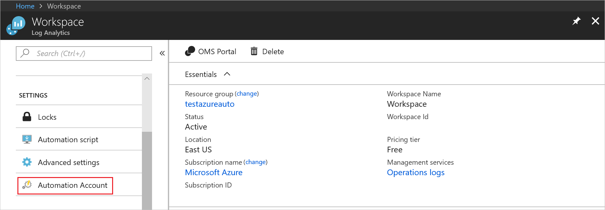
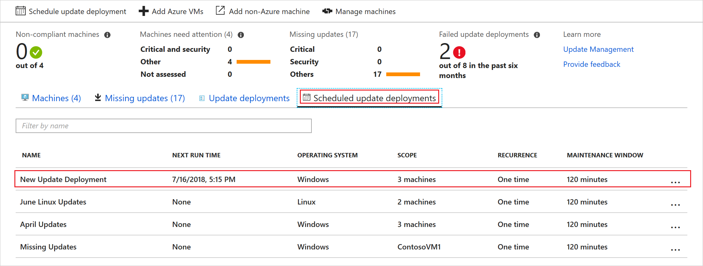

# Migrate Azure Monitor logs update deployments to Azure portal

The Operations Management Suite (OMS) portal is being [deprecated](../azure-monitor/logs/oms-portal-transition.md). All functionality that was available in the OMS portal for Update Management is available in the Azure portal, through Azure Monitor logs. This article provides the information you need to migrate to the Azure portal.

## Key information

* Existing deployments will continue to work. Once you have recreated the deployment in Azure, you can delete your old deployment.
* All existing features that you had in OMS are available in Azure. To learn more about Update Management, see [Update Management overview](./update-management/overview.md).

## Access the Azure portal

1. From your workspace, click **Open in Azure**. 

    

2. In the Azure portal, click **Automation Account**

    

3. In your Automation account, click **Update Management**.

    :::image type="content" source="media/migrate-oms-update-deployments/azure-automation.png" alt-text="Screenshot of the Update management page.":::

4. In the Azure portal, select **Automation Accounts** under **All services**. 

5. Under **Management Tools**, select the appropriate Automation account, and click **Update Management**.

## Recreate existing deployments

All update deployments created in the OMS portal have a [saved search](../azure-monitor/logs/computer-groups.md) also known as a computer group, with the same name as the update deployment that exists. The saved search contains the list of machines that were scheduled in the update deployment.

:::image type="content" source="media/migrate-oms-update-deployments/oms-deployment.png" alt-text="Screenshot of the Update Deployments page with the Name and Servers fields highlighted.":::

To use this existing saved search, follow these steps:

1. To create a new update deployment, go to the Azure portal, select the Automation account that is used, and click **Update Management**. Click **Schedule update deployment**.

    

2. The New Update Deployment pane opens. Enter values for the properties described in the following table and then click **Create**:

3. For **Machines to update**, select the saved search used by the OMS deployment.

    | Property | Description |
    | --- | --- |
    |Name |Unique name to identify the update deployment. |
    |Operating System| Select **Linux** or **Windows**.|
    |Machines to update |Select a Saved search, Imported group, or pick Machine from the dropdown and select individual machines. If you choose **Machines**, the readiness of the machine is shown in the **UPDATE AGENT READINESS** column.  To learn about the different methods of creating computer groups in Azure Monitor logs, see [Computer groups in Azure Monitor logs](../azure-monitor/logs/computer-groups.md) |
    |Update classifications|Select all the update classifications that you need. CentOS does not support this out of the box.|
    |Updates to exclude|Enter the updates to exclude. For Windows, enter the KB article without the **KB** prefix. For Linux, enter the package name or use a wildcard character.  |
    |Schedule settings|Select the time to start, and then select either **Once** or **Recurring** for the recurrence. | 
    | Maintenance window |Number of minutes set for updates. The value can't be less than 30 minutes or more than 6 hours. |
    | Reboot control| Determines how reboots should be handled. Available options are: Reboot if required (Default) Always reboot Never reboot Only reboot - will not install updates|

4. Click **Scheduled update deployments** to view the status of the newly created update deployment.

    

5. As mentioned previously, once your new deployments are configured through the Azure portal, you can remove the existing deployments from the Azure portal.

## Next steps

To learn more about Update Management in Azure Automation, see [Update Management overview](./update-management/overview.md).