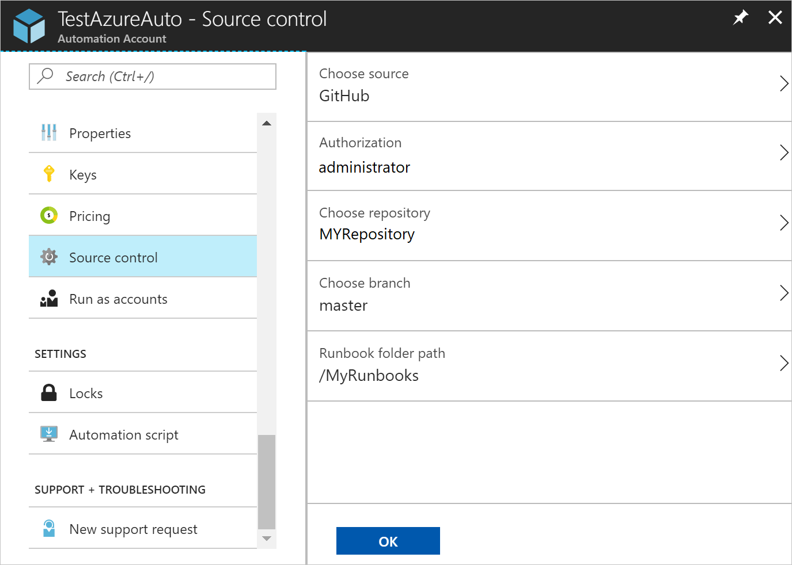
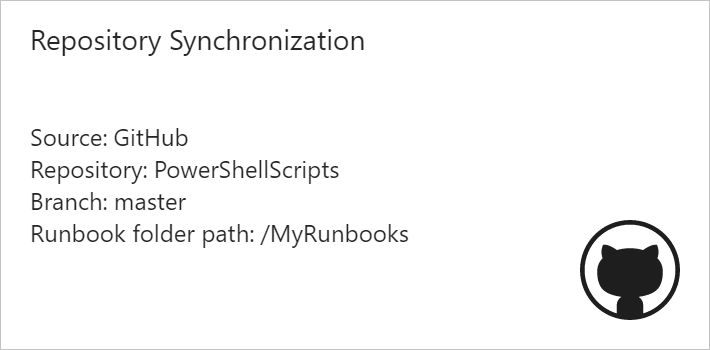
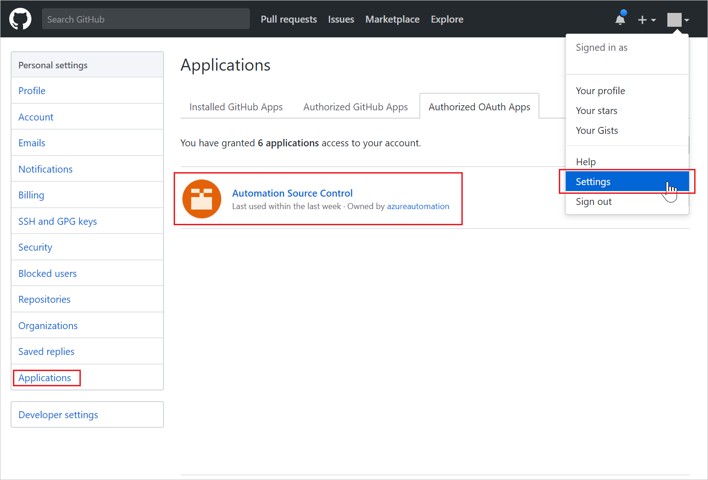
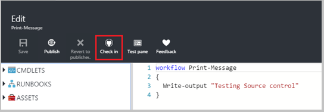
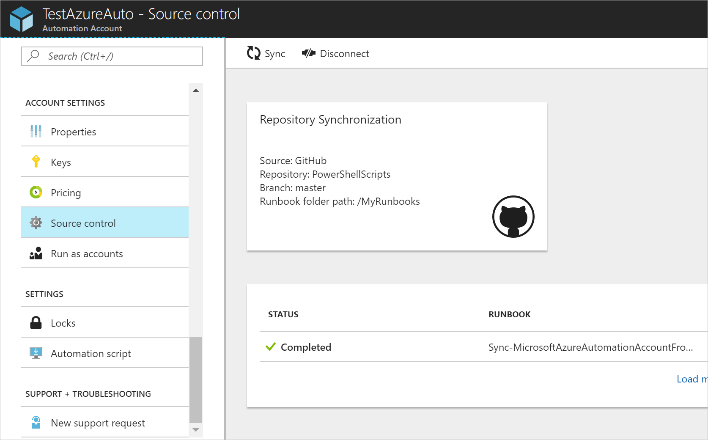
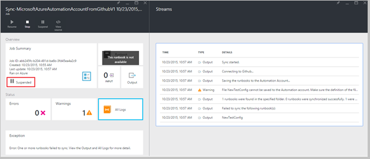

# Source control integration in Azure Automation - Legacy

> [!NOTE]
> There is a new experience for source control. To learn more about the new experience, see [Source Control (Preview)](source-control-integration.md).

Source control integration allows you to associate runbooks in your Automation account to a GitHub source control repository. Source control allows you to easily collaborate with your team, track changes, and roll back to earlier versions of your runbooks. For example, source control allows you to sync different branches in source control to your development, test or production Automation accounts, making it easy to promote code that has been tested in your development environment to your production Automation account.

Source control allows you to push code from Azure Automation to source control or pull your runbooks from source control to Azure Automation. This article describes how to set up source control in your Azure Automation environment. We start by configuring Azure Automation to access your GitHub repository and walk through different operations that can be done using source control integration. 

> [!NOTE]
> Source control supports pulling and pushing [PowerShell Workflow runbooks](automation-runbook-types.md#powershell-workflow-runbooks) as well as [PowerShell runbooks](automation-runbook-types.md#powershell-runbooks). [Graphical runbooks](automation-runbook-types.md#graphical-runbooks) are not yet supported.

There are two simple steps required to configure source control for your Automation account, and only one if you already have a GitHub account. They are:

## Step 1 – Create a GitHub repository

If you already have a GitHub account and a repository that you want to link to Azure Automation, then sign into your existing account and start from step 2 below. Otherwise, navigate to [GitHub](https://github.com/), sign up for a new account, and [create a new repository](https://help.github.com/articles/create-a-repo/).

## Step 2 – Set up source control in Azure Automation

1. From the Automation Account page in the Azure portal, under **Account Settings**, click **Source Control.**

2. The **Source Control** page opens, where you can configure your GitHub account details. Below is the list of parameters to configure:  

   | **Parameter** | **Description** |
   |:--- |:--- |
   | Choose Source |Select the source. Currently, only **GitHub** is supported. |
   | Authorization |Click the **Authorize** button to grant Azure Automation access to your GitHub repository. If you are already logged in to your GitHub account in a different window, then the credentials of that account are used. Once authorization is successful, the page will show your GitHub username under **Authorization Property**. |
   | Choose repository |Select a GitHub repository from the list of available repositories. |
   | Choose branch |Select a branch from the list of available branches. Only the **master** branch is shown if you haven’t created any branches. |
   | Runbook folder path |The runbook folder path specifies the path in the GitHub repository from which you want to push or pull your code. It must be entered in the format **/foldername/subfoldername**. Only runbooks in the runbook folder path will be synced to your Automation account. Runbooks in the subfolders of the runbook folder path will **NOT** be synced. Use **/** to sync all the runbooks under the repository. |
3. For example, if you have a repository named **PowerShellScripts** that contains a folder named **RootFolder**, which contains a folder named **SubFolder**. You can use the following strings to sync each folder level:

   1. To sync runbooks from **repository**, runbook folder path is */*
   2. To sync runbooks from **RootFolder**, runbook folder path is */RootFolder*
   3. To sync runbooks from **SubFolder**, runbook folder path is */RootFolder/SubFolder*.
4. After you configure the parameters, they are displayed on the **Set Up Source Control** page.  

    
5. Once you click **OK**, source control integration is now configured for your Automation account and should be updated with your GitHub information. You can now click on this part to view all of your source control sync job history.  

    
6. After you set up source control, Two [variable assets](automation-variables.md) are created in your Automation account. Additionally, an authorized application is added to your GitHub account.

   * The variable **Microsoft.Azure.Automation.SourceControl.Connection** contains the values of the connection string, as shown below.  

     | **Parameter** | **Value** |
     |:--- |:--- |
     | `Name`  |Microsoft.Azure.Automation.SourceControl.Connection |
     | `Type`  |String |
     | `Value` |{"Branch":\<*Your branch name*>,"RunbookFolderPath":\<*Runbook folder path*>,"ProviderType":\<*has a value 1 for GitHub*>,"Repository":\<*Name of your repository*>,"Username":\<*Your GitHub user name*>} |

   * The variable **Microsoft.Azure.Automation.SourceControl.OAuthToken**, contains the secure encrypted value of your OAuthToken.  

     |**Parameter**            |**Value** |
     |:---|:---|
     | `Name`  | Microsoft.Azure.Automation.SourceControl.OAuthToken |
     | `Type`  | Unknown(Encrypted) |
     | `Value` | <*Encrypted OAuthToken*> |  

       

   * **Automation Source Control** is added as an authorized application to your GitHub account. To view the application: From your GitHub home page, navigate to your **profile** > **Settings** > **Applications**. This application allows Azure Automation to sync your GitHub repository to an Automation account.  

     

## Using Source Control in Automation

### Check in a runbook from Azure Automation to source control

Runbook check in allows you to push the changes you have made to a runbook in Azure Automation into your source control repository. Below are the steps to check in a runbook:

1. From your Automation Account, [create a new textual runbook](automation-first-runbook-textual.md), or [edit an existing, textual runbook](automation-edit-textual-runbook.md). This runbook can be either a PowerShell Workflow or a PowerShell script runbook.  
2. After you edit your runbook, save it and click **check-in** from the **Edit** page.  

    

     > [!NOTE] 
     > Check-in from Azure Automation overwrites the code that currently exists in your source control. The Git equivalent command-line instruction to check-in is **git add + git commit + git push**  

3. When you click **check-in**, you are prompted with a confirmation message, click **Yes** to continue.  

    
4. Check-in starts the source control runbook: **Sync-MicrosoftAzureAutomationAccountToGitHubV1**. This runbook connects to GitHub and pushes changes from Azure Automation to your repository. To view the checked in job history, go back to the **Source Control Integration** tab and click to open the Repository Synchronization page. This page shows all of your source control jobs.  Select the job you want to view and click to view the details.  

    

   > [!NOTE]
   > Source control runbooks are special Automation runbooks that you cannot view or edit. While they do not show up on your runbook list, you see sync jobs showing in your jobs list.

5. The name of the modified runbook is sent as an input parameter for the checked in runbook. You can [view the job details](automation-runbook-execution.md#viewing-job-status-from-the-azure-portal) by expanding runbook in **Repository Synchronization** page.  

    
6. Refresh your GitHub repository once the job completes to view the changes.  There should be a commit in your repository with a commit message: **Updated *Runbook Name* in Azure Automation.**  

### Sync runbooks from source control to Azure Automation

The sync button on the Repository Synchronization page allows you to pull all the runbooks in the runbook folder path of your repository to your Automation account. The same repository can be synced to more than one Automation account. Below are the steps to sync a runbook:

1. From the Automation account where you set up source control, open the **Source Control Integration/Repository Synchronization** page and click **Sync**.  You are prompted with a confirmation message, click **Yes** to continue.  

    

2. Sync starts the runbook: **Sync-MicrosoftAzureAutomationAccountFromGitHubV1**. This runbook connects to GitHub and pulls the changes from your repository to Azure Automation. You should see a new job on the **Repository Synchronization** page for this action. To view details about the sync job, click to open the job details page.  

    

    > [!NOTE]
    > A sync from source control overwrites the draft version of the runbooks that currently exist in your Automation account for **ALL** runbooks that are currently in source control. The Git equivalent command-line instruction to sync is **git pull**

## Disconnecting source control

To disconnect from your GitHub account, open the Repository Synchronization page and click **Disconnect**. Once you disconnect source control, runbooks that were synced earlier still remain in your Automation account but the Repository Synchronization page will not be enabled.  

  

## Next steps

For more information about source control integration, see the following resources:  

* [Azure Automation: Source Control Integration in Azure Automation](https://azure.microsoft.com/blog/azure-automation-source-control-13/)  
* [Azure Automation: Integrating Runbook Source Control using Azure DevOps](https://azure.microsoft.com/blog/azure-automation-integrating-runbook-source-control-using-visual-studio-online/)  
