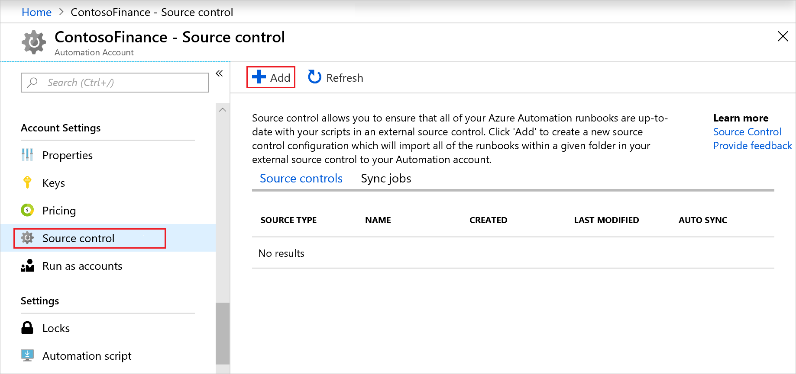
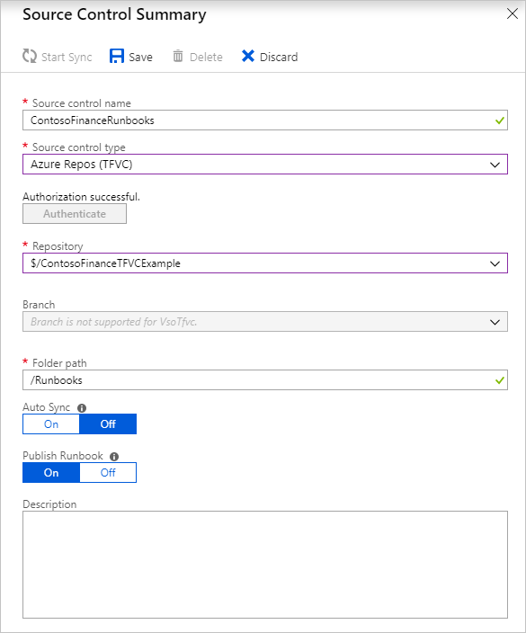

# Use source control integration

 Source control integration in Azure Automation supports single-direction synchronization from your source control repository. Source control allows you to keep your runbooks in your Automation account up to date with scripts in your GitHub or Azure Repos source control repository. This feature makes it easy to promote code that has been tested in your development environment to your production Automation account.
 
 Source control integration lets you easily collaborate with your team, track changes, and roll back to earlier versions of your runbooks. For example, source control allows you to synchronize different branches in source control with your development, test, and production Automation accounts. 

## Source control types

Azure Automation supports three types of source control:

* GitHub
* Azure Repos (Git)
* Azure Repos (TFVC)

## Prerequisites

* A source control repository (GitHub or Azure Repos)
* A [Run As account](manage-runas-account.md)
* The [latest Azure modules](automation-update-azure-modules.md) in your Automation account, including the `Az.Accounts` module (Az module equivalent of `AzureRM.Profile`)

> [!NOTE]
> Source control synchronization jobs are run under the user's Automation account and are billed at the same rate as other Automation jobs.

## Configure source control

This section tells how to configure source control for your Automation account. You can use either the Azure portal or PowerShell.

### Configure source control in Azure portal

Use this procedure to configure source control using the Azure portal.

1. In your Automation account, select **Source Control** and click **Add**.

    

2. Choose **Source Control type**, then click **Authenticate**. 

3. A browser window opens and prompts you to sign in. Follow the prompts to complete authentication.

4. On the Source Control Summary page, use the fields to fill in the source control properties defined below. Click **Save** when finished. 

    |Property  |Description  |
    |---------|---------|
    |Source control name     | A friendly name for the source control. This name must contain only letters and numbers.        |
    |Source control type     | Type of source control mechanism. Available options are:</br> * GitHub</br>* Azure Repos (Git)</br> * Azure Repos (TFVC)        |
    |Repository     | Name of the repository or project. The first 200 repositories are retrieved. To search for a repository, type the name in the field and click **Search on GitHub**.|
    |Branch     | Branch from which to pull the source files. Branch targeting isn't available for the TFVC source control type.          |
    |Folder path     | Folder that contains the runbooks to synchronize, for example, **/Runbooks**. Only runbooks in the specified folder are synchronized. Recursion isn't supported.        |
    |Auto Sync<sup>1</sup>     | Setting that turns on or off automatic synchronization when a commit is made in the source control repository.        |
    |Publish Runbook     | Setting of On if runbooks are automatically published after synchronization from source control, and Off otherwise.           |
    |Description     | Text specifying additional details about the source control.        |

    <sup>1</sup> To enable Auto Sync when configuring source control integration with Azure Repos, you must be a Project Administrator.

   

> [!NOTE]
> The login for your source control repository might be different from your login for the Azure portal. Ensure that you are logged in with the correct account for your source control repository when configuring source control. If there is a doubt, open a new tab in your browser, log out from **dev.azure.com**, **visualstudio.com**, or **github.com**, and try reconnecting to source control.

### Configure source control in PowerShell

You can also use PowerShell to configure source control in Azure Automation. To use the PowerShell cmdlets for this operation, you need a personal access token (PAT). Use the [New-AzAutomationSourceControl](/powershell/module/az.automation/new-azautomationsourcecontrol?view=azps-3.5.0) cmdlet to create the source control connection. This cmdlet requires a secure string for the PAT. To learn how to create a secure string, see [ConvertTo-SecureString](/powershell/module/microsoft.powershell.security/convertto-securestring?view=powershell-6).

The following subsections illustrate PowerShell creation of the source control connection for GitHub, Azure Repos (Git), and Azure Repos (TFVC). 

#### Create source control connection for GitHub

```powershell-interactive
New-AzAutomationSourceControl -Name SCGitHub -RepoUrl https://github.com/<accountname>/<reponame>.git -SourceType GitHub -FolderPath "/MyRunbooks" -Branch master -AccessToken <secureStringofPAT> -ResourceGroupName <ResourceGroupName> -AutomationAccountName <AutomationAccountName>
```

#### Create source control connection for Azure Repos (Git)

> [!NOTE]
> Azure Repos (Git) uses a URL that accesses **dev.azure.com** instead of **visualstudio.com**, used in earlier formats. The older URL format `https://<accountname>.visualstudio.com/<projectname>/_git/<repositoryname>` is deprecated but still supported. The new format is preferred.


```powershell-interactive
New-AzAutomationSourceControl -Name SCReposGit -RepoUrl https://dev.azure.com/<accountname>/<adoprojectname>/_git/<repositoryname> -SourceType VsoGit -AccessToken <secureStringofPAT> -Branch master -ResourceGroupName <ResourceGroupName> -AutomationAccountName <AutomationAccountName> -FolderPath "/Runbooks"
```

#### Create source control connection for Azure Repos (TFVC)

> [!NOTE]
> Azure Repos (TFVC) uses a URL that accesses **dev.azure.com** instead of **visualstudio.com**, used in earlier formats. The older URL format `https://<accountname>.visualstudio.com/<projectname>/_versionControl` is deprecated but still supported. The new format is preferred.

```powershell-interactive
New-AzAutomationSourceControl -Name SCReposTFVC -RepoUrl https://dev.azure.com/<accountname>/<adoprojectname>/_git/<repositoryname> -SourceType VsoTfvc -AccessToken <secureStringofPAT> -ResourceGroupName <ResourceGroupName> -AutomationAccountName <AutomationAccountName> -FolderPath "/Runbooks"
```

#### Personal access token (PAT) permissions

Source control requires some minimum permissions for PATs. The following subsections contain the minimum permissions required for GitHub and Azure Repos.

##### Minimum PAT permissions for GitHub

The following table defines the minimum PAT permissions required for GitHub. For more information about creating a PAT in GitHub, see [Creating a personal access token for the command line](https://help.github.com/articles/creating-a-personal-access-token-for-the-command-line/).

|Scope  |Description  |
|---------|---------|
|**`repo`**     |         |
|`repo:status`     | Access commit status         |
|`repo_deployment`      | Access deployment status         |
|`public_repo`     | Access public repositories         |
|**`admin:repo_hook`**     |         |
|`write:repo_hook`     | Write repository hooks         |
|`read:repo_hook`|Read repository hooks|

##### Minimum PAT permissions for Azure Repos

The following list defines the minimum PAT permissions required for Azure Repos. For more information about creating a PAT in Azure Repos, see [Authenticate access with personal access tokens](/azure/devops/organizations/accounts/use-personal-access-tokens-to-authenticate?view=azure-devops&tabs=preview-page).

| Scope  |  Access Type  |
|---------| ----------|
| `Code`      | Read  |
| `Project and team` | Read |
| `Identity` | Read     |
| `User profile` | Read     |
| `Work items` | Read    |
| `Service connections` | Read, query, manage<sup>1</sup>    |

<sup>1</sup> The `Service connections` permission is only required if you have enabled autosync.

## Synchronize with source control

Follow these steps to synchronize with source control. 

1. Select the source from the table on the Source control page. 

2. Click **Start Sync** to start the sync process. 

3. View the status of the current sync job or previous ones by clicking the **Sync jobs** tab. 

4. On the **Source Control** dropdown menu, select a source control mechanism.

    

5. Clicking on a job allows you to view the job output. The following example is the output from a source control sync job.

    ```output
    ===================================================================

    Azure Automation Source Control.
    Supported runbooks to sync: PowerShell Workflow, PowerShell Scripts, DSC Configurations, Graphical, and Python 2.

    Setting AzEnvironment.

    Getting AzureRunAsConnection.

    Logging in to Azure...

    Source control information for syncing:

    [Url = https://ContosoExample.visualstudio.com/ContosoFinanceTFVCExample/_versionControl] [FolderPath = /Runbooks]

    Verifying url: https://ContosoExample.visualstudio.com/ContosoFinanceTFVCExample/_versionControl

    Connecting to VSTS...

    Source Control Sync Summary:

    2 files synced:
     - ExampleRunbook1.ps1
     - ExampleRunbook2.ps1

    ==================================================================

    ```

6. Additional logging is available by selecting **All Logs** on the Source Control Sync Job Summary page. These additional log entries can help you troubleshoot issues that might arise when using source control.

## Disconnect source control

To disconnect from a source control repository:

1. Open **Source control** under **Account Settings** in your Automation account.

2. Select the source control mechanism to remove. 

3. On the Source Control Summary page, click **Delete**.

## Handle encoding issues

If multiple people are editing runbooks in your source control repository using different editors, encoding issues can occur. To learn more about this situation, see [Common causes of encoding issues](/powershell/scripting/components/vscode/understanding-file-encoding?view=powershell-7#common-causes-of-encoding-issues).

## Update the PAT

Currently, you can't use the Azure portal to update the PAT in source control. When your PAT is expired or revoked, you can update source control with a new access token in one of these ways:

* Use the [REST API](/rest/api/automation/sourcecontrol/update).
* Use the [Update-AzAutomationSourceControl](/powershell/module/az.automation/update-azautomationsourcecontrol) cmdlet.

## Next steps

* For integrating source control in Azure Automation, see [Azure Automation: Source Control Integration in Azure Automation](https://azure.microsoft.com/blog/azure-automation-source-control-13/).  
* For integrating runbook source control with Visual Studio Online, see [Azure Automation: Integrating Runbook Source Control using Visual Studio Online](https://azure.microsoft.com/blog/azure-automation-integrating-runbook-source-control-using-visual-studio-online/).
