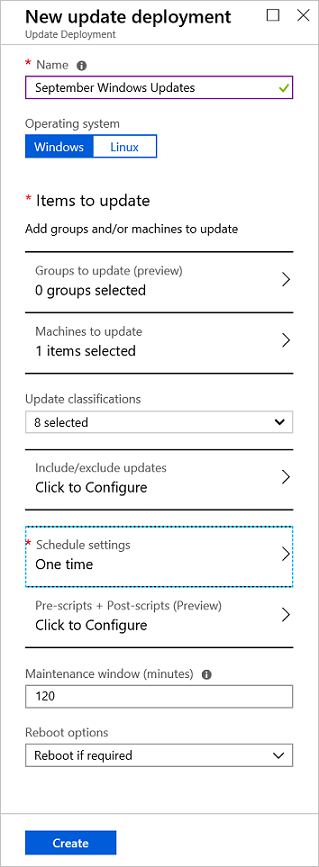
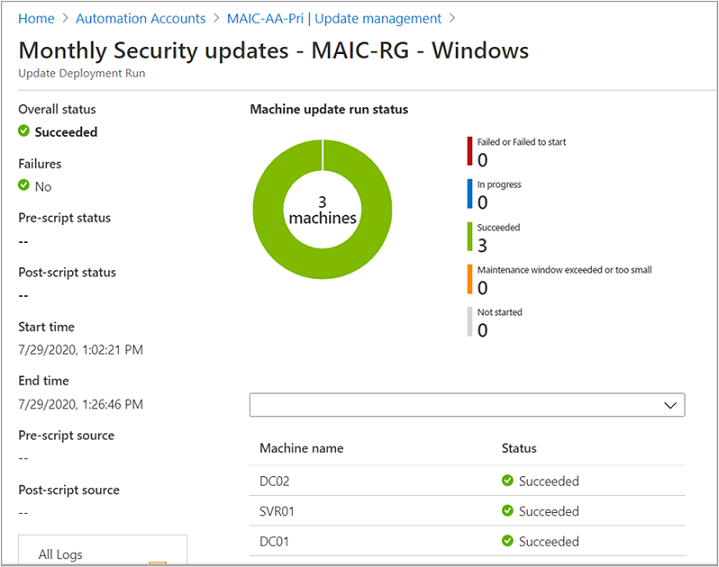

# How to deploy updates and review results

This article describes how to schedule an update deployment and review the process after the deployment is complete. You can configure an update deployment from a selected Azure virtual machine, from the selected Arc enabled server, or from the Automation account across all configured machines and servers. 

Under each scenario, the deployment you create targets that selected machine or server, or in the case of creating a deployment from your Automation account, you can target one or more machines. When you schedule an update deployment from an Azure VM or Arc enabled server, the steps are the same as deploying from your Automation account, with the following exceptions:

* The operating system is automatically pre-selected based on the OS of the machine
* The target machine to update is set to target itself automatically
* When configuring the schedule, you can specify **Update now**, occurs once, or uses a recurring schedule.

## Sign in to the Azure portal

Sign in to the [Azure portal](https://portal.azure.com)

## Schedule an update deployment

Scheduling an update deployment creates a [schedule](../shared-resources/schedules.md) resource linked to the **Patch-MicrosoftOMSComputers** runbook that handles the update deployment on the target machine or machines. You must schedule a deployment that follows your release schedule and service window to install updates. You can choose the update types to include in the deployment. For example, you can include critical or security updates, and exclude update rollups.

>[!NOTE]
>If you delete the schedule resource from the Azure portal or using PowerShell after creating the deployment, the deletion breaks the scheduled update deployment and presents an error when you attempt to reconfigure the schedule resource from the portal. You can only delete the schedule resource by deleting the corresponding deployment schedule.  

To schedule a new update deployment, perform the following steps. Depending on the resource selected (that is, Automation account, Arc enabled server, Azure VM), the steps below apply to all with minor differences while configuring the deployment schedule.

1. In the portal, to schedule a deployment for:

   * One or more machines, navigate to **Automation accounts** and select your Automation account with Update Management enabled from the list.
   * For an Azure VM, navigate to **Virtual machines** and select your VM from the list.
   * For an Arc enabled server, navigate to **Servers - Azure Arc** and select your server from the list.

2. Depending on the resource you selected, to navigate to Update Management:

   * If you selected your Automation account, go to **Update management** under **Update management**, and then select **Schedule update deployment**.
   * If you selected an Azure VM, go to **Guest + host updates**, and then select **Go to Update Management**.
   * If you selected an Arc enabled server, go to **Update Management**, and then select **Schedule update deployment**.

3. Under **New update deployment**, in the **Name** field enter a unique name for your deployment.

4. Select the operating system to target for the update deployment.

    > [!NOTE]
    > This option is not available if you selected an Azure VM or Arc enabled server. The operating system is automatically identified.

5. In the **Groups to update (preview)** region, define a query that combines subscription, resource groups, locations, and tags to build a dynamic group of Azure VMs to include in your deployment. To learn more, see [Use dynamic groups with Update Management](update-mgmt-groups.md).

    > [!NOTE]
    > This option is not available if you selected an Azure VM or Arc enabled server. The machine is automatically targeted for the scheduled deployment.

6. In the **Machines to update** region, select a saved search, an imported group, or pick **Machines** from the dropdown menu and select individual machines. With this option, you can see the readiness of the Log Analytics agent for each machine. To learn about the different methods of creating computer groups in Azure Monitor logs, see [Computer groups in Azure Monitor logs](../../azure-monitor/platform/computer-groups.md).

    > [!NOTE]
    > This option is not available if you selected an Azure VM or Arc enabled server. The machine is automatically targeted for the scheduled deployment.

7. Use the **Update classifications** region to specify [update classifications](update-mgmt-view-update-assessments.md#work-with-update-classifications) for products. For each product, deselect all supported update classifications but the ones to include in your update deployment.

    If your deployment is meant to apply only a select set of updates, it is necessary to deselect all the pre-selected update classifications when configuring the **Include/exclude updates** option as described in the next step. This ensures only the updates you have specified to *include* in this deployment are installed on the target machines.

8. Use the **Include/exclude updates** region to add or exclude selected updates from the deployment. On the **Include/Exclude** page, you enter KB article ID numbers to include or exclude.

   > [!IMPORTANT]
   > Remember that exclusions override inclusions. For instance, if you define an exclusion rule of `*`, Update Management excludes all patches or packages from the installation. Excluded patches still show as missing from the machines. For Linux machines, if you include a package that has a dependent package that has been excluded, Update Management doesn't install the main package.

   > [!NOTE]
   > You can't specify updates that have been superseded to include in the update deployment.

9. Select **Schedule settings**. The default start time is 30 minutes after the current time. You can set the start time to any time from 10 minutes in the future.

    > [!NOTE]
    > This option is different if you selected an Arc enabled server. You can select **Update now** or a start time 20 minutes into the future.

10. Use the **Recurrence** to specify if the deployment occurs once or uses a recurring schedule, then select **OK**.

11. In the **Pre-scripts + Post-scripts (Preview)** region, select the scripts to run before and after your deployment. To learn more, see [Manage pre-scripts and post-scripts](update-mgmt-pre-post-scripts.md).

12. Use the **Maintenance window (minutes)** field to specify the amount of time allowed for updates to install. Consider the following details when specifying a maintenance window:

    * Maintenance windows control how many updates are installed.
    * Update Management doesn't stop installing new updates if the end of a maintenance window is approaching.
    * Update Management doesn't terminate in-progress updates if the maintenance window is exceeded.
    * If the maintenance window is exceeded on Windows, it's often because a service pack update is taking a long time to install.

    > [!NOTE]
    > To avoid updates being applied outside of a maintenance window on Ubuntu, reconfigure the `Unattended-Upgrade` package to disable automatic updates. For information about how to configure the package, see the [Automatic updates topic in the Ubuntu Server Guide](https://help.ubuntu.com/lts/serverguide/automatic-updates.html).

13. Use the **Reboot options** field to specify the way to handle reboots during deployment. The following options are available: 
    * Reboot if necessary (default)
    * Always reboot
    * Never reboot
    * Only reboot; this option doesn't install updates

    > [!NOTE]
    > The registry keys listed under [Registry keys used to manage restart](/windows/deployment/update/waas-restart#registry-keys-used-to-manage-restart) can cause a reboot event if **Reboot options** is set to **Never reboot**.

14. When you're finished configuring the deployment schedule, select **Create**.

    

    > [!NOTE]
    > When you're finished configuring the deployment schedule for a selected Arc enabled server, select **Review + create**.

15. You're returned to the status dashboard. Select **Deployment schedules** to show the deployment schedule that you've created.

## Schedule an update deployment programmatically

To learn how to create an update deployment with the REST API, see [Software Update Configurations - Create](/rest/api/automation/softwareupdateconfigurations/create).

You can use a sample runbook to create a weekly update deployment. To learn more about this runbook, see [Create a weekly update deployment for one or more VMs in a resource group](https://gallery.technet.microsoft.com/scriptcenter/Create-a-weekly-update-2ad359a1).

## Check deployment status

After your scheduled deployment starts, you can see its status on the **History** tab under **Update management**. The status is **In progress** when the deployment is currently running. When the deployment ends successfully, the status changes to **Succeeded**. If there are failures with one or more updates in the deployment, the status is **Failed**.

## View results of a completed update deployment

When the deployment is finished, you can select it to see its results.

Under **Update results**, a summary provides the total number of updates and deployment results on the target VMs. The table on the right shows a detailed breakdown of the updates and the installation results for each.

The available values are:

* **Not attempted** - The update wasn't installed because there was insufficient time available, based on the defined maintenance window duration.
* **Not selected** - The update wasn't selected for deployment.
* **Succeeded** - The update succeeded.
* **Failed** - The update failed.

Select **All logs** to see all log entries that the deployment has created.

Select **Output** to see the job stream of the runbook responsible for managing the update deployment on the target VMs.

Select **Errors** to see detailed information about any errors from the deployment.

## Next steps

To learn how to create alerts to notify you about update deployment results, see [create alerts for Update Management](update-mgmt-configure-alerts.md).