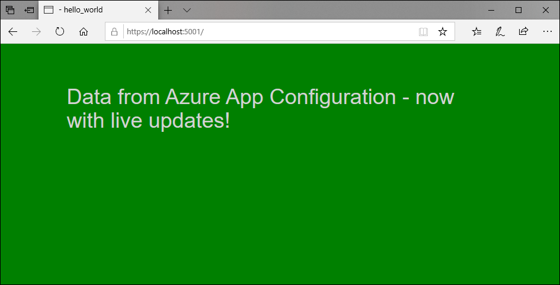

# Tutorial: Use dynamic configuration in an ASP.NET Core app

ASP.NET Core has a pluggable configuration system that can read configuration data from a variety of sources. It can handle changes on the fly without causing an application to restart. ASP.NET Core supports the binding of configuration settings to strongly typed .NET classes. It injects them into your code by using the various `IOptions<T>` patterns. One of these patterns, specifically `IOptionsSnapshot<T>`, automatically reloads the application's configuration when the underlying data changes.

You can inject `IOptionsSnapshot<T>` into controllers in your application to access the most recent configuration stored in Azure App Configuration. You also can set up the App Configuration ASP.NET Core client library to continuously monitor and retrieve any change in an app configuration store. You define the periodic interval for the polling.

This tutorial shows how you can implement dynamic configuration updates in your code. It builds on the web app introduced in the quickstarts. Before you continue, finish [Create an ASP.NET Core app with App Configuration](./quickstart-aspnet-core-app.md) first.

You can use any code editor to do the steps in this tutorial. [Visual Studio Code](https://code.visualstudio.com/) is an excellent option that's available on the Windows, macOS, and Linux platforms.

In this tutorial, you learn how to:

> [!div class="checklist"]
> * Set up your application to update its configuration in response to changes in an app configuration store.
> * Inject the latest configuration in your application's controllers.

## Prerequisites

To do this tutorial, install the [.NET Core SDK](https://dotnet.microsoft.com/download).

[!INCLUDE [quickstarts-free-trial-note](../../includes/quickstarts-free-trial-note.md)]

## Reload data from App Configuration

1. Open *Program.cs*, and update the `CreateWebHostBuilder` method by adding the `config.AddAzureAppConfiguration()` method.

    ```csharp
    public static IWebHostBuilder CreateWebHostBuilder(string[] args) =>
        WebHost.CreateDefaultBuilder(args)
            .ConfigureAppConfiguration((hostingContext, config) =>
            {
                var settings = config.Build();
                config.AddAzureAppConfiguration(options =>
                    options.Connect(settings["ConnectionStrings:AppConfig"])
                           .Watch("TestApp:Settings:BackgroundColor")
                           .Watch("TestApp:Settings:FontColor")
                           .Watch("TestApp:Settings:Message"));
            })
            .UseStartup<Startup>();
    ```

    The second parameter in the `.Watch` method is the polling interval at which the ASP.NET client library queries an app configuration store. The client library checks the specific configuration setting to see if any change occurred.
    
    > [!NOTE]
    > The default polling interval for the `Watch` extension method is 30 seconds if not specified.

2. Add a *Settings.cs* file that defines and implements a new `Settings` class.

    ```csharp
    namespace TestAppConfig
    {
        public class Settings
        {
            public string BackgroundColor { get; set; }
            public long FontSize { get; set; }
            public string FontColor { get; set; }
            public string Message { get; set; }
        }
    }
    ```

3. Open *Startup.cs*, and update the `ConfigureServices` method to bind configuration data to the `Settings` class.

    ```csharp
    public void ConfigureServices(IServiceCollection services)
    {
        services.Configure<Settings>(Configuration.GetSection("TestApp:Settings"));

        services.Configure<CookiePolicyOptions>(options =>
        {
            options.CheckConsentNeeded = context => true;
            options.MinimumSameSitePolicy = SameSiteMode.None;
        });

        services.AddMvc().SetCompatibilityVersion(CompatibilityVersion.Version_2_1);
    }
    ```

## Use the latest configuration data

1. Open *HomeController.cs* in the Controllers directory, and add a reference to the `Microsoft.Extensions.Options` package.

    ```csharp
    using Microsoft.Extensions.Options;
    ```

2. Update the `HomeController` class to receive `Settings` through dependency injection, and make use of its values.

    ```csharp
    public class HomeController : Controller
    {
        private readonly Settings _settings;
        public HomeController(IOptionsSnapshot<Settings> settings)
        {
            _settings = settings.Value;
        }

        public IActionResult Index()
        {
            ViewData["BackgroundColor"] = _settings.BackgroundColor;
            ViewData["FontSize"] = _settings.FontSize;
            ViewData["FontColor"] = _settings.FontColor;
            ViewData["Message"] = _settings.Message;

            return View();
        }
    }
    ```

3. Open *Index.cshtml* in the Views > Home directory, and replace its content with the following script:

    ```html
    <!DOCTYPE html>
    <html lang="en">
    <style>
        body {
            background-color: @ViewData["BackgroundColor"]
        }
        h1 {
            color: @ViewData["FontColor"];
            font-size: @ViewData["FontSize"];
        }
    </style>
    <head>
        <title>Index View</title>
    </head>
    <body>
        <h1>@ViewData["Message"]</h1>
    </body>
    </html>
    ```

## Build and run the app locally

1. To build the app by using the .NET Core CLI, run the following command in the command shell:

        dotnet build

2. After the build successfully completes, run the following command to run the web app locally:

        dotnet run

3. Open a browser window, and go to `http://localhost:5000`, which is the default URL for the web app hosted locally.

    

4. Sign in to the [Azure portal](https://portal.azure.com). Select **All resources**, and select the app configuration store instance that you created in the quickstart.

5. Select **Configuration Explorer**, and update the values of the following keys:

    | Key | Value |
    |---|---|
    | TestAppSettings:BackgroundColor | green |
    | TestAppSettings:FontColor | lightGray |
    | TestAppSettings:Message | Data from Azure App Configuration - now with live updates! |

6. Refresh the browser page to see the new configuration settings.

    

## Clean up resources

[!INCLUDE [azure-app-configuration-cleanup](../../includes/azure-app-configuration-cleanup.md)]

## Next steps

In this tutorial, you added an Azure managed service identity to streamline access to App Configuration and improve credential management for your app. To learn more about how to use App Configuration, continue to the Azure CLI samples.

> [!div class="nextstepaction"]
> [CLI samples](./cli-samples.md)
