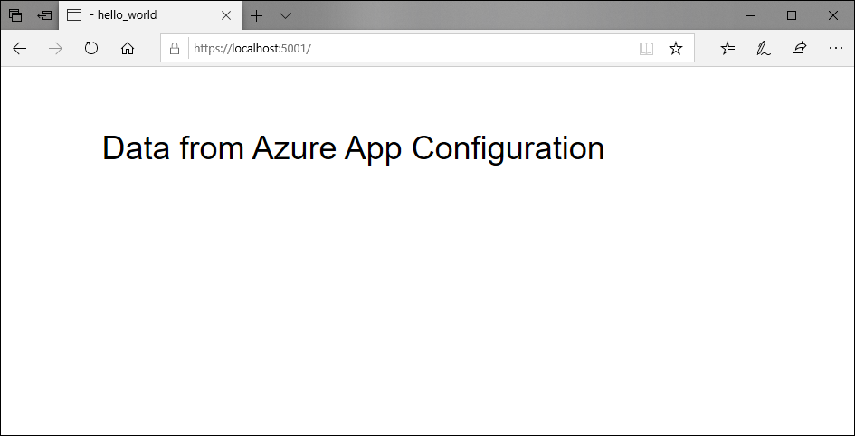

# Integrate with a CI/CD pipeline

This article describes various ways of using data from Azure App Configuration in a continuous integration and continuous deployment system.

## Use App Configuration in your Azure DevOps Pipeline

If you have an Azure DevOps Pipeline, you can fetch key-values from App Configuration and set them as task variables. The [Azure App Configuration DevOps extension](https://go.microsoft.com/fwlink/?linkid=2091063) is an add-on module that provides this functionality. Simply follow its instructions to use the extension in a build or release task sequence.

## Deploy App Configuration data with your application

Your application may fail to run if it depends on Azure App Configuration and cannot reach it. You can enhance the resiliency of your application to deal with such an event, however unlikely it is to happen. To do so, package the current configuration data into a file that's deployed with the application and loaded locally during its startup. This approach guarantees that your application has default setting values at least. These values are overwritten by any newer changes in an app configuration store when it's available.

Using the [Export](./howto-import-export-data.md#export-data) function of Azure App Configuration, you can automate the process of retrieving current configuration data as a single file. Then embed this file in a build or deployment step in your continuous integration and continuous deployment (CI/CD) pipeline.

The following example shows how to include App Configuration data as a build step for the web app introduced in the quickstarts. Before you continue, finish [Create an ASP.NET Core app with App Configuration](./quickstart-aspnet-core-app.md) first.

You can use any code editor to do the steps in this tutorial. [Visual Studio Code](https://code.visualstudio.com/) is an excellent option available on the Windows, macOS, and Linux platforms.

### Prerequisites

If you build locally, download and install the [Azure CLI](https://docs.microsoft.com/cli/azure/install-azure-cli?view=azure-cli-latest) if you haven’t already.

To do a cloud build, with Azure DevOps for example, make sure the [Azure CLI](https://docs.microsoft.com/cli/azure/install-azure-cli?view=azure-cli-latest) is installed in your build system.

### Export an app configuration store

1. Open your *.csproj* file, and add the following script:

    ```xml
    <Target Name="Export file" AfterTargets="Build">
        <Message Text="Export the configurations to a temp file. " />
        <Exec WorkingDirectory="$(MSBuildProjectDirectory)" Condition="$(ConnectionString) != ''" Command="az appconfig kv export -d file --path $(OutDir)\azureappconfig.json --format json --separator : --connection-string $(ConnectionString)" />
    </Target>
    ```

    Add the *ConnectionString* associated with your app configuration store as an environment variable.

2. Open *Program.cs*, and update the `CreateWebHostBuilder` method to use the exported JSON file by calling the `config.AddJsonFile()` method.

    ```csharp
    public static IWebHostBuilder CreateWebHostBuilder(string[] args) =>
        WebHost.CreateDefaultBuilder(args)
            .ConfigureAppConfiguration((hostingContext, config) =>
            {
                var directory = System.IO.Path.GetDirectoryName(Assembly.GetExecutingAssembly().Location);
                var settings = config.Build();

                config.AddJsonFile(Path.Combine(directory, "azureappconfig.json"));
                config.AddAzureAppConfiguration(settings["ConnectionStrings:AppConfig"]);
            })
            .UseStartup<Startup>();
    ```

### Build and run the app locally

1. Set an environment variable named **ConnectionString**, and set it to the access key to your app configuration store. If you use the Windows command prompt, run the following command and restart the command prompt to allow the change to take effect:

        setx ConnectionString "connection-string-of-your-app-configuration-store"

    If you use Windows PowerShell, run the following command:

        $Env:ConnectionString = "connection-string-of-your-app-configuration-store"

    If you use macOS or Linux, run the following command:

        export ConnectionString='connection-string-of-your-app-configuration-store'

2. To build the app by using the .NET Core CLI, run the following command in the command shell:

        dotnet build

3. After the build successfully completes, run the following command to run the web app locally:

        dotnet run

4. Open a browser window and go to `http://localhost:5000`, which is the default URL for the web app hosted locally.

    

## Next steps

In this tutorial, you exported Azure App Configuration data to be used in a deployment pipeline. To learn more about how to use App Configuration, continue to the Azure CLI samples.

> [!div class="nextstepaction"]
> [Managed identity integration](./howto-integrate-azure-managed-service-identity.md)
