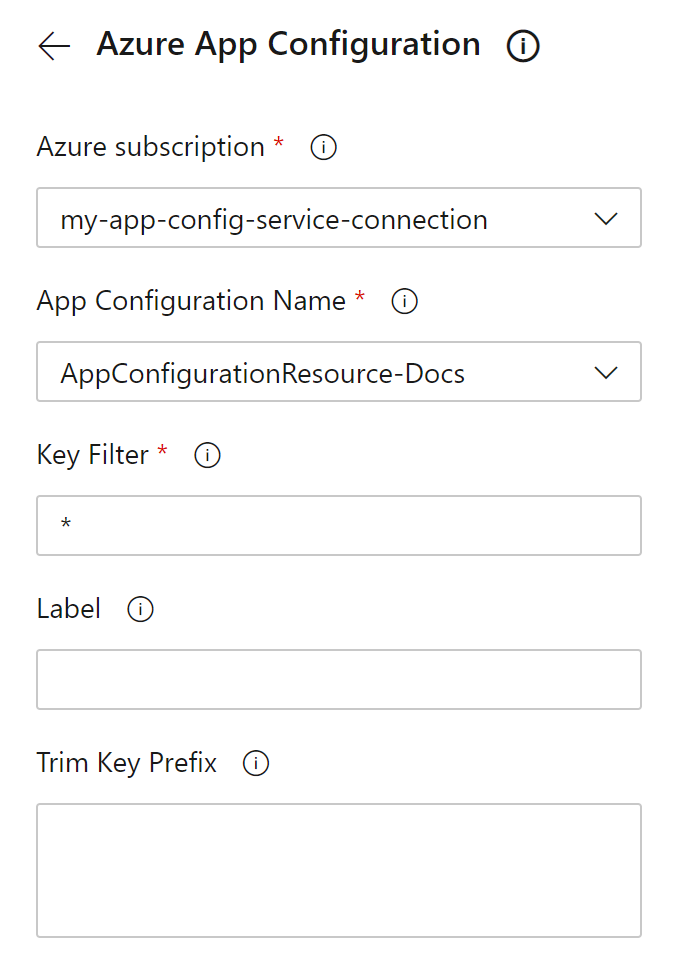
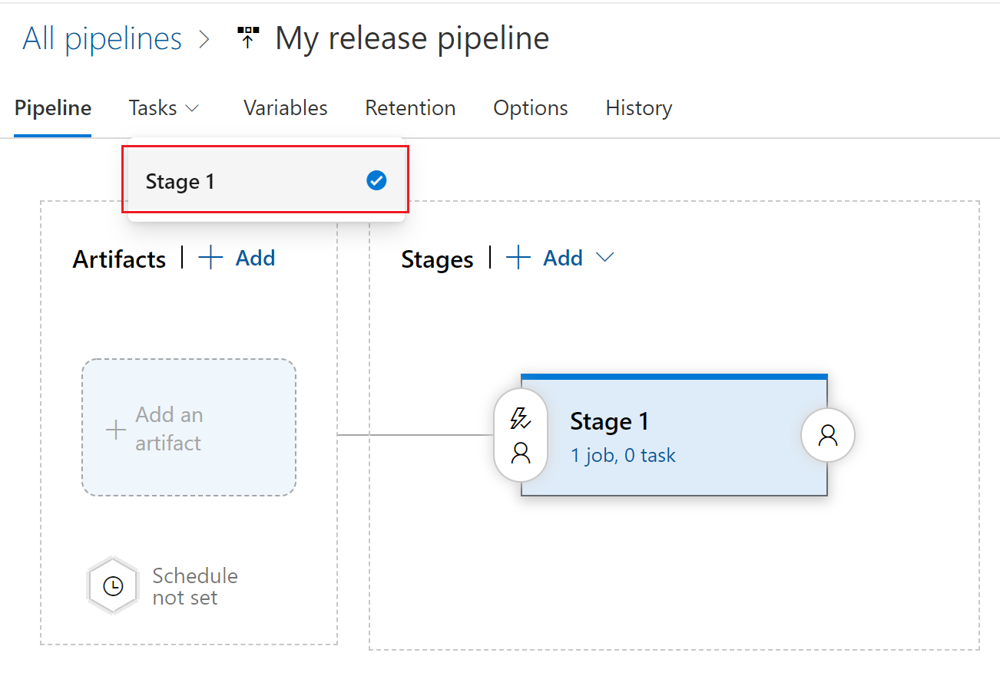
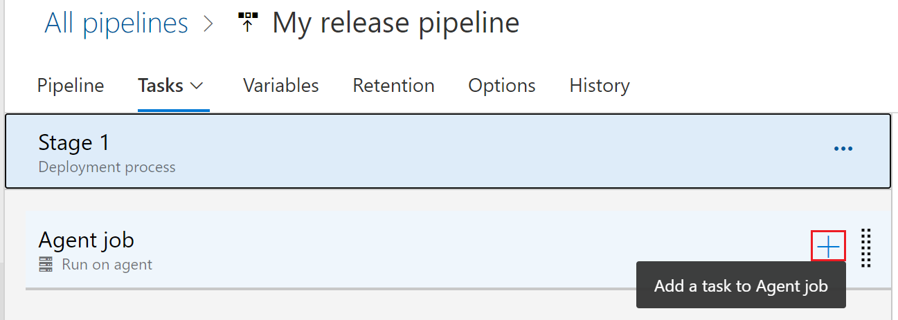

# Pull settings to App Configuration with Azure Pipelines

The [Azure App Configuration](https://marketplace.visualstudio.com/items?itemName=AzureAppConfiguration.azure-app-configuration-task) task pulls key-values from your App Configuration store and sets them as Azure pipeline variables, which can be consumed by subsequent tasks. This task complements the [Azure App Configuration Push](https://marketplace.visualstudio.com/items?itemName=AzureAppConfiguration.azure-app-configuration-task-push) task that pushes key-values from a configuration file into your App Configuration store. For more information, see [Push settings to App Configuration with Azure Pipelines](push-kv-devops-pipeline.md).

## Prerequisites

- Azure subscription - [create one for free](https://azure.microsoft.com/free/)
- App Configuration store - create one for free in the [Azure portal](https://portal.azure.com).
- Azure DevOps project - [create one for free](https://go.microsoft.com/fwlink/?LinkId=2014881)
- Azure App Configuration task - download for free from the [Visual Studio Marketplace](https://marketplace.visualstudio.com/items?itemName=AzureAppConfiguration.azure-app-configuration-task#:~:text=Navigate%20to%20the%20Tasks%20tab,the%20Azure%20App%20Configuration%20instance.).  

## Create a service connection

[!INCLUDE [azure-app-configuration-service-connection](../../includes/azure-app-configuration-service-connection.md)]

## Add role assignment

[!INCLUDE [azure-app-configuration-role-assignment](../../includes/azure-app-configuration-role-assignment.md)]

## Use in builds

This section will cover how to use the Azure App Configuration task in an Azure DevOps build pipeline.

1. Navigate to the build pipeline page by clicking **Pipelines** > **Pipelines**. For build pipeline documentation, see  [Create your first pipeline](/azure/devops/pipelines/create-first-pipeline?tabs=net%2Ctfs-2018-2%2Cbrowser).
      - If you're creating a new build pipeline, on the last step of the process, on the **Review** tab, select **Show assistant** on the right side of the pipeline.
      
      - If you're using an existing build pipeline, click the **Edit** button at the top-right.
      
1. Search for the **Azure App Configuration** Task.

1. Configure the necessary parameters for the task to pull the key-values from the App Configuration store. Descriptions of the parameters are available in the **Parameters** section below and in tooltips next to each parameter.
      - Set the **Azure subscription** parameter to the name of the service connection you created in a previous step.
      - Set the **App Configuration name** to the resource name of your App Configuration store.
      - Leave the default values for the remaining parameters.

1. Save and queue a build. The build log will display any failures that occurred during the execution of the task.

## Use in releases

This section will cover how to use the Azure App Configuration task in an Azure DevOps release pipeline.

1. Navigate to release pipeline page by selecting **Pipelines** > **Releases**. For release pipeline documentation, see [Release pipelines](/azure/devops/pipelines/release).
1. Choose an existing release pipeline. If you don’t have one, click **New pipeline** to create a new one.
1. Select the **Edit** button in the top-right corner to edit the release pipeline.
1. From the **Tasks** dropdown, choose the **Stage** to which you want to add the task. More information about stages can be found [here](/azure/devops/pipelines/release/environments).

1. Click **+** next to the Job to which you want to add a new task.

1. Search for the **Azure App Configuration** Task.

1. Configure the necessary parameters within the task to pull your key-values from your App Configuration store. Descriptions of the parameters are available in the **Parameters** section below and in tooltips next to each parameter.
      - Set the **Azure subscription** parameter to the name of the service connection you created in a previous step.
      - Set the **App Configuration name** to the resource name of your App Configuration store.
      - Leave the default values for the remaining parameters.
1. Save and queue a release. The release log will display any failures encountered during the execution of the task.

## Parameters

The following parameters are used by the Azure App Configuration task:

- **Azure subscription**: A drop-down containing your available Azure service connections. To update and refresh your list of available Azure service connections, press the **Refresh Azure subscription** button to the right of the textbox.
- **App Configuration Name**: A drop-down that loads your available configuration stores under the selected subscription. To update and refresh your list of available configuration stores, press the **Refresh App Configuration Name** button to the right of the textbox.
- **Key Filter**: The filter can be used to select what key-values are requested from Azure App Configuration. A value of * will select all key-values. For more information on, see [Query key values](concept-key-value.md#query-key-values).
- **Label**: Specifies which label should be used when selecting key-values from the App Configuration store. If no label is provided, then key-values with the no label will be retrieved. The following characters are not allowed: , *.
- **Trim Key Prefix**: Specifies one or more prefixes that should be trimmed from App Configuration keys before setting them as variables. Multiple prefixes can be separated by a new-line character.

## Use key-values in subsequent tasks

The key-values that are fetched from App Configuration are set as pipeline variables, which are accessible as environment variables. The key of the environment variable is the key of the key-value that is retrieved from App Configuration after trimming the prefix, if specified.

For example, if a subsequent task runs a PowerShell script, it could consume a key-value with the key 'myBuildSetting' like this:
```powershell
echo "$env:myBuildSetting"
```
And the value will be printed to the console.

> [!NOTE]
> Azure Key Vault references within App Configuration will be resolved and set as [secret variables](/azure/devops/pipelines/process/variables#secret-variables). In Azure pipelines, secret variables are masked out from log. They are not passed into tasks as environment variables and must instead be passed as inputs. 

## Troubleshooting

If an unexpected error occurs, debug logs can be enabled by setting the pipeline variable `system.debug` to `true`.

## FAQ

**How do I compose my configuration from multiple keys and labels?**

There are times when configuration may need to be composed from multiple labels, for example, default and dev. Multiple App Configuration tasks may be used in one pipeline to implement this scenario. The key-values fetched by a task in a later step will supersede any values from previous steps. In the aforementioned example, a task can be used to select key-values with the default label while a second task can select key-values with the dev label. The keys with the dev label will override the same keys with the default label.
