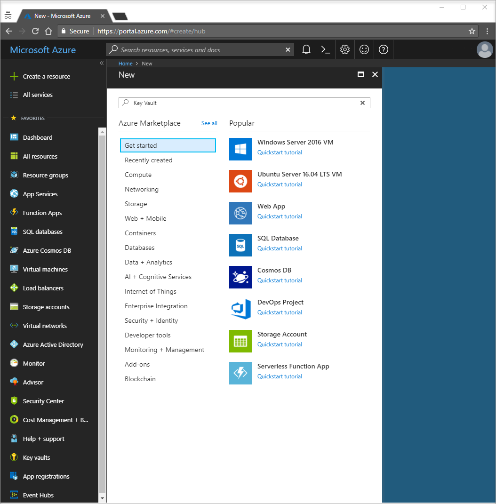
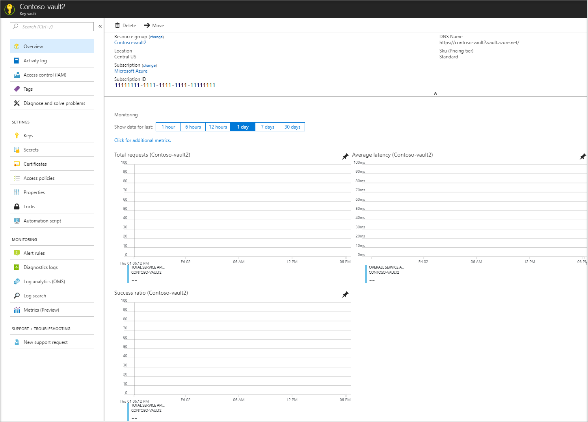
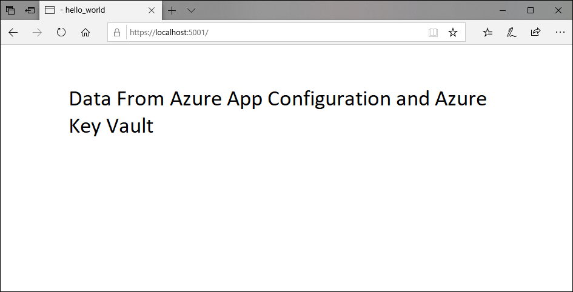

# Tutorial: Use Key Vault references in an ASP.NET Core app

In this tutorial, you learn how to use the Azure App Configuration service together with Azure Key Vault. App Configuration and Key Vault are complementary services used side by side in most application deployments.

App Configuration helps you use the services together by creating keys that reference values stored in Key Vault. When App Configuration creates such keys, it stores the URIs of Key Vault values rather than the values themselves.

Your application uses the App Configuration client provider to retrieve Key Vault references, just as it does for any other keys stored in App Configuration. In this case, the values stored in App Configuration are URIs that reference the values in the Key Vault. They are not Key Vault values or credentials. Because the client provider recognizes the keys as Key Vault references, it uses Key Vault to retrieve their values.

Your application is responsible for authenticating properly to both App Configuration and Key Vault. The two services don't communicate directly.

This tutorial shows you how to implement Key Vault references in your code. It builds on the web app introduced in the quickstarts. Before you continue, finish [Create an ASP.NET Core app with App Configuration](./quickstart-aspnet-core-app.md) first.

You can use any code editor to do the steps in this tutorial. For example, [Visual Studio Code](https://code.visualstudio.com/) is a cross-platform code editor that's available for the Windows, macOS, and Linux operating systems.

In this tutorial, you learn how to:

> [!div class="checklist"]
> * Create an App Configuration key that references a value stored in Key Vault.
> * Access the value of this key from an ASP.NET Core web application.

## Prerequisites

Before you start this tutorial, install the [.NET Core SDK](https://dotnet.microsoft.com/download).

[!INCLUDE [quickstarts-free-trial-note](../../includes/quickstarts-free-trial-note.md)]

## Create a vault

1. Select the **Create a resource** option in the upper-left corner of the Azure portal:

    
1. In the search box, enter **Key Vault**.
1. From the results list, select **Key vaults** on the left.
1. In **Key vaults**, select **Add**.
1. On the right in **Create key vault**, provide the following information:
    - Select **Subscription** to choose a subscription.
    - In **Resource Group**, select **Create new** and enter a resource group name.
    - In **Key vault name**, a unique name is required. For this tutorial, enter **Contoso-vault2**.
    - In the **Region** drop-down list, choose a location.
1. Leave the other **Create key vault** options with their default values.
1. Select **Create**.

At this point, your Azure account is the only one authorized to access this new vault.



## Add a secret to Key Vault

To add a secret to the vault, you need to take just a few additional steps. In this case, add a message that you can use to test Key Vault retrieval. The message is called **Message**, and you store the value "Hello from Key Vault" in it.

1. From the Key Vault properties pages, select **Secrets**.
1. Select **Generate/Import**.
1. In the **Create a secret** pane, enter the following values:
    - **Upload options**: Enter **Manual**.
    - **Name**: Enter **Message**.
    - **Value**: Enter **Hello from Key Vault**.
1. Leave the other **Create a secret** properties with their default values.
1. Select **Create**.

## Add a Key Vault reference to App Configuration

1. Sign in to the [Azure portal](https://portal.azure.com). Select **All resources**, and then select the App Configuration store instance that you created in the quickstart.

1. Select **Configuration Explorer**.

1. Select **+ Create** > **Key vault reference**, and then specify the following values:
    - **Key**: Select **TestApp:Settings:KeyVaultMessage**.
    - **Label**: Leave this value blank.
    - **Subscription**, **Resource group**, and **Key vault**: Enter the values corresponding to those in the key vault you created in the previous section.
    - **Secret**: Select the secret named **Message** that you created in the previous section.

## Connect to Key Vault

1. In this tutorial, you use a service principal for authentication to Key Vault. To create this service principal, use the Azure CLI [az ad sp create-for-rbac](/cli/azure/ad/sp?view=azure-cli-latest#az-ad-sp-create-for-rbac) command:

    ```azurecli
    az ad sp create-for-rbac -n "http://mySP" --sdk-auth
    ```

    This operation returns a series of key/value pairs:

    ```console
    {
    "clientId": "7da18cae-779c-41fc-992e-0527854c6583",
    "clientSecret": "b421b443-1669-4cd7-b5b1-394d5c945002",
    "subscriptionId": "443e30da-feca-47c4-b68f-1636b75e16b3",
    "tenantId": "35ad10f1-7799-4766-9acf-f2d946161b77",
    "activeDirectoryEndpointUrl": "https://login.microsoftonline.com",
    "resourceManagerEndpointUrl": "https://management.azure.com/",
    "activeDirectoryGraphResourceId": "https://graph.windows.net/",
    "sqlManagementEndpointUrl": "https://management.core.windows.net:8443/",
    "galleryEndpointUrl": "https://gallery.azure.com/",
    "managementEndpointUrl": "https://management.core.windows.net/"
    }
    ```

1. Run the following command to let the service principal access your key vault:

    ```
    az keyvault set-policy -n <your-unique-keyvault-name> --spn <clientId-of-your-service-principal> --secret-permissions delete get list set --key-permissions create decrypt delete encrypt get list unwrapKey wrapKey
    ```

1. Add secrets for *clientId* and *clientSecret* to Secrets Manager, the tool for storing sensitive data that you added to the *.csproj* file in [Quickstart: Create an ASP.NET Core app with Azure App Configuration](./quickstart-aspnet-core-app.md). These commands must be executed in the same directory as the *.csproj* file.

    ```
    dotnet user-secrets set ConnectionStrings:KeyVaultClientId <clientId-of-your-service-principal>
    dotnet user-secrets set ConnectionStrings:KeyVaultClientSecret <clientSecret-of-your-service-principal>
    ```

> [!NOTE]
> These Key Vault credentials are used only within your application. Your application authenticates directly to Key Vault with these credentials. They are never passed to the App Configuration service.

## Update your code to use a Key Vault reference

1. Open *Program.cs*, and add references to the following required packages:

    ```csharp
    using Microsoft.Azure.KeyVault;
    using Microsoft.IdentityModel.Clients.ActiveDirectory;
    ```

1. Update the `CreateWebHostBuilder` method to use App Configuration by calling the `config.AddAzureAppConfiguration` method. Include the `UseAzureKeyVault` option to pass in a new `KeyVaultClient` reference to your Key Vault.

    ```csharp
    public static IWebHostBuilder CreateWebHostBuilder(string[] args) =>
        WebHost.CreateDefaultBuilder(args)
            .ConfigureAppConfiguration((hostingContext, config) =>
            {
                var settings = config.Build();

                KeyVaultClient kvClient = new KeyVaultClient(async (authority, resource, scope) =>
                {
                    var adCredential = new ClientCredential(settings["ConnectionStrings:KeyVaultClientId"], settings["ConnectionStrings:KeyVaultClientSecret"]);
                    var authenticationContext = new AuthenticationContext(authority, null);
                    return (await authenticationContext.AcquireTokenAsync(resource, adCredential)).AccessToken;
                });

                config.AddAzureAppConfiguration(options => {
                    options.Connect(settings["ConnectionStrings:AppConfig"])
                            .UseAzureKeyVault(kvClient); });
            })
            .UseStartup<Startup>();
    ```

1. When you initialized the connection to App Configuration, you passed the `KeyVaultClient` reference to the `UseAzureKeyVault` method. After the initialization, you can access the values of Key Vault references in the same way you access the values of regular App Configuration keys.

    To see this process in action, open *Index.cshtml* in the **Views** > **Home** folder. Replace its contents with the following code:

    ```html
    @using Microsoft.Extensions.Configuration
    @inject IConfiguration Configuration

    <style>
        body {
            background-color: @Configuration["TestApp:Settings:BackgroundColor"]
        }
        h1 {
            color: @Configuration["TestApp:Settings:FontColor"];
            font-size: @Configuration["TestApp:Settings:FontSize"];
        }
    </style>

    <h1>@Configuration["TestApp:Settings:Message"]
        and @Configuration["TestApp:Settings:KeyVaultMessage"]</h1>
    ```

    You access the value of the Key Vault reference **TestApp:Settings:KeyVaultMessage** in the same way as for the configuration value of **TestApp:Settings:Message**.

## Build and run the app locally

1. To build the app by using the .NET Core CLI, run the following command in the command shell:

    ```
    dotnet build
    ```

1. After the build is complete, use the following command to run the web app locally:

    ```
    dotnet run
    ```

1. Open a browser window, and go to `http://localhost:5000`, which is the default URL for the web app hosted locally.

    

## Clean up resources

[!INCLUDE [azure-app-configuration-cleanup](../../includes/azure-app-configuration-cleanup.md)]

## Next steps

In this tutorial, you created an App Configuration key that references a value stored in Key Vault. To learn how to add an Azure-managed service identity that streamlines access to App Configuration and Key Vault, continue to the next tutorial.

> [!div class="nextstepaction"]
> [Managed identity integration](./howto-integrate-azure-managed-service-identity.md)
