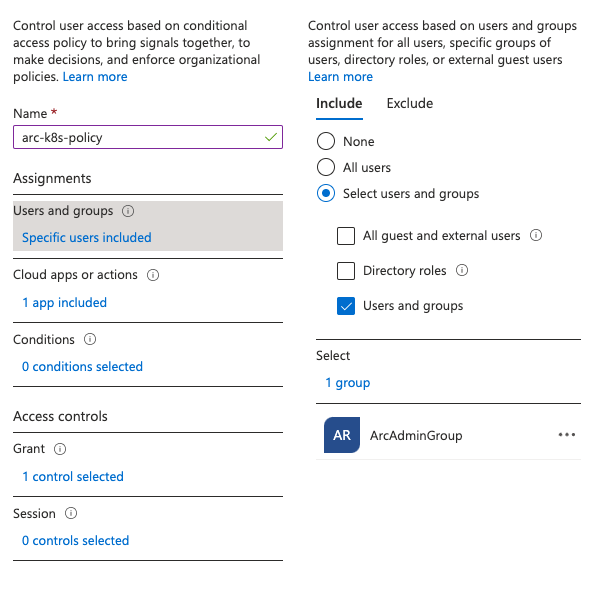
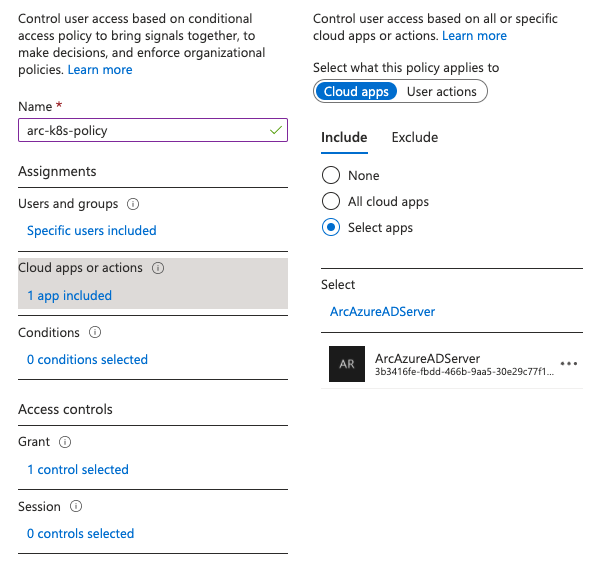
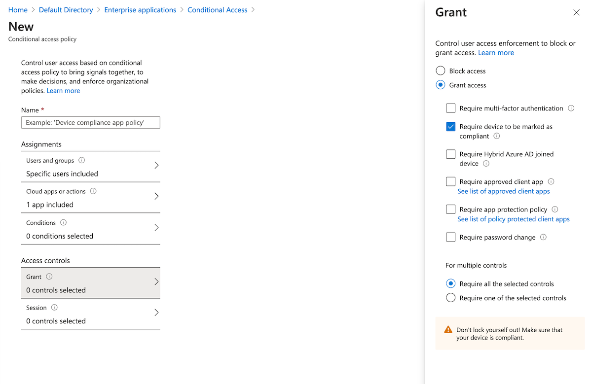
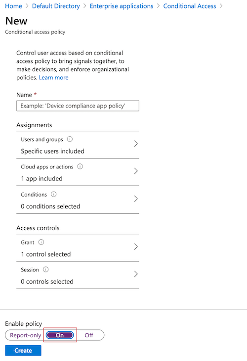

# Integrate Azure Active Directory with Azure Arc enabled Kubernetes clusters

Kubernetes [ClusterRoleBinding and RoleBinding](https://kubernetes.io/docs/reference/access-authn-authz/rbac/#rolebinding-and-clusterrolebinding) object types help to define authorization in Kubernetes natively. Using this feature, you can use Azure Active Directory and role assignments in Azure to control authorization checks on the cluster. This implies you can now use Azure role assignments to granularly control who can read, write, delete your Kubernetes objects such as Deployment, Pod and Service

A conceptual overview of this feature is available in [Azure RBAC - Azure Arc enabled Kubernetes](conceptual-azure-rbac.md) article.

[!INCLUDE [preview features note](./includes/preview/preview-callout.md)]

## Prerequisites

- [Install or upgrade Azure CLI](/cli/azure/install-azure-cli) to version >= 2.16.0

- Install the `connectedk8s` Azure CLI extension of version >= 1.1.0:

    ```azurecli
    az extension add --name connectedk8s
    ```
    
    If the `connectedk8s` extension is already installed, you can update it to the latest version using the following command: 

    ```azurecli
    az extension update --name connectedk8s
    ```

- An existing Azure Arc enabled Kubernetes connected cluster.
    - If you haven't connected a cluster yet, use our [quickstart](quickstart-connect-cluster.md).
    - [Upgrade your agents](agent-upgrade.md#manually-upgrade-agents) to version >= 1.1.0.

> [!NOTE]
> This feature can't be set up for managed Kubernetes offerings of cloud providers like Elastic Kubernetes Service or Google Kubernetes Engine where the user doesn't have access to `apiserver` of the cluster. For Azure Kubernetes Service (AKS) clusters, this [feature is available natively](../../aks/manage-azure-rbac.md) and doesn't require the AKS cluster to be connected to Azure Arc.

## Set up Azure AD applications

### Create server application

1. Create a new Azure AD application and get its `appId` value, which is used in later steps as `serverApplicationId`:

    ```azurecli
    az ad app create --display-name "<clusterName>Server" --identifier-uris "https://<clusterName>Server" --query appId -o tsv
    ```

1. Update the application group membership claims:

    ```azurecli
    az ad app update --id <serverApplicationId> --set groupMembershipClaims=All
    ```

1. Create a service principal and get its `password` field value, which is required later as `serverApplicationSecret` when enabling this feature on the cluster:

    ```azurecli
    az ad sp create --id <serverApplicationId>
    az ad sp credential reset --name <serverApplicationId> --credential-description "ArcSecret" --query password -o tsv
    ```

1. Grant the application API permissions:

    ```azurecli
    az ad app permission add --id <serverApplicationId> --api 00000003-0000-0000-c000-000000000000 --api-permissions e1fe6dd8-ba31-4d61-89e7-88639da4683d=Scope
    az ad app permission grant --id <serverApplicationId> --api 00000003-0000-0000-c000-000000000000
    ```

    > [!NOTE]
    > * This step has to be executed by an Azure tenant administrator.
    > * For usage of this feature in production, it is recommended to create a different server application for every cluster.

### Create client application

1. Create a new Azure AD application and get its 'appId' value, which is used in later steps as `clientApplicationId`:

    ```azurecli
    az ad app create --display-name "<clusterName>Client" --native-app --reply-urls "https://<clusterName>Client" --query appId -o tsv
    ```

2. Create a service principal for this client application:

    ```azurecli
    az ad sp create --id <clientApplicationId>
    ```

3. Get the `oAuthPermissionId` for the server application:

    ```azurecli
    az ad app show --id <serverApplicationId> --query "oauth2Permissions[0].id" -o tsv
    ```

4. Grant the required permissions for the client application:

    ```azurecli
    az ad app permission add --id <clientApplicationId> --api <serverApplicationId> --api-permissions <oAuthPermissionId>=Scope
    az ad app permission grant --id <clientApplicationId> --api <serverApplicationId>
    ```

## Create a role assignment for the server application

The server application needs the `Microsoft.Authorization/*/read` permissions to check if the user making the request is authorized on the Kubernetes objects that are a part of the request.

1. Create a file named accessCheck.json with the following contents:

    ```json
    {
      "Name": "Read authorization",
      "IsCustom": true,
      "Description": "Read authorization",
      "Actions": ["Microsoft.Authorization/*/read"],
      "NotActions": [],
      "DataActions": [],
      "NotDataActions": [],
      "AssignableScopes": [
        "/subscriptions/<subscription-id>"
      ]
    }
    ```

    Replace the `<subscription-id>` with the actual subscription ID.

2. Execute the following command to create the new custom role:

    ```azurecli
    az role definition create --role-definition ./accessCheck.json
    ```

3. From the output of above command, store the value of `id` field, which is used in later steps as `roleId`.

4. Create a role assignment on the server application as assignee using the role created above:

    ```azurecli
    az role assignment create --role <roleId> --assignee <serverApplicationId> --scope /subscriptions/<subscription-id>
    ```

## Enable Azure RBAC on cluster

1. Enable Azure RBAC on your Arc enabled Kubernetes cluster by running the following command:

    ```console
    az connectedk8s enable-features -n <clusterName> -g <resourceGroupName> --features azure-rbac --app-id <serverApplicationId> --app-secret <serverApplicationSecret>
    ```
    
    > [!NOTE]
    > 1. Before running the above command, ensure that the `kubeconfig` file on the machine is pointing to the cluster on which to enable the Azure RBAC feature.
    > 2. Use `--skip-azure-rbac-list` with the above command for a comma-separated list of usernames/email/oid undergoing authorization checks using Kubernetes native ClusterRoleBinding and RoleBinding objects instead of Azure RBAC.

### For a generic cluster where there is no reconciler running on apiserver specification:

1. SSH into every master node of the cluster and execute the following steps:

    1. Open `apiserver` manifest in edit mode:
        
        ```console
        sudo vi /etc/kubernetes/manifests/kube-apiserver.yaml
        ```

    1. Add the following specification under `volumes`:
        
        ```yml
        - name: azure-rbac
          secret:
            secretName: azure-arc-guard-manifests
        ```

    1. Add the following specification under `volumeMounts`:

        ```yml
        - mountPath: /etc/guard
          name: azure-rbac
          readOnly: true
        ```

    1. Add the following `apiserver` arguments:

        ```yml
        - --authentication-token-webhook-config-file=/etc/guard/guard-authn-webhook.yaml
        - --authentication-token-webhook-cache-ttl=5m0s
        - --authorization-webhook-cache-authorized-ttl=5m0s
        - --authorization-webhook-config-file=/etc/guard/guard-authz-webhook.yaml
        - --authorization-webhook-version=v1
        - --authorization-mode=Node,Webhook,RBAC
        ```
    
        If the Kubernetes cluster is of version >= 1.19.0, then the following `apiserver argument` needs to be set as well:

        ```yml
        - --authentication-token-webhook-version=v1
        ```

    1. Save and exit the editor to update the `apiserver` pod.


### For a cluster created using Cluster API

1. Copy the guard secret containing authentication and authorization webhook config files `from the workload cluster` on to your machine:

    ```console
    kubectl get secret azure-arc-guard-manifests -n kube-system -o yaml > azure-arc-guard-manifests.yaml
    ```

1. Change the `namespace` field in the `azure-arc-guard-manifests.yaml` file to the namespace within the management cluster where you are applying the custom resources for creation of workload clusters.

1. Apply this manifest:

    ```console
    kubectl apply -f azure-arc-guard-manifests.yaml
    ```

1. Edit the `KubeadmControlPlane` object by executing `kubectl edit kcp <clustername>-control-plane`:
    
    1. Add the following snippet under `files:`:
    
        ```console
        - contentFrom:
            secret:
              key: guard-authn-webhook.yaml
              name: azure-arc-guard-manifests
          owner: root:root
          path: /etc/kubernetes/guard-authn-webhook.yaml
          permissions: "0644"
        - contentFrom:
            secret:
              key: guard-authz-webhook.yaml
              name: azure-arc-guard-manifests
          owner: root:root
          path: /etc/kubernetes/guard-authz-webhook.yaml
          permissions: "0644"
        ```

    1. Add the following snippet under `apiServer:` -> `extraVolumes:`:
    
        ```console
        - hostPath: /etc/kubernetes/guard-authn-webhook.yaml
            mountPath: /etc/guard/guard-authn-webhook.yaml
            name: guard-authn
            readOnly: true
        - hostPath: /etc/kubernetes/guard-authz-webhook.yaml
            mountPath: /etc/guard/guard-authz-webhook.yaml
            name: guard-authz
            readOnly: true
        ```

    1. Add the following snippet under `apiServer:` -> `extraArgs:`:
    
        ```console
        authentication-token-webhook-cache-ttl: 5m0s
        authentication-token-webhook-config-file: /etc/guard/guard-authn-webhook.yaml
        authentication-token-webhook-version: v1
        authorization-mode: Node,Webhook,RBAC
        authorization-webhook-cache-authorized-ttl: 5m0s
        authorization-webhook-config-file: /etc/guard/guard-authz-webhook.yaml
        authorization-webhook-version: v1
        ```

    1. Save and exit to update the `KubeadmControlPlane` object. Wait for the these changes to be realized on the workload cluster.


## Create role assignments for users to access the cluster

Owners of the Azure Arc enabled Kubernetes resource can either use built-in roles or custom roles to grant other users access to the Kubernetes cluster.

### Built-in roles

| Role | Description |
|---|---|
| [Azure Arc Kubernetes Viewer](../../role-based-access-control/built-in-roles.md#azure-arc-kubernetes-viewer) | Allows read-only access to see most objects in a namespace. This role doesn't allow viewing secrets. This is because `read` permission on secrets would enable access to `ServiceAccount` credentials in the namespace, which would in turn allow API access using that `ServiceAccount` (a form of privilege escalation). |
| [Azure Arc Kubernetes Writer](../../role-based-access-control/built-in-roles.md#azure-arc-kubernetes-writer) | Allows read/write access to most objects in a namespace. This role doesn't allow viewing or modifying roles or role bindings. However, this role allows accessing secrets and running pods as any `ServiceAccount` in the namespace, so it can be used to gain the API access levels of any `ServiceAccount` in the namespace. |
| [Azure Arc Kubernetes Admin](../../role-based-access-control/built-in-roles.md#azure-arc-kubernetes-admin) | Allows admin access. Intended to be granted within a namespace using a RoleBinding. If used in a RoleBinding, allows read/write access to most resources in a namespace, including the ability to create roles and role bindings within the namespace. This role doesn't allow write access to resource quota or to the namespace itself. |
| [Azure Arc Kubernetes Cluster Admin](../../role-based-access-control/built-in-roles.md#azure-arc-kubernetes-cluster-admin) | Allows super-user access to execute any action on any resource. When used in a ClusterRoleBinding, it gives full control over every resource in the cluster and in all namespaces. When used in a RoleBinding, it gives full control over every resource in the role binding's namespace, including the namespace itself.|

You can create role assignments scoped to the Arc enabled Kubernetes cluster on the `Access Control (IAM)` blade of the cluster resource on Azure portal. You can also use Azure CLI commands, as shown below:

```azurecli
az role assignment create --role "Azure Arc Kubernetes Cluster Admin" --assignee <AZURE-AD-ENTITY-ID> --scope $ARM_ID
```

where `AZURE-AD-ENTITY-ID` could be a username (for example, testuser@mytenant.onmicrosoft.com) or even the `appId` of a service principal.

Here's another example of creating a role assignment scoped to a specific namespace within the cluster -

```azurecli
az role assignment create --role "Azure Arc Kubernetes Viewer" --assignee <AZURE-AD-ENTITY-ID> --scope $ARM_ID/namespaces/<namespace-name>
```

> [!NOTE]
> While role assignments scoped to the cluster can be created using either the Azure portal or CLI, role assignments scoped to namespaces can only be created using the CLI.

### Custom roles

You may choose to create your own role definition for usage in role assignments.

Walk through the below example of a role definition that allows a user to only read deployments. For more information, see [the full list of data actions you can use to construct a role definition](../../role-based-access-control/resource-provider-operations.md#microsoftkubernetes).

Copy the below JSON object into a file called custom-role.json. Replace the `<subscription-id>` placeholder with the actual subscription ID. The below custom role uses one of the data actions and lets you view all deployments in the scope (cluster/namespace) where the role assignment is created.

```json
{
    "Name": "Arc Deployment Viewer",
    "Description": "Lets you view all deployments in cluster/namespace.",
    "Actions": [],
    "NotActions": [],
    "DataActions": [
        "Microsoft.Kubernetes/connectedClusters/apps/deployments/read"
    ],
    "NotDataActions": [],
    "assignableScopes": [
        "/subscriptions/<subscription-id>"
    ]
}
```

1. Create the role definition by running the below command from the folder where you saved `custom-role.json`:

    ```bash
    az role definition create --role-definition @custom-role.json
    ```

1. Create a role assignment using this custom role definition:

    ```bash
    az role assignment create --role "Arc Deployment Viewer" --assignee <AZURE-AD-ENTITY-ID> --scope $ARM_ID/namespaces/<namespace-name>
    ```

## Configure kubectl with user credentials

There are two ways to obtain `kubeconfig` file needed to access the cluster:
1. Use [Cluster Connect](cluster-connect.md) feature (`az connectedk8s proxy`) of the Azure Arc enabled Kubernetes cluster.
1. Cluster admin shares `kubeconfig` file with every other user.

### If you are accessing cluster using Cluster Connect feature

Execute the following command to start the proxy process:

```console
az connectedk8s proxy -n <clusterName> -g <resourceGroupName>
```

After the proxy process is running, you can open another tab in your console to [start sending your requests to cluster](#sending-requests-to-cluster).

### If cluster admin shared the `kubeconfig` file with you 

1. Execute the following command to set credentials for user:

    ```console
    kubectl config set-credentials <testuser>@<mytenant.onmicrosoft.com> \
    --auth-provider=azure \
    --auth-provider-arg=environment=AzurePublicCloud \
    --auth-provider-arg=client-id=<clientApplicationId> \
    --auth-provider-arg=tenant-id=<tenantId> \
    --auth-provider-arg=apiserver-id=<serverApplicationId>
    ```

1. Open the `kubeconfig` file you created earlier. Under `contexts`, verify the context associated with cluster points to the user credentials created in previous step.

1. Add **config-mode** setting under user config:
  
    ```console
    name: testuser@mytenant.onmicrosoft.com
    user:
        auth-provider:
        config:
            apiserver-id: $SERVER_APP_ID
            client-id: $CLIENT_APP_ID
            environment: AzurePublicCloud
            tenant-id: $TENANT_ID
            config-mode: "1"
        name: azure
    ```

## Sending requests to cluster

1. Run any `kubectl` command. For example:
  * `kubectl get nodes` 
  * `kubectl get pods`

1. Once prompted for a browser-based authentication, copy the device login URL `https://microsoft.com/devicelogin` and open on your web browser.

1. Enter the code printed on your console, copy and paste the code on your terminal into the device authentication input prompt.

1. Enter the username (testuser@mytenant.onmicrosoft.com) and associated password.

1. If you see an error message like this, it means you are unauthorized to access the requested resource:

    ```console
    Error from server (Forbidden): nodes is forbidden: User "testuser@mytenant.onmicrosoft.com" cannot list resource "nodes" in API group "" at the cluster scope: User doesn't have access to the resource in Azure. Update role assignment to allow access.
    ```

    An administrator needs to create a new role assignment authorizing this user to have access on the resource.

## Use Conditional Access with Azure AD

When integrating Azure AD with your Arc enabled Kubernetes cluster, you can also use [Conditional Access](../../active-directory/conditional-access/overview.md) to control access to your cluster.

> [!NOTE]
> Azure AD Conditional Access is an Azure AD Premium capability.

To create an example Conditional Access policy to use with the cluster, complete the following steps:

1. At the top of the Azure portal, search for and select Azure Active Directory.
1. In the menu for Azure Active Directory on the left-hand side, select *Enterprise applications*.
1. In the menu for Enterprise applications on the left-hand side, select *Conditional Access*.
1. In the menu for Conditional Access on the left-hand side, select *Policies* then *New policy*.
1. In the menu for Conditional Access on the left-hand side, select *Policies* then *New policy*.
    
    [  ](./media/azure-rbac/conditional-access-new-policy.png#lightbox)

1. Enter a name for the policy such as *arc-k8s-policy*.
1. Select *Users and groups*, then under *Include* select *Select users and groups*. Choose the users and groups where you want to apply the policy. For this example, choose the same Azure AD group that has administration access to your cluster.

    [  ](./media/azure-rbac/conditional-access-users-groups.png#lightbox)

1. Select *Cloud apps or actions*, then under *Include* select *Select apps*. Search and select the server application you created earlier.

    [  ](./media/azure-rbac/conditional-access-apps.png#lightbox)

1. Under *Access controls*, select *Grant*. Select *Grant access* then *Require device to be marked as compliant*.

    [  ](./media/azure-rbac/conditional-access-grant-compliant.png#lightbox)
    
1. Under *Enable policy*, select *On* then *Create*.

    [  ](./media/azure-rbac/conditional-access-enable-policies.png#lightbox)

Access the cluster again. For example by running `kubectl get nodes` command to view nodes in the cluster:

```console
kubectl get nodes
```

Follow the instructions to sign in again. Notice there is an error message stating you are successfully logged in, but your admin requires the device requesting access to be managed by your Azure AD to access the resource.

In the Azure portal, navigate to Azure Active Directory, select *Enterprise applications* then under *Activity* select *Sign-ins*. Notice an entry at the top with a *Status* of *Failed* and a *Conditional Access* of *Success*. Select the entry then select *Conditional Access* in *Details*. Notice your Conditional Access policy is listed.

[  ](./media/azure-rbac/conditional-access-sign-in-activity.png#lightbox)

## Configure just-in-time cluster access with Azure AD

Another option for cluster access control is to use Privileged Identity Management (PIM) for just-in-time requests.

>[!NOTE]
> PIM is an Azure AD Premium capability requiring a Premium P2 SKU. For more on Azure AD SKUs, see the [pricing guide](https://azure.microsoft.com/pricing/details/active-directory/).

To configure just-in-time access requests for your cluster, complete the following steps:

1. At the top of the Azure portal, search for and select Azure Active Directory.
1. Take note of the Tenant ID, referred to for the rest of these instructions as `<tenant-id>

    [  ](./media/azure-rbac/jit-get-tenant-id.png#lightbox)

1. In the menu for Azure Active Directory on the left-hand side, under *Manage* select *Groups* then *New Group*.

    [  ](./media/azure-rbac/jit-create-new-group.png#lightbox)

1. Make sure a Group Type of *Security* is selected and enter a group name, such as *myJITGroup*. Under *Azure AD Roles can be assigned to this group (Preview)*, select *Yes*. Finally, select *Create*.

    [  ](./media/azure-rbac/jit-new-group-created.png#lightbox)

1. You will be brought back to the *Groups* page. Select your newly created group and take note of the Object ID, referred to for the rest of these instructions as `<object-id>`.

    [  ](./media/azure-rbac/jit-get-object-id.png#lightbox)

1. Back in the Azure portal, in the menu for *Activity* on the left-hand side, select *Privileged Access (Preview)* and select *Enable Privileged Access*.

    [  ](./media/azure-rbac/jit-enabling-priv-access.png#lightbox)

1. Select *Add Assignments* to begin granting access.

    [  ](./media/azure-rbac/jit-add-active-assignment.png#lightbox)

1. Select a role of *member*, and select the users and groups to whom you wish to grant cluster access. These assignments can be modified at any time by a group admin. When you're ready to move on, select *Next*.

    [  ](./media/azure-rbac/jit-adding-assignment.png#lightbox)

1. Choose an assignment type of *Active*, the desired duration, and provide a justification. When you're ready to proceed, select *Assign*. For more on assignment types, see [Assign eligibility for a privileged access group (preview) in Privileged Identity Management](../../active-directory/privileged-identity-management/groups-assign-member-owner.md#assign-an-owner-or-member-of-a-group).

    [  ](./media/azure-rbac/jit-set-active-assignment.png#lightbox)

Once the assignments have been made, verify just-in-time access is working by accessing the cluster. For example:

Use the `kubectl get nodes` command to view nodes in the cluster:

```console
kubectl get nodes
```

Note the authentication requirement and follow the steps to authenticate. If successful, you should see output similar to the following:

```output
To sign in, use a web browser to open the page https://microsoft.com/devicelogin and enter the code AAAAAAAAA to authenticate.

NAME      STATUS   ROLES    AGE      VERSION
node-1    Ready    agent    6m36s    v1.18.14
node-2    Ready    agent    6m42s    v1.18.14
node-3    Ready    agent    6m33s    v1.18.14
```

## Next steps

> [!div class="nextstepaction"]
> Securely connect to the cluster using [Cluster Connect](cluster-connect.md)