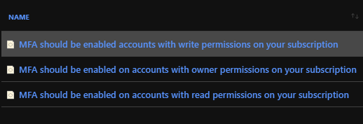
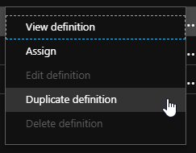
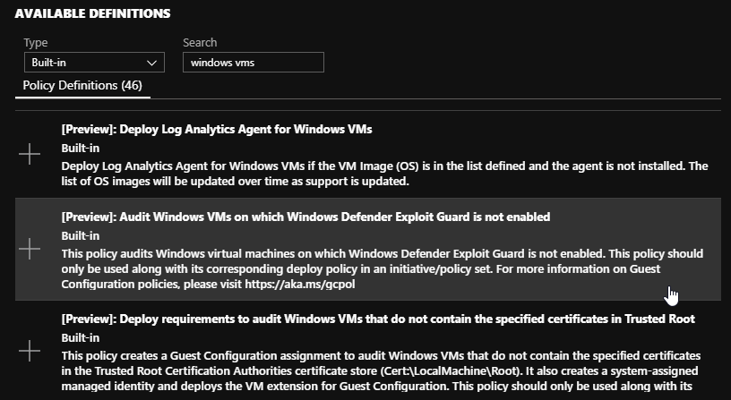
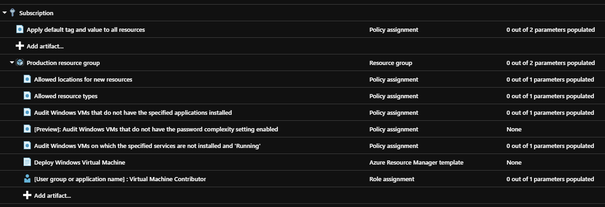

# Security compliance with Azure Policy and Azure Blueprints

The challenge of enforcing governance within your IT environment, whether it be an on-premises, cloud native or a hybrid environment, exists for all organisations. A robust technical governance framework needs to be in place to ensure your Microsoft Azure environment conforms with design, regulatory, and security requirements.

For Australian Government agencies, they key controls to consider when assessing risk are in the [Australian Cyber Security Centre (ACSC) Information Security Manual](https://acsc.gov.au/infosec/ism/index.htm) (ISM). The majority of controls detailed within the ISM require the application of technical governance to be effectively managed and enforced. It is important you have the appropriate tools to evaluate and enforce configuration in your environments.

Microsoft Azure provides two complimentary services to assist with these challenges, Azure Policy and Azure Blueprints.

## Azure Policy

Azure Policy enables the application of the technical elements of an organisation's IT governance. Azure Policy contains a constantly growing library of built-in policies. Each Policy enforces rules and effects on the targeted Azure Resources.

Once a policy is assigned to resources, the overall compliance against that policy can be evaluated, and be remediated if necessary.

This library of built-in Azure Polices enable an organisation to quickly enforce the types of controls found in the ACSC ISM. Examples of controls include:

* Monitoring virtual machines for missing system updates
* Auditing accounts with elevated permissions for multi-factor authentication
* Identifying unencrypted SQL Databases
* Monitoring the use of custom Azure role-based access control (Azure RBAC)
* Restricting the Azure regions that resources can be created in

If governance or regulatory controls are not met by a built-in Azure Policy definition, a custom definition can be created and assigned. All Azure Policy definitions are defined in JSON and follow a standard [definition structure](https://docs.microsoft.com/azure/governance/policy/concepts/definition-structure). Existing Azure Policy definitions can also be duplicated and used to form the basis of a custom Policy definition.

Assigning individual Azure Policies to resources, especially in complex environments or in environments with strict regulatory requirements, can create large overhead for your administrators. To assist with these challenges, a set of Azure Policies can be grouped together to form an Azure Policy Initiative. Policy Initiatives are used to combine related Azure policies that, when applied together as a group, form the basis of a specific security or compliance objective. Microsoft is adding built-in Azure Policy Initiative definitions, including definitions designed to meet specific regulatory requirements:

All Azure Policies and Initiatives are assigned to an assignment scope. This scope is defined at either the Azure Subscription, Azure Management Group, or Azure Resource Group levels. Once the required Azure Policies or Policy Initiatives have been assigned, an organisation will be able to enforce the configuration requirements on all newly created Azure resources.

Assigning a new Azure Policy or Initiative will not affect existing Azure resources. Azure Policy can; however, enable an organisation to view the compliance of existing Azure resources. Any resources that have been identified as being non-compliant can be remediated at the organisation's discretion

### Azure Policy and initiatives in action

The available built-in Azure Policy and Initiative definitions can be found under the Definition node in the Policy section of the Azure portal:

Using the library of built-in definitions, you can quickly search for Policies that meet an organisational requirement, review the policy definition, and assign the Policy to the appropriate resources. For example, the ISM requires multi-factor authentication (MFA) for all privileged users, and for all users with access to important data repositories. In Azure Policy you can search for "MFA" amongst the Azure Policy definitions:

Once a suitable policy is identified, you assign the policy to the desired scope. If there is no built-in policy that meets your requirements, you can duplicate the existing policy and make the desired changes:

Microsoft also provides a collection of Azure Policy samples on [GitHub](https://github.com/Azure/azure-policy) as a 'quickstart' for you to build custom Azure Policies. These Policy samples can be copied directly into the Azure Policy editor within the Azure portal.

When creating Azure Policy Initiatives, you can sort the list of available policy definitions, both built-in and custom, adding the required definitions.

For instance, you could search through the list of available Azure Policy definitions for all of the policies related to Windows virtual machines. Then you those definitions to an Initiative designed to enforce recommended virtual machine hardening practices:

While assigning an Azure Policy or Policy Initiative to an assignment scope, it is possible for you to exclude Azure resources from the effects of the Policies by excluding either Azure Management Groups or Azure Resource Groups.

### Real-time enforcement and compliance assessment

Azure Policy compliance scans of in-scope Azure resources are undertaken when the following conditions are met:

* When an Azure Policy or Azure Policy Initiative is assigned
* When the scope of an existing Azure Policy or Initiative is changed
* On demand via the API up to a maximum of 10 scans per hour
* Once every 24 hours - the default behaviour

A policy compliance scan for a single Azure resource is undertaken 15 minutes after a change has been made to the resource.

An overview of the Azure Policy compliance of resources can be reviewed within the Azure portal via the Policy Compliance dashboard:

The overall resource compliance percentage figure is an aggregate of the compliance of all in-scope deployed resources against all of your assigned Azure Policies. This allows you to identify the resources within an environment that are non-compliant and devise the plan to best remediate these resources.

The Policy Compliance dashboard also includes the change history for each resource. If a resource is identified as no longer being compliant with assigned policy, and automatic remediation is not enabled, you can view who made the change, what was changed, and when the changes were made to that resource.

## Azure Blueprints

Azure Blueprints extend the capability of Azure Policy by combining them with:

* Azure RBAC
* Azure Resource Groups
* [Azure Resource Manager Templates](https://docs.microsoft.com/azure/azure-resource-manager/resource-group-authoring-templates)

Blueprints allow for the creation of environment designs that deploy Azure resources from Resource Manager templates, configure RBAC, and enforce and audit configuration by assigning Azure Policy. Blueprints form an editable and redeployable environment template. Once the Blueprint has been created, it can then be assigned to an Azure Subscription. Once assigned, all of the Azure resources defined within the Blueprint will be created and the Azure Policies applied. The deployment and configuration of resources defined in an Azure Blueprint can be monitored from the Azure Blueprint console in the Azure portal.

Azure Blueprints that have been edited must be republished in the Azure portal. Each time a Blueprint is republished, the version number of the Blueprint is incremented. The version number allows you to determine which specific version of a Blueprint has been deployed to an organisation's Azure Subscriptions. If desired, the currently assigned version of the Blueprint can be updated to the latest version.

Resources deployed using an Azure Blueprint can be configured with [Azure Resource Locks](https://docs.microsoft.com/azure/azure-resource-manager/resource-group-lock-resources) at the time of deployment. Resource locks prevent resources from being accidentally modified or deleted.

Microsoft is developing Azure Blueprint templates for a range of industries and regulatory requirements. The current library of available Azure Blueprint definitions can be viewed in the Azure portal or the [Azure Security and Compliance Blueprint](https://servicetrust.microsoft.com/ViewPage/BlueprintOverview/) page in the Service Trust Portal.

### Azure Blueprint artifacts

To create an Azure Blueprint, you can start with a blank Blueprint template, or use one of the existing sample Blueprints as a starting point. You can add artifacts to the Blueprint that will be configured as part of deployment:

These artifacts could include the Azure Resource Group and Resources and associated Azure Policy and Policy Initiatives to enforce the configuration required for your environment to be compliant you're your regulatory requirements, for example, the ISM controls for system hardening.

Each of these artifacts can also be configured with parameters. These values are provided when the Blueprint has been assigned to an Azure subscription and deployed. Parameters allow for a single Blueprint to be created and used to deploy resources into different environments without having to edit the underlying Blueprint.

Microsoft is developing Azure PowerShell and CLI cmdlets to create and manage Azure Blueprints with the intention that a Blueprint could be maintained and deployed by an organisation via a CI/CD pipeline.

## Next steps

This article explained how governance and security can be enforced with Azure Policy and Azure Blueprints. Now that you've been exposed at a high level, learn how to use each service in more detail:

* [Azure Policy Overview](https://docs.microsoft.com/azure/governance/policy/overview)
* [Azure Blueprints Overview](https://azure.microsoft.com/services/blueprints/)
* [Azure Policy Samples](https://docs.microsoft.com/azure/governance/policy/samples/index)
* [Azure Policy Samples Repository](https://github.com/Azure/azure-policy)
* [Azure Policy Definition Structure](https://docs.microsoft.com/azure/governance/policy/concepts/definition-structure)
* [Azure Policy Effects](https://docs.microsoft.com/azure/governance/policy/concepts/effects)
