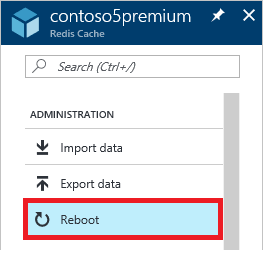
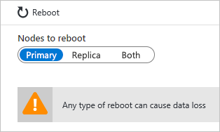
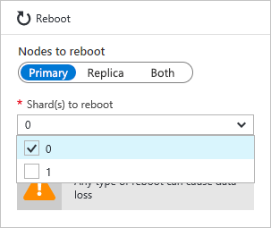
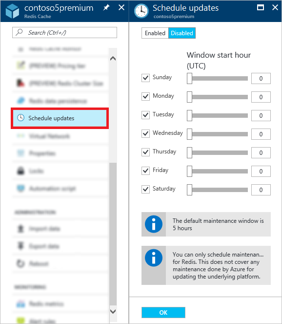

# How to administer Azure Cache for Redis
This topic describes how to perform administration tasks such as [rebooting](#reboot) and [scheduling updates](#schedule-updates) for your Azure Cache for Redis instances.

[!INCLUDE [updated-for-az](../../includes/updated-for-az.md)]

## Reboot
The **Reboot** blade allows you to reboot one or more nodes of your cache. This reboot capability enables you to test your application for resiliency if there is a failure of a cache node.

Select the nodes to reboot and click **Reboot**.

If you have a premium cache with clustering enabled, you can select which shards of the cache to reboot.

To reboot one or more nodes of your cache, select the desired nodes and click **Reboot**. If you have a premium cache with clustering enabled, select the desired shards to reboot and then click **Reboot**. After a few minutes, the selected nodes reboot, and are back online a few minutes later.

The impact on client applications varies depending on which nodes that you reboot.

* **Master** - When the primary node is rebooted, Azure Cache for Redis fails over to the replica node and promotes it to primary. During this failover, there may be a short interval in which connections may fail to the cache.
* **Replica** - When the replica node is rebooted, there is typically no impact to cache clients.
* **Both primary and replica** - When both cache nodes are rebooted, all data is lost in the cache and connections to the cache fail until the primary node comes back online. If you have configured [data persistence](cache-how-to-premium-persistence.md), the most recent backup is restored when the cache comes back online, but any cache writes that occurred after the most recent backup are lost.
* **Nodes of a premium cache with clustering enabled** - When you reboot one or more nodes of a premium cache with clustering enabled, the behavior for the selected nodes is the same as when you reboot the corresponding node or nodes of a non-clustered cache.

## Reboot FAQ
* [Which node should I reboot to test my application?](#which-node-should-i-reboot-to-test-my-application)
* [Can I reboot the cache to clear client connections?](#can-i-reboot-the-cache-to-clear-client-connections)
* [Will I lose data from my cache if I do a reboot?](#will-i-lose-data-from-my-cache-if-i-do-a-reboot)
* [Can I reboot my cache using PowerShell, CLI, or other management tools?](#can-i-reboot-my-cache-using-powershell-cli-or-other-management-tools)

### Which node should I reboot to test my application?
To test the resiliency of your application against failure of the primary node of your cache, reboot the **Master** node. To test the resiliency of your application against failure of the replica node, reboot the **Replica** node. To test the resiliency of your application against total failure of the cache, reboot **Both** nodes.

### Can I reboot the cache to clear client connections?
Yes, if you reboot the cache all client connections are cleared. Rebooting can be useful in the case where all client connections are used up due to a logic error or a bug in the client application. Each pricing tier has different [client connection limits](cache-configure.md#default-redis-server-configuration) for the various sizes, and once these limits are reached, no more client connections are accepted. Rebooting the cache provides a way to clear all client connections.

> [!IMPORTANT]
> If you reboot your cache to clear client connections, StackExchange.Redis automatically reconnects once the Redis node is back online. If the underlying issue is not resolved, the client connections may continue to be used up.
> 
> 

### Will I lose data from my cache if I do a reboot?
If you reboot both the **Master** and **Replica** nodes, all data in the cache (or in that shard if you are using a premium cache with clustering enabled) may be lost, but this is not guaranteed either. If you have configured [data persistence](cache-how-to-premium-persistence.md), the most recent backup will be restored when the cache comes back online, but any cache writes that have occurred after the backup was made are lost.

If you reboot just one of the nodes, data is not typically lost, but it still may be. For example if the primary node is rebooted and a cache write is in progress, the data from the cache write is lost. Another scenario for data loss would be if you reboot one node and the other node happens to go down due to a failure at the same time. For more information about possible causes for data loss, see [What happened to my data in Redis?](https://gist.github.com/JonCole/b6354d92a2d51c141490f10142884ea4#file-whathappenedtomydatainredis-md)

### Can I reboot my cache using PowerShell, CLI, or other management tools?
Yes, for PowerShell instructions see [To reboot an Azure Cache for Redis](cache-how-to-manage-redis-cache-powershell.md#to-reboot-an-azure-cache-for-redis).

## Schedule updates
The **Schedule updates** blade allows you to designate a maintenance window for your cache instance. A maintenance window allows you to control the day(s) and time(s) of a week during which the VM(s) hosting your cache can be updated. Azure Cache for Redis will make a best effort to start and finish updating Redis server software within the specified time window you define.

> [!NOTE] 
> The maintenance window applies only to Redis server updates, and not to any Azure updates or updates to the operating system of the VMs that host the cache.
>

To specify a maintenance window, check the desired days and specify the maintenance window start hour for each day, and click **OK**. Note that the maintenance window time is in UTC. 

The default, and minimum, maintenance window for updates is five hours. This value is not configurable from the Azure portal, but you can configure it in PowerShell using the `MaintenanceWindow` parameter of the [New-AzRedisCacheScheduleEntry](/powershell/module/az.rediscache/new-azrediscachescheduleentry) cmdlet. For more information, see Can I manage scheduled updates using PowerShell, CLI, or other management tools?

## Schedule updates FAQ
* [When do updates occur if I don't use the schedule updates feature?](#when-do-updates-occur-if-i-dont-use-the-schedule-updates-feature)
* [What type of updates are made during the scheduled maintenance window?](#what-type-of-updates-are-made-during-the-scheduled-maintenance-window)
* [Can I manage scheduled updates using PowerShell, CLI, or other management tools?](#can-i-managed-scheduled-updates-using-powershell-cli-or-other-management-tools)

### When do updates occur if I don't use the schedule updates feature?
If you don't specify a maintenance window, updates can be made at any time.

### What type of updates are made during the scheduled maintenance window?
Only Redis server updates are made during the scheduled maintenance window. The maintenance window does not apply to Azure updates or updates to the VM operating system.

### Can I managed scheduled updates using PowerShell, CLI, or other management tools?
Yes, you can manage your scheduled updates using the following PowerShell cmdlets:

* [Get-AzRedisCachePatchSchedule](/powershell/module/az.rediscache/get-azrediscachepatchschedule)
* [New-AzRedisCachePatchSchedule](/powershell/module/az.rediscache/new-azrediscachepatchschedule)
* [New-AzRedisCacheScheduleEntry](/powershell/module/az.rediscache/new-azrediscachescheduleentry)
* [Remove-AzRedisCachePatchSchedule](/powershell/module/az.rediscache/remove-azrediscachepatchschedule)

## Next steps
* Explore more [Azure Cache for Redis premium tier](cache-premium-tier-intro.md) features.

