# Import and Export data in Azure Cache for Redis
Import/Export is an Azure Cache for Redis data management operation, which allows you to import data into Azure Cache for Redis or export data from Azure Cache for Redis by importing and exporting an Azure Cache for Redis Database (RDB) snapshot from a premium cache to a blob in an Azure Storage Account.

- **Export** - you can export your Azure Cache for Redis RDB snapshots to a Page Blob.
- **Import** - you can import your Azure Cache for Redis RDB snapshots from either a Page Blob or a Block Blob.

Import/Export enables you to migrate between different Azure Cache for Redis instances or populate the cache with data before use.

This article provides a guide for importing and exporting data with Azure Cache for Redis and provides the answers to commonly asked questions.

> [!IMPORTANT]
> Import/Export is only available for [Premium tier](cache-overview.md#service-tiers) caches.
>
>

## Import
Import can be used to bring Redis compatible RDB files from any Redis server running in any cloud or environment, including Redis running on Linux, Windows, or any cloud provider such as Amazon Web Services and others. Importing data is an easy way to create a cache with pre-populated data. During the import process, Azure Cache for Redis loads the RDB files from Azure storage into memory and then inserts the keys into the cache.

> [!NOTE]
> Before beginning the import operation, ensure that your Redis Database (RDB) file or files are uploaded into page or block blobs in Azure storage, in the same region and subscription as your Azure Cache for Redis instance. For more information, see [Get started with Azure Blob storage](../storage/blobs/storage-quickstart-blobs-dotnet.md). If you exported your RDB file using the [Azure Cache for Redis Export](#export) feature, your RDB file is already stored in a page blob and is ready for importing.
>
>

1. To import one or more exported cache blobs, [browse to your cache](cache-configure.md#configure-azure-cache-for-redis-settings) in the Azure portal and click **Import data** from the **Resource menu**.

    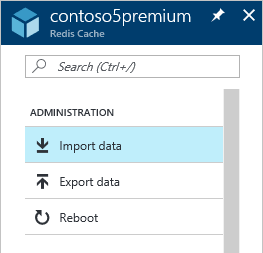
2. Click **Choose Blob(s)** and select the storage account that contains the data to import.

    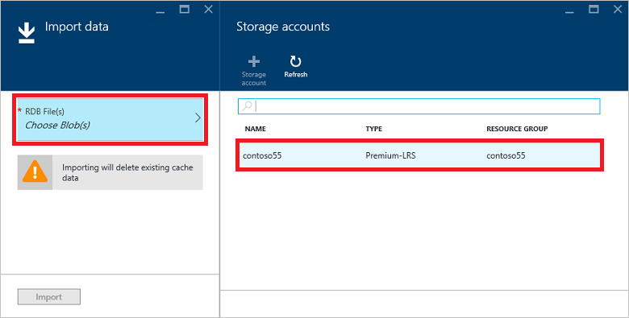
3. Click the container that contains the data to import.

    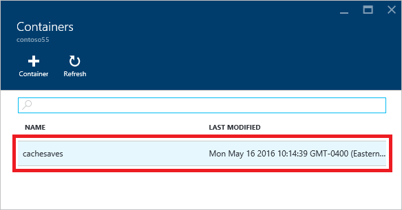
4. Select one or more blobs to import by clicking the area to the left of the blob name, and then click **Select**.

    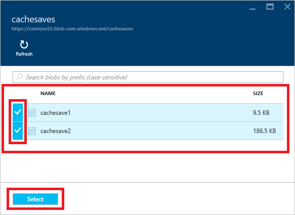
5. Click **Import** to begin the import process.

   > [!IMPORTANT]
   > The cache is not accessible by cache clients during the import process, and any existing data in the cache is deleted.
   >
   >

    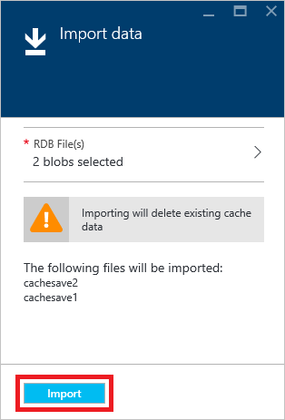

    You can monitor the progress of the import operation by following the notifications from the Azure portal, or by viewing the events in the [audit log](../azure-resource-manager/management/view-activity-logs.md).

    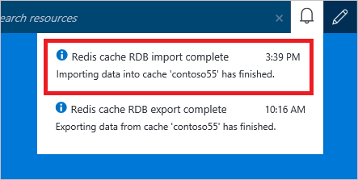

## Export
Export allows you to export the data stored in Azure Cache for Redis to Redis compatible RDB file(s). You can use this feature to move data from one Azure Cache for Redis instance to another or to another Redis server. During the export process, a temporary file is created on the VM that hosts the Azure Cache for Redis server instance, and the file is uploaded to the designated storage account. When the export operation completes with either a status of success or failure, the temporary file is deleted.

1. To export the current contents of the cache to storage, [browse to your cache](cache-configure.md#configure-azure-cache-for-redis-settings) in the Azure portal and click **Export data** from the **Resource menu**.

    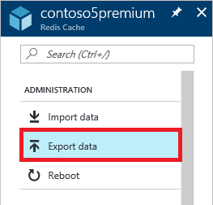
2. Click **Choose Storage Container** and select the desired storage account. The storage account must be in the same subscription and region as your cache.

   > [!IMPORTANT]
   > Export works with page blobs, which are supported by both classic and Resource Manager storage accounts, but are not supported by Blob storage accounts at this time. For more information, see [Azure storage account overview](../storage/common/storage-account-overview.md).
   >

    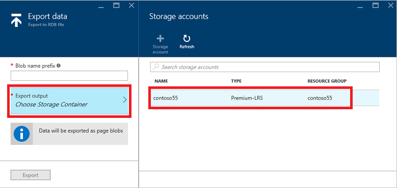
3. Choose the desired blob container and click **Select**. To use new a container, click **Add Container** to add it first and then select it from the list.

    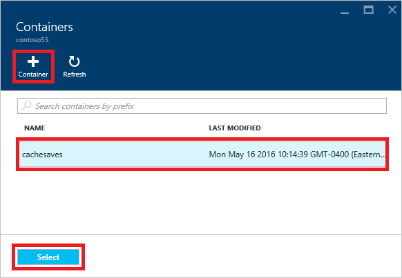
4. Type a **Blob name prefix** and click **Export** to start the export process. The blob name prefix is used to prefix the names of files generated by this export operation.

    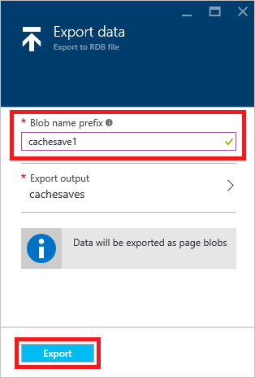

    You can monitor the progress of the export operation by following the notifications from the Azure portal, or by viewing the events in the [audit log](../azure-resource-manager/management/view-activity-logs.md).

    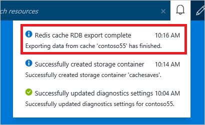

    Caches remain available for use during the export process.

## Import/Export FAQ
This section contains frequently asked questions about the Import/Export feature.

* [What pricing tiers can use Import/Export?](#what-pricing-tiers-can-use-importexport)
* [Can I import data from any Redis server?](#can-i-import-data-from-any-redis-server)
* [What RDB versions can I import?](#what-rdb-versions-can-i-import)
* [Is my cache available during an Import/Export operation?](#is-my-cache-available-during-an-importexport-operation)
* [Can I use Import/Export with Redis cluster?](#can-i-use-importexport-with-redis-cluster)
* [How does Import/Export work with a custom databases setting?](#how-does-importexport-work-with-a-custom-databases-setting)
* [How is Import/Export different from Redis persistence?](#how-is-importexport-different-from-redis-persistence)
* [Can I automate Import/Export using PowerShell, CLI, or other management clients?](#can-i-automate-importexport-using-powershell-cli-or-other-management-clients)
* [I received a timeout error during my Import/Export operation. What does it mean?](#i-received-a-timeout-error-during-my-importexport-operation-what-does-it-mean)
* [I got an error when exporting my data to Azure Blob Storage. What happened?](#i-got-an-error-when-exporting-my-data-to-azure-blob-storage-what-happened)

### What pricing tiers can use Import/Export?
Import/Export is available only in the premium pricing tier.

### Can I import data from any Redis server?
Yes, in addition to importing data exported from Azure Cache for Redis instances, you can import RDB files from any Redis server running in any cloud or environment, such as Linux, Windows, or cloud providers such as Amazon Web Services. To do this, upload the RDB file from the desired Redis server into a page or block blob in an Azure Storage Account, and then import it into your premium Azure Cache for Redis instance. For example, you may want to export the data from your production cache and import it into a cache used as part of a staging environment for testing or migration.

> [!IMPORTANT]
> To successfully import data exported from Redis servers other than Azure Cache for Redis when using a page blob, the page blob size must be aligned on a 512 byte boundary. For sample code to perform any required byte padding, see [Sample page blob upload](https://github.com/JimRoberts-MS/SamplePageBlobUpload).
>
>

### What RDB versions can I import?

Azure Cache for Redis supports RDB import up through RDB version 7.

### Is my cache available during an Import/Export operation?
* **Export** - Caches remain available and you can continue to use your cache during an export operation.
* **Import** - Caches become unavailable when an import operation starts, and become available for use when the import operation completes.

### Can I use Import/Export with Redis cluster?
Yes, and you can import/export between a clustered cache and a non-clustered cache. Since Redis cluster [only supports database 0](cache-how-to-premium-clustering.md#do-i-need-to-make-any-changes-to-my-client-application-to-use-clustering), any data in databases other than 0 isn't imported. When clustered cache data is imported, the keys are redistributed among the shards of the cluster.

### How does Import/Export work with a custom databases setting?
Some pricing tiers have different [databases limits](cache-configure.md#databases), so there are some considerations when importing if you configured a custom value for the `databases` setting during cache creation.

* When importing to a pricing tier with a lower `databases` limit than the tier from which you exported:
  * If you are using the default number of `databases`, which is 16 for all pricing tiers, no data is lost.
  * If you are using a custom number of `databases` that falls within the limits for the tier to which you are importing, no data is lost.
  * If your exported data contained data in a database that exceeds the limits of the new tier, the data from those higher databases is not imported.

### How is Import/Export different from Redis persistence?
Azure Cache for Redis persistence allows you to persist data stored in Redis to Azure Storage. When persistence is configured, Azure Cache for Redis persists a snapshot of the Azure Cache for Redis in a Redis binary format to disk based on a configurable backup frequency. If a catastrophic event occurs that disables both the primary and replica cache, the cache data is restored automatically using the most recent snapshot. For more information, see [How to configure data persistence for a Premium Azure Cache for Redis](cache-how-to-premium-persistence.md).

Import/ Export allows you to bring data into or export from Azure Cache for Redis. It does not configure backup and restore using Redis persistence.

### Can I automate Import/Export using PowerShell, CLI, or other management clients?
Yes, for PowerShell instructions see [To import an Azure Cache for Redis](cache-how-to-manage-redis-cache-powershell.md#to-import-an-azure-cache-for-redis) and [To export an Azure Cache for Redis](cache-how-to-manage-redis-cache-powershell.md#to-export-an-azure-cache-for-redis).

### I received a timeout error during my Import/Export operation. What does it mean?
If you remain on the **Import data** or **Export data** blade for longer than 15 minutes before initiating the operation, you receive an error with an error message similar to the following example:

```output
The request to import data into cache 'contoso55' failed with status 'error' and error 'One of the SAS URIs provided could not be used for the following reason: The SAS token end time (se) must be at least 1 hour from now and the start time (st), if given, must be at least 15 minutes in the past.
```

To resolve this, initiate the import or export operation before 15 minutes has elapsed.

### I got an error when exporting my data to Azure Blob Storage. What happened?
Export works only with RDB files stored as page blobs. Other blob types are not currently supported, including Blob storage accounts with hot and cool tiers. For more information, see [Azure storage account overview](../storage/common/storage-account-overview.md).

## Next steps
Learn more about Azure Cache for Redis features.

* [Azure Cache for Redis service tiers](cache-overview.md#service-tiers)