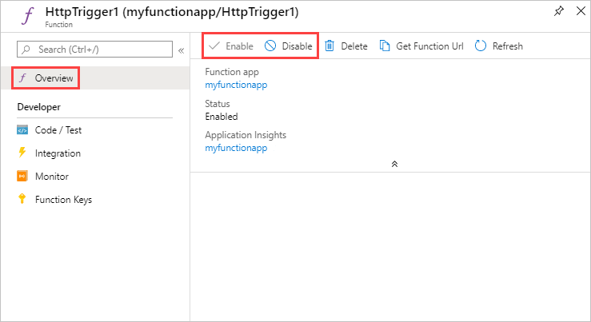

# How to disable functions in Azure Functions

This article explains how to disable a function in Azure Functions. To *disable* a function means to make the runtime ignore the automatic trigger that's defined for the function. This lets you prevent a specific function from running without stopping the entire function app.

The recommended way to disable a function is by using an app setting in the format `AzureWebJobs.<FUNCTION_NAME>.Disabled`. You can create and modify this application setting in a number of ways, including by using the [Azure CLI](/cli/azure/) and from your function's **Manage** tab in the [Azure portal](https://portal.azure.com). 

> [!NOTE]  
> When you disable an HTTP triggered function by using the methods described in this article, the endpoint may still by accessible when running on your local computer.  

## Use the Azure CLI

In the Azure CLI, you use the [`az functionapp config appsettings set`](/cli/azure/functionapp/config/appsettings#az-functionapp-config-appsettings-set) command to create and modify the app setting. The following command disables a function named `QueueTrigger` by creating an app setting named `AzureWebJobs.QueueTrigger.Disabled` set it to `true`. 

```azurecli-interactive
az functionapp config appsettings set --name <myFunctionApp> \
--resource-group <myResourceGroup> \
--settings AzureWebJobs.QueueTrigger.Disabled=true
```

To re-enable the function, rerun the same command with a value of `false`.

```azurecli-interactive
az functionapp config appsettings set --name <myFunctionApp> \
--resource-group <myResourceGroup> \
--settings AzureWebJobs.QueueTrigger.Disabled=false
```

## Use the Portal

You can also use the **Enable** and **Disable** buttons on the function's **Overview** page. These buttons work by creating and deleting the `AzureWebJobs.<FUNCTION_NAME>.Disabled` app setting.



> [!NOTE]  
> The portal-integrated testing functionality ignores the `Disabled` setting. This means that a disabled function still runs when started from the **Test** window in the portal. 

## Other methods

While the application setting method is recommended for all languages and all runtime versions, there are several other ways to disable functions. These methods, which vary by language and runtime version, are maintained for backward compatibility. 

### C# class libraries

In a class library function, you can also use the `Disable` attribute to prevent the function from being triggered. You can use the attribute without a constructor parameter, as shown in the following example:

```csharp
public static class QueueFunctions
{
    [Disable]
    [FunctionName("QueueTrigger")]
    public static void QueueTrigger(
        [QueueTrigger("myqueue-items")] string myQueueItem, 
        TraceWriter log)
    {
        log.Info($"C# function processed: {myQueueItem}");
    }
}
```

The attribute without a constructor parameter requires that you recompile and redeploy the project to change the function's disabled state. A more flexible way to use the attribute is to include a constructor parameter that refers to a Boolean app setting, as shown in the following example:

```csharp
public static class QueueFunctions
{
    [Disable("MY_TIMER_DISABLED")]
    [FunctionName("QueueTrigger")]
    public static void QueueTrigger(
        [QueueTrigger("myqueue-items")] string myQueueItem, 
        TraceWriter log)
    {
        log.Info($"C# function processed: {myQueueItem}");
    }
}
```

This method lets you enable and disable the function by changing the app setting, without recompiling or redeploying. Changing an app setting causes the function app to restart, so the disabled state change is recognized immediately.

> [!IMPORTANT]
> The `Disabled` attribute is the only way to disable a class library function. The generated *function.json* file for a class library function is not meant to be edited directly. If you edit that file, whatever you do to the `disabled` property will have no effect.
>
> The same goes for the **Function state** switch on the **Manage** tab, since it works by changing the *function.json* file.
>
> Also, note that the portal may indicate the function is disabled when it isn't.

### Functions 1.x - scripting languages

In version 1.x, you can also use the `disabled` property of the *function.json* file to tell the runtime not to trigger a function. This method only works for scripting languages such as C# script and JavaScript. The `disabled` property can be set to `true` or to the name of an app setting:

```json
{
    "bindings": [
        {
            "type": "queueTrigger",
            "direction": "in",
            "name": "myQueueItem",
            "queueName": "myqueue-items",
            "connection":"MyStorageConnectionAppSetting"
        }
    ],
    "disabled": true
}
```
or 

```json
    "bindings": [
        ...
    ],
    "disabled": "IS_DISABLED"
```

In the second example, the function is disabled when there is an app setting that is named IS_DISABLED and is set to `true` or 1.

>[!IMPORTANT]  
>The portal now uses application settings to disable v1.x functions. When an application setting conflicts with the function.json file, an error can occur. You should remove the `disabled` property from the function.json file to prevent errors. 


## Next steps

This article is about disabling automatic triggers. For more information about triggers, see [Triggers and bindings](functions-triggers-bindings.md).
