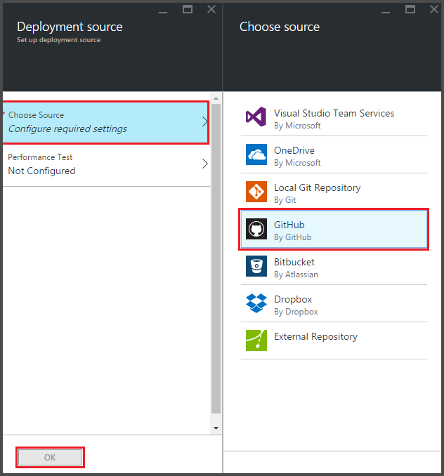
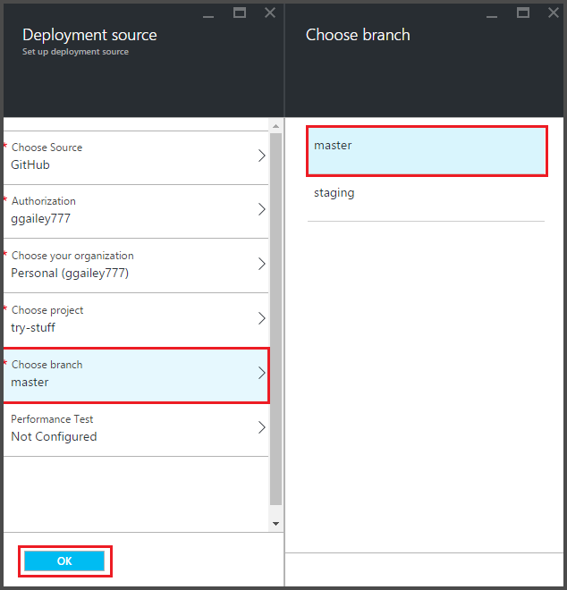
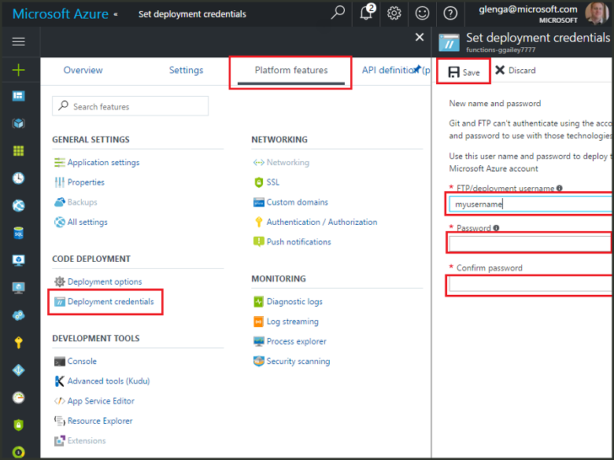
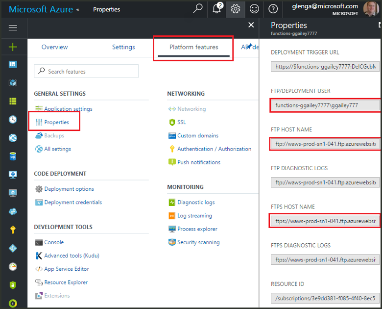
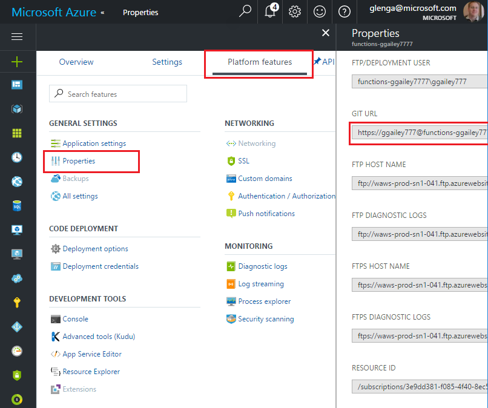

# Continuous deployment for Azure Functions
Azure Functions makes it easy to deploy your function app by using continuous integration. Functions integrates with major code repositories and deployment sources. This integration enables a workflow where function code updates made through one of these services trigger deployment to Azure. If you're new to Azure Functions, start with the [Azure Functions overview](functions-overview.md).

Continuous deployment is a great option for projects where you're integrating multiple and frequent contributions. It also lets you maintain source control on your function code. Azure Functions supports the following deployment sources:

* [Bitbucket](https://bitbucket.org/)
* [Dropbox](https://www.dropbox.com/)
* External repository (Git or Mercurial)
* [Git local repository](../app-service/deploy-local-git.md)
* [GitHub](https://github.com)
* [OneDrive](https://onedrive.live.com/)
* [Azure DevOps](https://azure.microsoft.com/services/devops/)

Deployments are configured on a per-function app basis. After continuous deployment is enabled, access to function code in the portal is set to *read-only*.

## Requirements for continuous deployment

Before you set up continuous deployment, you must have your deployment source configured and your function code in the deployment source. In a function app deployment, each function is in a named subdirectory, where the directory name is the name of the function.  

[!INCLUDE [functions-folder-structure](../../includes/functions-folder-structure.md)]

To be able to deploy from Azure DevOps, you must first link your Azure DevOps organization with your Azure subscription. For more information, see [Set up billing for your Azure DevOps organization](https://docs.microsoft.com/azure/devops/organizations/billing/set-up-billing-for-your-organization-vs#set-up-billing).

## Set up continuous deployment
Use this procedure to configure continuous deployment for an existing function app. These steps demonstrate integration with a GitHub repository, but similar steps apply for Azure DevOps or other deployment services.

1. In your function app in the [Azure portal](https://portal.azure.com), select **Platform features** > **Deployment options**. 
   
    
 
1. On the **Deployments** blade, select **Setup**.
 
    
   
1. On the **Deployment source** blade, select **Choose source**. Fill in the information for your chosen deployment source, and then select **OK**.
   
    

After you set up continuous deployment, all file changes in your deployment source are copied to the function app and a full site deployment is triggered. The site is redeployed when files in the source are updated.

## Deployment scenarios

Typical deployment scenarios include creating a staging deployment and moving existing functions to continuous deployment.

### Create a staging deployment

Function apps don't yet support deployment slots. But you can still manage separate staging and production deployments by using continuous integration.

The process to configure and work with a staging deployment looks generally like this:

1. Create two function apps in your subscription: one for the production code and one for staging. 

1. Create a deployment source, if you don't already have one. This example uses [GitHub].

1. For your production function app, complete the preceding steps in [Set up continuous deployment](#set-up-continuous-deployment) and set the deployment branch to the master branch of your GitHub repository.
   
    

1. Repeat step 3 for the staging function app, but choose the staging branch instead in your GitHub repo. If your deployment source doesn't support branching, use a different folder.
    
1. Make updates to your code in the staging branch or folder, and then verify that the staging deployment reflects those changes.

1. After testing, merge changes from the staging branch into the master branch. This merge triggers deployment to the production function app. If your deployment source doesn't support branches, overwrite the files in the production folder with the files from the staging folder.

### Move existing functions to continuous deployment
When you have existing functions that you have created and maintained in the portal, you need to download your function code files by using FTP or the local Git repository before you can set up continuous deployment as described earlier. You can do this in the Azure App Service settings for your function app. After you download the files, you can upload them to your chosen continuous deployment source.

> [!NOTE]
> After you configure continuous integration, you can no longer edit your source files in the Functions portal.

#### Configure deployment credentials
Before you can download files from your function app by using FTP or a local Git repository, you must configure your credentials to access the site. Credentials are set at the function app level. Use the following steps to set deployment credentials in the Azure portal:

1. In your function app in the [Azure portal](https://portal.azure.com), select **Platform features** > **Deployment credentials**.
   
1. Enter a username and password, and then select **Save**. 

   

You can now use these credentials to access your function app from FTP or the built-in Git repo.

#### Download files by using FTP

1. In your function app in the [Azure portal](https://portal.azure.com), select **Platform features** > **Properties**. Then, copy the values for **FTP/Deployment User**, **FTP Host Name**, and **FTPS Host Name**.  

   **FTP/Deployment User** must be entered as displayed in the portal, including the app name, to provide proper context for the FTP server.
   
   

1. From your FTP client, use the connection information that you gathered to connect to your app and download the source files for your functions.

#### Download files by using a local Git repository

1. In your function app in the [Azure portal](https://portal.azure.com), select **Platform features** > **Deployment options**. 
   
    
 
1. Then on the **Deployments** blade, select **Setup**.
 
    
   
1. On the **Deployment source** blade, select **Local Git repository** > **OK**.

1. In **Platform features**, select **Properties** and note the value of the Git URL. 
   
    

1. Clone the repository on your local machine by using a Git-aware command prompt or your favorite Git tool. The Git clone command looks like this:
   
        git clone https://username@my-function-app.scm.azurewebsites.net:443/my-function-app.git

1. Fetch files from your function app to the clone on your local computer, as in the following example:
   
        git pull origin master
   
    If requested, supply your [configured deployment credentials](#credentials).  

[GitHub]: https://github.com/

## Next steps

> [!div class="nextstepaction"]
> [Best practices for Azure Functions](functions-best-practices.md)
