# Create your first Azure function with Java and IntelliJ

This article shows you:
- How to create a [serverless](https://azure.microsoft.com/overview/serverless-computing/) function project with IntelliJ IDEA
- Steps for testing and debugging the function in the integrated development environment (IDE) on your own computer
- Instructions for deploying the function project to Azure Functions

<!-- TODO  -->

[!INCLUDE [quickstarts-free-trial-note](../../includes/quickstarts-free-trial-note.md)]

## Set up your development environment

To develop a function with Java and IntelliJ, install the following software:

+ An Azure account with an active subscription. [Create an account for free](https://azure.microsoft.com/free/?ref=microsoft.com&utm_source=microsoft.com&utm_medium=docs&utm_campaign=visualstudio).
+ An [Azure supported Java Development Kit (JDK)](https://aka.ms/azure-jdks) for Java 8
+ An [IntelliJ IDEA](https://www.jetbrains.com/idea/download/) Ultimate Edition or Community Edition installed
+ [Maven 3.5.0+](https://maven.apache.org/download.cgi)
+ Latest [Function Core Tools](https://github.com/Azure/azure-functions-core-tools)

## Installation and Sign-in

1. In IntelliJ IDEA's Settings/Preferences dialog (Ctrl+Alt+S), select **Plugins**. Then, find the **Azure Toolkit for IntelliJ** in the **Marketplace** and click **Install**. After installed, click **Restart** to activate the plugin. 

    ![Azure Toolkit for IntelliJ plugin in Marketplace][marketplace]

2. To sign in to your Azure account, open sidebar **Azure Explorer**, and then click the **Azure Sign In** icon in the bar on top (or from IDEA menu **Tools/Azure/Azure Sign in**).
    ![The IntelliJ Azure Sign In command][intellij-azure-login]

3. In the **Azure Sign In** window, select **Device Login**, and then click **Sign in** ([other sign in options](/azure/developer/java/toolkit-for-intellij/sign-in-instructions)).

   ![The Azure Sign In window with device login selected][intellij-azure-popup]

4. Click **Copy&Open** in **Azure Device Login** dialog .

   ![The Azure Login Dialog window][intellij-azure-copycode]

5. In the browser, paste your device code (which has been copied when you click **Copy&Open** in last step) and then click **Next**.

   ![The device login browser][intellij-azure-link-ms-account]

6. In the **Select Subscriptions** dialog box, select the subscriptions that you want to use, and then click **OK**.

   ![The Select Subscriptions dialog box][intellij-azure-login-select-subs]
   
## Create your local project

In this section, you use Azure Toolkit for IntelliJ to create a local Azure Functions project. Later in this article, you'll publish your function code to Azure. 

1. Open IntelliJ Welcome dialog, select *Create New Project* to open a new Project wizard, select *Azure Functions*.

    

1. Select *Http Trigger*, then click *Next* and follow the wizard to go through all the configurations in the following pages; confirm your project location then click *Finish*; Intellj IDEA will then open your new project.

    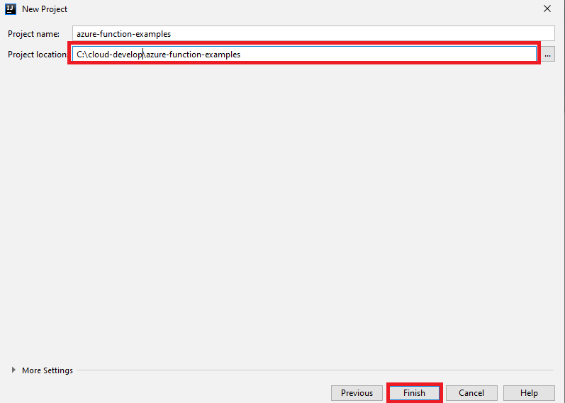

## Run the Function App locally

1. Navigate to `src/main/java/org/example/functions/HttpTriggerFunction.java` to see the code generated. Beside the line *17*, you will notice that there is a green *Run* button, click it and select *Run 'azure-function-exam...'*, you will see that your function app is running locally with a few logs.

    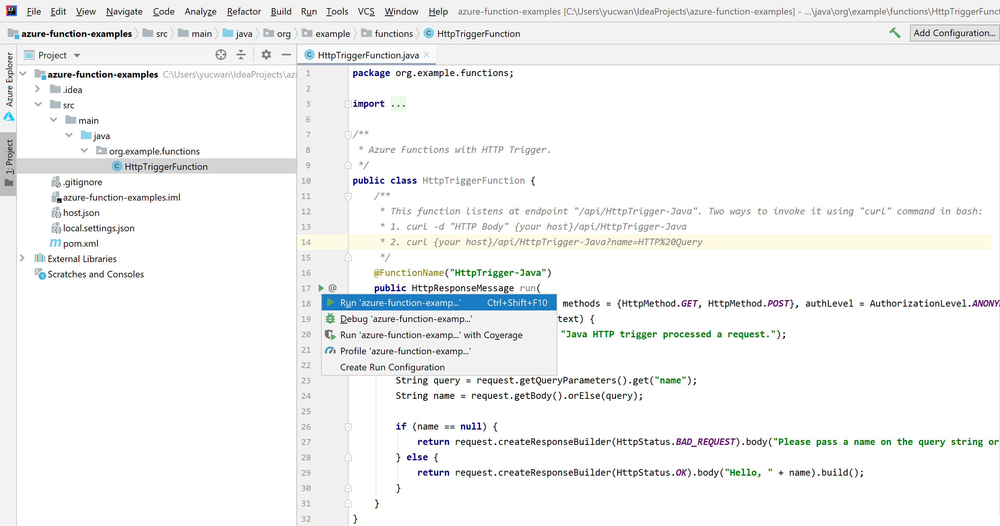

    

1. You can try the function by accessing the printed endpoint from browser, like `http://localhost:7071/api/HttpTrigger-Java?name=Azure`.

    

1. The log is also printed out in your IDEA, now, stop the function by clicking the *stop* button.

    

## Debug the Function App locally

1. Now let's try to debug your Function App locally, click the *Debug* button in the toolbar (if you don't see it, click *View -> Appearance -> Toolbar* to enable Toolbar).

    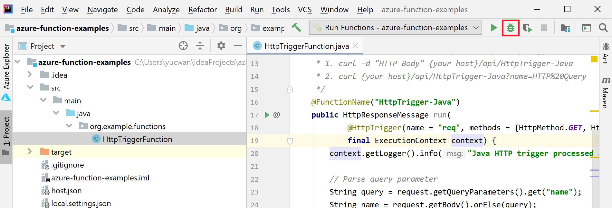

1. Click on line *20* of the file `src/main/java/org/example/functions/HttpTriggerFunction.java` to add a breakpoint, access the endpoint `http://localhost:7071/api/HttpTrigger-Java?name=Azure` again , you will find the breakpoint is hit, you can try more debug features like *step*, *watch*, *evaluation*. Stop the debug session by click the stop button.

    

## Deploy your Function App to Azure

1. Right click your project in IntelliJ Project explorer, select *Azure -> Deploy to Azure Functions*

    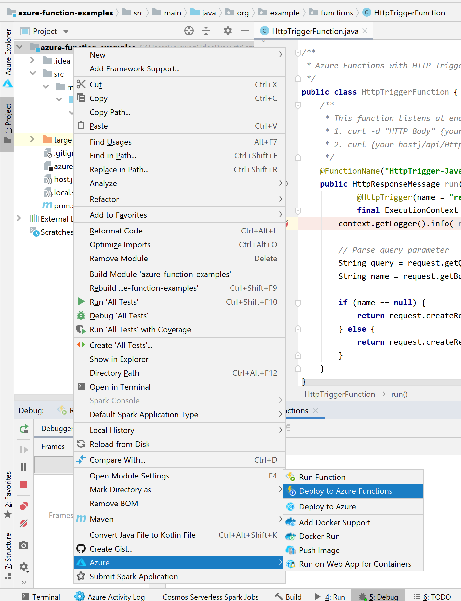

1. If you don't have any Function App yet, click *No available function, click to create a new one*.

    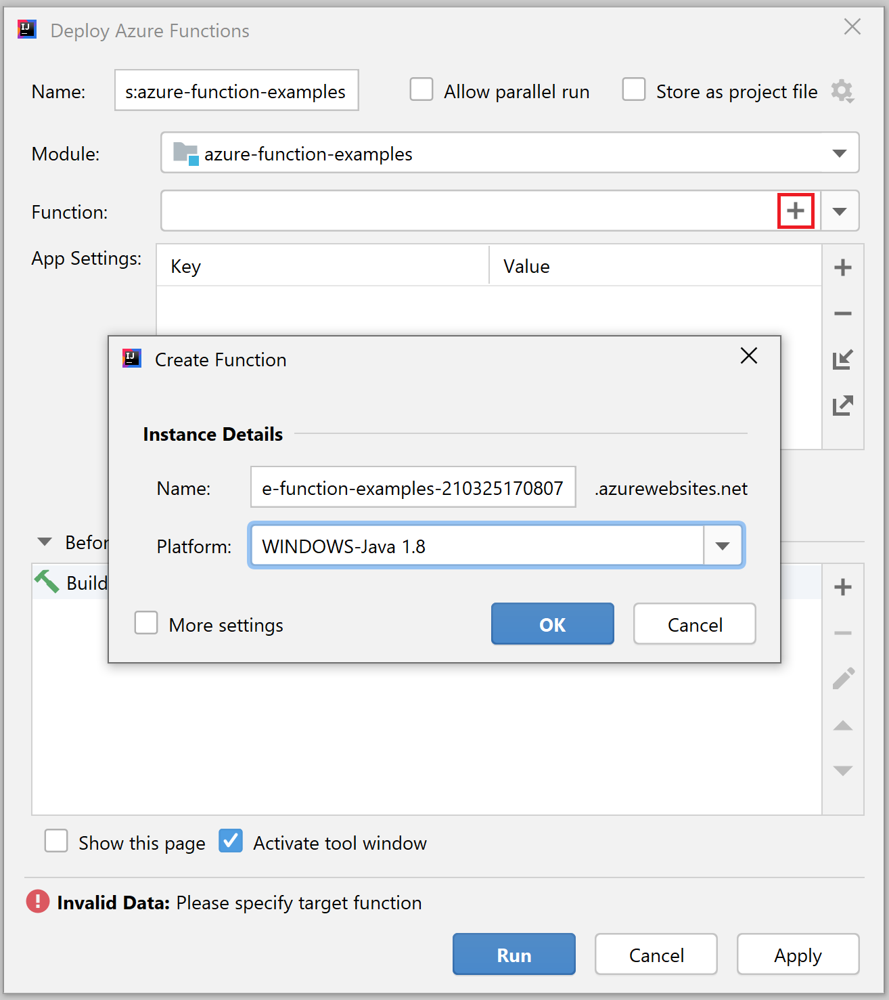

1. Type in the Function app name and choose proper subscription/platform/resource group/App Service plan, you can also create resource group/App Service plan here. Then, keep app settings unchanged, click *OK* and wait some minutes for the new function to be created. After *Creating New Function App...* progress bar disappears.

    

1. Select the function app you want to deploy to, (the new function app you just created will be automatically selected). Click *Run* to deploy your functions.

    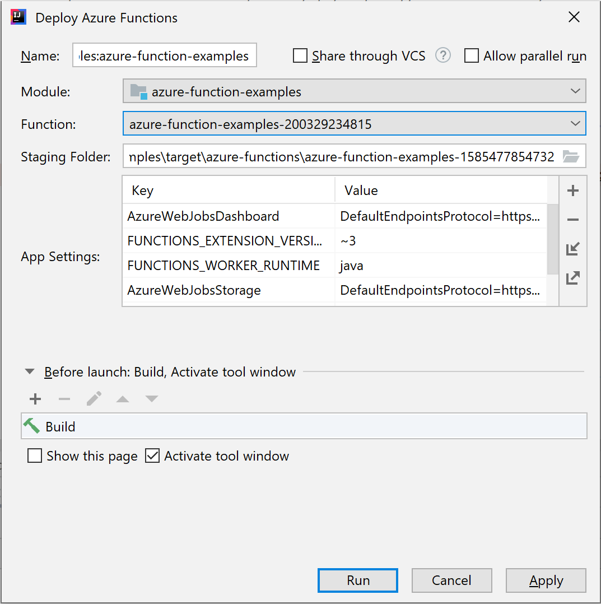

    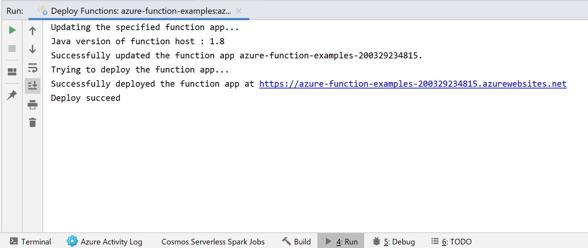

## Manage Azure Functions from IDEA

1. You can manage your functions with *Azure Explorer* in your IDEA, click on *Function App*, you will see all your functions here.

    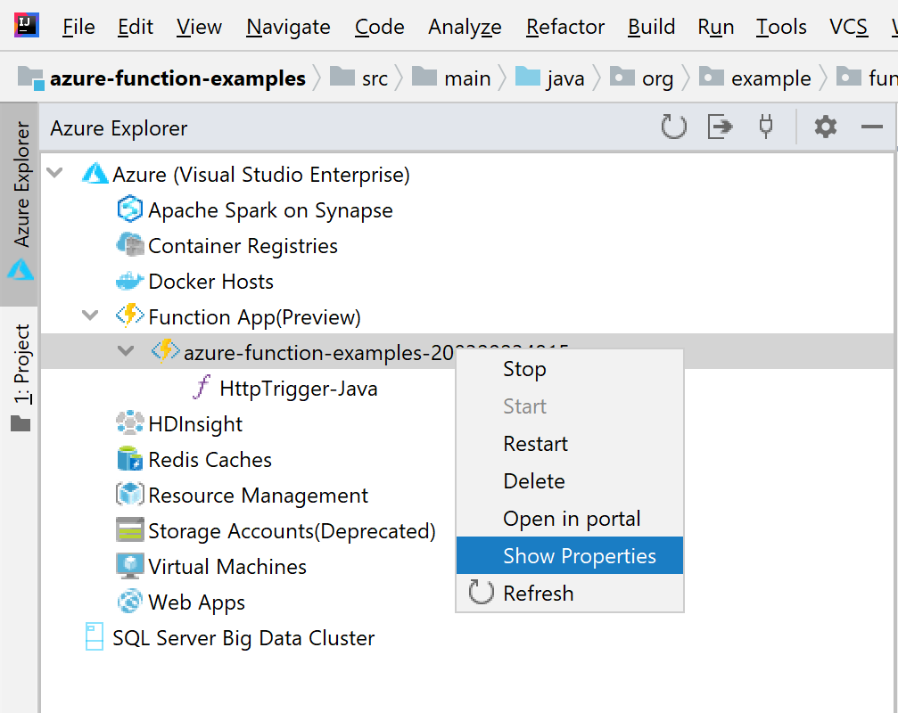

1. Click to select on one of your functions, and right click, select *Show Properties* to open the detail page. 

    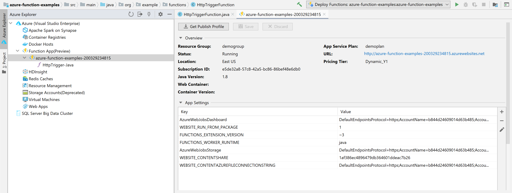

1. Right click on your Function *HttpTrigger-Java*, and select *Trigger Function*, you will see that the browser is opened with the trigger URL.

    

## Add more Functions to the project

1. Right click on the package *org.example.functions* and select *New -> Azure Function Class*. 

    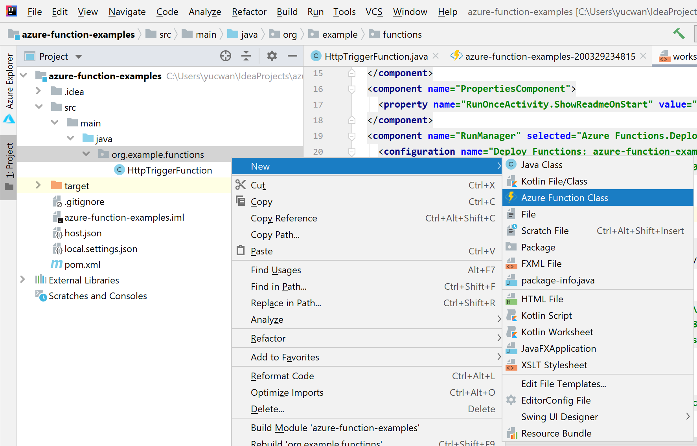

1. Fill in the class name *HttpTest* and select *HttpTrigger* in the create function class wizard, click *OK* to create, in this way, you can create new functions as you want.

    
    
    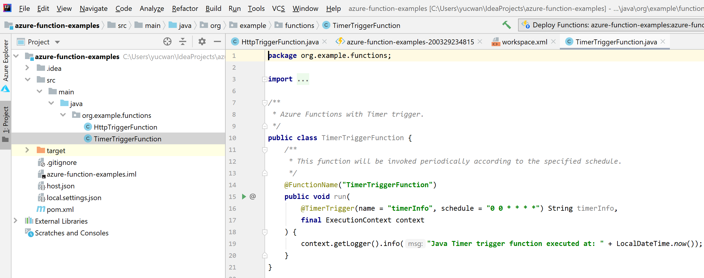

## Cleaning Up Functions

1. Deleting Azure Functions in Azure Explorer
      
      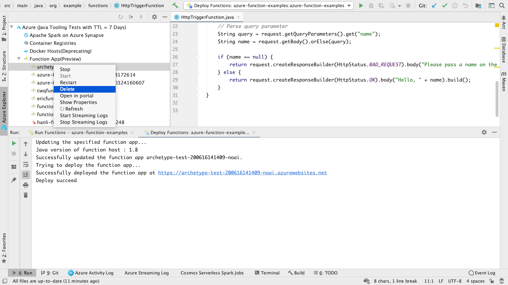
      

## Next steps

You've created a Java functions project with an HTTP triggered function, run it on your local machine, and deployed it to Azure. Now, extend your function by...

> [!div class="nextstepaction"]
> [Adding an Azure Storage queue output binding](./functions-add-output-binding-storage-queue-java.md)

[marketplace]:./media/functions-create-first-java-intellij/marketplace.png
[intellij-azure-login]: media/functions-create-first-java-intellij/intellij-azure-login.png
[intellij-azure-popup]: media/functions-create-first-java-intellij/intellij-azure-login-popup.png
[intellij-azure-copycode]: media/functions-create-first-java-intellij/intellij-azure-login-copyopen.png
[intellij-azure-link-ms-account]: media/functions-create-first-java-intellij/intellij-azure-login-linkms-account.png
[intellij-azure-login-select-subs]: media/functions-create-first-java-intellij/intellij-azure-login-selectsubs.png
