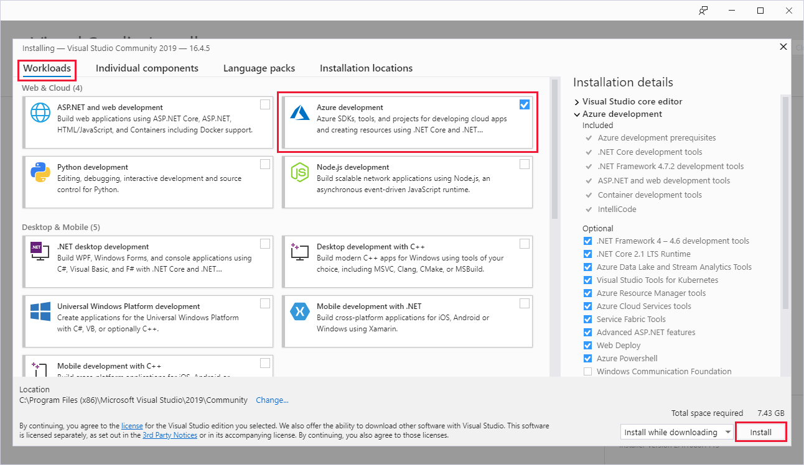

# Create your first function using Visual Studio

Azure Functions lets you execute your code in a [serverless](https://azure.microsoft.com/solutions/serverless/) environment without having to first create a VM or publish a web application.

In this article, you learn how to use Visual Studio 2019 to locally create and test a "hello world" function and then publish it to Azure. This quickstart is designed for Visual Studio 2019. When creating a Functions project using Visual Studio 2017, you must first install the [latest Azure Functions tools](functions-develop-vs.md#check-your-tools-version).

## Prerequisites

To complete this tutorial, you must first install [Visual Studio 2019](https://azure.microsoft.com/downloads/). Make sure that the **Azure development** workload is also installed.

[!INCLUDE [quickstarts-free-trial-note](../../includes/quickstarts-free-trial-note.md)]

## Create a function app project

[!INCLUDE [Create a project using the Azure Functions template](../../includes/functions-vstools-create.md)]

Visual Studio creates a project and class that contains boilerplate code for the HTTP trigger function type. The `FunctionName` attribute on the method sets the name of the function, which by default is `HttpTrigger`. The `HttpTrigger` attribute specifies that the function is triggered by an HTTP request. The boilerplate code sends an HTTP response that includes a value from the request body or query string.

You can expand the capabilities of your function using input and output bindings by applying the appropriate attributes to the method. For more information, see the [Triggers and bindings](functions-dotnet-class-library.md#triggers-and-bindings) section of the [Azure Functions C# developer reference](functions-dotnet-class-library.md).

Now that you've created your function project and an HTTP-triggered function, you can test it on your local computer.

## Run the function locally

Visual Studio integrates with Azure Functions Core Tools so that you can test your functions locally using the full Functions runtime.  

[!INCLUDE [functions-run-function-test-local-vs](../../includes/functions-run-function-test-local-vs.md)]

After you have verified that the function runs correctly on your local computer, it's time to publish the project to Azure.

## Publish the project to Azure

You must have a function app in your Azure subscription before you can publish your project. Visual Studio publishing creates a function app for you the first time you publish your project.

[!INCLUDE [Publish the project to Azure](../../includes/functions-vstools-publish.md)]

## Test your function in Azure

1. Copy the base URL of the function app from the Publish profile page. Replace the `localhost:port` portion of the URL you used when testing the function locally with the new base URL. As before, make sure to append the query string `?name=<YOUR_NAME>` to this URL and execute the request.

    The URL that calls your HTTP triggered function should be in the following format:

        http://<APP_NAME>.azurewebsites.net/api/<FUNCTION_NAME>?name=<YOUR_NAME> 

2. Paste this new URL for the HTTP request into your browser's address bar. The following shows the response in the browser to the remote GET request returned by the function:

    

## Next steps

You have used Visual Studio to create and publish a C# function app in Azure with a simple HTTP triggered function. To learn more about developing functions as .NET class libraries, see [Azure Functions C# developer reference](functions-dotnet-class-library.md).

> [!div class="nextstepaction"]
> [Add an Azure Storage queue binding to your function](functions-add-output-binding-storage-queue-vs.md)
