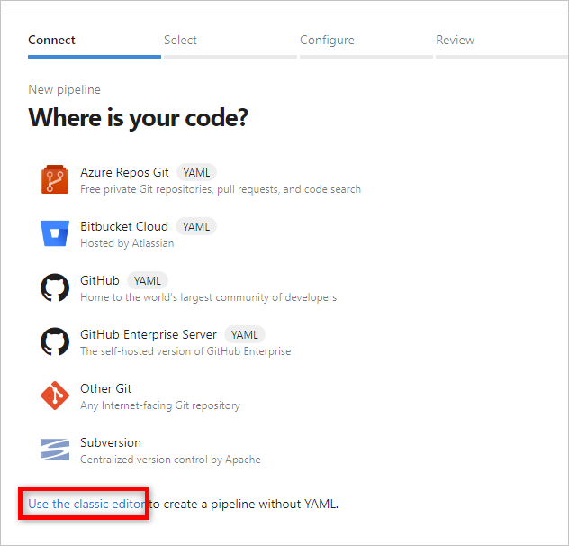
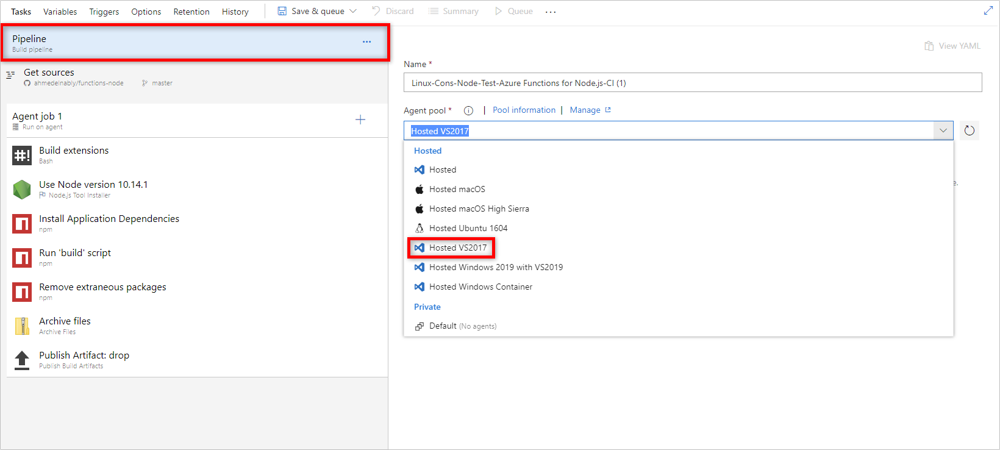
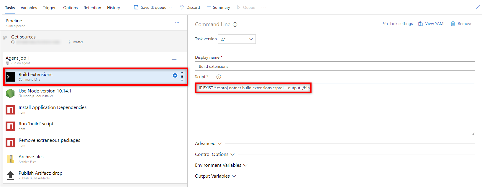

# Continuous delivery using Azure DevOps

You can automatically deploy your function to an Azure Function app using [Azure Pipelines](/azure/devops/pipelines/).
To define your pipeline, you can use:

- YAML File: This file describes the pipeline, it may have a build steps section, and a release section. The YAML file should be in the same repo as the app.

- Templates: Templates are ready made tasks that build or deploy your app.

## YAML-based pipeline

### Build your app

Building your app in Azure Pipelines depends on the programming language of your app.
Each language has specific build steps to create a deployment artifact, which can be used to deploy your function app in Azure.

#### .NET

You can use the following sample to create your YAML file to build your .NET app.

```yaml
jobs:
  - job: Build
    pool:
      vmImage: 'VS2017-Win2016'
steps:
- script: |
    dotnet restore
    dotnet build --configuration Release
- task: DotNetCoreCLI@2
  inputs:
    command: publish
    arguments: '--configuration Release --output publish_output'
    projects: '*.csproj'
    publishWebProjects: false
    modifyOutputPath: true
    zipAfterPublish: false
- task: ArchiveFiles@2
  displayName: "Archive files"
  inputs:
    rootFolderOrFile: "$(System.DefaultWorkingDirectory)/publish_output"
    includeRootFolder: false
    archiveFile: "$(System.DefaultWorkingDirectory)/build$(Build.BuildId).zip"
- task: PublishBuildArtifacts@1
  inputs:
    PathtoPublish: '$(System.DefaultWorkingDirectory)/build$(Build.BuildId).zip'
    name: 'drop'
```

#### JavaScript

You can use the following sample to create your YAML file to build your JavaScript app:

```yaml
jobs:
  - job: Build
    pool:
      vmImage: ubuntu-16.04 # Use 'VS2017-Win2016' if you have Windows native +Node modules
steps:
- bash: |
    if [ -f extensions.csproj ]
    then
        dotnet build extensions.csproj --output ./bin
    fi
    npm install 
    npm run build --if-present
    npm prune --production
- task: ArchiveFiles@2
  displayName: "Archive files"
  inputs:
    rootFolderOrFile: "$(System.DefaultWorkingDirectory)"
    includeRootFolder: false
    archiveFile: "$(System.DefaultWorkingDirectory)/build$(Build.BuildId).zip"
- task: PublishBuildArtifacts@1
  inputs:
    PathtoPublish: '$(System.DefaultWorkingDirectory)/build$(Build.BuildId).zip'
    name: 'drop'
```

#### Python

You can use the following sample to create your YAML file to build your Python app, Python is only supported for Linux Azure Functions:

```yaml
jobs:
  - job: Build
    pool:
      vmImage: ubuntu-16.04
steps:
- task: UsePythonVersion@0
  displayName: "Setting python version to 3.6 as required by functions"
  inputs:
    versionSpec: '3.6'
    architecture: 'x64'
- bash: |
    if [ -f extensions.csproj ]
    then
        dotnet build extensions.csproj --output ./bin
    fi
    python3.6 -m venv worker_venv
    source worker_venv/bin/activate
    pip3.6 install setuptools
    pip3.6 install -r requirements.txt
- task: ArchiveFiles@2
  displayName: "Archive files"
  inputs:
    rootFolderOrFile: "$(System.DefaultWorkingDirectory)"
    includeRootFolder: false
    archiveFile: "$(System.DefaultWorkingDirectory)/build$(Build.BuildId).zip"
- task: PublishBuildArtifacts@1
  inputs:
    PathtoPublish: '$(System.DefaultWorkingDirectory)/build$(Build.BuildId).zip'
    name: 'drop'
```

### Deploy your app

Depending on the hosting OS, you need to include the following YAML sample in your YAML file.

#### Windows function App

The following snippet can be used to deploy to a Windows function app

```yaml
steps:
- task: AzureFunctionApp@1
  inputs:
    azureSubscription: '<Azure service connection>'
    appType: functionApp
    appName: '<Name of function app>'
```

#### Linux function App

The following snippet can be used to deploy to a Linux function app

```yaml
steps:
- task: AzureFunctionApp@1
  inputs:
    azureSubscription: '<Azure service connection>'
    appType: functionAppLinux
    appName: '<Name of function app>'
```

## Template-based pipeline

Templates in Azure DevOps, are predefined group of tasks that build or deploy an app.

### Build your app

Building your app in Azure Pipelines depends on the programming language of your app. Each language has specific build steps to create a deployment artifact, that can be used to update your function app in Azure.
To use the built-in build templates, when creating a new build pipeline, choose **Use the classic editor** to create a pipeline using the designer templates



After configuring the source of your code, search for Azure Functions build templates, and choose the template that matches your app language.


#### JavaScript apps

If your JavaScript app have a dependency on Windows native modules, you will need to update:

- The Agent Pool version to **Hosted VS2017**

  

- The script in the **Build extensions** step in the template to `IF EXIST *.csproj dotnet build extensions.csproj --output ./bin`

  

### Deploy your app

When creating a new release pipeline, search for Azure Functions release template.


## Creating an Azure Pipeline using the Azure CLI

Using the `az functionapp devops-pipeline create` [command](/cli/azure/functionapp/devops-pipeline#az-functionapp-devops-pipeline-create), an Azure pipeline will get created to build and release any code changes in your repo. The command will generate a new YAML file that defines the build and release pipeline and commit it to your repo.
The pre-requisites for this command depend on the location of your code:

- If your code is in GitHub:

    - You need to have **write** permission to your subscription.

    - You are the project administrator in Azure DevOps.

    - You have permission to create a GitHub Personal Access Token with sufficient permissions. [GitHub PAT Permission Requirements.](https://aka.ms/azure-devops-source-repos)

    - You have permission to commit to the master branch in your GitHub repository to commit the auto-generated YAML file.

- If your code is in Azure Repos:

    - You need to have **write** permission to your subscription.

    - You are the project administrator in Azure DevOps.

## Next steps

+ [Azure Functions Overview](functions-overview.md)
+ [Azure DevOps Overview](/azure/devops/pipelines/)
