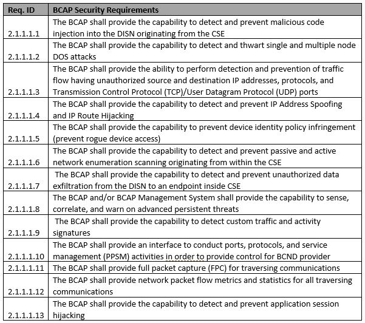
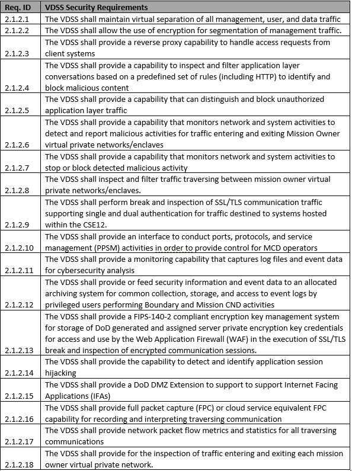
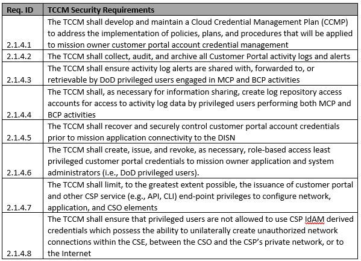
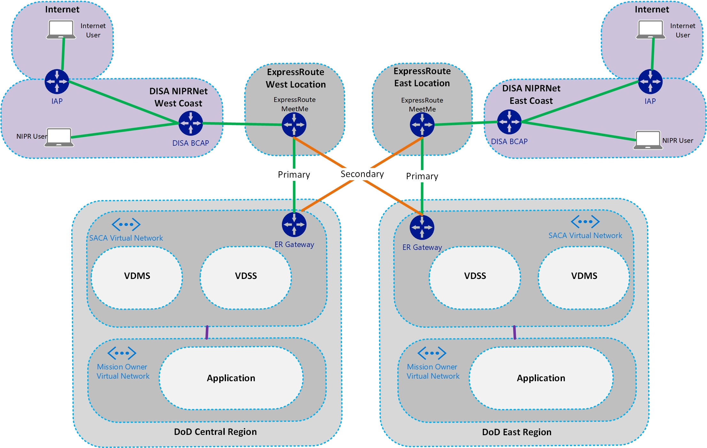
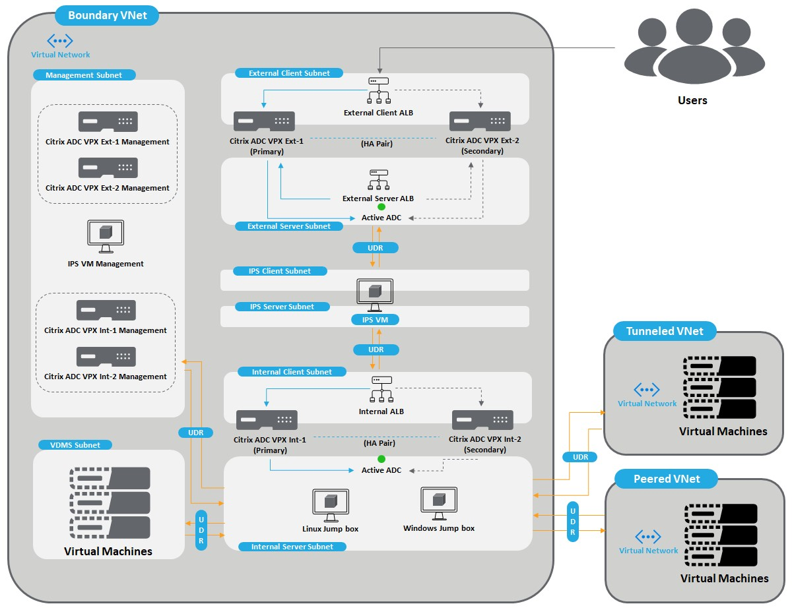
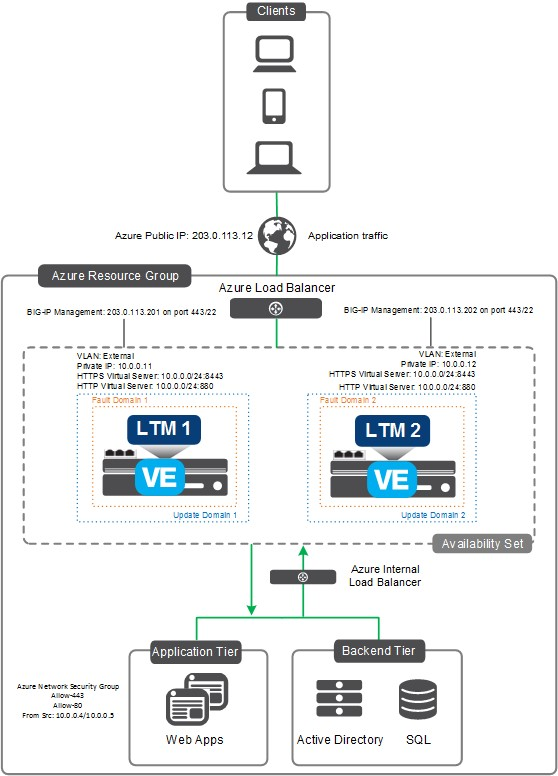

---
# This basic template provides core metadata fields for Markdown articles on docs.microsoft.com.

# Mandatory fields.
title: Secure Azure Computing Architecture
description: Learn about the Secure Azure Computing Architecture (SACA). Using SACA allows U.S. DoD and civilian customers to comply with the SCCA FRD.
author: jahender
ms.author: jahender 
ms.date: 4/9/2019
ms.topic: article
# Use ms.service for services or ms.prod for on-premises products. Remove the # before the relevant field.
ms.service: azure-government
# ms.prod: product-name-from-white-list

# Optional fields. Don't forget to remove # if you need a field.
# ms.custom: can-be-multiple-comma-separated
# ms.reviewer: MSFT-alias-of-reviewer
# manager: MSFT-alias-of-manager-or-PM-counterpart
---
# Secure Azure Computing Architecture

U.S. Department of Defense (DoD) customers who deploy workloads to Azure have asked for guidance to set up secure virtual networks and configure the security tools and services that are stipulated by DoD standards and practice. 

The Defense Information System Agency (DISA) published the [Secure Cloud Computing Architecture (SCCA) Functional Requirements Document (FRD)](https://dl.dod.cyber.mil/wp-content/uploads/cloud/pdf/SCCA_FRD_v2-9.pdf) in 2017. SCCA describes the functional objectives for securing the Defense Information System Network’s (DISN) and commercial cloud provider connection points. SCCA also describes how mission owners secure cloud applications at the connection boundary. Every DoD entity that connects to the commercial cloud must follow the guidelines set forth in the SCCA FRD.
 
The SCCA has four components:
 
- Boundary Cloud Access Point (BCAP)
- Virtual Datacenter Security Stack (VDSS)
- Virtual Datacenter Managed Service (VDMS)
- Trusted Cloud Credential Manager (TCCM) 

Microsoft has developed a solution that meets the SCCA requirements for both IL4 and IL5 workloads that run in Azure. This Azure-specific solution is called the Secure Azure Computing Architecture (SACA). Customers who deploy SACA are in compliance with the SCCA FRD. They can enable DoD customers to move workloads into Azure after they're connected.

SCCA guidance and architectures are specific to DoD customers, but the latest revisions to SACA help civilian customers comply with trusted internet connection (TIC) guidance. The latest revisions also help commercial customers that want to implement a secure DMZ to protect their Azure environments.

## Secure Cloud Computing Architecture components

### BCAP

The purpose of the BCAP is to protect the DISN from attacks that originate in the cloud environment. BCAP performs intrusion detection and prevention. it also filters out unauthorized traffic. This component can be co-located with other components of the SCCA. We recommend that you deploy this component by using physical hardware. BCAP security requirements are listed in the following table.

#### BCAP security requirements

### VDSS

The purpose of the VDSS is to protect DoD mission-owner applications that are hosted in Azure. VDSS performs the bulk of the security operations in the SCCA. It conducts traffic inspection to secure the applications that run in Azure. This component can be provided within your Azure environment.

#### VDSS security requirements

### VDMS

The purpose of VDMS is to provide host security and shared data center services. The functions of VDMS can either run in the hub of your SCCA or the mission owner can deploy pieces of it in their own specific Azure subscription. This component can be provided within your Azure environment.

#### VDMS security requirements

### TCCM

TCCM is a business role. This individual is responsible for managing the SCCA. Their duties are to: 

- Establish plans and policies for account access to the cloud environment. 
- Ensure that identity and access management is operating properly. 
- Maintain the Cloud Credential Management Plan. 

This individual is appointed by the authorizing official. The BCAP, VDSS, and VDMS provide the capabilities that the TCCM needs to perform their job.

#### TCCM security requirements

 

## SACA components and planning considerations 

The SACA reference architecture is designed to deploy the VDSS and VDMS components in Azure and to enable the TCCM. This architecture is modular. All of the pieces of VDSS and VDMS can live in a centralized hub. Some of the controls can be met in the mission-owner space or even on-premises. Microsoft recommends that you co-locate the VDSS and VDMS components into a central virtual network that all mission owners can connect through. The following diagram shows this architecture: 

When you plan your SCCA compliancy strategy and technical architecture, consider the following topics from the beginning because they affect every customer. The following issues have come up with DoD customers and tend to slow down planning and execution. 

#### Which BCAP will your organization use?
   - DISA BCAP:
        - DISA has two operational BCAPs at the Pentagon and at Camp Roberts, CA. A third is planned to come online soon. 
        - DISA’s BCAPs all have Azure ExpressRoute circuits to Azure, which can be used by DoD customers for connectivity. 
        - DISA has an enterprise-level Microsoft peering session for DoD customers who want to subscribe to Microsoft software as a service (SaaS) tools, such as Office 365. By using the DISA BCAP, you can enable connectivity and peering to your SACA instance. 
   - Build your own BCAP:
        - This option requires you to lease space in a co-located data center and set up an ExpressRoute circuit to Azure. 
        - This option requires additional approval. 
        - Because of the additional approval and a physical build-out, this option takes the most time. 
    - We recommend that you use the DISA BCAP. This option is readily available, has built-in redundancy, and has customers that operate on it today in production.
- DoD routable IP space:
    - You must use DoD routable IP space at your edge. The option to use NAT to connect those spaces to private IP space in Azure is available.
    - Contact the DoD Network Information Center (NIC) to obtain IP space. You need it as part of your System/Network Approval Process (SNAP) submission with DISA. 
    - If you plan to use NAT to connect private address space in Azure, you need a minimum of a /24 subnet of address space assigned from the NIC for each region where you plan to deploy SACA.
- Redundancy:
    - Deploy a SACA instance to at least two regions. In the DoD cloud, you deploy it to both available DoD regions.
    - Connect to at least two BCAPs via separate ExpressRoute circuits. Both ExpressRoute connections can then be linked to each region’s SACA instance. 
- DoD component-specific requirements:
    - Does your organization have any specific requirements outside the SCCA requirements? Some organizations have specific IPS requirements.
- SACA is a modular architecture:
    - Use only the components you need for your environment. 
        - Deploy network virtual appliances in a single tier or multi-tier.
        - Use integrated IPS or bring-your-own IPS.
- DoD impact level of your applications and data:
    - If there's any possibility of applications running in Microsoft IL5 regions, build your SACA instance in IL5. The instance can be used in front of IL4 applications and IL5. An IL4 SACA instance in front of an IL5 application most likely won't receive accreditation.

#### Which network virtual appliance vendor will you use for VDSS?
As mentioned earlier, you can build this SACA reference by using a variety of appliances and Azure services. Microsoft has automated solution templates to deploy the SACA architecture with both F5 and Citrix. These solutions are covered in the following section.

#### Which Azure services will you use?
- There are Azure services that can meet requirements for log analytics, host-based protection, and IDS functionality. It's possible that some services aren’t generally available in Microsoft IL5 regions. In this case, you might need to use third-party tools if these Azure services can’t meet your requirements. Look at the tools you're comfortable with and the feasibility of using Azure native tooling.
- We recommend that you use as many Azure native tools as possible. They're built with cloud security in mind and seamlessly integrate with the rest of the Azure platform. Use the Azure native tools in the following list to meet various requirements of SCCA:

    - [Azure Monitor](https://docs.microsoft.com/azure/azure-monitor/overview )
    - [Azure Security Center](https://docs.microsoft.com/azure/security-center/security-center-intro) 
    - [Azure Network Watcher](https://docs.microsoft.com/azure/network-watcher/network-watcher-monitoring-overview) 
    - [Azure Key Vault](https://docs.microsoft.com/azure/key-vault/key-vault-overview) 
    - [Azure Active Directory](https://docs.microsoft.com/azure/active-directory/fundamentals/active-directory-whatis)
    - [Azure Application Gateway](https://docs.microsoft.com/azure/application-gateway/overview)
    - [Azure Firewall](https://docs.microsoft.com/azure/firewall/overview) 
    - [Azure Front Door](https://docs.microsoft.com/azure/frontdoor/front-door-overview)
    - [Azure security groups](https://docs.microsoft.com/azure/virtual-network/security-overview)
    - [Azure DDoS Protection](https://docs.microsoft.com/azure/virtual-network/ddos-protection-overview)
    - [Azure Sentinel](https://docs.microsoft.com/azure/sentinel/overview)
- Sizing
    - A sizing exercise must be completed. Look at the number of concurrent connections you might have through the SACA instance and the network throughput requirements. 
    - This step is critical. It helps to size the VMs and identify the licenses that are required from the various vendors you use in your SACA instance. 
    - A good cost analysis can’t be done without this sizing exercise. Correct sizing also allows for best performance. 

## Most common deployment scenario

 Several Microsoft customers have gone through the full deployment or at least the planning stages of their SACA environments. Their experiences revealed insight into the most common deployment scenario. The following diagram shows the most common architecture: 

 

As you can see from the diagram, DoD customers typically subscribe to two of the DISA BCAPs. One of these lives on the West Coast and the other lives on the East Coast. An ExpressRoute private peer is enabled to Azure at each DISA BCAP location. These ExpressRoute peers are then linked to the virtual network gateway in the DoD East and DoD Central Azure regions. A SACA instance is deployed in the DoD East and DoD Central Azure regions. All ingress and egress traffic flows through it to and from the ExpressRoute connection to the DISA BCAP.

Mission-owner applications then choose the Azure regions in which they plan to deploy their applications. They use virtual network peering to connect their application’s virtual network to the SACA virtual network. Then they force tunnel all their traffic through the VDSS instance.

We recommend this architecture because it meets SCCA requirements. It’s highly available and easily scalable. It also simplifies deployment and management.

## Automated SACA deployment options

 As previously mentioned, Microsoft has partnered with two vendors to create an automated SACA infrastructure template. Both templates deploy the following Azure components:

- SACA virtual network
    - Management subnet
        - This subnet is where management VMs and services are deployed, also known as a jump boxes.
        - VDMS subnet
            - This subnet is where VMs and services used for VDMS are deployed.
        - Untrusted and trusted subnets
            - These subnets are where virtual appliances are deployed.
        - Gateway subnet
            - This subnet is where the ExpressRoute Gateway is deployed.
- Management jump box virtual machines
    - They're used for out-of-band management of the environment.
- Network virtual appliances
    - You use either Citrix or F5 based on which template you deploy.
- Public IPs
    - They're used for the front end until ExpressRoute is brought online. These IPs translate to the back-end Azure private address space.
- Route tables 
    - Applied during automation, these route tables force tunnel all traffic through the virtual appliance.
- Azure load balancers - Standard SKU
    - They're used to load balance traffic across the appliances.
- Network security groups
    - They're used to control which types of traffic can traverse to certain endpoints.

### Citrix SACA deployment

A Citrix deployment template deploys two layers of highly available Citrix ADC appliances. This architecture meets the requirements of VDSS. 

For the Citrix documentation and deployment script, see [this GitHub link](https://github.com/citrix/netscaler-azure-templates/tree/master/templates/saca).

 ### F5 SACA deployment

Two separate F5 deployment templates cover two different architectures. The first template has only one layer of F5 appliances in an active-active highly available configuration. This architecture meets the requirements for VDSS. The second template adds a second layer of active-active highly available F5s. This second layer allows customers to add their own IPS separate from F5 in between the F5 layers. Not all DoD components have specific IPS prescribed for use. If that's the case, the single layer of F5 appliances works for most because that architecture includes IPS on the F5 devices.

For the F5 documentation and deployment script, see [this GitHub link](https://github.com/f5devcentral/f5-azure-saca).

