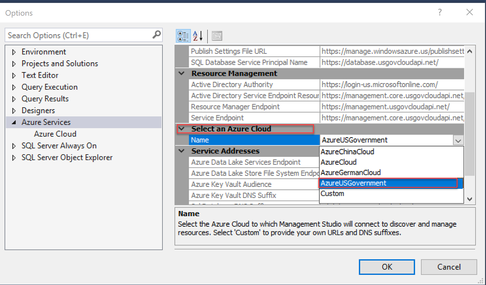
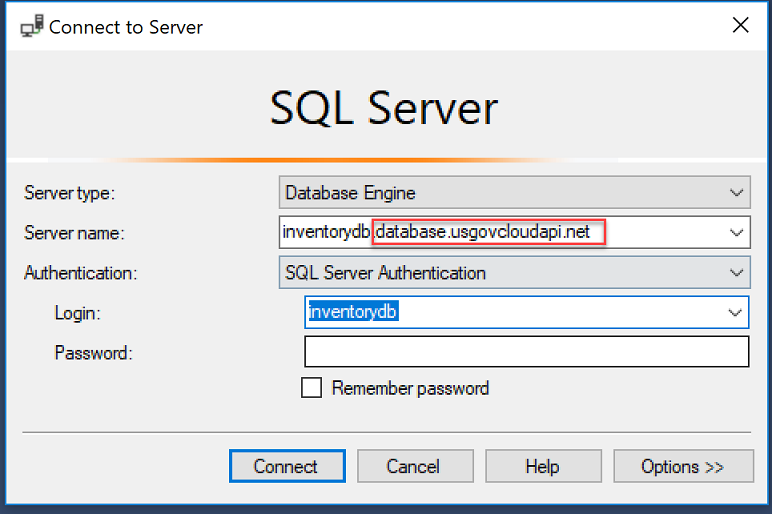

# Develop with SQL Server Management Studio 

To use SQL Server Management Studio (SSMS) with Azure Government, specify Azure Government as the environment to connect to, rather than global Azure. To connect to computers that are running SQL Server in your Azure Government subscription, you must configure SSMS to connect to the Azure Government cloud. 

For general information about SSMS, see the [SSMS documentation](https://docs.microsoft.com/sql/ssms/download-sql-server-management-studio-ssms).

If you don't have an Azure Government subscription, create a [free account](https://azure.microsoft.com/global-infrastructure/government/request/) before you begin.

## Prerequisites

* Review [Guidance for developers](documentation-government-developer-guide.md).  This article discusses Azure Government's unique URLs and endpoints for managing your environment. You must know about these endpoints in order to connect to Azure Government. 
* Review [Compare Azure Government and global Azure](compare-azure-government-global-azure.md) and click on a service of interest to see variations between Azure Government and global Azure.

## Set up an Azure SQL Server firewall rule

Before you connect to Azure Government from SSMS, you must set up an Azure SQL Server firewall rule to allow your local IP address to access your computer that's running SQL Server. 

Follow these steps to [Manage firewall rules by using the Azure portal](../sql-database/sql-database-firewall-configure.md#manage-server-level-ip-firewall-rules-using-the-azure-portal). 

## Specify Azure Government as the environment to connect

1. Open SSMS. Browse to **Tools** > **Options** > **Azure Services**.

    

2. In the **Select an Azure Cloud** drop-down, select **AzureUSGovernment**.

    

3. Browse to **File** > **Connect Object Explorer**. Enter the name of your computer that's running SQL Server. Enter your authentication information. 

    >[!Note]
    >The name of the computer that's running SQL Server ends with **.usgovcloudapi.net**.
    >
    >

    

SSMS is now connected to your Azure Government subscription.

## Get help and provide feedback

* Read more about [Azure Storage](https://docs.microsoft.com/azure/storage/). 
* Subscribe to the [Azure Government blog](https://blogs.msdn.microsoft.com/azuregov/).
* Get help on Stack Overflow by using the [`azure-gov`](https://stackoverflow.com/questions/tagged/azure-gov) tag.
* Share feedback or request new features by using the [Azure Government feedback forum](https://feedback.azure.com/forums/558487-azure-government).

## Next steps

[Develop with Visual Studio](documentation-government-get-started-connect-with-vs.md)