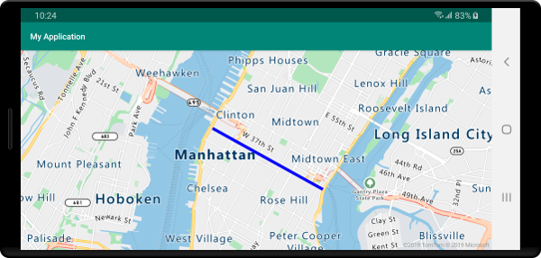
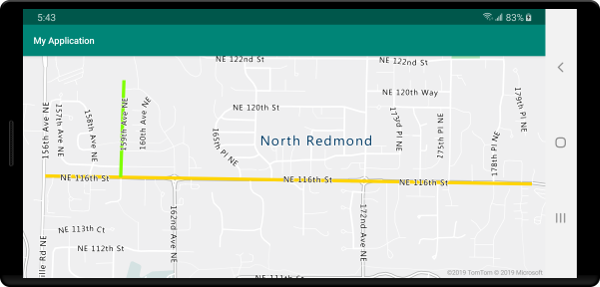
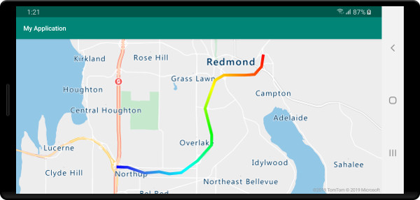
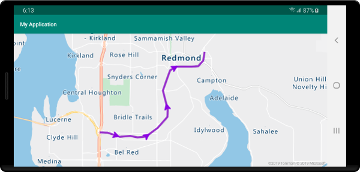

# Add a line layer to the map (Android SDK)

A line layer can be used to render `LineString` and `MultiLineString` features as paths or routes on the map. A line layer can also be used to render the outline of `Polygon` and `MultiPolygon` features. A data source is connected to a line layer to provide it with data to render.

> [!TIP]
> Line layers by default will render the coordinates of polygons as well as lines in a data source. To limit the layer so that it only renders LineString geometry features, set the `filter` option of the layer to `eq(geometryType(), "LineString")`. If you want to include MultiLineString features as well, set the `filter` option of the layer to `any(eq(geometryType(), "LineString"), eq(geometryType(), "MultiLineString"))`.

## Prerequisites

Be sure to complete the steps in the [Quickstart: Create an Android app](quick-android-map.md) document. Code blocks in this article can be inserted into the maps `onReady` event handler.

## Add a line layer

The following code shows how to create a line. Add the line to a data source, then render it with a line layer using the `LineLayer` class.

::: zone pivot="programming-language-java-android"

```java
//Create a data source and add it to the map.
DataSource source = new DataSource();
map.sources.add(source);

//Create a list of points.
List<Point> points = Arrays.asList(
    Point.fromLngLat(-73.97234, 40.74327),
    Point.fromLngLat(-74.00442, 40.75680));

//Create a LineString geometry and add it to the data source.
source.add(LineString.fromLngLats(points));

//Create a line layer and add it to the map.
LineLayer layer = new LineLayer(source,
    strokeColor("blue"),
    strokeWidth(5f)
);

map.layers.add(layer);
```

::: zone-end

::: zone pivot="programming-language-kotlin"

```kotlin
//Create a data source and add it to the map.
val source = DataSource()
map.sources.add(source)

//Create a list of points.
val points = asList(
    Point.fromLngLat(-73.97234, 40.74327),
    Point.fromLngLat(-74.00442, 40.75680)
)

//Create a LineString geometry and add it to the data source.
source.add(LineString.fromLngLats(points))

//Create a line layer and add it to the map.
val layer = LineLayer(
    source,
    strokeColor("blue"),
    strokeWidth(5f)
)

map.layers.add(layer)
```

::: zone-end

The following screenshot shows the above code rendering a line in a line layer.



## Data-driven line style

The following code creates two line features and adds a speed limit value as a property to each line. A line layer uses a data-drive style expression color the lines based on the speed limit value. Since the line data overlays along roads, the code below adds the line layer below the label layer so that road labels can still clearly be read.

::: zone pivot="programming-language-java-android"

```java
//Create a data source and add it to the map.
DataSource source = new DataSource();
map.sources.add(source);

//Create a line feature.
Feature feature = Feature.fromGeometry(
    LineString.fromLngLats(Arrays.asList(
        Point.fromLngLat(-122.131821, 47.704033),
        Point.fromLngLat(-122.099919, 47.703678))));

//Add a property to the feature.
feature.addNumberProperty("speedLimitMph", 35);

//Add the feature to the data source.
source.add(feature);

//Create a second line feature.
Feature feature2 = Feature.fromGeometry(
    LineString.fromLngLats(Arrays.asList(
        Point.fromLngLat(-122.126662, 47.708265),
        Point.fromLngLat(-122.126877, 47.703980))));

//Add a property to the second feature.
feature2.addNumberProperty("speedLimitMph", 15);

//Add the second feature to the data source.
source.add(feature2);

//Create a line layer and add it to the map.
LineLayer layer = new LineLayer(source,
    strokeColor(
        interpolate(
            linear(),
            get("speedLimitMph"),
            stop(0, color(Color.GREEN)),
            stop(30, color(Color.YELLOW)),
            stop(60, color(Color.RED))
        )
    ),
    strokeWidth(5f)
);

map.layers.add(layer, "labels");
```

::: zone-end

::: zone pivot="programming-language-kotlin"

```kotlin
//Create a data source and add it to the map.
val source = DataSource()
map.sources.add(source)

//Create a line feature.
val feature = Feature.fromGeometry(
    LineString.fromLngLats(
        Arrays.asList(
            Point.fromLngLat(-122.131821, 47.704033),
            Point.fromLngLat(-122.099919, 47.703678)
        )
    )
)

//Add a property to the feature.
feature.addNumberProperty("speedLimitMph", 35)

//Add the feature to the data source.
source.add(feature)

//Create a second line feature.
val feature2 = Feature.fromGeometry(
    LineString.fromLngLats(
        Arrays.asList(
            Point.fromLngLat(-122.126662, 47.708265),
            Point.fromLngLat(-122.126877, 47.703980)
        )
    )
)

//Add a property to the second feature.
feature2.addNumberProperty("speedLimitMph", 15)

//Add the second feature to the data source.
source.add(feature2)

//Create a line layer and add it to the map.
val layer = LineLayer(
    source,
    strokeColor(
        interpolate(
            linear(),
            get("speedLimitMph"),
            stop(0, color(Color.GREEN)),
            stop(30, color(Color.YELLOW)),
            stop(60, color(Color.RED))
        )
    ),
    strokeWidth(5f)
)

map.layers.add(layer, "labels")
```

::: zone-end

The following screenshot shows the above code rendering two lines in a line layer with their color being retrieved from a data driven style expression based on a property in the line features.



## Add a stroke gradient to a line

You may apply a single stroke color to a line. You can also fill a line with a gradient of colors to show transition from one line segment to the next line segment. For example, line gradients can be used to represent changes over time and distance, or different temperatures across a connected line of objects. In order to apply this feature to a line, the data source must have the `lineMetrics` option set to `true`, and then a color gradient expression can be passed to the `strokeColor` option of the line. The stroke gradient expression has to reference the `lineProgress` data expression that exposes the calculated line metrics to the expression.

::: zone pivot="programming-language-java-android"

```java
//Create a data source and add it to the map.
DataSource source = new DataSource(
    //Enable line metrics on the data source. This is needed to enable support for strokeGradient.
    withLineMetrics(true)
);
map.sources.add(source);

//Create a line and add it to the data source.
source.add(LineString.fromLngLats(
    Arrays.asList(
        Point.fromLngLat(-122.18822, 47.63208),
        Point.fromLngLat(-122.18204, 47.63196),
        Point.fromLngLat(-122.17243, 47.62976),
        Point.fromLngLat(-122.16419, 47.63023),
        Point.fromLngLat(-122.15852, 47.62942),
        Point.fromLngLat(-122.15183, 47.62988),
        Point.fromLngLat(-122.14256, 47.63451),
        Point.fromLngLat(-122.13483, 47.64041),
        Point.fromLngLat(-122.13466, 47.64422),
        Point.fromLngLat(-122.13844, 47.65440),
        Point.fromLngLat(-122.13277, 47.66515),
        Point.fromLngLat(-122.12779, 47.66712),
        Point.fromLngLat(-122.11595, 47.66712),
        Point.fromLngLat(-122.11063, 47.66735),
        Point.fromLngLat(-122.10668, 47.67035),
        Point.fromLngLat(-122.10565, 47.67498)
    )
));

//Create a line layer and pass in a gradient expression for the strokeGradient property.
map.layers.add(new LineLayer(source,
    strokeWidth(6f),

    //Pass an interpolate or step expression that represents a gradient.
    strokeGradient(
        interpolate(
            linear(),
            lineProgress(),
            stop(0, color(Color.BLUE)),
            stop(0.1, color(Color.argb(255, 65, 105, 225))), //Royal Blue
            stop(0.3, color(Color.CYAN)),
            stop(0.5, color(Color.argb(255,0, 255, 0))), //Lime
            stop(0.7, color(Color.YELLOW)),
            stop(1, color(Color.RED))
        )
    )
));
```

::: zone-end

::: zone pivot="programming-language-kotlin"

```kotlin
//Create a data source and add it to the map.
val source = DataSource(
    //Enable line metrics on the data source. This is needed to enable support for strokeGradient.
    withLineMetrics(true)
)
map.sources.add(source)

//Create a line and add it to the data source.
source.add(
    LineString.fromLngLats(
        Arrays.asList(
            Point.fromLngLat(-122.18822, 47.63208),
            Point.fromLngLat(-122.18204, 47.63196),
            Point.fromLngLat(-122.17243, 47.62976),
            Point.fromLngLat(-122.16419, 47.63023),
            Point.fromLngLat(-122.15852, 47.62942),
            Point.fromLngLat(-122.15183, 47.62988),
            Point.fromLngLat(-122.14256, 47.63451),
            Point.fromLngLat(-122.13483, 47.64041),
            Point.fromLngLat(-122.13466, 47.64422),
            Point.fromLngLat(-122.13844, 47.65440),
            Point.fromLngLat(-122.13277, 47.66515),
            Point.fromLngLat(-122.12779, 47.66712),
            Point.fromLngLat(-122.11595, 47.66712),
            Point.fromLngLat(-122.11063, 47.66735),
            Point.fromLngLat(-122.10668, 47.67035),
            Point.fromLngLat(-122.10565, 47.67498)
        )
    )
)

//Create a line layer and pass in a gradient expression for the strokeGradient property.
map.layers.add(
    LineLayer(
        source,
        strokeWidth(6f),  

        //Pass an interpolate or step expression that represents a gradient.
        strokeGradient(
            interpolate(
                linear(),
                lineProgress(),
                stop(0, color(Color.BLUE)),
                stop(0.1, color(Color.argb(255, 65, 105, 225))),  //Royal Blue
                stop(0.3, color(Color.CYAN)),
                stop(0.5, color(Color.argb(255, 0, 255, 0))),  //Lime
                stop(0.7, color(Color.YELLOW)),
                stop(1, color(Color.RED))
            )
        )
    )
)
```

::: zone-end

The following screenshot shows the above code displaying a line rendered using a gradient stroke color.



## Add symbols along a line

This sample shows how to add arrow icons along a line on the map. When using a symbol layer, set the `symbolPlacement` option to `SymbolPlacement.LINE`. This option will render the symbols along the line and rotate the icons (0 degrees = right).

::: zone pivot="programming-language-java-android"

```java
//Create a data source and add it to the map.
DataSource source = new DataSource();
map.sources.add(source);

//Load a image of an arrow into the map image sprite and call it "arrow-icon".
map.images.add("arrow-icon", R.drawable.purple_arrow_right);

//Create and add a line to the data source.
source.add(LineString.fromLngLats(Arrays.asList(
    Point.fromLngLat(-122.18822, 47.63208),
    Point.fromLngLat(-122.18204, 47.63196),
    Point.fromLngLat(-122.17243, 47.62976),
    Point.fromLngLat(-122.16419, 47.63023),
    Point.fromLngLat(-122.15852, 47.62942),
    Point.fromLngLat(-122.15183, 47.62988),
    Point.fromLngLat(-122.14256, 47.63451),
    Point.fromLngLat(-122.13483, 47.64041),
    Point.fromLngLat(-122.13466, 47.64422),
    Point.fromLngLat(-122.13844, 47.65440),
    Point.fromLngLat(-122.13277, 47.66515),
    Point.fromLngLat(-122.12779, 47.66712),
    Point.fromLngLat(-122.11595, 47.66712),
    Point.fromLngLat(-122.11063, 47.66735),
    Point.fromLngLat(-122.10668, 47.67035),
    Point.fromLngLat(-122.10565, 47.67498)))
);

//Create a line layer and add it to the map.
map.layers.add(new LineLayer(source,
    strokeColor("DarkOrchid"),
    strokeWidth(5f)
));

//Create a symbol layer and add it to the map.
map.layers.add(new SymbolLayer(source,
    //Space symbols out along line.
    symbolPlacement(SymbolPlacement.LINE),

    //Spread the symbols out 100 pixels apart.
    symbolSpacing(100f),
    
    //Use the arrow icon as the symbol.
    iconImage("arrow-icon"),

    //Allow icons to overlap so that they aren't hidden if they collide with other map elements.
    iconAllowOverlap(true),

    //Center the symbol icon.
    iconAnchor(AnchorType.CENTER),

    //Scale the icon size.
    iconSize(0.8f)
));
```

::: zone-end

::: zone pivot="programming-language-kotlin"

```kotlin
//Create a data source and add it to the map.
val source = DataSource()
map.sources.add(source)

//Load a image of an arrow into the map image sprite and call it "arrow-icon".
map.images.add("arrow-icon", R.drawable.purple_arrow_right)

//Create and add a line to the data source.
//Create and add a line to the data source.
source.add(
    LineString.fromLngLats(
        Arrays.asList(
            Point.fromLngLat(-122.18822, 47.63208),
            Point.fromLngLat(-122.18204, 47.63196),
            Point.fromLngLat(-122.17243, 47.62976),
            Point.fromLngLat(-122.16419, 47.63023),
            Point.fromLngLat(-122.15852, 47.62942),
            Point.fromLngLat(-122.15183, 47.62988),
            Point.fromLngLat(-122.14256, 47.63451),
            Point.fromLngLat(-122.13483, 47.64041),
            Point.fromLngLat(-122.13466, 47.64422),
            Point.fromLngLat(-122.13844, 47.65440),
            Point.fromLngLat(-122.13277, 47.66515),
            Point.fromLngLat(-122.12779, 47.66712),
            Point.fromLngLat(-122.11595, 47.66712),
            Point.fromLngLat(-122.11063, 47.66735),
            Point.fromLngLat(-122.10668, 47.67035),
            Point.fromLngLat(-122.10565, 47.67498)
        )
    )
)

//Create a line layer and add it to the map.
map.layers.add(
    LineLayer(
        source,
        strokeColor("DarkOrchid"),
        strokeWidth(5f)
    )
)

//Create a symbol layer and add it to the map.
map.layers.add(
    SymbolLayer(
        source,  //Space symbols out along line.
        symbolPlacement(SymbolPlacement.LINE),  //Spread the symbols out 100 pixels apart.
        symbolSpacing(100f),  //Use the arrow icon as the symbol.
        iconImage("arrow-icon"),  //Allow icons to overlap so that they aren't hidden if they collide with other map elements.
        iconAllowOverlap(true),  //Center the symbol icon.
        iconAnchor(AnchorType.CENTER),  //Scale the icon size.
        iconSize(0.8f)
    )
)
```

::: zone-end

For this sample, the following image was loaded into the drawable folder of the app.

| |
|:-----------------------------------------------------------------------:|
|                           `purple_arrow_right.png`                       |

The screenshot below shows the above code displaying a line with arrow icons displayed along it.



## Next steps

See the following articles for more code samples to add to your maps:

> [!div class="nextstepaction"]
> [Create a data source](create-data-source-android-sdk.md)

> [!div class="nextstepaction"]
> [Use data-driven style expressions](data-driven-style-expressions-android-sdk.md)

> [!div class="nextstepaction"]
> [Add a polygon layer](how-to-add-shapes-to-android-map.md)
