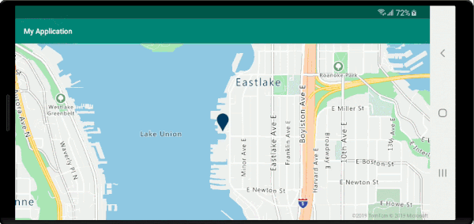

# Display feature information

Spatial data is often represented using points, lines, and polygons. This data often has metadata information associated with it. For example, a point may represent the location of a store and metadata about that restaurant may be its name, address, and type of food it serves. This metadata can be added as properties of these features using a `JsonObject`. The following code creates a simple point feature with a `title` property that has a value of "Hello World!"

```java
//Create a data source and add it to the map.
DataSource dataSource = new DataSource();
map.sources.add(dataSource);

//Create a point feature with some properties and add it to the data source.
JsonObject properties = new JsonObject();
properties.addProperty("title", "Hello World!");

//Create a point feature, pass in the metadata properties, and add it to the data source.
dataSource.add(Feature.fromGeometry(Point.fromLngLat(-122.33, 47.64), properties));
```

When a user interacts with a feature on the map, events can be used to react to those actions. A common scenario is to display a message made of the metadata properties of a feature the user interacted with. The `OnFeatureClick` event is the main event used to detect when the user tapped a feature on the map. There's also an `OnLongFeatureClick` event. When adding the `OnFeatureClick` event to the map, it can be limited to a single layer by passing in the ID of a layer to limit it to. If no layer ID is passed in, tapping any feature on the map, regardless of which layer it is in, would fire this event. The following code creates a symbol layer to render point data on the map, then adds an `OnFeatureClick` event and limits it to this symbol layer.

```java
//Create a symbol and add it to the map.
SymbolLayer symbolLayer = new SymbolLayer(dataSource);
map.layers.add(symbolLayer);

//Add a feature click event to the map.
map.events.add((OnFeatureClick) (features) -> {
    //Retrieve the title property of the feature as a string.
    String msg = features.get(0).properties().get("title").getAsString();

    //Do something with the message.
}, symbolLayer.getId());    //Limit this event to the symbol layer.
```

## Display a toast message

A toast message is one of the easiest ways to display information to the user and is available in all versions of Android. It doesn't support any type of user input and is only displayed for a short period of time. If you want to quickly let the user know something about what they tapped on, a toast message might be a good option. The following code shows how a toast message can be used with the `OnFeatureClick` event.

```java
//Add a feature click event to the map.
map.events.add((OnFeatureClick) (features) -> {
    //Retrieve the title property of the feature as a string.
    String msg = features.get(0).getStringProperty("title");

    //Display a toast message with the title information.
    Toast.makeText(this, msg, Toast.LENGTH_SHORT).show();
}, symbolLayer.getId());    //Limit this event to the symbol layer.
```

<center>

</center>

In addition to toast messages, There are many other ways to present the metadata properties of a feature, such as:

- [Snakbar widget](https://developer.android.com/training/snackbar/showing.html) - Snackbars provide lightweight feedback about an operation. They show a brief message at the bottom of the screen on mobile and lower left on larger devices. Snackbars appear above all other elements on screen and only one can be displayed at a time.
- [Dialogs](https://developer.android.com/guide/topics/ui/dialogs) -  A dialog is a small window that prompts the user to make a decision or enter additional information. A dialog doesn't fill the screen and is normally used for modal events that require users to take an action before they can continue.
- Add a [Fragment](https://developer.android.com/guide/components/fragments) to the current activity.
- Navigate to another activity or view.

## Next steps

To add more data to your map:

> [!div class="nextstepaction"]
> [Add a symbol layer](how-to-add-symbol-to-android-map.md)

> [!div class="nextstepaction"]
> [Add shapes to an Android map](how-to-add-shapes-to-android-map.md)
