# Drawing conversion errors and warnings

The [Azure Maps Conversion service](/rest/api/maps/conversion) lets you convert uploaded Drawing packages into map data. Drawing packages must adhere to the [Drawing package requirements](drawing-requirements.md). If one or more requirements aren't met, then the Conversion service will return errors or warnings. This article lists the conversion error and warning codes, with recommendations on how to resolve them. It also provides some examples of drawings that can cause the Conversion service to return these codes.

The Conversion service will succeed if there are any conversion warnings. However, it's recommended that you review and resolve all warnings. A warning means part of the conversion was ignored or automatically fixed. Failing to resolve the warnings could result in errors in latter processes.

## General Warnings

### **geometryWarning**

#### *Description for geometryWarning*

A **geometryWarning** occurs when the drawing contains an invalid entity. An invalid entity is an entity that doesn't conform to geometric constraints. Examples of an invalid entity are a self-intersecting polygon or a non-closed PolyLine in a layer that only supports closed geometry.

The Conversion service is unable to create a map feature from an invalid entity and instead ignores it.

#### *Examples for geometryWarning*

* The two images below show examples of self-intersecting polygons.

     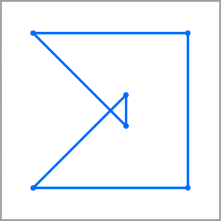

     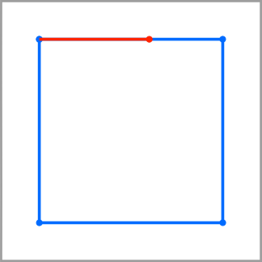

* Below is an image that shows a non-closed PolyLine. Assume that the layer only supports closed geometry.

    

#### *How to fix geometryWarning*

Inspect the **geometryWarning** for each entity to verify that it follows geometric constraints.

### **unexpectedGeometryInLayer**

#### *Description for unexpectedGeometryInLayer*

An **unexpectedGeometryInLayer** warning occurs when the drawing contains geometry that is incompatible with the expected geometry type for a given layer. When the Conversion service returns an **unexpectedGeometryInLayer** warning, it will ignore that geometry.

#### *Example for unexpectedGeometryInLayer*

The image below shows a non-closed PolyLine. Assume that the layer only supports closed geometry.


#### *How to fix unexpectedGeometryInLayer*

Inspect each **unexpectedGeometryInLayer** warning and move the incompatible geometry to a compatible layer. If it isn't compatible with any of the other layers, it should be removed.

### **unsupportedFeatureRepresentation**

#### *Description for unsupportedFeatureRepresentation*

The **unsupportedFeatureRepresentation** warning occurs when the drawing contains an unsupported entity type.

#### *Example for unsupportedFeatureRepresentation*

The image below shows an unsupported entity type as a multi-line text object on a label layer.
  
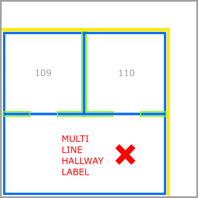

#### *How to fix unsupportedFeatureRepresentation*

Ensure that your DWG files contain only the supported entity types. Supported types are listed under the [Drawing files requirements section in the Drawing package requirements article](drawing-requirements.md#drawing-package-requirements).

### **automaticRepairPerformed**

#### *Description for automaticRepairPerformed*

The **automaticRepairPerformed** warning occurs when the Conversion service automatically repairs invalid geometry.

#### *Examples for automaticRepairPerformed*

* The following image shows how the Conversion service repaired a self-intersecting polygon into valid geometry.

    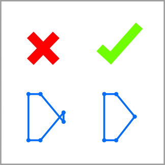

* The image below shows how the Conversion service snapped the first and last vertex of a non-closed PolyLine to create a closed PolyLine, where the first and last vertex were less than 1 mm apart.  

    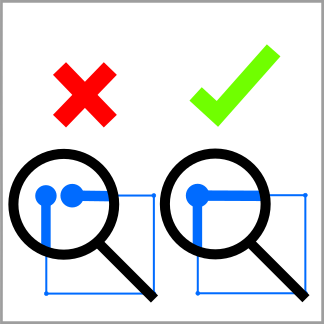

* The image below shows how, in a layer that supports only closed PolyLines, the Conversion service repaired multiple non-closed PolyLines. In order to avoid discarding the non-closed PolyLines, the service combined them into a single closed PolyLine.

    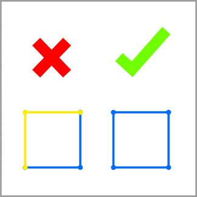

#### *How to fix automaticRepairPerformed*

To fix an **automaticRepairPerformed** warning, take the following actions:

1. Inspect each warning's geometry and the specific warning text.
2. Determine if the automated repair is correct.
3. If the repair is correct, continue. Otherwise, go to the design file and resolve the warning manually.

>[!TIP]
>To suppress a warning in the future, make changes to the original drawing so that the original drawing matches the repaired drawing.

## Manifest warnings

### **redundantAttribution**

#### *Description for redundantAttribution*

The **redundantAttribution** warning occurs when the manifest contains redundant or conflicting object properties.

#### *Examples for redundantAttribution*

* The JSON snippet below contains two or more `unitProperties` objects with the same `name`.

    ```json
    "unitProperties": [
        {
            "unitName": "L1-100",
            "categoryName": "room.office"
        },
        {
            "unitName": "L1-101",
            "categoryName": "room.office"
        },
        {
            "unitName": "L1-101",
            "categoryName": "room.office"
        }
    ]
    ```

* In the JSON snippet below, two or more `zoneProperties` objects have the same `name`.

    ```json
     "zoneProperties": [
        {
            "zoneName": "Assembly Area 1",
            "categoryName": "zone.assembly"
        },
        {
            "zoneName": "Assembly Area 2",
            "categoryName": "zone.assembly"
        },
        {
            "zoneName": "Assembly Area 2",
            "categoryName": "zone.assembly"
        }
    ```

#### *How to fix redundantAttribution*

To fix a **redundantAttribution* warning, remove redundant or conflicting object properties.

### **manifestWarning**

#### *Description for manifestWarning*

A **manifestWarning** occurs when the manifest contains unitProperties or zoneProperties objects that are unused during conversion.

#### *Examples for manifestWarning*

* The manifest contains a `unitProperties` object with a `unitName` that has no matching label in a `unitLabel` layer.

* The manifest contains a `zoneProperties` object with a `zoneName` that has no matching label in a `zoneLabel` layer.

#### *How to fix manifestWarning*

To fix a **manifestWarning**, remove the unused `unitProperties` or `zoneProperties` object from the manifest, or add a unit/zone label to the drawing so that the properties object is used during conversion.

## Wall warnings

### **wallOutsideLevel**

#### *Description for wallOutsideLevel*

The **wallOutsideLevel** warning occurs when the drawing contains a Wall geometry outside the bounds of a level outline.

#### *Example for wallOutsideLevel*

* The image below shows an interior wall, in red, outside the yellow level boundary.

    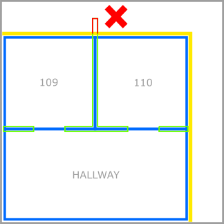

* The following image shows an exterior wall, in red, outside the yellow level boundary.

    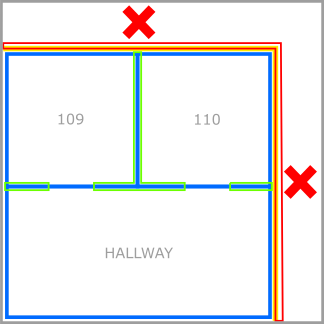

#### *How to fix wallOutsideLevel*

To fix a **wallOutsideLevel** warning, expand the level geometry to include all walls. Or, modify wall boundaries to fit inside the level boundary.

## Unit warnings

### **unitOutsideLevel**

#### *Description for unitOutsideLevel*

A **unitOutsideLevel** warning occurs when the drawing contains unit geometry outside the bounds of the level outline.

#### *Example for unitOutsideLevel*

 In the following image, unit geometry, in red, exceeds the bounds of the yellow level boundary.

 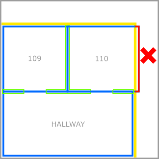

#### *How to fix unitOutsideLevel*

To fix a **unitOutsideLevel** warning, expand the level boundary to include all units. Or, modify unit geometry to fit inside the level boundary.

### **partiallyOverlappingUnit**

#### *Description for partiallyOverlappingUnit*

A **partiallyOverlappingUnit** warning occurs when the drawing contains a unit geometry partially overlapping on another unit geometry. The Conversion service discards overlapping units.

#### *Example scenarios partiallyOverlappingUnit*

In the following image, the overlapping unit is highlighted in red. `UNIT110` and `HALLWAY` are discarded.

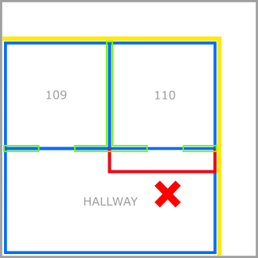

#### *How to fix partiallyOverlappingUnit*

To fix a **partiallyOverlappingUnit** warning, redraw each partially overlapping unit so that it doesn't overlap any other units.

## Door warnings

### **doorOutsideLevel**

#### *Description for doorOutsideLevel*

A **doorOutsideLevel** warning occurs when the drawing contains a door geometry outside the bounds of the level geometry.

#### *Example for doorOutsideLevel*

In the following image, the door geometry, highlighted in red, overlaps the yellow level boundary.

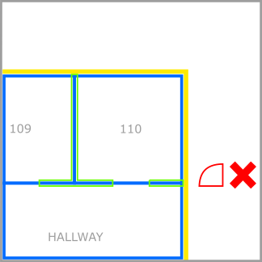

#### *How to fix doorOutsideLevel*

To fix a **doorOutsideLevel** warning, redraw your door geometry so that it is inside the level boundaries.

## Zone warnings

### **zoneWarning**

#### *Description for zoneWarning*

The **zoneWarning** occurs when a zone doesn't contain a label. The Conversion service discards a zone that isn't label.l

#### *Example for zoneWarning*

The following image shows a zone that doesn't contain a label.

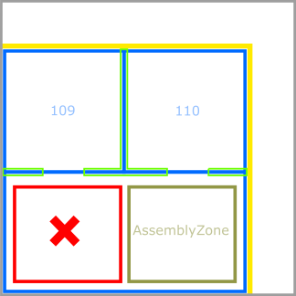

#### *How to fix zoneWarning*

To fix a **zoneWarning**, verify that each zone has a single label.

## Label Warnings

### *labelWarning*

#### *Description for labelWarning*

The **labelWarning** occurs when the drawing contains ambiguous or contradictory labels feature.

A **labelWarning** occurs because of one or more of the following reasons:

* A unit label isn't in any units.
* A zone label isn't in any zones.
* A zone label is inside two or more zones.

#### *Example for labelWarning*

The following image shows a label that inside two zones.

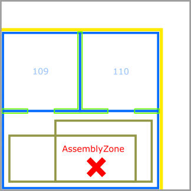

#### *How to fix labelWarning*

To fix a **labelWarning**, ensure that:

* All unit labels are inside units.
* All zone labels are inside zones.
* All zone labels are in one and only one zone.

## Drawing Package errors

### **invalidArchiveFormat**

#### *Description for invalidArchiveFormat*

An **invalidArchiveFormat** error occurs when the drawing package is in an invalid archive format such as GZIP or 7-Zip. Only the ZIP archive format is supported.

An **invalidArchiveFormat** error will also occur if the ZIP archive is empty.

#### *How to fix invalidArchiveFormat*

To fix an **invalidArchiveFormat** error, verify that:

* Your archive file name ends in _.zip_.
* Your ZIP archive contains data.
* You can open your ZIP archive.

### **invalidUserData**

#### *Description for invalidUserData*

An **invalidUserData** error occurs when the Conversion service is unable to read a user data object from storage.

#### *Example scenario for invalidUserData*

You attempted to upload a Drawing package with an incorrect `udid` parameter.

#### *How to fix invalidUserData*

To fix an **invalidUserData** error, verify that:

* You've provided a correct `udid` for the uploaded package.
* Azure Maps Creator (Preview) has been enabled for the Azure Maps account you used for uploading the Drawing package.
* The API request to the Conversion service contains the subscription key to the Azure Maps account you used for uploading the Drawing package.

### **dwgError**

#### *Description for dwgError*

A **dwgError** when the drawing package contains an issue with one or more DWG files in the uploaded ZIP archive.

The **dwgError** occurs when the drawing package contains a DWG file that can't be opened because it is invalid or corrupt.

* A DWG file isn't a valid AutoCAD DWG file format drawing.
* A DWG file is corrupt.
* A DWG file is listed in the _manifest.json_ file, but it's missing from the ZIP archive.

#### *How to fix dwgError*

To fix a **dwgError**, inspect your _manifest.json_ file confirm that:

* All DWG files in your ZIP archive are valid AutoCAD DWG format drawings, open each one in AutoCAD. Remove or fix all invalid drawings.
* The list of  DWG files in the _manifest.json_  matches the DWG files in the ZIP archive.

## Manifest errors

### **invalidJsonFormat**

#### Description for invalidJsonFormat

An **invalidJsonFormat** error occurs when the _manifest.json_ file can't be read.

The _manifest.json_file can't be read because of JSON formatting or syntax errors. To learn more about how JSON format and syntax, see [The JavaScript Object Notation (JSON) Data Interchange Format](https://tools.ietf.org/html/rfc7159)

#### *How to fix invalidJsonFormat*

To fix an **invalidJsonFormat** error, use a JSON linter to detect and resolve any JSON errors.

### **missingRequiredField**

#### *Description for missingRequiredField*

A **missingRequiredField** error occurs when the _manifest.json_ file is missing required data.

#### *How to fix missingRequiredField*

To fix a **missingRequiredField** error, verify that the manifest contains all required properties. For a full list of required manifest object, see the [manifest section in the Drawing package requirements](drawing-requirements.md#manifest-file-requirements)  

### **missingManifest**

#### *Description for missingManifest*

The **missingManifest** error occurs when the _manifest.json_ file is missing from the ZIP archive.

The **missingManifest** error occurs because of one or more of the following reasons:

* The _manifest.json_ file is misspelled.
* The _manifest.json_ is missing.
* The _manifest.json_ isn't inside the root directory of the ZIP archive.

#### *How to fix missingManifest*

To fix a **missingManifest** error, confirm that the archive has a file named _manifest.json_ at the root level of the ZIP archive.

### **conflict**

#### *Description for conflict*

The **conflict** error occurs when the _manifest.json_ file contains conflicting information.

#### *Example scenario for conflict*

The Conversion service will return a **conflict** error  when more than one level is defined with the same level ordinal. The following JSON snippet shows two levels defined with the same ordinal.

```JSON
"buildingLevels":
{
    "levels": [
        {
            "levelName": "Ground",
            "ordinal": 0,
            "filename": "./Level_0.dwg"
        },
        {
            "levelName": "Parking",
            "ordinal": 0,
            "filename": "./Level_P.dwg"
        }
    ]
}
```

#### *How to fix conflict*

To fix a **conflict** error, inspect your _manifest.json_ and remove any conflicting information.

### **invalidGeoreference**

#### *Description for invalidGeoreference*

The **invalidGeoreference** error occurs when a _manifest.json_ file contains an invalid georeference.

The **invalidGeoreference** error occurs because of one or more of the following reasons:

* The user is georeferencing a latitude or longitude value that is out of range.
* The user is georeferencing a rotation value that is out of range.

#### *Example scenario for invalidGeoreference*

In the JSON snippet below, the latitude is above the upper limit.

```json
"georeference"
{
    "lat": 88.0,
    "lon": -122.132600,
    "angle": 0
},
```

#### *How to fix invalidGeoreference*

To fix an **invalidGeoreference** error, verify that the georeferenced values are within range.

>[!IMPORTANT]
>In GeoJSON, the coordinates order is longitude and latitude. If you don't use the correct order, you may accidentally refer a latitude or longitude value that is out of range.

## Wall errors

### **wallError**

#### *Description for wallError*

The **wallError** occurs when the drawing contains an error while attempting to create a wall feature.

#### *Example scenario for wallError*

The following image displays a wall feature that doesn't overlap any units.

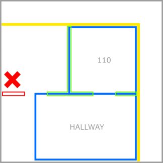

#### *How to fix wallError*

To fix a **wallError** error, redraw the wall so that it overlaps at least one unit. Or, create a new unit that overlaps the wall.

## Vertical Penetration errors

### **verticalPenetrationError**

#### *Description for verticalPenetrationError*

The **verticalPenetrationError** occurs when the drawing contains an ambiguous vertical penetration feature.

The **verticalPenetrationError** occurs because of one or more of the following reasons:

* The drawing contains a vertical penetration area with no overlapping vertical penetration areas on any levels above or below it.
* The drawing package contains a level with two or more vertical penetration features on it that both overlap a single vertical penetration feature on another level directly above or below it.

#### *Example scenario for verticalPenetrationError*

The image below shows a vertical penetration area with no overlapping vertical penetration areas on levels above or below it.

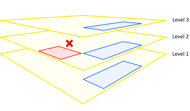

The following image shows a vertical penetration area that overlaps more than one vertical penetration area on an adjacent level.

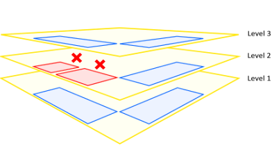

#### How to fix verticalPenetrationError

To fix a **verticalPenetrationError** error, read about how to use a vertical penetration feature in the [Drawing package requirements](drawing-requirements.md) article.

## Next steps

> [!div class="nextstepaction"]
> [How to use Azure Maps Drawing error visualizer](drawing-error-visualizer.md)

> [!div class="nextstepaction"]
> [Creator (Preview) for indoor mapping](creator-indoor-maps.md)