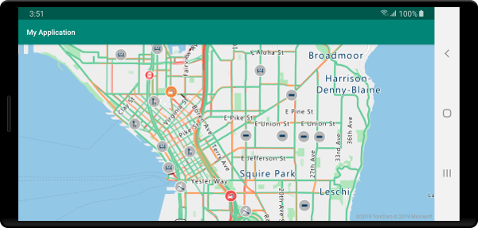
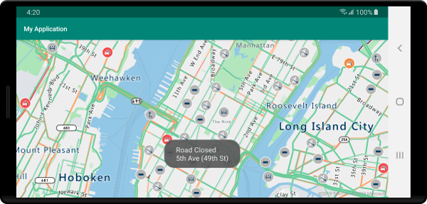

# Show traffic data on the map (Android SDK)

Flow data and incidents data are the two types of traffic data that can be displayed on the map. This guide shows you how to display both types of traffic data. Incidents data consists of point and line-based data for things such as constructions, road closures, and accidents. Flow data shows metrics about the flow of traffic on the road.

## Prerequisites

Be sure to complete the steps in the [Quickstart: Create an Android app](quick-android-map.md) document. Code blocks in this article can be inserted into the maps `onReady` event handler.

## Show traffic on the map

There are two types of traffic data available in Azure Maps:

- Incident data - consists of point and line-based data for things such as construction, road closures, and accidents.
- Flow data - provides metrics on the flow of traffic on the roads. Often, traffic flow data is used to color the roads. The colors are based on how much traffic is slowing down the flow, relative to the speed limit, or another metric. There are four values that can be passed into the traffic `flow` option of the map.

    |Flow Value | Description|
    | :-- | :-- |
    | TrafficFlow.NONE | Doesn't display traffic data on the map |
    | TrafficFlow.RELATIVE | Shows traffic data that's relative to the free-flow speed of the road |
    | TrafficFlow.RELATIVE_DELAY | Displays areas that are slower than the average expected delay |
    | TrafficFlow.ABSOLUTE | Shows the absolute speed of all vehicles on the road |

The following code shows how to display traffic data on the map.

```java
//Show traffic on the map using the traffic options.
map.setTraffic(
    incidents(true),
    flow(TrafficFlow.RELATIVE)
);
```

The following screenshot shows the above code rending real-time traffic information on the map.



## Get traffic incident details

Details about a traffic incident are available within the properties of the feature used to display the incident on the map. Traffic incidents are added to the map using the Azure Maps traffic incident vector tile service. The format of the data in these vector tiles if [documented here](https://developer.tomtom.com/traffic-api/traffic-api-documentation-traffic-incidents/vector-incident-tiles). The following code adds a click event to the map and retrieves the traffic incident feature that was clicked and displays a toast message with some of the details.

```java
//Show traffic information on the map.
map.setTraffic(
    incidents(true),
    flow(TrafficFlow.RELATIVE)
);

//Add a click event to the map.
map.events.add((OnFeatureClick) (features) -> {

    if (features != null && features.size() > 0) {
        Feature incident = features.get(0);

        //Ensure that the clicked feature is an traffic incident feature.
        if (incident.properties() != null && incident.hasProperty("incidentType")) {

            StringBuilder sb = new StringBuilder();
            String incidentType = incident.getStringProperty("incidentType");

            if (incidentType != null) {
                sb.append(incidentType);
            }

            if (sb.length() > 0) {
                sb.append("\n");
            }

            //If the road is closed, find out where it is closed from.
            if ("Road Closed".equals(incidentType)) {
                String from = incident.getStringProperty("from");

                if (from != null) {
                    sb.append(from);
                }
            } else {
                //Get the description of the traffic incident.
                String description = incident.getStringProperty("description");

                if (description != null) {
                    sb.append(description);
                }
            }

            String message = sb.toString();

            if (message.length() > 0) {
                Toast.makeText(this, message, Toast.LENGTH_LONG).show();
            }
        }
    }
});
```

The following screenshot shows the above code rending real-time traffic information on the map with a toast message displaying incident details.



## Next steps

View the following guides to learn how to add more data to your map:

> [!div class="nextstepaction"]
> [Add a tile layer](how-to-add-tile-layer-android-map.md)
