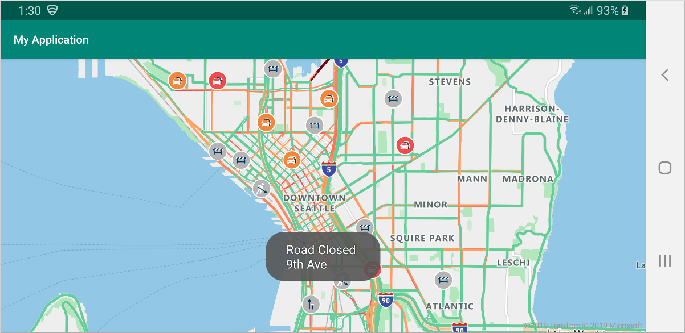

# Show traffic data on the map using Azure Maps Android SDK

Flow data and incidents data are the two types of traffic data that can be displayed on the map. This guide shows you how to display both types of traffic data. Incidents data consists of point and line-based data for things such as constructions, road closures, and accidents. Flow data shows metrics about the flow of traffic on the road.

## Prerequisites

Before you can show traffic on the map, you need to [make an Azure Account](quick-demo-map-app.md#create-an-azure-maps-account)and [obtain a subscription key](quick-demo-map-app.md#get-the-primary-key-for-your-account). Then, you need to install the [Azure Maps Android SDK](https://docs.microsoft.com/azure/azure-maps/how-to-use-android-map-control-library) and load a map.

## Incidents traffic data

You'll need to import the following libraries to call `setTraffic` and `incidents`:

```java
import static com.microsoft.com.azure.maps.mapcontrol.options.TrafficOptions.incidents;
```

 The following code snippet shows you how to display traffic data on the map. We pass a boolean value to the `incidents` method, and pass that to the `setTraffic` method. 

```java
protected void onCreate(Bundle savedInstanceState) {
    super.onCreate(savedInstanceState);
    mapControl.getMapAsync(map - > {
        map.setTraffic(incidents(true));
    }
}
```

## Flow traffic data

You'll first need to import the following libraries to call `setTraffic` and `flow`:

```java
import com.microsoft.azure.maps.mapcontrol.options.TrafficFlow;
import static com.microsoft.azure.maps.mapcontrol.options.TrafficOptions.flow;
```

Use the following code snippet to set traffic flow data. Similar to the code in the previous section, we pass the return value of the `flow` method to the `setTraffic` method. There are four values that can be passed to `flow`, and each value would trigger `flow` to return the respective value. The return value of `flow` will then be passed as the argument to `setTraffic`. See the table below for these four values:

|Flow Value | Description|
| :-- | :-- |
| TrafficFlow.NONE | Doesn't display traffic data on the map |
| TrafficFlow.RELATIVE | Shows traffic data that's relative to the free-flow speed of the road |
| TrafficFlow.RELATIVE_DELAY | Displays areas that are slower than the average expected delay |
| TrafficFlow.ABSOLUTE | Shows the absolute speed of all vehicles on the road |

```java
protected void onCreate(Bundle savedInstanceState) {
    super.onCreate(savedInstanceState);
    mapControl.getMapAsync(map -> {
        map.setTraffic(flow(TrafficFlow.RELATIVE)));
    }
}
```

## Show incident traffic data by clicking a feature

To obtain the incidents for a specific feature, you can use the code below. When a feature is clicked, the code logic checks for incidents and builds a message about the incident. A message shows up at the bottom of the screen with the details.

1. First, you need to edit **res > layout > activity_main.xml**, so that it looks like the one below. You may replace the `mapcontrol_centerLat`, `mapcontrol_centerLng`, and `mapcontrol_zoom` with your desired values. Recall, the zoom level is a value between 0 and 22. At zoom level 0, the entire world fits on a single tile.

   ```XML
   <?xml version="1.0" encoding="utf-8"?>
   <FrameLayout
       xmlns:android="http://schemas.android.com/apk/res/android"
       xmlns:app="http://schemas.android.com/apk/res-auto"
       android:layout_width="match_parent"
       android:layout_height="match_parent"
       >
    
       <com.microsoft.azure.maps.mapcontrol.MapControl
           android:id="@+id/mapcontrol"
           android:layout_width="match_parent"
           android:layout_height="match_parent"
           app:mapcontrol_centerLat="47.6050"
           app:mapcontrol_centerLng="-122.3344"
           app:mapcontrol_zoom="12"
           />

   </FrameLayout>
   ```

2. Add the following code to your **MainActivity.java** file. The package is included by default, so make sure you keep your package at the top.

   ```java
   package <yourpackagename>;
   import androidx.appcompat.app.AppCompatActivity;

   import android.os.Bundle;
   import android.widget.Toast;

   import com.microsoft.azure.maps.mapcontrol.AzureMaps;
   import com.microsoft.azure.maps.mapcontrol.MapControl;
   import com.mapbox.geojson.Feature;
   import com.microsoft.azure.maps.mapcontrol.events.OnFeatureClick;

   import com.microsoft.azure.maps.mapcontrol.options.TrafficFlow;
   import static com.microsoft.azure.maps.mapcontrol.options.TrafficOptions.flow;
   import static com.microsoft.azure.maps.mapcontrol.options.TrafficOptions.incidents;

   public class MainActivity extends AppCompatActivity {

       static {
           AzureMaps.setSubscriptionKey("Your Azure Maps Subscription Key");
       }

       MapControl mapControl;

       @Override
       protected void onCreate(Bundle savedInstanceState) {
           super.onCreate(savedInstanceState);
           setContentView(R.layout.activity_main);

           mapControl = findViewById(R.id.mapcontrol);

           mapControl.onCreate(savedInstanceState);

           //Wait until the map resources are ready.
           mapControl.getMapAsync(map -> {

               map.setTraffic(flow(TrafficFlow.RELATIVE));
               map.setTraffic(incidents(true));

               map.events.add((OnFeatureClick) (features) -> {

                   if (features != null && features.size() > 0) {
                       Feature incident = features.get(0);
                       if (incident.properties() != null) {


                           StringBuilder sb = new StringBuilder();
                           String incidentType = incident.getStringProperty("incidentType");
                           if (incidentType != null) {
                               sb.append(incidentType);
                           }
                           if (sb.length() > 0) sb.append("\n");
                           if ("Road Closed".equals(incidentType)) {
                               sb.append(incident.getStringProperty("from"));
                           } else {
                               String description = incident.getStringProperty("description");
                               if (description != null) {
                                   for (String word : description.split(" ")) {
                                       if (word.length() > 0) {
                                           sb.append(word.substring(0, 1).toUpperCase());
                                           if (word.length() > 1) {
                                               sb.append(word.substring(1));
                                           }
                                           sb.append(" ");
                                       }
                                   }
                               }
                           }
                           String message = sb.toString();

                           if (message.length() > 0) {
                               Toast.makeText(this,message,Toast.LENGTH_LONG).show();
                           }
                       }
                   }
               });
           });
       }

       @Override
       public void onResume() {
           super.onResume();
           mapControl.onResume();
       }

       @Override
       protected void onStart(){
           super.onStart();
           mapControl.onStart();
       }

       @Override
       public void onPause() {
           super.onPause();
           mapControl.onPause();
       }

       @Override
       public void onStop() {
           super.onStop();
           mapControl.onStop();
       }

       @Override
       public void onLowMemory() {
           super.onLowMemory();
           mapControl.onLowMemory();
       }

       @Override
       protected void onDestroy() {
           super.onDestroy();
           mapControl.onDestroy();
       }

       @Override
       protected void onSaveInstanceState(Bundle outState) {
           super.onSaveInstanceState(outState);
           mapControl.onSaveInstanceState(outState);
       }
   }
   ```

3. Once you incorporate the above code in your application, you'll be able to click on a feature and see the details of the traffic incidents. Depending on the latitude, longitude, and the zoom level values that you used in your **activity_main.xml** file, you'll see results similar to the following image:

   <center>

   

   </center>

## Next steps

View the following guides to learn how to add more data to your map:

> [!div class="nextstepaction"]
> [Add a symbol layer](how-to-add-symbol-to-android-map.md)

> [!div class="nextstepaction"]
> [Add a tile layer](how-to-add-tile-layer-android-map.md)

> [!div class="nextstepaction"]
> [Add shapes to android map](how-to-add-shapes-to-android-map.md)

> [!div class="nextstepaction"]
> [Display feature information](display-feature-information-android.md)
